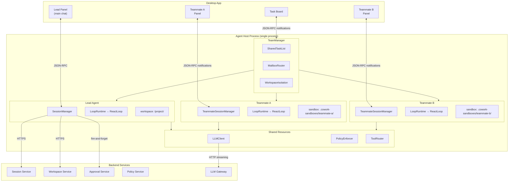
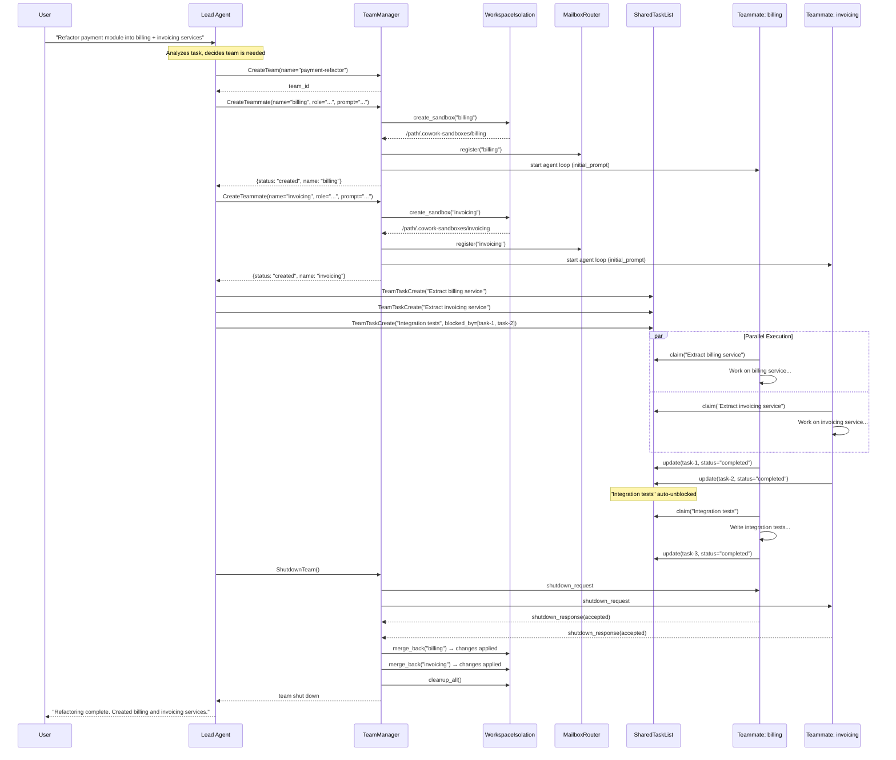
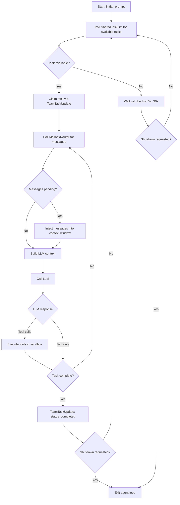
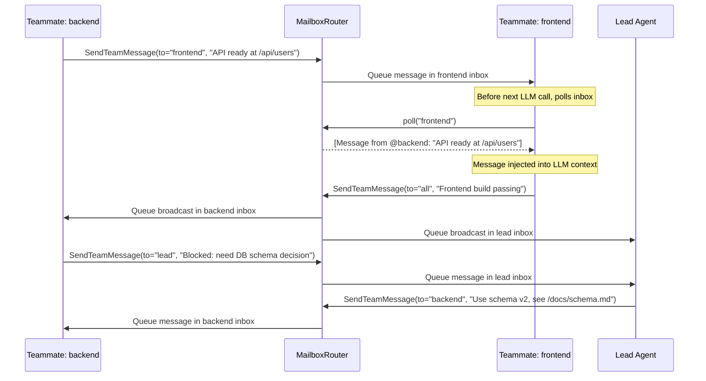
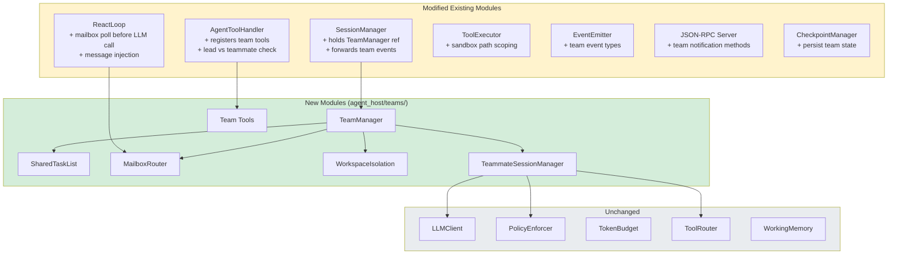
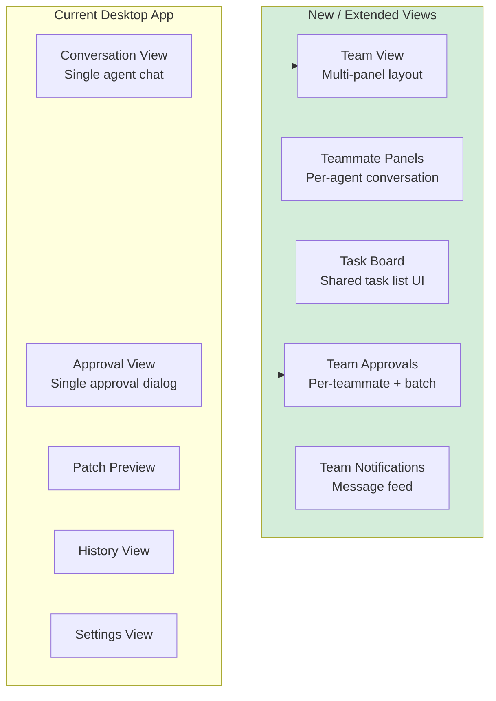

# Agent Teams — Detailed Design

**Phase:** 3+
**Primary Repo:** `cowork-agent-runtime`
**Affected Repos:** `cowork-agent-runtime`, `cowork-desktop-app`, `cowork-session-service`, `cowork-infra`

---

## 1. Purpose

Agent Teams extends cowork's single-agent-with-sub-agents model into a coordinated multi-agent system where a **lead agent** can spawn **teammate agents** that work in parallel on shared projects with peer-to-peer communication, shared task tracking, and workspace isolation.

### What We Have Today

- **Single agent loop** with depth-1 sub-agents (`SpawnAgent` tool)
- Sub-agents: isolated `MessageThread`, shared `TokenBudget`, max 5 concurrent via `asyncio.Semaphore(5)`, max 10 steps each
- Hub-and-spoke only — sub-agents report results to parent, cannot communicate with each other
- No file isolation — all agents operate on the same working directory
- Sub-agent results truncated to 2,048 chars and returned inline

### What Agent Teams Adds

| Capability | Sub-Agents (Current) | Agent Teams (New) |
|-----------|---------------------|-------------------|
| Communication | Hub-and-spoke (parent only) | Peer-to-peer messaging + broadcasts |
| Context | Shared token budget, limited context | Independent token budget per teammate |
| File isolation | Same working directory | Isolated workspace sandbox per teammate |
| Coordination | Parent orchestrates all | Shared task list with dependencies |
| Depth | 1 (no recursive spawning) | 1 (teammates can't spawn teams) |
| Lifetime | Ephemeral (within one step) | Persistent (across multiple steps, outlive individual tasks) |
| Visibility | Results only | Full UI panel per teammate |
| Scope | Quick focused lookup | Complex parallel workstreams |

---

## 2. Architecture Overview



### Key Design Decision: Single Process, Multiple Sessions

Unlike Claude Code (which spawns separate OS processes per teammate), cowork runs all teammates **within a single Agent Host process**. This is because:

1. The Desktop App spawns exactly one Agent Host process — multiple processes would require significant transport changes
2. In-process coordination (shared memory, asyncio) is simpler and faster than IPC
3. The Agent Host already supports concurrent sessions via `SessionManager`
4. Token budget enforcement is easier in-process

Each teammate gets its own `SessionManager` → `LoopRuntime` → `ReactLoop` stack, just like a real session, but coordinated by a `TeamManager` that manages the shared task list and mailbox system.

---

## 3. Core Components

### 3.1 TeamManager

New module: `agent_host/teams/team_manager.py`

Owns the lifecycle of a team: creation, teammate spawning, task list, mailboxes, shutdown.

```python
class TeamManager:
    """Manages a team of agents working on a shared project."""

    team_id: str
    lead_session_id: str
    members: dict[str, TeammateInfo]      # name → info
    task_list: SharedTaskList
    mailbox: MailboxRouter
    workspace_isolation: WorkspaceIsolation
    config: TeamConfig

    async def create_teammate(
        self,
        name: str,
        role: str,
        initial_prompt: str,
    ) -> TeammateInfo: ...

    async def shutdown_teammate(self, name: str) -> None: ...
    async def shutdown_team(self) -> None: ...
```

**Lifecycle:**
1. Lead agent calls `CreateTeam` tool → `TeamManager` created
2. Lead calls `CreateTeammate` tool → `TeamManager.create_teammate()` → new `SessionManager` instance created with its own isolated workspace
3. Teammates run their agent loops independently
4. Lead calls `ShutdownTeam` → graceful shutdown of all teammates

### 3.2 SharedTaskList

New module: `agent_host/teams/task_list.py`

In-memory task list shared between all agents in a team. Replaces the file-based approach used by Claude Code (since we're single-process).

```python
@dataclass
class TeamTask:
    task_id: str
    title: str
    description: str
    status: Literal["pending", "claimed", "in_progress", "completed", "failed", "blocked"]
    assignee: str | None = None         # teammate name
    created_by: str = ""                # teammate name
    blocked_by: list[str] = field(default_factory=list)  # task_ids
    result: str | None = None
    created_at: datetime
    updated_at: datetime

class SharedTaskList:
    """Thread-safe shared task list for agent coordination."""

    _tasks: dict[str, TeamTask]
    _lock: asyncio.Lock

    async def create_task(self, title, description, blocked_by=None, created_by="") -> TeamTask: ...
    async def claim_task(self, task_id: str, assignee: str) -> TeamTask: ...
    async def update_status(self, task_id: str, status: str, result: str | None = None) -> TeamTask: ...
    async def list_tasks(self, status: str | None = None, assignee: str | None = None) -> list[TeamTask]: ...
    async def get_task(self, task_id: str) -> TeamTask | None: ...
    async def get_available_tasks(self, for_teammate: str) -> list[TeamTask]: ...
```

**Dependency Resolution:**
- A task with `blocked_by=["task-A", "task-B"]` stays in `blocked` status
- When task-A and task-B both reach `completed`, the blocked task automatically transitions to `pending`
- `get_available_tasks()` returns only `pending` tasks with all dependencies resolved

**Concurrency Safety:**
- All mutations acquire `asyncio.Lock` (cooperative, no contention in single-threaded asyncio)
- No file locking needed (unlike Claude Code) since everything is in-process

### 3.3 MailboxRouter

New module: `agent_host/teams/mailbox.py`

Enables peer-to-peer messaging between teammates. Messages are queued and polled.

```python
@dataclass
class TeamMessage:
    message_id: str
    from_agent: str
    to_agent: str | None       # None = broadcast
    content: str
    message_type: Literal["message", "broadcast", "shutdown_request", "shutdown_response"]
    timestamp: datetime

class MailboxRouter:
    """Routes messages between team members."""

    _inboxes: dict[str, asyncio.Queue[TeamMessage]]  # agent_name → inbox

    def register(self, agent_name: str) -> None: ...
    def unregister(self, agent_name: str) -> None: ...

    async def send(self, from_agent: str, to_agent: str, content: str) -> None: ...
    async def broadcast(self, from_agent: str, content: str) -> None: ...
    async def poll(self, agent_name: str, timeout: float = 0) -> list[TeamMessage]: ...
    def has_messages(self, agent_name: str) -> bool: ...
```

**Message Injection:**
- Before each LLM call, the `ReactLoop` checks for pending messages via `mailbox.poll()`
- Pending messages are injected as a system message in the context window:
  ```
  [Team Messages]
  From @backend-dev: "API endpoint is ready at /api/users. Schema: {id, name, email}"
  From @lead: "Please also add pagination support"
  ```
- This approach avoids interrupting the agent mid-step

### 3.4 WorkspaceIsolation

New module: `agent_host/teams/workspace_isolation.py`

Provides file-level isolation between teammates. Cowork is a general-purpose agent — not all workspaces are git repos — so isolation is **directory-based by default** with git worktrees as an optional optimization when a repo is detected.

```python
class IsolationStrategy(Protocol):
    """Strategy for creating isolated workspaces per teammate."""

    async def create(self, teammate_name: str) -> Path: ...
    async def merge_back(self, teammate_name: str) -> MergeResult: ...
    async def cleanup(self, teammate_name: str) -> None: ...
    async def cleanup_all(self) -> None: ...

class DirectorySandbox:
    """Default strategy: copy workspace into a sandboxed directory."""
    ...

class GitWorktreeSandbox:
    """Optimization for git repos: use lightweight worktrees instead of full copies."""
    ...

class WorkspaceIsolation:
    """Facade that selects the appropriate isolation strategy."""

    _strategy: IsolationStrategy
    _sandboxes: dict[str, SandboxInfo]  # teammate_name → info

    @classmethod
    def create(cls, workspace_dir: Path) -> WorkspaceIsolation:
        """Auto-detect strategy: GitWorktreeSandbox if git repo, else DirectorySandbox."""
        ...

    async def create_sandbox(self, teammate_name: str) -> Path: ...
    async def merge_back(self, teammate_name: str) -> MergeResult: ...
    async def cleanup(self, teammate_name: str) -> None: ...
    async def cleanup_all(self) -> None: ...
```

#### DirectorySandbox (Default)

Used when the workspace is not a git repo, or for non-code workloads (data processing, file management, research).

**Creation:**
- Sandbox directory: `{workspace}/.cowork-sandboxes/{teammate_name}/`
- Copies the workspace directory into the sandbox (respecting `.gitignore`-style exclusion patterns to skip large/irrelevant files like `node_modules/`, `.venv/`, build artifacts)
- Configurable exclusion list via `TeamConfig.sandbox_exclude_patterns`
- For large workspaces, uses a **lazy copy** approach: symlink read-only files, copy-on-write for files the teammate modifies (via platform filesystem APIs where available, else fall back to full copy)

**Merge back:**
- When a teammate completes, diff the sandbox against the original workspace
- Produce a list of changed/created/deleted files
- The lead reviews and selectively applies changes (or applies all)
- Conflicts (same file modified by multiple teammates) are flagged for lead resolution

**Cleanup:**
- Delete the sandbox directory
- If no changes were made, cleanup is silent
- If changes exist but weren't merged, warn the lead before deleting

#### GitWorktreeSandbox (Auto-detected for Git Repos)

Used when the workspace root contains a `.git` directory. Provides the same interface as `DirectorySandbox` but uses git's native worktree mechanism for efficiency.

**Creation:**
- `git worktree add .cowork-sandboxes/{teammate_name} -b team/{team_id}/{teammate_name}`
- Lightweight: shares `.git` objects with the main repo
- Each teammate gets its own branch

**Merge back:**
- Teammate commits their changes to their branch
- Lead merges branches via git (fast-forward, merge commit, or rebase)
- Conflicts handled through git's merge machinery

**Cleanup:**
- `git worktree remove .cowork-sandboxes/{teammate_name}`
- If branch has unmerged commits, preserve it; otherwise delete

#### Shared-Workspace Mode (No Isolation)

For tasks where teammates operate on **disjoint file sets** (e.g. one teammate writes reports, another processes data in a different directory), isolation may be unnecessary overhead. The lead can opt out:

```python
class TeamConfig:
    isolation_mode: Literal["auto", "sandbox", "worktree", "shared"] = "auto"
    # auto     → GitWorktreeSandbox if git repo, else DirectorySandbox
    # sandbox  → Force DirectorySandbox
    # worktree → Force GitWorktreeSandbox (fails if not a git repo)
    # shared   → No isolation, all teammates share the lead's workspace
    sandbox_exclude_patterns: list[str] = field(default_factory=lambda: [
        "node_modules", ".venv", "__pycache__", ".git", "build", "dist",
    ])
```

In `shared` mode, the `PolicyEnforcer` path restrictions are the only guard against teammates stepping on each other's files. The lead takes responsibility for coordinating who touches what via the shared task list.

---

## 4. Agent-Internal Tools (Team Extensions)

New tools added to `AgentToolHandler` when a team is active:

### 4.1 Lead-Only Tools

```python
# CreateTeam — Initialize a team
{
    "name": "CreateTeam",
    "parameters": {
        "name": {"type": "string", "description": "Team name"},
        "description": {"type": "string", "description": "Team objective"}
    }
}

# CreateTeammate — Spawn a new teammate
{
    "name": "CreateTeammate",
    "parameters": {
        "name": {"type": "string", "description": "Short identifier (e.g. 'backend-dev')"},
        "role": {"type": "string", "description": "Role description for context"},
        "initial_prompt": {"type": "string", "description": "First instruction for the teammate"}
    }
}

# ShutdownTeammate — Gracefully stop a teammate
{
    "name": "ShutdownTeammate",
    "parameters": {
        "name": {"type": "string", "description": "Teammate name to shut down"}
    }
}

# ShutdownTeam — Shut down all teammates and clean up
{
    "name": "ShutdownTeam",
    "parameters": {}
}
```

### 4.2 Tools Available to All Team Members (Lead + Teammates)

```python
# TeamTaskCreate — Add a task to the shared list
{
    "name": "TeamTaskCreate",
    "parameters": {
        "title": {"type": "string"},
        "description": {"type": "string"},
        "blocked_by": {"type": "array", "items": {"type": "string"}, "description": "Task IDs this depends on"}
    }
}

# TeamTaskUpdate — Update task status
{
    "name": "TeamTaskUpdate",
    "parameters": {
        "task_id": {"type": "string"},
        "status": {"type": "string", "enum": ["claimed", "in_progress", "completed", "failed"]},
        "result": {"type": "string", "description": "Completion summary (when status=completed)"}
    }
}

# TeamTaskList — View all tasks
{
    "name": "TeamTaskList",
    "parameters": {
        "status": {"type": "string", "description": "Filter by status (optional)"},
        "assignee": {"type": "string", "description": "Filter by assignee (optional)"}
    }
}

# SendTeamMessage — Send a message to a teammate or broadcast
{
    "name": "SendTeamMessage",
    "parameters": {
        "to": {"type": "string", "description": "Teammate name, or 'all' for broadcast"},
        "content": {"type": "string", "description": "Message content"}
    }
}
```

### 4.3 Tool Availability Matrix

| Tool | Lead | Teammate | Condition |
|------|------|----------|-----------|
| `CreateTeam` | yes | no | No active team |
| `CreateTeammate` | yes | no | Team active |
| `ShutdownTeammate` | yes | no | Team active |
| `ShutdownTeam` | yes | no | Team active |
| `TeamTaskCreate` | yes | yes | Team active |
| `TeamTaskUpdate` | yes | yes | Team active |
| `TeamTaskList` | yes | yes | Team active |
| `SendTeamMessage` | yes | yes | Team active |
| `SpawnAgent` | yes | yes | Existing sub-agent tool (unchanged) |

Teammates retain access to all existing tools (`ReadFile`, `WriteFile`, `RunCommand`, etc.) — they are full agents, not limited sub-agents.

---

## 5. Team Creation & Composition

Teams are **prompt-driven** — there is no schema file, workflow definition, or pre-configured team template. The user describes what they want in natural language, and the lead agent decides the team composition.

### 5.1 User-Driven Flow (Primary)

The most common flow: the user asks for something complex, and the lead agent decides a team is appropriate.

```
User: "Refactor the payment module — split the monolith into separate services
       for billing, invoicing, and notifications. Update all tests."

Lead agent (thinking):
  - This involves 3 independent workstreams + a test workstream
  - These can run in parallel with coordination
  - A team of 3-4 teammates makes sense

Lead agent → CreateTeam(name="payment-refactor", description="...")
Lead agent → CreateTeammate(name="billing", role="Extract billing logic into standalone service", ...)
Lead agent → CreateTeammate(name="invoicing", role="Extract invoicing logic into standalone service", ...)
Lead agent → CreateTeammate(name="notifications", role="Extract notification logic into standalone service", ...)
Lead agent → TeamTaskCreate(title="Extract billing service", blocked_by=[], ...)
Lead agent → TeamTaskCreate(title="Extract invoicing service", blocked_by=[], ...)
Lead agent → TeamTaskCreate(title="Extract notification service", blocked_by=[], ...)
Lead agent → TeamTaskCreate(title="Update integration tests", blocked_by=["task-1", "task-2", "task-3"], ...)
```

The lead agent uses its judgment to:
- Decide **whether** a team is needed (vs. doing it solo or with sub-agents)
- Choose **how many** teammates to spawn
- Define each teammate's **role and initial instructions**
- Create the **task list** with dependency ordering
- Assign tasks or let teammates self-claim

### 5.2 Explicit User Request

The user can explicitly request a team:

```
User: "Use a team for this. I want one agent on the backend API and one on the frontend."

Lead agent → CreateTeam(name="feature-build", ...)
Lead agent → CreateTeammate(name="backend", role="Backend API development", initial_prompt="Build the REST API for...")
Lead agent → CreateTeammate(name="frontend", role="Frontend UI development", initial_prompt="Build the React components for...")
```

### 5.3 Lead Decision Heuristics

The lead agent's system prompt includes guidance for when to use teams:

```
## When to Use Teams

Use teams when the user's request involves:
- Multiple independent workstreams that can run in parallel
- Work that naturally decomposes into separate concerns (backend/frontend, service A/service B)
- Tasks where one teammate's output feeds into another (dependency chains)

Do NOT use teams when:
- The task is small enough to do solo (< 30 minutes of work)
- The work is deeply sequential (each step depends on the previous)
- There's only one file or module involved
- A quick sub-agent (SpawnAgent) would suffice

## Teammate Sizing Guidelines
- 2-3 teammates: Most common. Good for frontend/backend splits, parallel file processing.
- 4-6 teammates: Large refactors, multi-service changes, comprehensive test suites.
- 7-8 teammates: Rare. Only for truly large-scale parallel work. Coordination overhead is significant.
```

### 5.4 Team Creation Sequence



### 5.5 Team Templates (Future Enhancement)

In a later phase, users or organizations could define reusable team templates:

```json
{
  "name": "fullstack-feature",
  "description": "Standard template for fullstack feature development",
  "teammates": [
    {"name": "backend", "role": "Backend API and database changes"},
    {"name": "frontend", "role": "Frontend UI components and state management"},
    {"name": "tests", "role": "Write unit and integration tests for the feature"}
  ],
  "task_patterns": [
    {"title": "Implement API endpoints", "assignee": "backend"},
    {"title": "Build UI components", "assignee": "frontend"},
    {"title": "Write tests", "blocked_by": ["task-1", "task-2"], "assignee": "tests"}
  ]
}
```

This is **not part of the initial implementation** — the prompt-driven approach is sufficient for launch and avoids premature abstraction. Templates can be added in Phase 3c if usage patterns emerge.

---

## 6. Teammate Lifecycle

### 5.1 Creation

```
Lead calls CreateTeammate(name="backend-dev", role="...", initial_prompt="...")
  │
  ├─ TeamManager.create_teammate()
  │   ├─ WorkspaceIsolation.create_sandbox("backend-dev")
  │   │     → (git repo) git worktree add .cowork-sandboxes/backend-dev ...
  │   │     → (non-git)  copy workspace to .cowork-sandboxes/backend-dev/
  │   │     → returns /path/to/.cowork-sandboxes/backend-dev
  │   │
  │   ├─ MailboxRouter.register("backend-dev")
  │   │
  │   ├─ Create TeammateSessionManager (lightweight variant of SessionManager)
  │   │     → Shares: LLMClient, PolicyEnforcer, PolicyBundle
  │   │     → Fresh: MessageThread, TokenBudget(teammate_limit), WorkingMemory
  │   │     → Workspace dir: sandbox path
  │   │
  │   └─ Start agent loop: asyncio.create_task(teammate.run(initial_prompt))
  │
  └─ Return to lead: {"status": "created", "name": "backend-dev", "workspace": "..."}
```

### 6.2 Execution Loop (per Teammate)

Each teammate runs a standard `ReactLoop` with these additions:

1. **Before each LLM call** — check mailbox, inject pending messages as context
2. **After task completion** — automatically poll `SharedTaskList` for next available task
3. **Idle behavior** — if no tasks available and no messages, wait with backoff (poll every 5s, max 30s)
4. **Shutdown signal** — when `shutdown_request` message received, finish current step, exit



#### Peer-to-Peer Communication Flow



### 6.3 Teammate System Prompt

```
You are a teammate in a multi-agent team working on a shared project.

Team: {team_name}
Your name: {teammate_name}
Your role: {role_description}

## Working Directory
You are working in an isolated workspace at: {sandbox_path}
Other teammates are working in separate workspaces — your file changes do not affect them.
When your work is complete, the lead will review and merge your changes back.

## Coordination
- Use TeamTaskList to see what needs to be done
- Use TeamTaskUpdate to claim tasks and report completion
- Use SendTeamMessage to communicate with teammates or the lead
- Save your work frequently

## Guidelines
- Focus on your assigned tasks
- When blocked, message the relevant teammate or the lead
- When your current task is done, check the task list for more work
- If the task list is empty and you have no messages, let the lead know you are idle
```

### 6.4 Shutdown

```
Lead calls ShutdownTeammate(name="backend-dev")
  │
  ├─ MailboxRouter.send(to="backend-dev", type="shutdown_request")
  │
  ├─ Teammate receives shutdown_request in next message poll
  │   ├─ Finishes current step
  │   ├─ Sends shutdown_response(status="accepted")
  │   └─ Agent loop exits
  │
  ├─ TeamManager waits for loop completion (timeout: 60s)
  │   └─ If timeout: force-cancel the teammate task
  │
  ├─ WorkspaceIsolation.merge_back("backend-dev")
  │   └─ Returns MergeResult with list of changed files
  │   └─ Lead reviews and applies changes (or auto-applies if configured)
  │
  ├─ WorkspaceIsolation.cleanup("backend-dev")
  │   └─ Removes sandbox directory (or git worktree)
  │
  └─ MailboxRouter.unregister("backend-dev")
```

---

## 7. Token Budget Strategy

### Per-Teammate Budgets

Unlike sub-agents (which share the parent's budget), teammates get **independent token budgets** carved from the session's total allocation:

```python
@dataclass
class TeamBudgetConfig:
    total_session_tokens: int          # e.g. 1,000,000
    lead_reserved_tokens: int          # e.g. 200,000 (always reserved for lead)
    per_teammate_tokens: int           # e.g. 150,000 (default per teammate)
    max_teammates: int = 8             # hard cap
```

**Budget allocation:**
- Lead always retains `lead_reserved_tokens` — teammates cannot exhaust the lead's budget
- Each teammate starts with `per_teammate_tokens`
- If a teammate runs out, it reports back to the lead and stops
- The lead can reallocate unused budget from completed teammates

**Why independent budgets (not shared):**
- A runaway teammate cannot starve others
- Budget exhaustion is localized — one teammate hitting its limit doesn't block the team
- The lead retains enough budget to synthesize results and merge

---

## 8. Policy & Approval Handling

### Shared Policy Bundle

All teammates share the same `PolicyBundle` from the session. Capabilities, path restrictions, and approval rules are identical.

### Teammate Approvals

When a teammate triggers an approval-required action:

1. Teammate's `ToolExecutor` calls `approval_gate.request_approval()`
2. The approval request is forwarded to the Desktop App with the **teammate name** in the context
3. Desktop App shows the approval in the **teammate's UI panel** (not the lead's)
4. User approves/denies in that panel
5. Decision is persisted to Approval Service (fire-and-forget, same as today)

**UI considerations:**
- Each teammate panel shows its own approval requests
- Approvals can pile up across teammates — the Desktop App should show a count badge
- Consider a "batch approve" option for low-risk actions across teammates

### Auto-Approval for Teammates

To reduce approval fatigue, the lead can configure auto-approval rules when creating the team:

```python
class TeamConfig:
    auto_approve: list[str] = []  # capability names, e.g. ["File.Read", "File.Write"]
    require_plan_approval: bool = True  # lead reviews teammate plans before execution
```

This is additive to policy — it only skips the user approval UI for actions the policy already allows. It cannot override a policy denial.

---

## 9. Desktop App Integration

### UI Layout

When a team is active, the Desktop App switches to a **team view**:

```
┌──────────────────────────────────────────────────────────────────┐
│  Team: "Backend Refactor"                          [Shutdown Team]│
├──────────────────┬──────────────────┬────────────────────────────┤
│  Lead            │  backend-dev     │  frontend-dev              │
│  ─────────────── │  ─────────────── │  ──────────────────────── │
│  Conversation    │  Conversation    │  Conversation              │
│  messages...     │  messages...     │  messages...               │
│                  │                  │                            │
│                  │                  │                            │
│                  │  [Approval: Y/N] │                            │
│                  │                  │                            │
├──────────────────┴──────────────────┴────────────────────────────┤
│  Shared Tasks                                                    │
│  ☑ Set up API routes (backend-dev) — completed                  │
│  ▶ Build user form (frontend-dev) — in_progress                 │
│  ⏸ Write integration tests — blocked by: task-1, task-2         │
│  ○ Deploy to staging — pending                                   │
└──────────────────────────────────────────────────────────────────┘
```

### JSON-RPC Extensions

New notifications from Agent Host → Desktop App:

```jsonc
// Team created
{"jsonrpc": "2.0", "method": "team/created", "params": {"teamId": "...", "name": "..."}}

// Teammate spawned
{"jsonrpc": "2.0", "method": "team/teammate_created", "params": {"teamId": "...", "name": "backend-dev", "role": "..."}}

// Teammate shut down
{"jsonrpc": "2.0", "method": "team/teammate_removed", "params": {"teamId": "...", "name": "backend-dev"}}

// Task list updated
{"jsonrpc": "2.0", "method": "team/task_updated", "params": {"teamId": "...", "task": {...}}}

// Team message sent (for UI display)
{"jsonrpc": "2.0", "method": "team/message", "params": {"teamId": "...", "from": "backend-dev", "to": "lead", "content": "..."}}

// Teammate conversation update (stream to UI panel)
{"jsonrpc": "2.0", "method": "team/teammate_output", "params": {"teamId": "...", "name": "backend-dev", "content": "..."}}
```

---

## 10. Constraints & Guardrails

### Hard Limits

| Constraint | Value | Rationale |
|-----------|-------|-----------|
| Max teammates per team | 8 | Coordination overhead grows superlinearly |
| Max teams per session | 1 | Prevent nested team complexity |
| Teammate depth | 0 (no teams) | Teammates cannot spawn their own teams |
| Sub-agents within teammates | Allowed (depth-1) | Teammates can use SpawnAgent for focused lookups |
| Teammate max steps | 200 (configurable) | Prevent runaway teammates |
| Shutdown grace period | 60 seconds | Force-cancel after timeout |
| Idle timeout | 5 minutes | Shut down idle teammates to save tokens |

### Safety

- **No cross-sandbox access**: Teammates cannot read/write files outside their sandbox. The `PolicyEnforcer` path restriction is scoped to the teammate's sandbox root (unless `shared` isolation mode is used).
- **Teammate isolation**: Teammates cannot access each other's `MessageThread` or `WorkingMemory`. Communication is only via `SharedTaskList` and `MailboxRouter`.
- **Lead authority**: Only the lead can create/shutdown teammates. Teammates cannot promote themselves or modify team configuration.
- **Graceful degradation**: If a teammate crashes, the team continues. The lead is notified and can reassign the crashed teammate's tasks.

---

## 11. Relationship to Existing Sub-Agents

Sub-agents and teammates serve different purposes and **coexist**:

| Aspect | Sub-Agents | Teammates |
|--------|-----------|-----------|
| **Scope** | Quick focused task (e.g. "search for X") | Extended workstream (e.g. "build the API") |
| **Lifetime** | Single tool call (seconds) | Minutes to hours |
| **Budget** | Shared with parent | Independent allocation |
| **File isolation** | None (same directory) | Sandbox directory or git worktree |
| **Persistence** | Ephemeral | Persisted (survives parent step boundaries) |
| **Communication** | Return value only | Bidirectional messaging |
| **Who can spawn** | Any agent (lead or teammate) | Lead only |

A teammate can use `SpawnAgent` for quick sub-tasks, just like the lead does today. This is the only form of depth > 1 allowed.

---

## 12. Module Structure

```
agent_host/
  teams/
    __init__.py
    team_manager.py        # TeamManager: lifecycle, coordination
    task_list.py           # SharedTaskList: in-memory task tracking
    mailbox.py             # MailboxRouter: peer-to-peer messaging
    workspace_isolation.py # WorkspaceIsolation: sandbox/worktree strategies
    models.py              # TeamConfig, TeammateInfo, TeamTask, TeamMessage
    teammate_session.py    # TeammateSessionManager: lightweight session for teammates
    tools.py               # Team-specific agent tool definitions and handlers
```

### How We Extend Existing Components

Agent Teams is designed to build on top of the existing architecture — no rewrites, only extensions. The diagram below shows what's new (green) vs what's modified (yellow) vs unchanged (grey).



#### `cowork-agent-runtime` — Detailed Changes Per Module

**`SessionManager` (`session/session_manager.py`)**
- Add `_team_manager: TeamManager | None` instance variable
- New method: `create_team()` → instantiates `TeamManager`, wires shared resources
- New method: `shutdown_team()` → delegates to `TeamManager.shutdown_team()`
- Modify `_run_agent()`: if team active, pass `MailboxRouter` ref to `ReactLoop`
- Modify `shutdown()`: shutdown team before closing session
- Forward team events (teammate created/removed, task updates) to `EventEmitter`

**`AgentToolHandler` (`loop/agent_tools.py`)**
- Add team tool definitions to `get_tool_definitions()` when `TeamManager` is active
- New handlers: `_handle_create_team()`, `_handle_create_teammate()`, `_handle_shutdown_teammate()`, `_handle_shutdown_team()`, `_handle_team_task_create()`, `_handle_team_task_update()`, `_handle_team_task_list()`, `_handle_send_team_message()`
- Add `is_lead: bool` flag to control which tools are available (lead-only vs all members)
- Wire `TeamManager` callbacks similar to existing `_spawn_sub_agent` callback pattern

**`ReactLoop` (`loop/react_loop.py`)**
- Modify `_build_messages()`: if `mailbox` ref exists, poll for messages and inject as system message before the volatile suffix
- Message injection format: `[Team Messages]\nFrom @name: "content"\n...`
- No changes to tool execution flow — team tools route through `AgentToolHandler` like existing agent tools

**`ToolExecutor` (`loop/tool_executor.py`)**
- Modify `_check_path_allowed()`: if teammate, resolve paths against sandbox root instead of original workspace
- Pass `sandbox_root` via `ExecutionContext.workspace_dir` (already supported — just needs correct path)

**`EventEmitter` (`events/event_emitter.py`)**
- New event types: `team_created`, `teammate_created`, `teammate_removed`, `team_task_updated`, `team_message`, `team_shutdown`
- Each event carries `team_id` + relevant context
- Events forwarded to JSON-RPC server as notifications

**`CheckpointManager` (`session/checkpoint_manager.py`)**
- Extend `SessionCheckpoint` with optional `team_state: TeamCheckpoint`
- `TeamCheckpoint` contains: team config, member list, task list snapshot, teammate message thread snapshots
- On restore: recreate `TeamManager` and resume teammate loops

**`JSON-RPC Server` (`server/handlers.py`)**
- New notification methods: `team/created`, `team/teammate_created`, `team/teammate_removed`, `team/task_updated`, `team/message`, `team/teammate_output`
- Subscribe to `EventEmitter` team events and forward as JSON-RPC notifications
- No new request methods needed — team operations are tool calls, not direct RPC

**`config.py`**
- New env vars: `MAX_TEAMMATES` (default 8), `TEAMMATE_MAX_STEPS` (default 200), `TEAMMATE_IDLE_TIMEOUT` (default 300s), `TEAM_ISOLATION_MODE` (default "auto")

#### `cowork-desktop-app` — Required Extensions

The Desktop App needs significant UI additions to support teams:



**New views:**

| View | Purpose | IPC Events Consumed |
|------|---------|-------------------|
| `TeamView` | Container layout — splits screen into lead + teammate panels + task board | `team/created`, `team/teammate_created`, `team/teammate_removed` |
| `TeammatePanel` | Per-teammate conversation stream (mirrors `ConversationView` but scoped) | `team/teammate_output` |
| `TaskBoardView` | Visual task list with status indicators, assignees, dependency lines | `team/task_updated` |
| `TeamMessageFeed` | Timeline of inter-agent messages (optional, for transparency) | `team/message` |

**Modified views:**

| View | Change |
|------|--------|
| `ConversationView` | Detect `team/created` event → switch to `TeamView` layout |
| `ApprovalView` | Show teammate name in approval dialog; support batch approve across teammates |
| `HistoryView` | Show team sessions with teammate breakdown |

**State management (`state/`):**
- New `TeamState` slice: team config, members, task list, per-teammate conversation buffers
- Subscribe to `team/*` JSON-RPC notifications to keep state synchronized

**IPC client (`ipc/`):**
- Register handlers for new `team/*` notification methods
- No new request methods — team operations are initiated by the agent, not the user

#### `cowork-session-service` — Minor Extensions

| Change | Purpose |
|--------|---------|
| Add `teamId` field to Session model | Track which sessions are part of a team |
| Add `parentSessionId` field | Link teammate sessions to lead session |
| New query: list sessions by `teamId` | Retrieve all teammate sessions for a team |
| New session type: `"teammate"` | Distinguish lead vs teammate sessions in history |

These are backward-compatible additions — existing sessions are unaffected.

#### `cowork-workspace-service` — No Changes

Teammates use the same workspace service. Each teammate's artifacts are tagged with its session ID, which links back to the team via the session service.

#### `cowork-approval-service` — No Changes

Approval decisions already carry `sessionId` + `userId`. Teammate approvals are just approvals from a teammate session — no schema changes needed.

#### `cowork-policy-service` — Minor Extension

| Change | Purpose |
|--------|---------|
| Optional `teamPolicy` section in PolicyBundle | Team-specific settings: max teammates, auto-approve capabilities, isolation mode |

This is additive — policies without `teamPolicy` use defaults.

---

## 13. Implementation Plan

### Phase 3a: Core Team Infrastructure

1. **SharedTaskList** — in-memory task list with dependencies and locking
2. **MailboxRouter** — in-memory message queues with poll/send/broadcast
3. **WorkspaceIsolation** — directory sandbox (default) + git worktree strategy (auto-detected)
4. **TeamManager** — teammate lifecycle, wiring shared resources
5. **TeammateSessionManager** — lightweight session manager variant for teammates
6. **Team tools** — `CreateTeam`, `CreateTeammate`, `ShutdownTeammate`, `ShutdownTeam`, `TeamTaskCreate`, `TeamTaskUpdate`, `TeamTaskList`, `SendTeamMessage`
7. **ReactLoop integration** — mailbox polling, message injection
8. **Unit tests** — all components

### Phase 3b: Desktop App Integration

9. **JSON-RPC notifications** — team events emitted to Desktop App
10. **Team view UI** — multi-panel layout, per-teammate conversation, shared task board
11. **Teammate approval UI** — per-panel approval dialogs, batch approve

### Phase 3c: Hardening

12. **Checkpoint/recovery** — persist team state, restore on crash
13. **Budget reallocation** — lead can redistribute unused teammate budgets
14. **Idle timeout** — auto-shutdown idle teammates
15. **Integration tests** — end-to-end team workflows

### Estimated Scope

| Component | Effort | Dependencies |
|-----------|--------|-------------|
| SharedTaskList | Small | None |
| MailboxRouter | Small | None |
| WorkspaceIsolation | Medium | Platform adapters (copy, symlink) + git CLI (optional) |
| TeamManager | Medium | TaskList, Mailbox, WorkspaceIsolation |
| TeammateSessionManager | Medium | SessionManager refactor |
| Team tools | Medium | TeamManager |
| ReactLoop integration | Small | MailboxRouter |
| JSON-RPC notifications | Small | EventEmitter |
| Desktop App team view | Large | JSON-RPC notifications |
| Checkpoint/recovery | Medium | CheckpointManager |

---

## 14. Open Questions

1. **Should teammates share the same LLM model, or can the lead assign different models?** A cheaper model for simple tasks (e.g. file formatting) could reduce costs significantly. The `LLMClient` already takes a model parameter.

2. **Should the shared task list be persisted to the Session Service?** Currently in-memory only. Persisting would enable crash recovery and team history, but adds backend coupling. Recommendation: persist to checkpoint file first (like `WorkingMemory`), consider backend persistence later.

3. **How should merge conflicts be handled?** When the lead merges teammate changes back, conflicts may arise (two teammates modified the same file). Options: (a) let the lead agent resolve via its tools, (b) spawn a dedicated sub-agent to resolve, (c) in `shared` mode, use the task list to prevent overlapping file edits. Recommendation: (c) as the default prevention mechanism, with (a) as fallback.

4. **Should teammates be able to request more budget from the lead?** This adds complexity but prevents premature shutdown of productive teammates. Recommendation: implement in Phase 3c with a `BudgetRequest` message type.

5. **What happens when the Desktop App disconnects mid-team?** The Agent Host should pause all teammates (drain current step, then wait). On reconnect, resume. This aligns with the existing session resume design.

---

## 15. References

- **Claude Code Agent Teams**: [Official docs](https://code.claude.com/docs/en/agent-teams), announced Feb 2026 with Opus 4.6
- **"Building a C compiler with a team of parallel Claudes"**: Anthropic engineering blog — 16 agents, 100K lines of Rust, ~$20K
- **Existing sub-agent design**: `cowork-infra/docs/components/local-agent-host.md` §4.8
- **Loop strategy architecture**: `cowork-infra/docs/components/loop-strategy.md`
