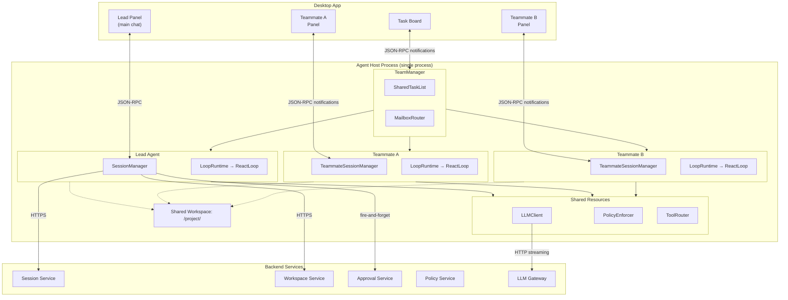
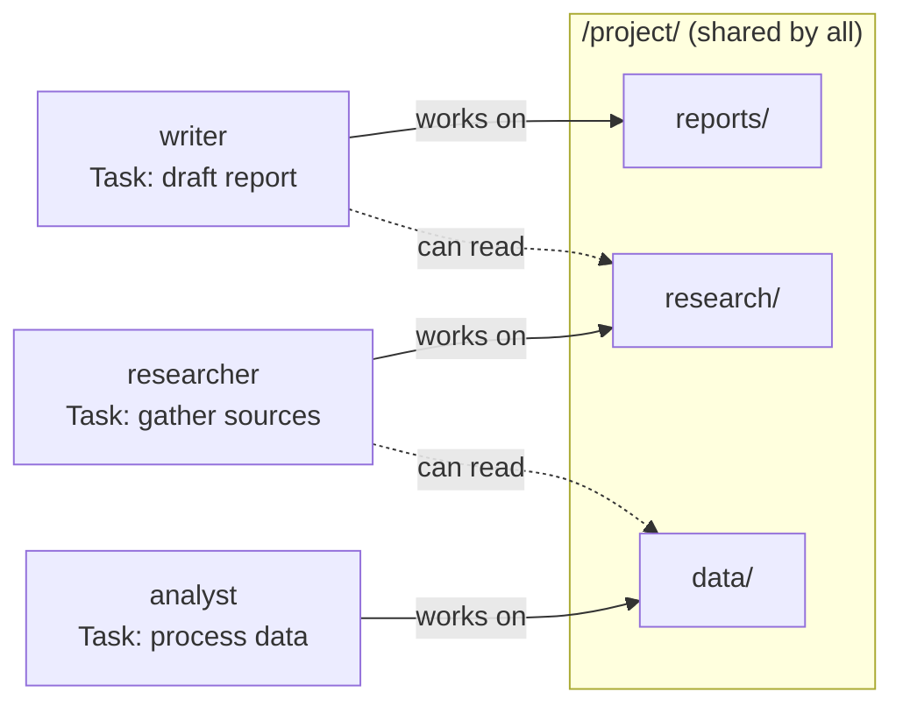
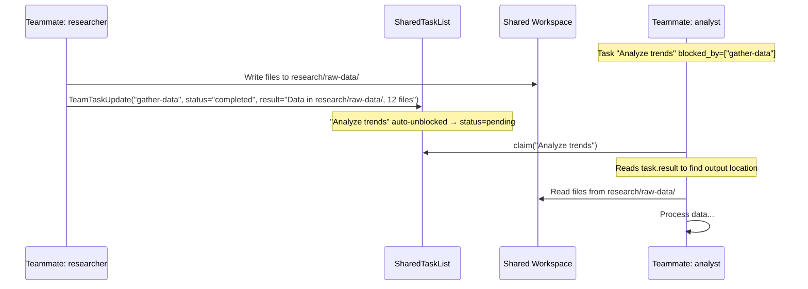
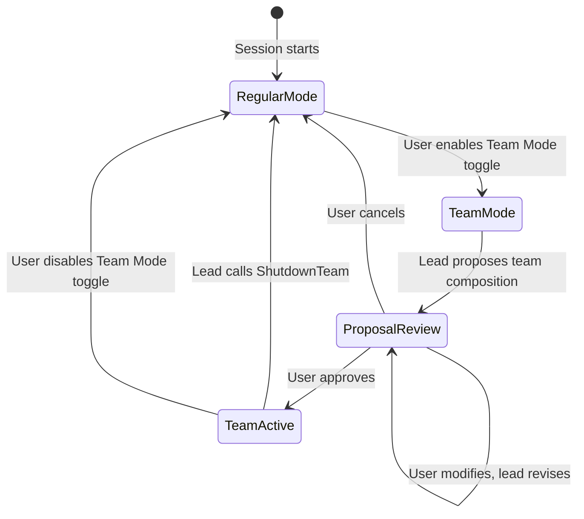
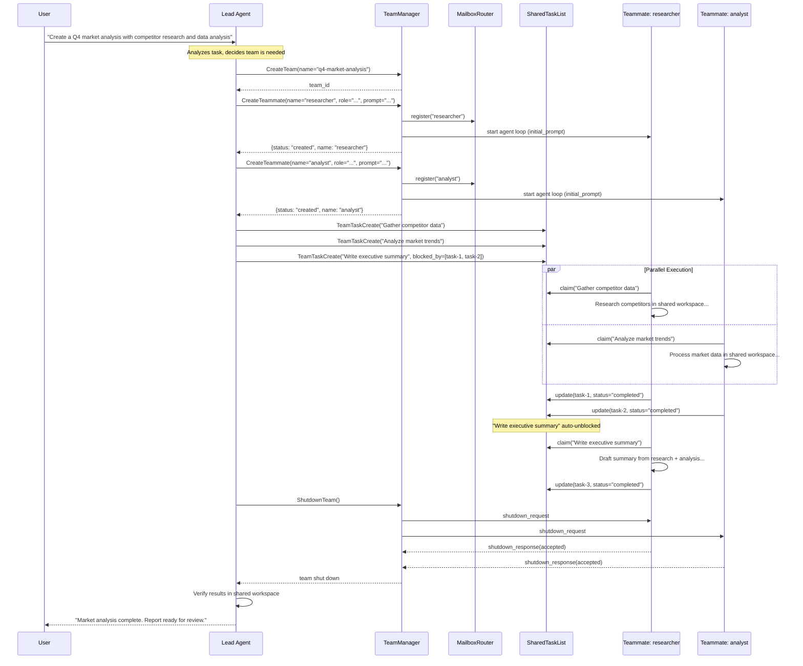
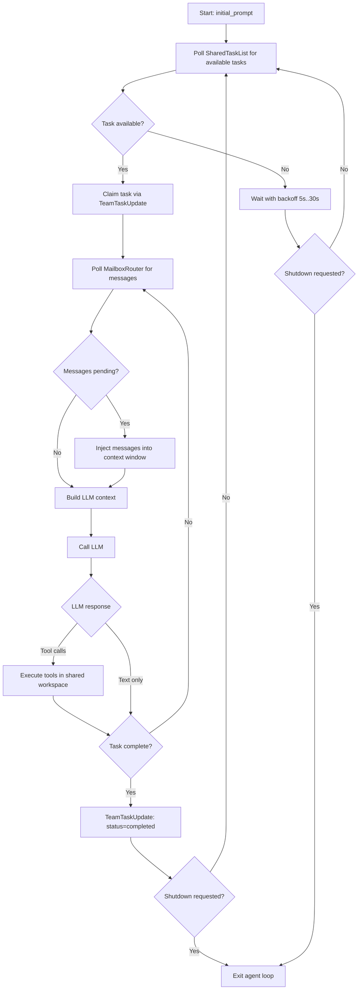
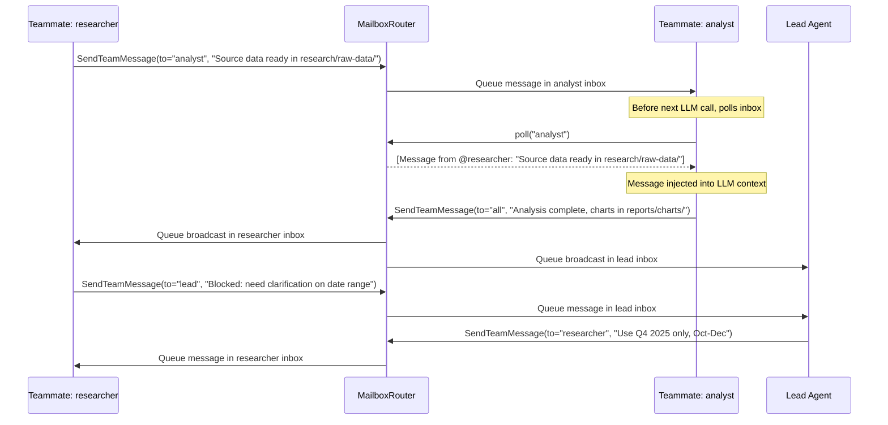
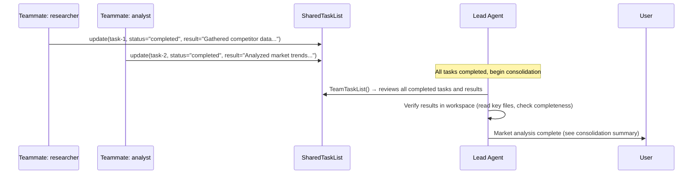
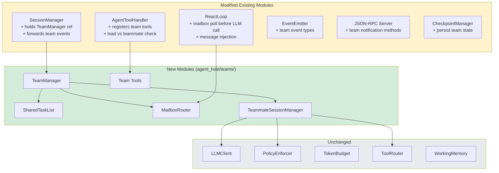
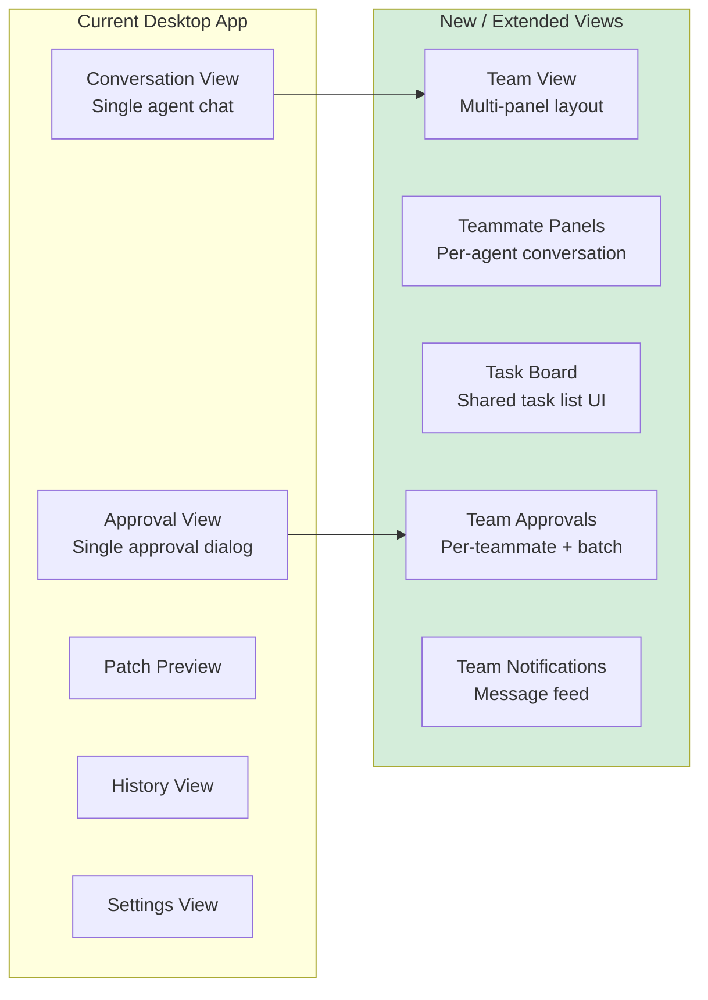

# Agent Teams — Detailed Design

**Phase:** 3+
**Primary Repo:** `cowork-agent-runtime`
**Affected Repos:** `cowork-agent-runtime`, `cowork-desktop-app`, `cowork-session-service`, `cowork-infra`

---

## 1. Purpose

Agent Teams extends cowork's single-agent-with-sub-agents model into a coordinated multi-agent system where a **lead agent** can spawn **teammate agents** that work in parallel on a shared workspace with peer-to-peer communication and shared task tracking.

### What We Have Today

- **Single agent loop** with depth-1 sub-agents (`SpawnAgent` tool)
- Sub-agents: isolated `MessageThread`, shared `TokenBudget`, max 5 concurrent via `asyncio.Semaphore(5)`, max 10 steps each
- Hub-and-spoke only — sub-agents report results to parent, cannot communicate with each other
- No file isolation — all agents operate on the same working directory
- Sub-agent results truncated to 2,048 chars and returned inline

### What Agent Teams Adds

| Capability | Sub-Agents (Current) | Agent Teams (New) |
|-----------|---------------------|-------------------|
| Communication | Hub-and-spoke (parent only) | Peer-to-peer messaging + broadcasts |
| Context | Shared token budget, limited context | Independent token budget per teammate |
| File isolation | Same working directory | Shared workspace (task-based coordination) |
| Coordination | Parent orchestrates all | Shared task list with dependencies |
| Depth | 1 (no recursive spawning) | 1 (teammates can't spawn teams) |
| Lifetime | Ephemeral (within one step) | Persistent (across multiple steps, outlive individual tasks) |
| Visibility | Results only | Full UI panel per teammate |
| Scope | Quick focused lookup | Complex parallel workstreams |

---

## 2. Architecture Overview



### Key Design Decision: Single Process, Multiple Sessions

Unlike Claude Code (which spawns separate OS processes per teammate), cowork runs all teammates **within a single Agent Host process**. This is because:

1. The Desktop App spawns exactly one Agent Host process — multiple processes would require significant transport changes
2. In-process coordination (shared memory, asyncio) is simpler and faster than IPC
3. The Agent Host already supports concurrent sessions via `SessionManager`
4. Token budget enforcement is easier in-process

Each teammate gets its own `SessionManager` → `LoopRuntime` → `ReactLoop` stack, just like a real session, but coordinated by a `TeamManager` that manages the shared task list and mailbox system.

---

## 3. Core Components

### 3.1 TeamManager

New module: `agent_host/teams/team_manager.py`

Owns the lifecycle of a team: creation, teammate spawning, task list, mailboxes, shutdown.

```python
class TeamManager:
    """Manages a team of agents working on a shared project."""

    team_id: str
    lead_session_id: str
    members: dict[str, TeammateInfo]      # name → info
    task_list: SharedTaskList
    mailbox: MailboxRouter
    config: TeamConfig

    async def create_teammate(
        self,
        name: str,
        role: str,
        initial_prompt: str,
    ) -> TeammateInfo: ...

    async def shutdown_teammate(self, name: str) -> None: ...
    async def shutdown_team(self) -> None: ...
```

**Lifecycle:**
1. Lead agent calls `CreateTeam` tool → `TeamManager` created
2. Lead calls `CreateTeammate` tool → `TeamManager.create_teammate()` → new `SessionManager` instance created with access to the shared workspace
3. Teammates run their agent loops independently
4. Lead calls `ShutdownTeam` → graceful shutdown of all teammates

### 3.2 SharedTaskList

New module: `agent_host/teams/task_list.py`

In-memory task list shared between all agents in a team. Replaces the file-based approach used by Claude Code (since we're single-process).

```python
@dataclass
class TeamTask:
    task_id: str
    title: str
    description: str
    status: Literal["pending", "claimed", "in_progress", "completed", "failed", "blocked"]
    assignee: str | None = None         # teammate name
    created_by: str = ""                # teammate name
    blocked_by: list[str] = field(default_factory=list)  # task_ids
    result: str | None = None
    created_at: datetime
    updated_at: datetime

class SharedTaskList:
    """Thread-safe shared task list for agent coordination."""

    _tasks: dict[str, TeamTask]
    _lock: asyncio.Lock

    async def create_task(self, title, description, blocked_by=None, created_by="") -> TeamTask: ...
    async def claim_task(self, task_id: str, assignee: str) -> TeamTask: ...
    async def update_status(self, task_id: str, status: str, result: str | None = None) -> TeamTask: ...
    async def list_tasks(self, status: str | None = None, assignee: str | None = None) -> list[TeamTask]: ...
    async def get_task(self, task_id: str) -> TeamTask | None: ...
    async def get_available_tasks(self, for_teammate: str) -> list[TeamTask]: ...
```

**Dependency Resolution:**
- A task with `blocked_by=["task-A", "task-B"]` stays in `blocked` status
- When task-A and task-B both reach `completed`, the blocked task automatically transitions to `pending`
- `get_available_tasks()` returns only `pending` tasks with all dependencies resolved

**Concurrency Safety:**
- All mutations acquire `asyncio.Lock` (cooperative, no contention in single-threaded asyncio)
- No file locking needed (unlike Claude Code) since everything is in-process

### 3.3 MailboxRouter

New module: `agent_host/teams/mailbox.py`

Enables peer-to-peer messaging between teammates. Messages are queued and polled.

```python
@dataclass
class TeamMessage:
    message_id: str
    from_agent: str
    to_agent: str | None       # None = broadcast
    content: str
    message_type: Literal["message", "broadcast", "shutdown_request", "shutdown_response"]
    timestamp: datetime

class MailboxRouter:
    """Routes messages between team members."""

    _inboxes: dict[str, asyncio.Queue[TeamMessage]]  # agent_name → inbox

    def register(self, agent_name: str) -> None: ...
    def unregister(self, agent_name: str) -> None: ...

    async def send(self, from_agent: str, to_agent: str, content: str) -> None: ...
    async def broadcast(self, from_agent: str, content: str) -> None: ...
    async def poll(self, agent_name: str, timeout: float = 0) -> list[TeamMessage]: ...
    def has_messages(self, agent_name: str) -> bool: ...
```

**Message Injection:**
- Before each LLM call, the `ReactLoop` checks for pending messages via `mailbox.poll()`
- Pending messages are injected as a system message in the context window:
  ```
  [Team Messages]
  From @research-agent: "Found 12 relevant papers on the topic. Summary saved to workspace/research/findings.md"
  From @lead: "Please also check for contradicting studies from the last 2 years"
  ```
- This approach avoids interrupting the agent mid-step

### 3.4 Shared Workspace

All teammates share the same workspace directory. There is no file copying, no sandboxing, and no isolation layer.

#### Why Shared?

- **Zero overhead** — no copies, no disk usage, instant teammate startup regardless of workspace size
- **Simplicity** — no merge step, no delta tracking, no ToolExecutor interception
- **Real-time visibility** — teammates see each other's changes immediately
- **Works universally** — git repos, data directories, media projects, any workspace

Copying workspaces is impractical (multi-GB repos, 4 teammates = 4x disk usage). File reservation adds complexity that doesn't pay off — the lead must predict file access upfront, and agents often discover they need unexpected files mid-task.

#### How Conflicts Are Prevented

Conflicts are prevented by **task decomposition**, not enforcement. The lead agent decomposes work into tasks that target non-overlapping areas of the workspace:



This is the same coordination model humans use — you don't lock files, you divide work so people don't step on each other. The `SharedTaskList` makes the division explicit so teammates know what's theirs.

If two teammates do write the same file (rare with good task decomposition), the later write wins. The lead can detect this during verification and fix it.

#### Inter-Teammate Data Flow

When one teammate's work depends on another's output (e.g. an analyst waiting on a researcher's data), three mechanisms work together:



**1. SharedTaskList dependencies (sequencing)** — The analyst's task has `blocked_by=["gather-data"]`. It stays blocked until the researcher marks their task completed. This ensures the analyst doesn't start before the data exists.

**2. Workspace files (data transfer)** — The researcher writes output to the shared workspace. The analyst reads those files directly. This is the primary mechanism for transferring substantial data between teammates.

**3. Task result field (location discovery)** — When the researcher completes a task, the `result` field includes where the output lives: `"Data in research/raw-data/, 12 files"`. The analyst reads this from the task list to know where to look.

**Convention:** The lead agent establishes the data flow when creating tasks. Each task's `description` specifies:
- **Where to write output** — so the producer knows the expected location
- **Where to read input** — so the consumer knows where to look
- **What format to expect** — so the consumer can parse without guessing

Example task descriptions from the lead:

```
Task: "Gather competitor data"
  Description: "Research the top 8 competitors. Save one file per competitor
    in research/competitors/{name}.md. Each file should have sections:
    Overview, Products, Pricing, Market Share."

Task: "Analyze market trends" (blocked_by: gather-data)
  Description: "Read competitor profiles from research/competitors/.
    Produce trend analysis in data/analysis/trends.md and comparison
    charts in reports/charts/. Use the competitor data as primary source."
```

For lightweight coordination that doesn't need task dependencies (e.g. a tip or status update mid-task), teammates use **MailboxRouter messages** directly. Messages are injected into the recipient's LLM context before their next call, so they're seen promptly but don't interrupt work in progress.

#### Future Enhancement: Git Worktrees (Phase 3c)

For git repositories where true isolation becomes necessary (e.g. teammates experimenting with conflicting approaches), git worktrees can be added as an opt-in mode later. Worktrees are lightweight (shared `.git` objects, no data copy) and provide branch-based isolation with git's merge machinery for consolidation. This is deferred to keep the initial implementation simple.

---

## 4. Agent-Internal Tools (Team Extensions)

New tools added to `AgentToolHandler` when a team is active:

### 4.1 Lead-Only Tools

```python
# CreateTeam — Initialize a team
{
    "name": "CreateTeam",
    "parameters": {
        "name": {"type": "string", "description": "Team name"},
        "description": {"type": "string", "description": "Team objective"}
    }
}

# CreateTeammate — Spawn a new teammate
{
    "name": "CreateTeammate",
    "parameters": {
        "name": {"type": "string", "description": "Short identifier (e.g. 'researcher')"},
        "role": {"type": "string", "description": "Role description for context"},
        "initial_prompt": {"type": "string", "description": "First instruction for the teammate"}
    }
}

# ShutdownTeammate — Gracefully stop a teammate
{
    "name": "ShutdownTeammate",
    "parameters": {
        "name": {"type": "string", "description": "Teammate name to shut down"}
    }
}

# ShutdownTeam — Shut down all teammates and clean up
{
    "name": "ShutdownTeam",
    "parameters": {}
}
```

### 4.2 Tools Available to All Team Members (Lead + Teammates)

```python
# TeamTaskCreate — Add a task to the shared list
{
    "name": "TeamTaskCreate",
    "parameters": {
        "title": {"type": "string"},
        "description": {"type": "string"},
        "blocked_by": {"type": "array", "items": {"type": "string"}, "description": "Task IDs this depends on"}
    }
}

# TeamTaskUpdate — Update task status
{
    "name": "TeamTaskUpdate",
    "parameters": {
        "task_id": {"type": "string"},
        "status": {"type": "string", "enum": ["claimed", "in_progress", "completed", "failed"]},
        "result": {"type": "string", "description": "Completion summary (when status=completed)"}
    }
}

# TeamTaskList — View all tasks
{
    "name": "TeamTaskList",
    "parameters": {
        "status": {"type": "string", "description": "Filter by status (optional)"},
        "assignee": {"type": "string", "description": "Filter by assignee (optional)"}
    }
}

# SendTeamMessage — Send a message to a teammate or broadcast
{
    "name": "SendTeamMessage",
    "parameters": {
        "to": {"type": "string", "description": "Teammate name, or 'all' for broadcast"},
        "content": {"type": "string", "description": "Message content"}
    }
}
```

### 4.3 Tool Availability Matrix

| Tool | Lead | Teammate | Condition |
|------|------|----------|-----------|
| `CreateTeam` | yes | no | No active team |
| `CreateTeammate` | yes | no | Team active |
| `ShutdownTeammate` | yes | no | Team active |
| `ShutdownTeam` | yes | no | Team active |
| `TeamTaskCreate` | yes | yes | Team active |
| `TeamTaskUpdate` | yes | yes | Team active |
| `TeamTaskList` | yes | yes | Team active |
| `SendTeamMessage` | yes | yes | Team active |
| `SpawnAgent` | yes | yes | Existing sub-agent tool (unchanged) |

Teammates retain access to all existing tools (`ReadFile`, `WriteFile`, `RunCommand`, etc.) — they are full agents, not limited sub-agents.

---

## 5. Team Mode & Composition

### 5.1 Team Mode is User-Controlled

Team mode is an **explicit opt-in by the user**, not a decision the agent makes on its own. This is because teams:

- Cost significantly more tokens (each teammate is a full agent loop with independent budget)
- Change the UI layout from single conversation to multi-panel
- Take longer to set up and coordinate than solo execution

**The agent never creates a team unless the user has enabled team mode.**

#### Desktop App: Team Mode Toggle

The Desktop App provides a **Team Mode toggle** in the conversation toolbar (similar to Plan Mode). When team mode is off, the `CreateTeam` and `CreateTeammate` tools are not available to the agent — it cannot spawn teammates even if the task would benefit from parallelism.



#### Proposal → Approval Flow

When team mode is enabled, the lead agent **proposes** a team composition before spawning anything. The user reviews and can modify the proposal:

```
User enables Team Mode, then types:
  "Research and write a comprehensive market analysis report for Q4"

Lead agent proposes:
  "I'd like to set up a team of 3 for this:
   - researcher: Gather market data, competitor info, and industry trends
   - analyst: Process data, create charts, and compute key metrics
   - writer: Draft the final report with executive summary and recommendations

   I'll create tasks with dependencies so the final report runs after research and analysis.
   Shall I proceed?"

User: "Yes, go ahead" (or "Drop analyst, I'll handle the numbers myself")

Lead agent → CreateTeam(name="q4-market-analysis", ...)
Lead agent → CreateTeammate(name="researcher", ...)
Lead agent → CreateTeammate(name="analyst", ...)
...
```

This two-step flow (propose → confirm) gives the user full control over cost and team structure while letting the agent use its judgment for the initial proposal.

### 5.2 User Specifies Composition Directly

The user can skip the proposal step and specify exactly what they want:

```
User: "Team mode. 2 agents: one for research, one for writing the proposal."

Lead agent → CreateTeam(name="grant-proposal", ...)
Lead agent → CreateTeammate(name="researcher", role="Literature review and data gathering", ...)
Lead agent → CreateTeammate(name="writer", role="Draft and format the proposal document", ...)
```

### 5.3 Agent Can Suggest Team Mode

When team mode is off, the agent can **suggest** (but not activate) team mode if the task would benefit:

```
User: "Organize and summarize all 8 quarterly reports from last year into a single annual review"

Agent: "This involves 8 independent report summaries that could run in parallel.
        Would you like to enable Team Mode? I'd suggest 4 teammates,
        each handling 2 quarterly reports."

User: [enables Team Mode toggle] "Go for it"
```

The agent never bypasses the user — it suggests, the user decides.

### 5.4 Lead Decision Heuristics

When team mode is enabled, the lead agent's system prompt includes guidance for composition:

```
## Team Composition Guidelines

When the user enables Team Mode, propose a team composition before spawning:

Sizing:
- 2-3 teammates: Most common. Good for research/writing splits, parallel document processing.
- 4-6 teammates: Large projects with many independent workstreams (e.g. multi-topic research, batch file processing).
- 7-8 teammates: Rare. Only for truly large-scale parallel work.

Always propose the team to the user first. Wait for confirmation before calling
CreateTeam or CreateTeammate. The user may want to adjust the composition.
```

### 5.4 Team Creation Sequence



### 5.5 Team Templates (Future Enhancement)

In a later phase, users or organizations could define reusable team templates:

```json
{
  "name": "research-report",
  "description": "Standard template for research-driven report generation",
  "teammates": [
    {"name": "researcher", "role": "Gather sources, data, and reference materials"},
    {"name": "analyst", "role": "Process data, create visualizations, compute metrics"},
    {"name": "writer", "role": "Draft final report with findings and recommendations"}
  ],
  "task_patterns": [
    {"title": "Collect and organize source materials", "assignee": "researcher"},
    {"title": "Analyze data and generate charts", "assignee": "analyst"},
    {"title": "Write final report", "blocked_by": ["task-1", "task-2"], "assignee": "writer"}
  ]
}
```

This is **not part of the initial implementation** — the prompt-driven approach is sufficient for launch and avoids premature abstraction. Templates can be added in Phase 3c if usage patterns emerge.

---

## 6. Teammate Lifecycle

### 5.1 Creation

```
Lead calls CreateTeammate(name="researcher", role="...", initial_prompt="...")
  │
  ├─ TeamManager.create_teammate()
  │   ├─ MailboxRouter.register("researcher")
  │   │
  │   ├─ Create TeammateSessionManager (lightweight variant of SessionManager)
  │   │     → Shares: LLMClient, PolicyEnforcer, PolicyBundle, workspace directory
  │   │     → Fresh: MessageThread, TokenBudget(teammate_limit), WorkingMemory
  │   │
  │   └─ Start agent loop: asyncio.create_task(teammate.run(initial_prompt))
  │
  └─ Return to lead: {"status": "created", "name": "researcher"}
```

### 6.2 Execution Loop (per Teammate)

Each teammate runs a standard `ReactLoop` with these additions:

1. **Before each LLM call** — check mailbox, inject pending messages as context
2. **After task completion** — automatically poll `SharedTaskList` for next available task
3. **Idle behavior** — if no tasks available and no messages, wait with backoff (poll every 5s, max 30s)
4. **Shutdown signal** — when `shutdown_request` message received, finish current step, exit



#### Peer-to-Peer Communication Flow



### 6.3 Teammate System Prompt

```
You are a teammate in a multi-agent team working on a shared project.

Team: {team_name}
Your name: {teammate_name}
Your role: {role_description}

## Working Directory
You are working in: {workspace_path}
You share this workspace with other teammates. Stick to the files relevant to your
assigned tasks. Check the task list to see what others are working on to avoid conflicts.

## Coordination
- Use TeamTaskList to see what needs to be done
- Use TeamTaskUpdate to claim tasks and report completion
- Use SendTeamMessage to communicate with teammates or the lead
- Save your work frequently

## Guidelines
- Focus on your assigned tasks
- When blocked, message the relevant teammate or the lead
- When your current task is done, check the task list for more work
- If the task list is empty and you have no messages, let the lead know you are idle
```

### 6.4 Shutdown

```
Lead calls ShutdownTeammate(name="researcher")
  │
  ├─ MailboxRouter.send(to="researcher", type="shutdown_request")
  │
  ├─ Teammate receives shutdown_request in next message poll
  │   ├─ Finishes current step
  │   ├─ Sends shutdown_response(status="accepted")
  │   └─ Agent loop exits
  │
  ├─ TeamManager waits for loop completion (timeout: 60s)
  │   └─ If timeout: force-cancel the teammate task
  │
  └─ MailboxRouter.unregister("researcher")
```

---

## 7. Result Consolidation

When teammates complete their work, the lead agent verifies and reports the results. Since all teammates share the same workspace, there is no merge step — changes are already in place.

### 7.1 Consolidation Flow



### 7.2 What the Lead Does

No merge needed — changes are already in the workspace. Consolidation is **verification**:

1. Lead reads the `SharedTaskList` to see what each teammate accomplished
2. Lead verifies the results (runs tests, checks file integrity, reviews key changes)
3. Lead reports a summary to the user
4. No cleanup needed (no sandboxes to remove)

Since the lead decomposes tasks into non-overlapping areas of the workspace, conflicts are prevented by design rather than detected after the fact.

### 7.3 What the User Sees

The lead produces a **consolidation summary** for the user:

```
Team "q4-market-analysis" completed:

  researcher (3 tasks, 42 steps):
    - Gathered data on 8 competitors in research/competitors/
    - Collected 12 industry reports, saved to research/sources/
    - Created research/summary.md with key findings

  analyst (2 tasks, 38 steps):
    - Processed quarterly revenue data into data/analysis/
    - Generated 5 trend charts in reports/charts/
    - Created data/metrics.md with computed KPIs

  Verification:
    - All source files present and cross-referenced
    - Executive summary covers all research findings
    - Charts match the underlying data
```

The user can then review the outputs in the Desktop App, just like any other agent output.

### 7.4 Partial Failure Handling

If a teammate fails or is shut down before completing:

- **Completed tasks**: Results are preserved and consolidated normally
- **In-progress task**: Marked as `failed` in the task list. Lead can reassign to another teammate or handle it solo
- **Partial workspace changes**: Since all teammates share the workspace, partial changes are already present. The lead reviews and may need to clean up incomplete work before reassigning

The lead reports partial failures to the user:

```
Team "q4-market-analysis" completed with issues:
  researcher: Completed all tasks successfully
  analyst: Failed on "Generate forecast models" (budget exhausted after 2/3 tasks)
    - 2 completed tasks applied
    - 1 remaining task reassigned to lead (completing now)
```

---

## 8. Token Budget Strategy

### Per-Teammate Budgets

Unlike sub-agents (which share the parent's budget), teammates get **independent token budgets** carved from the session's total allocation:

```python
@dataclass
class TeamBudgetConfig:
    total_session_tokens: int          # e.g. 1,000,000
    lead_reserved_tokens: int          # e.g. 200,000 (always reserved for lead)
    per_teammate_tokens: int           # e.g. 150,000 (default per teammate)
    max_teammates: int = 8             # hard cap
```

**Budget allocation:**
- Lead always retains `lead_reserved_tokens` — teammates cannot exhaust the lead's budget
- Each teammate starts with `per_teammate_tokens`
- If a teammate runs out, it reports back to the lead and stops
- The lead can reallocate unused budget from completed teammates

**Why independent budgets (not shared):**
- A runaway teammate cannot starve others
- Budget exhaustion is localized — one teammate hitting its limit doesn't block the team
- The lead retains enough budget to verify results and report to user

---

## 9. Policy & Approval Handling

### Shared Policy Bundle

All teammates share the same `PolicyBundle` from the session. Capabilities, path restrictions, and approval rules are identical.

### Teammate Approvals

When a teammate triggers an approval-required action:

1. Teammate's `ToolExecutor` calls `approval_gate.request_approval()`
2. The approval request is forwarded to the Desktop App with the **teammate name** in the context
3. Desktop App shows the approval in the **teammate's UI panel** (not the lead's)
4. User approves/denies in that panel
5. Decision is persisted to Approval Service (fire-and-forget, same as today)

**UI considerations:**
- Each teammate panel shows its own approval requests
- Approvals can pile up across teammates — the Desktop App should show a count badge
- Consider a "batch approve" option for low-risk actions across teammates

### Auto-Approval for Teammates

To reduce approval fatigue, the lead can configure auto-approval rules when creating the team:

```python
class TeamConfig:
    auto_approve: list[str] = []  # capability names, e.g. ["File.Read", "File.Write"]
    require_plan_approval: bool = True  # lead reviews teammate plans before execution
```

This is additive to policy — it only skips the user approval UI for actions the policy already allows. It cannot override a policy denial.

---

## 10. Desktop App Integration

### UI Layout

When a team is active, the Desktop App switches to a **team view**:

```
┌──────────────────────────────────────────────────────────────────┐
│  Team: "Q4 Market Analysis"                        [Shutdown Team]│
├──────────────────┬──────────────────┬────────────────────────────┤
│  Lead            │  researcher      │  analyst                   │
│  ─────────────── │  ─────────────── │  ──────────────────────── │
│  Conversation    │  Conversation    │  Conversation              │
│  messages...     │  messages...     │  messages...               │
│                  │                  │                            │
│                  │                  │                            │
│                  │  [Approval: Y/N] │                            │
│                  │                  │                            │
├──────────────────┴──────────────────┴────────────────────────────┤
│  Shared Tasks                                                    │
│  ☑ Gather competitor data (researcher) — completed               │
│  ▶ Analyze market trends (analyst) — in_progress                │
│  ⏸ Write executive summary — blocked by: task-1, task-2         │
│  ○ Final review and formatting — pending                         │
└──────────────────────────────────────────────────────────────────┘
```

### JSON-RPC Extensions

New notifications from Agent Host → Desktop App:

```jsonc
// Team created
{"jsonrpc": "2.0", "method": "team/created", "params": {"teamId": "...", "name": "..."}}

// Teammate spawned
{"jsonrpc": "2.0", "method": "team/teammate_created", "params": {"teamId": "...", "name": "researcher", "role": "..."}}

// Teammate shut down
{"jsonrpc": "2.0", "method": "team/teammate_removed", "params": {"teamId": "...", "name": "researcher"}}

// Task list updated
{"jsonrpc": "2.0", "method": "team/task_updated", "params": {"teamId": "...", "task": {...}}}

// Team message sent (for UI display)
{"jsonrpc": "2.0", "method": "team/message", "params": {"teamId": "...", "from": "researcher", "to": "lead", "content": "..."}}

// Teammate conversation update (stream to UI panel)
{"jsonrpc": "2.0", "method": "team/teammate_output", "params": {"teamId": "...", "name": "researcher", "content": "..."}}
```

---

## 11. Constraints & Guardrails

### Hard Limits

| Constraint | Value | Rationale |
|-----------|-------|-----------|
| Max teammates per team | 8 | Coordination overhead grows superlinearly |
| Max teams per session | 1 | Prevent nested team complexity |
| Teammate depth | 0 (no teams) | Teammates cannot spawn their own teams |
| Sub-agents within teammates | Allowed (depth-1) | Teammates can use SpawnAgent for focused lookups |
| Teammate max steps | 200 (configurable) | Prevent runaway teammates |
| Shutdown grace period | 60 seconds | Force-cancel after timeout |
| Idle timeout | 5 minutes | Shut down idle teammates to save tokens |

### Safety

- **Workspace boundaries**: All teammates share the workspace but the `PolicyEnforcer` path restrictions from the session's `PolicyBundle` still apply. Teammates cannot access paths outside the allowed workspace.
- **Teammate isolation**: Teammates cannot access each other's `MessageThread` or `WorkingMemory`. Communication is only via `SharedTaskList` and `MailboxRouter`.
- **Lead authority**: Only the lead can create/shutdown teammates. Teammates cannot promote themselves or modify team configuration.
- **Graceful degradation**: If a teammate crashes, the team continues. The lead is notified and can reassign the crashed teammate's tasks.

---

## 12. Relationship to Existing Sub-Agents

Sub-agents and teammates serve different purposes and **coexist**:

| Aspect | Sub-Agents | Teammates |
|--------|-----------|-----------|
| **Scope** | Quick focused task (e.g. "search for X") | Extended workstream (e.g. "research and analyze market data") |
| **Lifetime** | Single tool call (seconds) | Minutes to hours |
| **Budget** | Shared with parent | Independent allocation |
| **File isolation** | None (same directory) | Shared workspace (task-based coordination) |
| **Persistence** | Ephemeral | Persisted (survives parent step boundaries) |
| **Communication** | Return value only | Bidirectional messaging |
| **Who can spawn** | Any agent (lead or teammate) | Lead only |

A teammate can use `SpawnAgent` for quick sub-tasks, just like the lead does today. This is the only form of depth > 1 allowed.

---

## 13. Module Structure

```
agent_host/
  teams/
    __init__.py
    team_manager.py        # TeamManager: lifecycle, coordination
    task_list.py           # SharedTaskList: in-memory task tracking
    mailbox.py             # MailboxRouter: peer-to-peer messaging
    models.py              # TeamConfig, TeammateInfo, TeamTask, TeamMessage
    teammate_session.py    # TeammateSessionManager: lightweight session for teammates
    tools.py               # Team-specific agent tool definitions and handlers
```

### How We Extend Existing Components

Agent Teams is designed to build on top of the existing architecture — no rewrites, only extensions. The diagram below shows what's new (green) vs what's modified (yellow) vs unchanged (grey).



#### `cowork-agent-runtime` — Detailed Changes Per Module

**`SessionManager` (`session/session_manager.py`)**
- Add `_team_manager: TeamManager | None` instance variable
- New method: `create_team()` → instantiates `TeamManager`, wires shared resources
- New method: `shutdown_team()` → delegates to `TeamManager.shutdown_team()`
- Modify `_run_agent()`: if team active, pass `MailboxRouter` ref to `ReactLoop`
- Modify `shutdown()`: shutdown team before closing session
- Forward team events (teammate created/removed, task updates) to `EventEmitter`

**`AgentToolHandler` (`loop/agent_tools.py`)**
- Add team tool definitions to `get_tool_definitions()` when `TeamManager` is active
- New handlers: `_handle_create_team()`, `_handle_create_teammate()`, `_handle_shutdown_teammate()`, `_handle_shutdown_team()`, `_handle_team_task_create()`, `_handle_team_task_update()`, `_handle_team_task_list()`, `_handle_send_team_message()`
- Add `is_lead: bool` flag to control which tools are available (lead-only vs all members)
- Wire `TeamManager` callbacks similar to existing `_spawn_sub_agent` callback pattern

**`ReactLoop` (`loop/react_loop.py`)**
- Modify `_build_messages()`: if `mailbox` ref exists, poll for messages and inject as system message before the volatile suffix
- Message injection format: `[Team Messages]\nFrom @name: "content"\n...`
- No changes to tool execution flow — team tools route through `AgentToolHandler` like existing agent tools

**`ToolExecutor` (`loop/tool_executor.py`)**
- No changes needed — teammates share the workspace and use the same `ExecutionContext.workspace_dir` as the lead

**`EventEmitter` (`events/event_emitter.py`)**
- New event types: `team_created`, `teammate_created`, `teammate_removed`, `team_task_updated`, `team_message`, `team_shutdown`
- Each event carries `team_id` + relevant context
- Events forwarded to JSON-RPC server as notifications

**`CheckpointManager` (`session/checkpoint_manager.py`)**
- Extend `SessionCheckpoint` with optional `team_state: TeamCheckpoint`
- `TeamCheckpoint` contains: team config, member list, task list snapshot, teammate message thread snapshots
- On restore: recreate `TeamManager` and resume teammate loops

**`JSON-RPC Server` (`server/handlers.py`)**
- New notification methods: `team/created`, `team/teammate_created`, `team/teammate_removed`, `team/task_updated`, `team/message`, `team/teammate_output`
- Subscribe to `EventEmitter` team events and forward as JSON-RPC notifications
- No new request methods needed — team operations are tool calls, not direct RPC

**`config.py`**
- New env vars: `MAX_TEAMMATES` (default 8), `TEAMMATE_MAX_STEPS` (default 200), `TEAMMATE_IDLE_TIMEOUT` (default 300s), `TEAM_ISOLATION_MODE` (default "auto")

#### `cowork-desktop-app` — Required Extensions

The Desktop App needs significant UI additions to support teams:



**New views:**

| View | Purpose | IPC Events Consumed |
|------|---------|-------------------|
| `TeamView` | Container layout — splits screen into lead + teammate panels + task board | `team/created`, `team/teammate_created`, `team/teammate_removed` |
| `TeammatePanel` | Per-teammate conversation stream (mirrors `ConversationView` but scoped) | `team/teammate_output` |
| `TaskBoardView` | Visual task list with status indicators, assignees, dependency lines | `team/task_updated` |
| `TeamMessageFeed` | Timeline of inter-agent messages (optional, for transparency) | `team/message` |

**Modified views:**

| View | Change |
|------|--------|
| `ConversationView` | Detect `team/created` event → switch to `TeamView` layout |
| `ApprovalView` | Show teammate name in approval dialog; support batch approve across teammates |
| `HistoryView` | Show team sessions with teammate breakdown |

**State management (`state/`):**
- New `TeamState` slice: team config, members, task list, per-teammate conversation buffers
- Subscribe to `team/*` JSON-RPC notifications to keep state synchronized

**IPC client (`ipc/`):**
- Register handlers for new `team/*` notification methods
- No new request methods — team operations are initiated by the agent, not the user

#### `cowork-session-service` — Minor Extensions

| Change | Purpose |
|--------|---------|
| Add `teamId` field to Session model | Track which sessions are part of a team |
| Add `parentSessionId` field | Link teammate sessions to lead session |
| New query: list sessions by `teamId` | Retrieve all teammate sessions for a team |
| New session type: `"teammate"` | Distinguish lead vs teammate sessions in history |

These are backward-compatible additions — existing sessions are unaffected.

#### `cowork-workspace-service` — No Changes

Teammates use the same workspace service. Each teammate's artifacts are tagged with its session ID, which links back to the team via the session service.

#### `cowork-approval-service` — No Changes

Approval decisions already carry `sessionId` + `userId`. Teammate approvals are just approvals from a teammate session — no schema changes needed.

#### `cowork-policy-service` — Minor Extension

| Change | Purpose |
|--------|---------|
| Optional `teamPolicy` section in PolicyBundle | Team-specific settings: max teammates, auto-approve capabilities, budget allocation |

This is additive — policies without `teamPolicy` use defaults.

---

## 14. Implementation Plan

### Phase 3a: Core Team Infrastructure

1. **SharedTaskList** — in-memory task list with dependencies and locking
2. **MailboxRouter** — in-memory message queues with poll/send/broadcast
3. **TeamManager** — teammate lifecycle, wiring shared resources
5. **TeammateSessionManager** — lightweight session manager variant for teammates
6. **Team tools** — `CreateTeam`, `CreateTeammate`, `ShutdownTeammate`, `ShutdownTeam`, `TeamTaskCreate`, `TeamTaskUpdate`, `TeamTaskList`, `SendTeamMessage`
7. **ReactLoop integration** — mailbox polling, message injection
8. **Unit tests** — all components

### Phase 3b: Desktop App Integration

9. **JSON-RPC notifications** — team events emitted to Desktop App
10. **Team view UI** — multi-panel layout, per-teammate conversation, shared task board
11. **Teammate approval UI** — per-panel approval dialogs, batch approve

### Phase 3c: Hardening

12. **Checkpoint/recovery** — persist team state, restore on crash
13. **Budget reallocation** — lead can redistribute unused teammate budgets
14. **Idle timeout** — auto-shutdown idle teammates
15. **Integration tests** — end-to-end team workflows

### Estimated Scope

| Component | Effort | Dependencies |
|-----------|--------|-------------|
| SharedTaskList | Small | None |
| MailboxRouter | Small | None |
| TeamManager | Medium | TaskList, Mailbox |
| TeammateSessionManager | Medium | SessionManager refactor |
| Team tools | Medium | TeamManager |
| ReactLoop integration | Small | MailboxRouter |
| JSON-RPC notifications | Small | EventEmitter |
| Desktop App team view | Large | JSON-RPC notifications |
| Checkpoint/recovery | Medium | CheckpointManager |

---

## 15. Open Questions

1. **Should teammates share the same LLM model, or can the lead assign different models?** A cheaper model for simple tasks (e.g. data extraction, file organization) could reduce costs significantly. The `LLMClient` already takes a model parameter.

2. **Should the shared task list be persisted to the Session Service?** Currently in-memory only. Persisting would enable crash recovery and team history, but adds backend coupling. Recommendation: persist to checkpoint file first (like `WorkingMemory`), consider backend persistence later.

3. **How should file conflicts be handled?** If two teammates write to the same file (rare with good task decomposition), the later write wins. Options: (a) let the lead detect and fix during verification, (b) add advisory file tracking to the task list so teammates can see who's working where. Recommendation: (a) for simplicity, since good task decomposition prevents most conflicts.

4. **Should teammates be able to request more budget from the lead?** This adds complexity but prevents premature shutdown of productive teammates. Recommendation: implement in Phase 3c with a `BudgetRequest` message type.

5. **What happens when the Desktop App disconnects mid-team?** The Agent Host should pause all teammates (drain current step, then wait). On reconnect, resume. This aligns with the existing session resume design.

---

## 16. References

- **Claude Code Agent Teams**: [Official docs](https://code.claude.com/docs/en/agent-teams), announced Feb 2026 with Opus 4.6
- **"Building a C compiler with a team of parallel Claudes"**: Anthropic engineering blog — 16 agents, 100K lines of Rust, ~$20K
- **Existing sub-agent design**: `cowork-infra/docs/components/local-agent-host.md` §4.8
- **Loop strategy architecture**: `cowork-infra/docs/components/loop-strategy.md`
