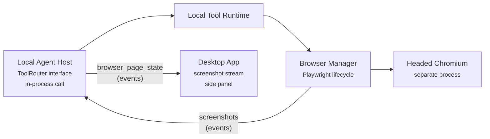
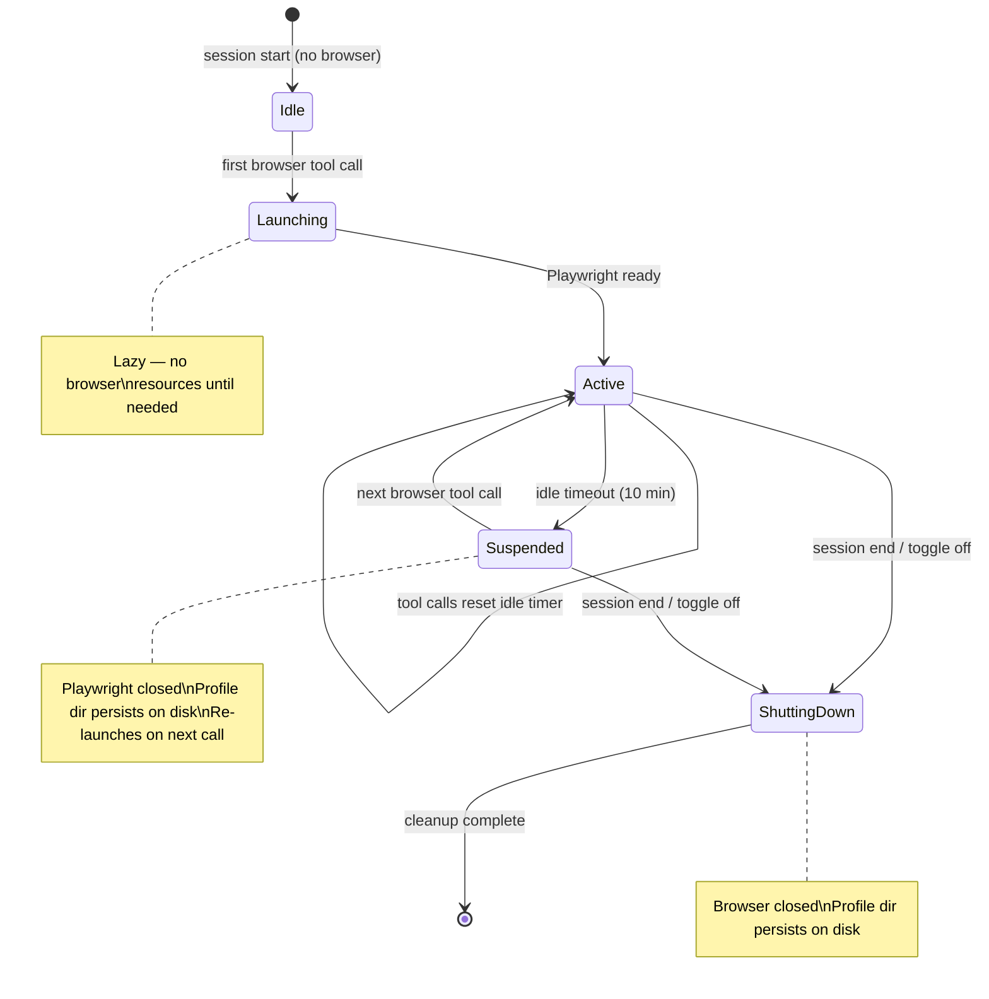
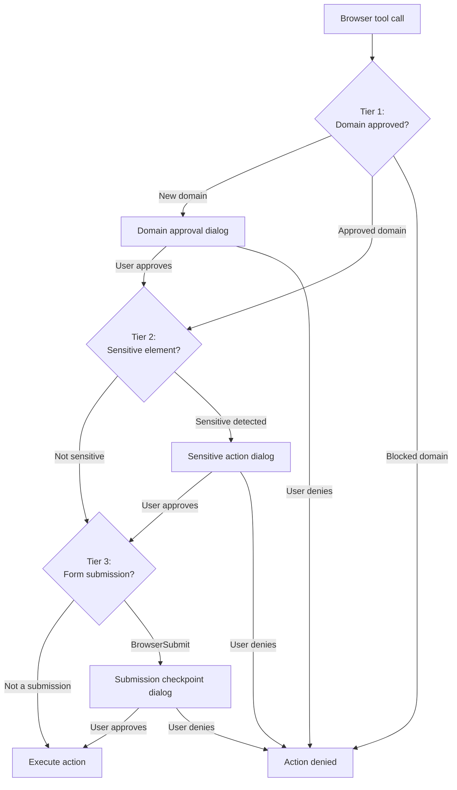
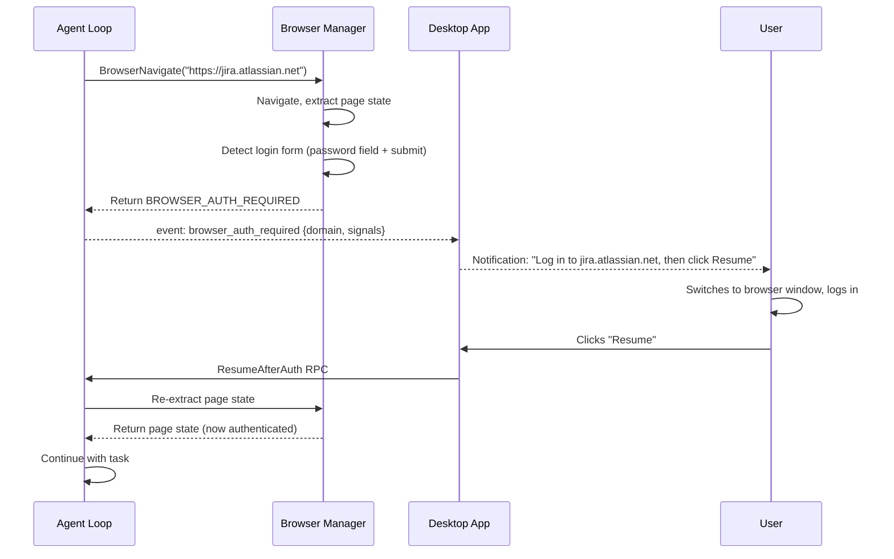
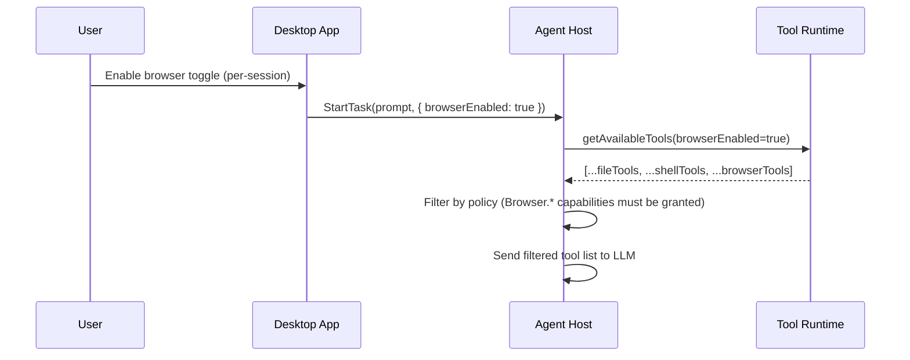

# Browser Automation — Component Design

**Repos:** `cowork-agent-runtime` (`tool_runtime/tools/browser/`), `cowork-desktop-app` (browser side panel, approval extensions)
**Bounded Context:** ToolExecution (browser), AgentExecution (UI)
**Phase:** 2 (MVP); autonomous mode in Phase 3+

---

The browser automation capability enables the agent to perform browser-based tasks — research, form filling, multi-step workflows, and file downloads — with human-in-the-loop oversight. It uses Playwright as the browser engine, integrated directly into the Local Tool Runtime as a new tool category alongside file, shell, network, and code tools.

This document describes the architecture of the browser automation feature. For the tool execution framework it extends, see [local-tool-runtime.md](local-tool-runtime.md). For the approval system it leverages, see [local-agent-host.md](local-agent-host.md). For the desktop UI changes, see [desktop-app.md](desktop-app.md).

**Prerequisites:** [architecture.md](../architecture.md) (capability model, policy bundles), [local-tool-runtime.md](local-tool-runtime.md) (tool system), [local-agent-host.md](local-agent-host.md) (approval flow, event system), [desktop-app.md](desktop-app.md) (IPC, UI state)

---

## 1. Overview

### What this feature does

- Adds 11 browser tools to the Local Tool Runtime — navigate, click, type, select, scroll, back, extract, screenshot, submit, download, wait
- Manages a Playwright browser instance lifecycle within the agent-runtime process — lazy launch, idle timeout, session-end cleanup
- Returns structured page state (accessibility tree with indexed interactive elements) to the LLM after each action
- Provides a screenshot stream to the Desktop App via a collapsible side panel
- Implements three-tier HITL: domain approval → sensitive action detection → submission checkpoints
- Supports user takeover — the user can pause the agent, interact with the headed browser directly, and resume
- Handles authentication via hybrid auto-detection (login form / 401 / OAuth detection) with user takeover fallback
- Persists browser sessions (cookies, localStorage) per workspace across Cowork sessions
- Requires explicit user opt-in — browser tools are only available when the user enables the browser capability toggle

### What this feature does NOT do

- Replace the agent loop — Cowork's LLM decides when and how to use browser tools, same as file/shell tools
- Run its own agent loop — no nested LLM calls (unlike browser-use or Stagehand). Each browser action is a discrete tool call
- Embed the browser inside the Electron window — the browser is a separate headed window; the desktop app shows a screenshot stream in a side panel
- Handle CAPTCHAs automatically — the user handles these during takeover
- Store credentials — the agent never sees or stores passwords. Authentication is always user-driven

### Key constraints

- **Same package boundary as all tools.** Browser tools live in `tool_runtime/tools/browser/`. No cross-imports with `agent_host/`.
- **Policy-gated.** Browser tools are only registered if the policy bundle grants `Browser.*` capabilities AND the user has enabled the browser toggle.
- **Session-scoped opt-in.** The browser toggle is per-session, default off. Enabling it adds browser tools to the LLM's tool definitions. Disabling removes them.
- **No browser resources when unused.** Playwright launches lazily on the first browser tool call, not on session start.

### Component Context



---

## 2. Library Choice: Playwright

### Why Playwright directly (not browser-use, Stagehand, or Playwright MCP)

The core requirement is human-in-the-loop browser automation. This means every browser action must be a discrete tool call in Cowork's agent loop, so the existing policy enforcement and approval infrastructure applies uniformly.

**browser-use** (MIT, Python, 81k stars) is the strongest autonomous browser agent library, but it owns its own agent loop — it makes LLM calls internally, decides what to click, and executes. Inserting approval checkpoints between its internal decisions would require forking or heavy monkey-patching. The autonomous capability it provides is valuable, but for the HITL use case it fights the architecture.

**Playwright MCP** (Apache 2.0, TypeScript, 29k stars) aligns with Cowork's Phase 2 MCP infrastructure, but adds a TypeScript sidecar process and another transport layer when Playwright Python is available in-process.

**Stagehand** (MIT, TypeScript) has promising act/extract/observe primitives, but its Python SDK is immature and it's optimized for Browserbase cloud.

**Playwright directly** (Apache 2.0, Python + TypeScript):
- Each browser action is a tool call — HITL works unchanged
- Python-native — runs in the same process as `tool_runtime`
- Headed mode for user visibility and takeover
- Screenshot capture for the side panel and conversation history
- Accessibility tree API for token-efficient page state
- Persistent browser context (`userDataDir`) for cross-session auth
- Native Electron support (future Phase 4 embedding)
- Multi-browser support (Chromium, Firefox, WebKit)
- Industry standard, Microsoft-backed

**Phase 3+ option:** browser-use can be added as an optional "autonomous mode" for tasks where the user trades HITL granularity for speed. It would run as a sub-agent, with its LLM calls routed through Cowork's LLM client for budget tracking.

---

## 3. Internal Module Structure

### Package layout

```
tool_runtime/tools/browser/
  browser_manager.py        — Playwright lifecycle (launch, contexts, pages, idle timeout)
  dom_service.py            — Accessibility tree extraction, interactive element indexing
  page_state.py             — Page state representation for the LLM
  navigate.py               — BrowserNavigate tool
  click.py                  — BrowserClick tool
  type_text.py              — BrowserType tool
  select.py                 — BrowserSelect tool
  scroll.py                 — BrowserScroll tool
  back.py                   — BrowserBack tool
  extract.py                — BrowserExtract tool
  screenshot.py             — BrowserScreenshot tool
  submit.py                 — BrowserSubmit tool
  download.py               — BrowserDownload tool
  wait.py                   — BrowserWait tool
  sensitive_detector.py     — Sensitive element detection (password fields, destructive buttons)
```

### Module dependencies

```mermaid
flowchart TD
  router["router/<br/><small>ToolRouter impl<br/>dispatch + registry</small>"]
  bm["browser/<br/>browser_manager<br/><small>Playwright lifecycle</small>"]
  dom["browser/<br/>dom_service<br/><small>a11y tree extraction</small>"]
  ps["browser/<br/>page_state<br/><small>LLM representation</small>"]
  sd["browser/<br/>sensitive_detector<br/><small>risk heuristics</small>"]
  nav["browser/<br/>navigate"]
  click["browser/<br/>click"]
  type["browser/<br/>type_text"]
  sel["browser/<br/>select"]
  scroll["browser/<br/>scroll"]
  back["browser/<br/>back"]
  extract["browser/<br/>extract"]
  ss["browser/<br/>screenshot"]
  submit["browser/<br/>submit"]
  dl["browser/<br/>download"]
  wait["browser/<br/>wait"]
  output["output/<br/><small>formatting<br/>truncation</small>"]
  platform["platform/<br/><small>OS abstraction</small>"]

  router --> nav
  router --> click
  router --> type
  router --> sel
  router --> scroll
  router --> back
  router --> extract
  router --> ss
  router --> submit
  router --> dl
  router --> wait

  nav --> bm
  click --> bm
  type --> bm
  sel --> bm
  scroll --> bm
  back --> bm
  extract --> bm
  ss --> bm
  submit --> bm
  dl --> bm
  wait --> bm

  nav --> dom
  click --> dom
  type --> dom
  extract --> dom
  submit --> dom

  nav --> ps
  click --> ps
  type --> ps
  extract --> ps

  click --> sd
  type --> sd
  submit --> sd

  ss --> output
  dl --> platform
  dl --> output
```

**Dependency rules:**
- All browser tools depend on `browser_manager` for the Playwright page handle
- Tools that read page state depend on `dom_service` and `page_state`
- Tools that perform mutations depend on `sensitive_detector` for risk assessment
- `browser_manager` has no dependencies on individual tool modules
- No browser tool imports from `agent_host/` — same boundary as all other tools

---

## 4. Browser Manager

The `BrowserManager` is a singleton within the ToolRouter that manages the Playwright browser lifecycle.

### Lifecycle



### Launch behavior

1. First browser tool call triggers launch
2. `BrowserManager` starts Playwright with a **persistent context** in **headed mode** (visible browser window):
   ```python
   context = await playwright.chromium.launch_persistent_context(
       user_data_dir=f"{workspace_dir}/.cowork/browser-profile",
       headless=False,
       viewport={"width": 1280, "height": 800},
       args=["--disk-cache-size=0"],  # Disable disk cache to keep profile small
   )
   ```
3. Chrome manages its own state in the profile directory — cookies, localStorage, IndexedDB, service workers all persist automatically across browser restarts. No custom serialization needed.
4. Disk cache is disabled (`--disk-cache-size=0`) to keep the profile directory small (~10-20MB instead of 100-500MB). Pages load from network on every visit — acceptable tradeoff for a tool-driven browser.
5. Opens a single page (tab)
6. Returns the page handle to the requesting tool

**Profile directory:** `{workspace_dir}/.cowork/browser-profile/` — managed entirely by Chrome. We never read or write to it directly. Contains cookies, localStorage, IndexedDB, preferences. Survives browser restarts, session boundaries, and crashes.

### Idle timeout

- Timer resets on every browser tool call
- After `browserIdleTimeoutSeconds` (default 600s / 10 min, configurable via policy bundle) of no browser tool calls:
  - Browser closed (Playwright process terminates)
  - State transitions to `Suspended`
  - Profile directory remains on disk — no export needed, Chrome already persisted state
- Next browser tool call re-launches with the same `user_data_dir` — Chrome loads cookies, localStorage, etc. from the profile directory automatically

### Session-end cleanup

On session end or browser toggle off:
1. Close all pages and browser context
2. Stop Playwright
3. Profile directory remains on disk for next session in the same workspace

No export or serialization step — Chrome manages its own persistence. The profile directory is on the user's local machine (browser automation is desktop-only), so OS-level disk encryption (FileVault / BitLocker) provides at-rest protection.

### Multiple pages

- Phase 2 (MVP): single page per session. Tools operate on the active page.
- Phase 3: multi-page support. Agent can open new tabs for parallel research. Page handle passed as optional argument to tools.

### Configuration

All settings are configurable — none are hardcoded constants. Policy bundle settings are managed by admins; session options are per-session user choices.

| Setting | Default | Source | Notes |
|---------|---------|--------|-------|
| `browserHeadless` | `false` | Policy bundle | Phase 2: always headed. Phase 3+: headless for CI/standalone runtime |
| `browserViewportWidth` | `1280` | Policy bundle (overridable via session options) | Standard desktop viewport |
| `browserViewportHeight` | `800` | Policy bundle (overridable via session options) | Standard desktop viewport |
| `browserIdleTimeoutSeconds` | `600` | Policy bundle | 10 min default. Browser suspends after this idle period |
| `browserChannel` | `chromium` | Policy bundle | Phase 2: Chromium only. Phase 3+: Firefox, WebKit |
| `maxDownloadFileSizeBytes` | `524288000` | Policy bundle | 500MB default. Downloads exceeding this are rejected |

---

## 5. Page State Representation

After each browser action, tools return a structured representation of the page for the LLM to decide the next action.

### Primary: Accessibility tree with indexed elements

The `dom_service` extracts the page's accessibility tree via Playwright's `page.accessibility.snapshot()` and augments it with indexed interactive elements:

```
Page: Jira Board - Project X
URL: https://myorg.atlassian.net/board/123

Interactive elements:
[1] link "Home" href="/home"
[2] link "Projects" href="/projects"
[3] button "Create Issue"
[4] input[text] "Search board" value=""
[5] link "PROJ-456: Fix login bug"
[6] select "Status" value="In Progress" options=["To Do", "In Progress", "Done"]
[7] button "Save"
[8] link "Next page →"

Page content (truncated):
# Project X Board
Showing 10 of 47 issues

| Key | Summary | Status | Assignee |
|-----|---------|--------|----------|
| PROJ-456 | Fix login bug | In Progress | Alice |
| PROJ-457 | Add dark mode | To Do | Bob |
...
```

### Element indexing

- Interactive elements are assigned monotonic indices `[1]`, `[2]`, ... per page snapshot
- Indices are stable within a snapshot but may change after navigation, DOM mutations, or dynamic content updates (lazy loading, AJAX, JavaScript re-renders)
- The agent references elements by index: `BrowserClick({ index: 5 })`
- **Guidance for the LLM:** Always re-extract page state (via `BrowserExtract` or the page state returned by action tools) after any action that may alter the DOM. Never reuse stale indices from a previous snapshot
- Non-interactive content (headings, paragraphs, tables) is included as markdown text for context but not indexed

### What counts as interactive

| Element | Indexed | Notes |
|---------|---------|-------|
| `<a>` with href | Yes | Links |
| `<button>` | Yes | Buttons |
| `<input>` (all types) | Yes | Text fields, checkboxes, radio buttons |
| `<select>` | Yes | Dropdowns — options listed inline |
| `<textarea>` | Yes | Multi-line text |
| `[role="button"]` | Yes | ARIA buttons |
| `[role="link"]` | Yes | ARIA links |
| `[role="tab"]` | Yes | Tab controls |
| `[contenteditable]` | Yes | Editable regions |
| `<div>`, `<span>`, `<p>` | No | Static content — included as markdown |
| `` | No | Alt text included in content |

### Secondary: Screenshots

The `BrowserScreenshot` tool captures the current viewport as a PNG. Screenshots are:
- Returned as base64 image content (multimodal LLM attachment)
- Stored as artifacts in the Workspace Service (for conversation history replay)
- Streamed to the Desktop App side panel after every action

Screenshots are **not** automatically attached to every tool result. The LLM calls `BrowserScreenshot` explicitly when it needs visual understanding (complex layouts, canvas elements, heavily styled pages where the a11y tree is insufficient).

### Token budget

| Representation | Typical tokens | When to use |
|----------------|---------------|-------------|
| A11y tree (simple page) | 2,000–5,000 | Most pages |
| A11y tree (complex page) | 10,000–20,000 | Data-heavy dashboards |
| Screenshot (vision) | ~1,000 (image tokens) | Complex visual layouts, canvas |
| A11y tree + screenshot | 5,000–21,000 | Edge cases where tree is insufficient |

The a11y tree is truncated at 20,000 tokens with the standard truncation strategy (80% head / 20% tail / marker).

---

## 6. Browser Tools

### 6.1 BrowserNavigate

**Capability:** `Browser.Navigate`

**Arguments:**

| Argument | Type | Required | Description |
|----------|------|----------|-------------|
| `url` | string | yes | URL to navigate to |
| `waitUntil` | string | no | Navigation wait condition. Default: `domcontentloaded`. Options: `load`, `domcontentloaded`, `networkidle` |

**Behavior:**
1. Validate URL — only `http://` and `https://` schemes allowed
2. Check domain against `allowedDomains` / `blockedDomains` in policy
3. If this is the first interaction with this domain in the session → trigger domain approval (see [Section 8](#8-hitl-model))
4. Navigate via `page.goto(url, wait_until=waitUntil)`
5. Wait for page to reach the specified load state
6. Extract page state via `dom_service`
7. Capture screenshot for side panel
8. Check for auth detection (see [Section 9](#9-authentication-handling))
9. Return page state as output text + screenshot as artifact

**Output:** Page state (a11y tree with indexed elements). Screenshot emitted as `browser_page_state` event.

**Errors:**
- `BROWSER_DOMAIN_BLOCKED` — domain not in `allowedDomains` or in `blockedDomains`
- `BROWSER_DOMAIN_DENIED` — user denied domain approval
- `BROWSER_NAVIGATION_FAILED` — page failed to load (timeout, DNS failure, etc.)
- `BROWSER_AUTH_REQUIRED` — login page detected, waiting for user takeover

---

### 6.2 BrowserClick

**Capability:** `Browser.Interact`

**Arguments:**

| Argument | Type | Required | Description |
|----------|------|----------|-------------|
| `index` | integer | yes | Element index from page state |
| `button` | string | no | Mouse button. Default: `left`. Options: `left`, `right`, `middle` |
| `modifiers` | array | no | Modifier keys held during click. Options: `Shift`, `Control`, `Meta`, `Alt` |

**Behavior:**
1. Resolve element by index from the current page state snapshot
2. If element not found → return error `BROWSER_ELEMENT_NOT_FOUND`
3. Run sensitive element detection:
   - If element text matches destructive patterns (`delete`, `remove`, `cancel subscription`, `deactivate`) → trigger approval
   - If element is inside a payment/checkout context → trigger approval
4. Scroll element into view if needed
5. Click via `element.click()`
6. Wait for navigation or DOM settlement (whichever comes first, 5s timeout)
7. Re-extract page state
8. Capture screenshot for side panel
9. Return updated page state

**Output:** Updated page state after click.

---

### 6.3 BrowserType

**Capability:** `Browser.Interact`

**Arguments:**

| Argument | Type | Required | Description |
|----------|------|----------|-------------|
| `index` | integer | yes | Element index of the input field |
| `text` | string | yes | Text to type |
| `clearFirst` | boolean | no | Clear the field before typing. Default: `true` |
| `pressEnter` | boolean | no | Press Enter after typing. Default: `false` |

**Behavior:**
1. Resolve element by index
2. Run sensitive field detection:
   - If `input[type=password]` → trigger approval with message "Agent wants to type into a password field"
   - If `autocomplete` contains `cc-number`, `cc-csc`, `cc-exp` → trigger approval with message "Agent wants to type into a payment field"
   - If `autocomplete` contains `ssn`, `tax-id` → trigger approval
3. If `clearFirst`: select all text in field, then delete
4. Type text via `element.fill(text)` (instant) or `element.type(text)` (keystroke simulation if needed for JS validation)
5. If `pressEnter`: press Enter key
6. Wait for DOM settlement
7. Re-extract page state
8. Return updated page state

**Output:** Updated page state after typing.

---

### 6.4 BrowserSelect

**Capability:** `Browser.Interact`

**Arguments:**

| Argument | Type | Required | Description |
|----------|------|----------|-------------|
| `index` | integer | yes | Element index of the select/checkbox/radio |
| `value` | string | yes | Value to select (option text for `<select>`, `true`/`false` for checkboxes) |

**Behavior:**
1. Resolve element by index
2. Determine element type:
   - `<select>`: use `element.select_option(label=value)`
   - `<input type="checkbox">`: check or uncheck based on `value`
   - `<input type="radio">`: click to select
3. Wait for DOM settlement
4. Re-extract page state
5. Return updated page state

**Output:** Updated page state after selection.

---

### 6.5 BrowserScroll

**Capability:** `Browser.Navigate`

**Arguments:**

| Argument | Type | Required | Description |
|----------|------|----------|-------------|
| `direction` | string | yes | Scroll direction: `up`, `down`, `left`, `right` |
| `amount` | string | no | Scroll amount: `page` (default), `half`, or pixel count as string (e.g., `"500"`) |

**Behavior:**
1. Calculate scroll delta based on direction and amount
2. Execute scroll via `page.mouse.wheel()` or `page.evaluate()`
3. Wait 500ms for lazy-loaded content
4. Re-extract page state
5. Capture screenshot for side panel
6. Return updated page state

**Output:** Updated page state after scroll.

---

### 6.6 BrowserBack

**Capability:** `Browser.Navigate`

**Arguments:** None.

**Behavior:**
1. Call `page.go_back()`
2. Wait for navigation to complete
3. Re-extract page state
4. Capture screenshot for side panel
5. Return updated page state

**Output:** Updated page state after navigating back.

---

### 6.7 BrowserExtract

**Capability:** `Browser.Extract`

**Arguments:**

| Argument | Type | Required | Description |
|----------|------|----------|-------------|
| `selector` | string | no | CSS selector to extract from a specific region. Default: entire page |
| `format` | string | no | Output format: `markdown` (default), `text`, `html` |

**Behavior:**
1. If `selector` provided: scope extraction to matching element(s)
2. Extract content in the requested format:
   - `markdown`: HTML → markdown conversion (same as `FetchUrl` tool)
   - `text`: `innerText` of the target
   - `html`: raw HTML of the target
3. Truncate if output exceeds `maxOutputBytes`
4. Return extracted content

**Output:** Page content in the requested format. No screenshot emitted (read-only, no visual change).

---

### 6.8 BrowserScreenshot

**Capability:** `Browser.Extract`

**Arguments:**

| Argument | Type | Required | Description |
|----------|------|----------|-------------|
| `fullPage` | boolean | no | Capture the full scrollable page, not just the viewport. Default: `false` |
| `selector` | string | no | CSS selector to screenshot a specific element |

**Behavior:**
1. Capture screenshot via `page.screenshot()` or `element.screenshot()`
2. Return as base64 PNG image content (multimodal attachment for LLM)
3. Store as artifact in Workspace Service: type `browser_screenshot`, key `{workspaceId}/{sessionId}/browser_screenshot/{artifactId}`, content type `image/png`

**Output:** Screenshot image. Returned as `ImageContent` (same as `ViewImage` tool). Artifact metadata includes `url`, `timestamp`, and `fullPage` flag for history retrieval.

---

### 6.9 BrowserSubmit

**Capability:** `Browser.Submit`

**Arguments:**

| Argument | Type | Required | Description |
|----------|------|----------|-------------|
| `index` | integer | yes | Element index of the submit button or form |
| `description` | string | yes | Agent's description of what is being submitted (shown in approval dialog) |

**Behavior:**
1. Resolve element by index
2. Extract form data summary:
   - Find the enclosing `<form>` element
   - List all input fields with their labels and current values
   - Redact sensitive fields using the redaction algorithm below
3. **Always trigger submission checkpoint approval** — present form summary + screenshot to user
4. If approved: click the submit element
5. Wait for navigation or response
6. Re-extract page state
7. Return updated page state with submission result

**Output:** Updated page state after submission. Approval dialog includes form field summary.

**Form data redaction algorithm:**

Field labels are extracted in priority order: `<label for="">` text → `aria-label` → `placeholder` → `name` attribute → `id` attribute. For fields detected as sensitive, values are redacted before inclusion in the approval payload:

| Detection | Rule | Display |
|-----------|------|---------|
| `input[type=password]` | Full redaction | `"••••••"` |
| `autocomplete="cc-number"` or field matching `/card.*(number\|num)/i` | Show last 4 digits | `"••••••••1234"` |
| `autocomplete="cc-csc"` or field matching `/cvv\|cvc\|csc/i` | Full redaction | `"•••"` |
| `autocomplete="cc-exp"` or field matching `/expir/i` | Show as-is | Not redacted (low sensitivity) |
| Field matching `/ssn\|social.*security\|tax.*id/i` | Show last 4 digits | `"•••-••-1234"` |
| All other fields | Show as-is | Not redacted |

Short values (≤2 characters) are fully redacted to `"••"` regardless of type, to prevent leaking information.

**Approval payload:**
```json
{
  "approvalId": "appr_042",
  "title": "Form submission",
  "actionSummary": "Submit expense report on workday.com",
  "riskLevel": "high",
  "details": {
    "toolName": "BrowserSubmit",
    "description": "Submit expense report for Q1 travel",
    "url": "https://workday.com/expenses/new",
    "formData": [
      { "label": "Amount", "value": "$1,245.00" },
      { "label": "Category", "value": "Travel" },
      { "label": "Description", "value": "Q1 client visit flights" },
      { "label": "Receipt", "value": "receipt-q1.pdf (attached)" }
    ]
  }
}
```

---

### 6.10 BrowserDownload

**Capability:** `Browser.Download`

**Arguments:**

| Argument | Type | Required | Description |
|----------|------|----------|-------------|
| `index` | integer | no | Element index of the download link/button. Mutually exclusive with `url`. |
| `url` | string | no | Direct URL to download. Mutually exclusive with `index`. |
| `savePath` | string | yes | Absolute path in the workspace to save the file |

**Behavior:**
1. Resolve the download path and validate it's within allowed workspace paths (same as `File.Write` path validation)
2. **Trigger approval** — show filename, URL, save path, estimated file size
3. If approved:
   - If `index` provided: click the element and intercept the download via Playwright's download handler
   - If `url` provided: initiate download via `page.request` or navigation
4. Wait for download to complete (timeout: 120s)
5. Move downloaded file to `savePath`
6. Return confirmation with file size and path

**Output:** `"Downloaded {filename} ({size}) to {savePath}"`

**Errors:**
- `BROWSER_DOWNLOAD_FAILED` — download didn't complete or was cancelled
- `BROWSER_DOWNLOAD_TIMEOUT` — download exceeded 120s
- `BROWSER_PATH_DENIED` — save path not in allowed paths

---

### 6.11 BrowserWait

**Capability:** `Browser.Navigate`

**Arguments:**

| Argument | Type | Required | Description |
|----------|------|----------|-------------|
| `condition` | string | yes | What to wait for: `element`, `navigation`, `networkidle` |
| `selector` | string | conditional | CSS selector (required when condition is `element`) |
| `timeout` | integer | no | Timeout in seconds. Default: 30 |

**Behavior:**
1. Wait for the specified condition:
   - `element`: `page.wait_for_selector(selector, timeout=timeout*1000)`
   - `navigation`: `page.wait_for_url("**", timeout=timeout*1000)` (any URL change)
   - `networkidle`: `page.wait_for_load_state("networkidle", timeout=timeout*1000)`
2. Re-extract page state
3. Return updated page state

**Output:** Updated page state after wait condition is met.

**Errors:**
- `BROWSER_WAIT_TIMEOUT` — condition not met within timeout

---

## 7. Capabilities & Policy

### New capabilities

| Capability | Description | Risk Level | Default Approval |
|------------|-------------|------------|-----------------|
| `Browser.Navigate` | Navigate to URLs, scroll, go back, wait | Low | Domain approval on first interaction |
| `Browser.Extract` | Read page content, take screenshots | Low | No |
| `Browser.Interact` | Click elements, type text, select options | Medium | No (on approved domain), Yes for sensitive elements |
| `Browser.Submit` | Submit forms | High | Always (submission checkpoint) |
| `Browser.Download` | Save files from browser to workspace | Medium | Always |

### Policy bundle extension

New fields in the policy bundle `capabilities` array:

```json
{
  "name": "Browser.Navigate",
  "allowedDomains": ["*.atlassian.net", "github.com", "*.google.com"],
  "blockedDomains": ["*.gambling.com"],
  "requiresApproval": false
},
{
  "name": "Browser.Extract",
  "requiresApproval": false
},
{
  "name": "Browser.Interact",
  "allowedDomains": ["*.atlassian.net", "github.com"],
  "requiresApproval": false
},
{
  "name": "Browser.Submit",
  "allowedDomains": ["*.atlassian.net"],
  "requiresApproval": true,
  "approvalRuleId": "approval_browser_submit"
},
{
  "name": "Browser.Download",
  "allowedPaths": ["/Users/suman/projects/demo"],
  "maxFileSizeBytes": 52428800,
  "requiresApproval": true,
  "approvalRuleId": "approval_browser_download"
}
```

### Domain allowlisting

- `allowedDomains` supports wildcards: `*.atlassian.net` matches `myorg.atlassian.net`
- `blockedDomains` takes precedence over `allowedDomains`
- If neither is specified, all domains are allowed (with domain approval on first interaction)
- Domain checks apply to `Browser.Navigate` and `Browser.Interact` — the agent cannot navigate to or interact with blocked domains
- `Browser.Extract` and `Browser.Screenshot` are not domain-gated — the agent can read content from any page it has already navigated to

### Tool-to-capability mapping

```
TOOL_CAPABILITY_MAP (browser additions) = {
    "BrowserNavigate":   "Browser.Navigate",
    "BrowserClick":      "Browser.Interact",
    "BrowserType":       "Browser.Interact",
    "BrowserSelect":     "Browser.Interact",
    "BrowserScroll":     "Browser.Navigate",
    "BrowserBack":       "Browser.Navigate",
    "BrowserExtract":    "Browser.Extract",
    "BrowserScreenshot": "Browser.Extract",
    "BrowserSubmit":     "Browser.Submit",
    "BrowserDownload":   "Browser.Download",
    "BrowserWait":       "Browser.Navigate",
}
```

---

## 8. HITL Model

### Three-tier protection

The browser HITL model provides three layers of protection, each catching different risk categories:



### Tier 1: Domain approval

- Triggered on the first `Browser.Navigate` or `Browser.Interact` call to a new domain within the session
- Approval dialog: "Allow agent to browse {domain}?"
- Once approved, the domain is added to the session's approved domain set
- Persists for the session duration (not across sessions — each session starts with a clean approved set)
- Policy's `allowedDomains` pre-approves domains (no dialog needed)
- Policy's `blockedDomains` blocks without prompting

### Tier 2: Sensitive element detection

The `sensitive_detector` module analyzes elements before `BrowserClick` and `BrowserType` actions:

**Destructive button detection (BrowserClick):**

| Signal | Examples | Confidence |
|--------|----------|------------|
| Element text | "Delete", "Remove", "Cancel subscription", "Deactivate account" | High |
| Element `aria-label` | "Delete item", "Remove from cart" | High |
| Nearby `role="alertdialog"` | Confirmation modal context | Medium |
| CSS class heuristics | `.btn-danger`, `.destructive` | Low (supplementary) |

**Sensitive field detection (BrowserType):**

| Signal | Detected as | Approval message |
|--------|-------------|-----------------|
| `input[type=password]` | Password field | "Agent wants to type into a password field" |
| `autocomplete="cc-number"` | Credit card number | "Agent wants to type into a payment field" |
| `autocomplete="cc-csc"` | CVV | "Agent wants to type into a payment field" |
| `autocomplete="cc-exp"` | Card expiry | "Agent wants to type into a payment field" |
| `name` or `id` containing `ssn`, `tax`, `social-security` | Government ID | "Agent wants to type into a sensitive identity field" |

**Design note:** Sensitive detection is heuristic, not foolproof. It is a supplementary safety layer on top of domain approval and submission checkpoints. False negatives are acceptable — the submission checkpoint catches anything that slips through before data leaves the browser.

### Tier 3: Submission checkpoints

- `BrowserSubmit` **always** triggers approval, regardless of domain approval status or policy configuration
- The approval dialog includes:
  - Agent's description of what is being submitted
  - Form data summary (field labels + values, sensitive values redacted)
  - Screenshot of the current page
  - URL of the submission target
- This is the final gate before data is sent to an external server

### User takeover

Available at any time, independent of the three tiers:

1. User clicks **Pause** in the desktop app browser side panel
2. Agent loop suspends (current tool call completes, then waits)
3. User interacts with the headed browser window directly — navigate, log in, fill fields, fix agent mistakes
4. User clicks **Resume** in the desktop app
5. Agent re-extracts page state from the current browser state and continues

Takeover does not require the agent to be waiting for approval — the user can pause proactively.

---

## 9. Authentication Handling

### Hybrid auto-detection

The `dom_service` checks for authentication signals after each navigation:

**Detection signals:**

| Signal | Confidence | Action |
|--------|------------|--------|
| Page contains `input[type=password]` + submit button | High | Trigger auth pause |
| HTTP 401 or 403 response | High | Trigger auth pause |
| URL contains `/login`, `/signin`, `/auth`, `/sso` | Medium | Trigger auth pause |
| OAuth redirect (URL matches known OAuth providers) | Medium | Trigger auth pause |
| Page title contains "Sign in", "Log in" | Low | Supplement other signals |

**Detection is conservative:** requires at least one high-confidence signal or two medium-confidence signals to trigger an automatic pause.

### Auth pause flow



### Fallback

If auto-detection fails (e.g., a custom login form that doesn't use `type=password`):
- The agent receives the page state showing the login form
- The LLM recognizes it cannot proceed and asks the user to authenticate
- The user takes over, logs in, and resumes
- This is the same user takeover flow — no special handling needed

### Session persistence

- Chrome manages its own state via the persistent context profile directory (`{workspace_dir}/.cowork/browser-profile/`)
- After successful authentication, cookies and localStorage are automatically written to the profile by Chrome
- Next session in the same workspace re-launches with the same profile → user stays logged in
- No custom export/import — Chrome handles persistence natively
- At-rest protection via OS disk encryption (FileVault / BitLocker) — browser automation is desktop-only
- User can clear stored sessions by deleting the profile directory, or via browser profile management UI (Phase 3)

---

## 10. Session-Scoped Opt-In

### Toggle mechanism

Browser tools are gated behind an explicit user toggle:



### Behavior

| State | Browser tools in LLM context | Browser resources |
|-------|------------------------------|-------------------|
| Toggle OFF (default) | Not included | None |
| Toggle ON, policy grants `Browser.*` | Included | Lazy (launch on first call) |
| Toggle ON, policy denies `Browser.*` | Not included (toggle shows "unavailable") | None |

### Toggle lifecycle

- **Default:** OFF at session start
- **Enable:** User clicks toggle. Takes effect on the next task (next `StartTask` call).
- **Disable:** User clicks toggle again. Browser tools removed from next LLM call. Idle timeout still applies — browser shuts down after 10 minutes of inactivity, or immediately on session end.
- **Re-enable:** Same session, browser context reused (no re-auth needed — profile directory preserves state).

### Why explicit opt-in

1. **Token efficiency** — 11 browser tool definitions add ~2,000 tokens to every LLM call. No cost when unused.
2. **Clarity of intent** — the LLM won't attempt browser actions when the user is doing code work
3. **Resource awareness** — launching a browser is a visible, resource-consuming action. The user should expect it.
4. **Security surface** — browser automation expands the attack surface (network access to arbitrary domains). Opt-in makes this a conscious choice.

### Web sandbox exclusion

Browser automation is **desktop-only**. The Policy Service must not grant `Browser.*` capabilities for web sandbox sessions. The same agent-runtime codebase runs in both environments, but the policy bundle controls what tools are available.

**Why browser tools are incompatible with web sandbox:**

1. **No headed browser window.** Browser tools launch a visible Chromium window that the user observes and can take over. In a headless ECS container, there is no display — Playwright would need to run headless, defeating the HITL design (no screenshot stream, no user takeover, no visual confirmation before form submissions).
2. **No user takeover.** The core safety model depends on the user being able to pause the agent, interact with the browser directly (e.g., to authenticate), and resume. This requires the browser window to be on the user's machine, not in a remote container.
3. **SSRF risk from shared infrastructure.** A browser running inside the VPC can reach internal services, metadata endpoints (169.254.169.254), and other containers. The desktop browser runs on the user's machine with only their network access — a much smaller blast radius.
4. **Resource isolation.** Playwright consumes significant memory (~200-500MB per browser instance). In a shared ECS worker pool, this would reduce session density and require larger task definitions.

**How it works:** The Policy Service determines capabilities based on session type. Desktop sessions can include `Browser.*` capabilities (subject to tenant policy). Web sandbox sessions omit them entirely. The agent-runtime doesn't need any conditional logic — it simply never sees `Browser.*` in the policy bundle, so browser tools are never registered, and the LLM never sees them.

**Future consideration (Phase 3+):** If headless browser support is added for CI/automation use cases, a separate capability (e.g., `Browser.Headless`) with its own policy rules could enable limited browser functionality in web sandbox — extract and screenshot only, no user takeover, no form submission, stricter domain restrictions.

---

## 11. Desktop App Changes

### Browser side panel

New collapsible panel on the right side of the conversation view:

```
┌──────────────────────────────────────────────────────────────────┐
│ Conversation View                    │ Browser Panel (collapsible)│
│                                      │                            │
│ [Message list...]                    │ ┌────────────────────────┐ │
│                                      │ │ 🌐 jira.atlassian.net  │ │
│ [Tool card: BrowserNavigate]         │ ├────────────────────────┤ │
│  → Navigated to jira.atlassian.net   │ │                        │ │
│                                      │ │   [Screenshot stream]  │ │
│ [Tool card: BrowserClick [5]]        │ │                        │ │
│  → Clicked "PROJ-456: Fix login bug" │ │                        │ │
│                                      │ │                        │ │
│                                      │ ├────────────────────────┤ │
│                                      │ │ [Takeover] [Pause] [✕] │ │
│                                      │ └────────────────────────┘ │
│                                      │                            │
│ [Prompt input]                       │                            │
└──────────────────────────────────────────────────────────────────┘
```

**Panel behavior:**
- Hidden by default
- Opens automatically when the first browser tool executes in the session
- User can collapse/expand manually
- Screenshot updates after every browser action (not continuous streaming — event-driven)
- URL bar shows current page URL (read-only)
- Three action buttons:
  - **Takeover** — opens/focuses the headed browser window for direct user interaction
  - **Pause** — suspends the agent loop after the current tool call completes
  - **Close** (✕) — shuts down the browser, disables the toggle

### Browser toggle

Located in the prompt input area, alongside the existing "Plan first" toggle:

```
┌──────────────────────────────────────────────────┐
│ [Textarea: "your prompt"]        [🌐] [📋] [→]  │
└──────────────────────────────────────────────────┘
```

- 🌐 = Browser toggle (off by default, filled when active)
- 📋 = Plan first toggle (existing)
- → = Send button (existing)
- Tooltip: "Enable browser" / "Browser enabled"
- If policy doesn't grant `Browser.*` capabilities: toggle is grayed out with tooltip "Browser not available in this session"

### Browser-specific approval dialogs

Three approval dialog variants for browser actions:

**Domain approval:**
```
┌─────────────────────────────────────────┐
│ Allow Domain Access        [Low Risk]   │
│                                         │
│ Agent wants to browse:                  │
│ jira.atlassian.net                      │
│                                         │
│ [Deny]                      [Allow]     │
└─────────────────────────────────────────┘
```

**Sensitive action approval:**
```
┌─────────────────────────────────────────┐
│ Sensitive Action           [Medium Risk]│
│                                         │
│ Agent wants to click "Delete project"   │
│ on github.com                           │
│                                         │
│ ┌─────────────────────────────────────┐ │
│ │ [Screenshot of current page]        │ │
│ └─────────────────────────────────────┘ │
│                                         │
│ [Deny]                     [Approve]    │
└─────────────────────────────────────────┘
```

**Submission checkpoint:**
```
┌─────────────────────────────────────────┐
│ Form Submission            [High Risk]  │
│                                         │
│ Submit expense report on workday.com    │
│                                         │
│ Form data:                              │
│ • Amount: $1,245.00                     │
│ • Category: Travel                      │
│ • Description: Q1 client visit flights  │
│ • Receipt: receipt-q1.pdf               │
│                                         │
│ ┌─────────────────────────────────────┐ │
│ │ [Screenshot of current page]        │ │
│ └─────────────────────────────────────┘ │
│                                         │
│ [Deny]                     [Approve]    │
└─────────────────────────────────────────┘
```

### New session event types

| Event | Payload | Purpose |
|-------|---------|---------|
| `browser_started` | `{ browserChannel }` | Browser launched (side panel opens) |
| `browser_stopped` | `{ reason }` | Browser closed (idle, session end, user close) |
| `browser_page_state` | `{ url, screenshotBase64 }` | Screenshot stream update for side panel |
| `browser_auth_required` | `{ domain, signals[] }` | Auth detected, waiting for user takeover |
| `browser_takeover_started` | — | User took over browser control |
| `browser_takeover_ended` | — | User resumed agent control |
| `browser_domain_approved` | `{ domain }` | User approved a new domain |

### New IPC channels

| Channel | Direction | Purpose |
|---------|-----------|---------|
| `browser:takeover` | Renderer → Main | User clicks Takeover — focus browser window |
| `browser:pause` | Renderer → Main | User clicks Pause — suspend agent after current tool |
| `browser:resume` | Renderer → Main | User clicks Resume — continue agent loop |
| `browser:close` | Renderer → Main | User clicks Close — shut down browser |
| `push:browser-page-state` | Main → Renderer | Screenshot + URL update for side panel |
| `push:browser-auth-required` | Main → Renderer | Auth detection notification |

### State management (Zustand)

New `browser-store`:

```typescript
interface BrowserStore {
  // Browser state
  browserEnabled: boolean          // Toggle state
  browserStatus: 'idle' | 'launching' | 'active' | 'suspended' | 'takeover'
  currentUrl: string | null
  currentScreenshot: string | null  // base64 PNG
  approvedDomains: Set<string>

  // Side panel
  panelOpen: boolean

  // Actions
  setBrowserEnabled: (enabled: boolean) => void
  setBrowserStatus: (status: BrowserStatus) => void
  updatePageState: (url: string, screenshot: string) => void
  addApprovedDomain: (domain: string) => void
  setPanelOpen: (open: boolean) => void
  reset: () => void
}
```

---

## 12. Tool Registration & Filtering

### Conditional registration

Browser tools are registered in the ToolRouter's registry like all other tools, but filtered based on two conditions:

```
function getAvailableTools(options: { browserEnabled: boolean }):
  tools = [...fileTools, ...shellTools, ...networkTools, ...codeTools]

  if options.browserEnabled:
    tools.append(...browserTools)

  return tools
```

The `agent_host` then applies policy filtering on top:

```
function getToolDefinitionsForLLM():
  allTools = toolRouter.getAvailableTools({ browserEnabled: session.browserEnabled })

  // Filter by policy capabilities
  filteredTools = allTools.filter(tool =>
    policyEnforcer.hasCapability(TOOL_CAPABILITY_MAP[tool.name])
  )

  // Filter by plan mode
  if planMode:
    filteredTools = filteredTools.filter(tool => tool.name in PLAN_MODE_ALLOWED_TOOLS)

  return filteredTools
```

### Plan mode interaction

Browser tools in plan mode:

| Tool | Allowed in plan mode | Rationale |
|------|---------------------|-----------|
| `BrowserNavigate` | No | Navigating changes state |
| `BrowserClick` | No | Mutation |
| `BrowserType` | No | Mutation |
| `BrowserSelect` | No | Mutation |
| `BrowserScroll` | No | Changes viewport state |
| `BrowserBack` | No | Changes navigation state |
| `BrowserExtract` | Yes | Read-only — useful for plan research |
| `BrowserScreenshot` | Yes | Read-only — useful for plan research |
| `BrowserSubmit` | No | Mutation |
| `BrowserDownload` | No | Mutation |
| `BrowserWait` | No | Changes state |

**Note:** `BrowserExtract` and `BrowserScreenshot` are allowed in plan mode only if the browser is already open (from a previous non-plan task). Plan mode cannot launch the browser.

### Tool parallelization

Browser tools are **never parallelized** with each other — they operate on a shared page state. However, browser tools can run in parallel with non-browser tools (e.g., `BrowserScreenshot` + `ReadFile`).

```
_NEVER_PARALLELIZE_BROWSER = {
    "BrowserNavigate", "BrowserClick", "BrowserType", "BrowserSelect",
    "BrowserScroll", "BrowserBack", "BrowserExtract", "BrowserScreenshot",
    "BrowserSubmit", "BrowserDownload", "BrowserWait"
}
```

---

## 13. Error Handling

### Browser-specific error codes

| Code | Meaning | Recovery |
|------|---------|----------|
| `BROWSER_LAUNCH_FAILED` | Playwright failed to start | Check Playwright installation, retry |
| `BROWSER_DOMAIN_BLOCKED` | Domain in `blockedDomains` | Agent tries alternative approach |
| `BROWSER_DOMAIN_DENIED` | User denied domain approval | Agent tries alternative approach |
| `BROWSER_NAVIGATION_FAILED` | Page failed to load | Agent retries or navigates elsewhere |
| `BROWSER_AUTH_REQUIRED` | Login page detected | User takeover |
| `BROWSER_ELEMENT_NOT_FOUND` | Index doesn't match any element | Agent re-extracts page state and retries |
| `BROWSER_ELEMENT_NOT_INTERACTABLE` | Element is hidden, disabled, or covered | Agent scrolls or waits |
| `BROWSER_WAIT_TIMEOUT` | Wait condition not met in time | Agent retries with different strategy |
| `BROWSER_DOWNLOAD_FAILED` | Download didn't complete | Agent retries or reports failure |
| `BROWSER_DOWNLOAD_TIMEOUT` | Download exceeded 120s | Agent reports failure |
| `BROWSER_PATH_DENIED` | Download path not in allowed paths | Agent asks user for valid path |
| `BROWSER_SENSITIVE_DENIED` | User denied sensitive action | Agent tries alternative approach |
| `BROWSER_SUBMIT_DENIED` | User denied form submission | Agent reports to user |
| `BROWSER_CRASHED` | Browser process crashed | Re-launch browser with same profile directory |

### Crash recovery

If the Playwright browser process crashes:
1. `BrowserManager` detects process exit via Playwright's `browser.on("disconnected")` event
2. Emits `browser_stopped` event with `reason: "crashed"`
3. On next browser tool call: re-launches browser with the same `userDataDir` — Chrome's profile directory survives crashes, so cookies and auth state are preserved
4. Agent re-extracts page state (may need to re-navigate)

Browser crashes do not affect the agent session — only the in-memory page state is lost. Auth state persists in the profile directory.

**Edge cases:**
- **Corrupted profile directory:** If Playwright fails to launch with the existing profile (e.g., locked files, corrupted SQLite), log a warning, delete the profile directory, and launch fresh. User will need to re-authenticate.
- **Crash during auth takeover:** Emit `browser_stopped` + `browser_takeover_ended` events. User sees a notification. On next browser tool call, re-launch and re-navigate. The LLM will detect the login page again and request takeover.
- **Repeated crashes (3+ within 5 minutes):** Mark browser capability as temporarily unavailable. Return `BROWSER_LAUNCH_FAILED` with message suggesting the user restart the session. Do not retry indefinitely.

---

## 14. Security Considerations

### Process isolation

- Playwright's Chromium runs as a **separate process** from the Electron app and the agent runtime
- The only data crossing the boundary: tool call arguments (in), page state + screenshots (out)
- No shared memory, no shared process model
- The screenshot stream is image bytes only — no executable content enters the Electron renderer

### Domain policy enforcement

- Domain checks happen in the tool runtime before any navigation
- `blockedDomains` in the policy bundle cannot be overridden by user approval
- Domain approval is session-scoped — does not persist across sessions
- Policy `allowedDomains` are pre-approved but still subject to sensitive action detection and submission checkpoints

### Credential safety

- The agent never sees or stores user passwords
- `BrowserType` into password fields triggers approval — the agent must declare what it's doing
- Form data summaries in submission checkpoints redact sensitive values
- Browser profile directory protected by OS disk encryption (FileVault / BitLocker)
- No credential manager integration — authentication is always user-driven via takeover

### Content isolation

- Content from the automated browser is never executed in the Electron main process
- Screenshots are rendered as `` elements in the renderer — no `innerHTML` or `srcdoc`
- Page state (a11y tree text) is rendered as plain text — no HTML injection possible
- Downloaded files go through the same path validation as `File.Write`

### SSRF prevention

- `BrowserNavigate` only allows `http://` and `https://` schemes
- `file://`, `javascript:`, `data:`, `chrome://` schemes are blocked
- No access to local network addresses (127.0.0.1, ::1, 169.254.*, 10.*, 172.16-31.*, 192.168.*) unless explicitly allowed in policy
- Same SSRF prevention as the existing `HttpRequest` tool

---

## 15. Phasing

### Phase 2 (MVP) — This document

- All 11 browser tools in `tool_runtime/tools/browser/`
- Playwright integration with headed browser + screenshot stream side panel
- DOM service (a11y tree with indexed interactive elements)
- Three-tier HITL (domain approval, sensitive detection, submission checkpoints)
- User takeover with pause/resume
- Hybrid auth detection with takeover fallback
- Persistent browser sessions per workspace (Chrome profile directory, disk cache disabled)
- Session-scoped opt-in toggle, policy-gated
- Browser side panel in desktop app
- Browser-specific approval dialogs
- Lazy launch, 10-min idle timeout, session-end cleanup

### Phase 3

- **Autonomous browsing mode** — browser-use integration as a sub-agent for goal-driven tasks with reduced HITL. LLM calls routed through Cowork's LLM client for budget tracking.
- **Browser profile management UI** — view, switch, and clear saved browser sessions per workspace
- **Multi-page (tab) support** — agent can open multiple tabs for parallel research. Page handle passed as optional tool argument.
- **Improved sensitive detection** — ML-based classifier instead of heuristic pattern matching, trained on labeled examples of destructive/sensitive UI elements

### Phase 4

- **Embedded interactive browser view** — replace screenshot stream with a true embedded browser inside the Electron window (WebContentsView + CDP). Only if user demand warrants the complexity and security investment.
- **Web app testing** — localhost browsing, assertion tools, test recording
- **Workflow recording and replay** — record a browser session as a macro, replay it in future sessions with parameterized inputs
- **browser-use as primary mode** — if autonomous mode proves reliable in Phase 3, consider making it the default with HITL as the safety net rather than the primary interaction model

---

## 16. Open Questions

| Question | Current Decision | Revisit When |
|----------|-----------------|--------------|
| Multi-browser support (Firefox, WebKit) | Chromium only for MVP | Phase 3 — if users need cross-browser testing |
| Screenshot stream frame rate | Event-driven (after each action) | Phase 3 — if users want smoother real-time view |
| Max concurrent browser sessions | One per Cowork session | Phase 3 — tab support may change this |
| Browser extension support | Not supported | Phase 3 — if users need extensions (e.g., ad blockers) |
| Headless mode for CI/automation | Headed only for MVP | Phase 3 — when standalone runtime supports headless |
| Network request interception | Not supported | Phase 3 — useful for testing, mocking APIs |
| Cookie consent automation | User handles via takeover | Phase 3 — common enough to warrant auto-handling |
| Proxy configuration | Not supported | Phase 3 — enterprise environments may require proxies |
