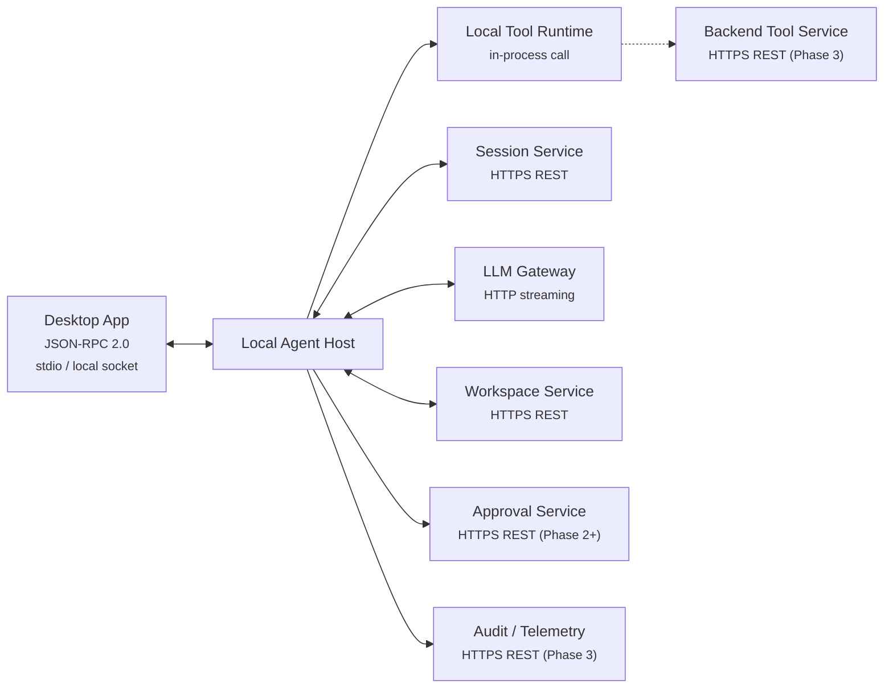
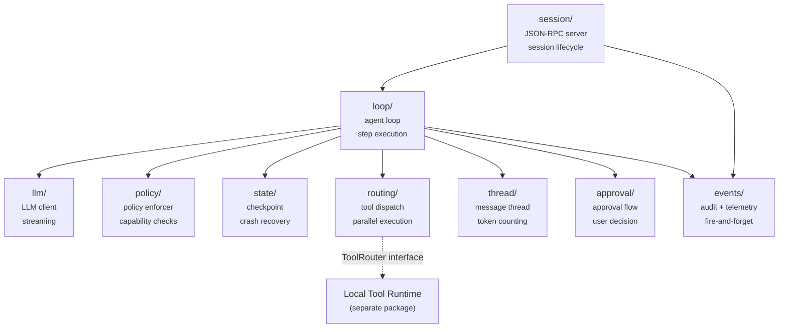
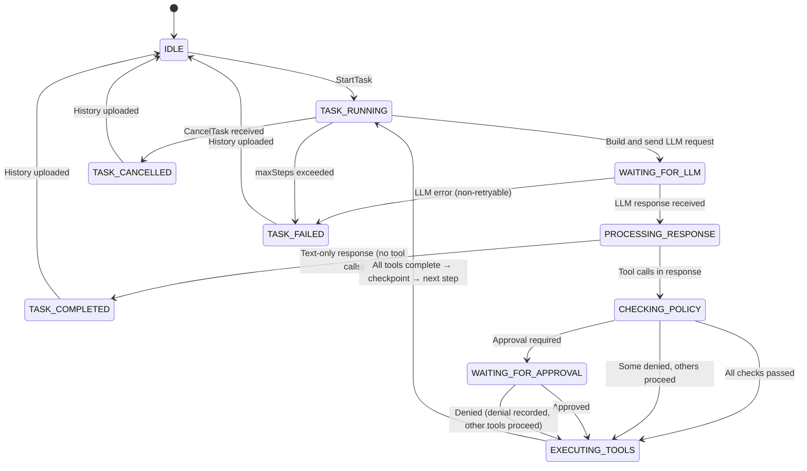
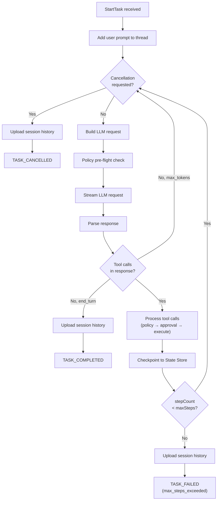
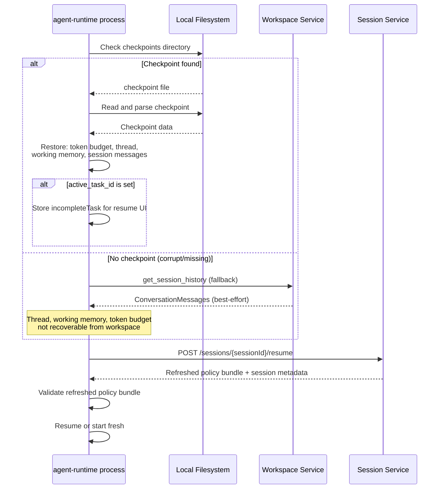

# Local Agent Host — Component Design

**Repo:** `cowork-agent-runtime` (`agent_host/` package)
**Bounded Context:** AgentExecution
**Phase:** 1 (MVP)
**Covers:** Local Agent Host, Local Policy Enforcer, Local State Store

---

The Local Agent Host is the backbone of the desktop agent system. It runs the agent loop, manages sessions, calls the LLM, routes tool calls, enforces policy, and checkpoints state for crash recovery.

This document describes the internal design of the `agent-host/` package. It covers the core agent loop, the embedded Local Policy Enforcer, and the Local State Store. For the Desktop App UI, see [desktop-app.md](desktop-app.md). For the tool execution layer, see [local-tool-runtime.md](local-tool-runtime.md).

**Prerequisites:** [architecture.md](../architecture.md) (architecture, protocol contracts), [domain-model.md](../domain-model.md) (entity hierarchy, state machines)

---

## 1. Overview

### What this component does

- Hosts the JSON-RPC 2.0 server that the Desktop App connects to
- Orchestrates the agent loop: plan → call LLM → execute tools → checkpoint → repeat
- Manages the in-memory message thread across tasks within a session
- Enforces capability and path restrictions from the policy bundle (Local Policy Enforcer)
- Checkpoints state to disk after each step for crash recovery (Local State Store)
- Routes tool calls to the Local Tool Runtime (in-process) or Backend Tool Service (Phase 3, remote)
- Uploads session history and artifacts to the Workspace Service
- Emits audit and telemetry events (fire-and-forget)

### What this component does NOT do

- Render UI — that is the Desktop App
- Execute tools — that is the Local Tool Runtime
- Store canonical history — that is the Workspace Service
- Generate policy bundles — that is the Policy Service
- Route or guard LLM requests at the network level — that is the LLM Gateway

### Key constraint

**One session per OS process.** The Desktop App spawns one `cowork-agent-runtime` process per session. The process exits when the session ends. This simplifies concurrency — there is no need for session multiplexing, session isolation, or shared memory between sessions.

### Component Context



---

## 2. Internal Module Structure

### Package layout

```
agent-host/
  server/          — JSON-RPC 2.0 server (parse, serialize, dispatch, handlers)
  session/         — Session/Workspace HTTP clients, checkpoint manager, SessionManager
  loop/            — LoopRuntime (infrastructure) + LoopStrategy protocol (orchestration), agent-internal tools, error recovery
  llm/             — LLM Gateway streaming client (openai SDK), response models, error classifier
  thread/          — Message thread management, context compaction, token counting
  memory/          — Working memory (task tracker, plan, notes) + persistent memory (project instructions, auto-memory)
  skills/          — Skill definitions, loader (built-in/markdown/policy)
  policy/          — Local Policy Enforcer (capability checks, path/command enforcement, risk assessment)
  budget/          — Token budget tracking (pre-check + record_usage)
  approval/        — Approval gate (asyncio Futures for user approval flow)
  events/          — Telemetry and audit event emission (fire-and-forget)
```

### Module dependencies



**Dependency rules:**
- `session/` is the process entry point — it starts the JSON-RPC server and delegates task execution to `loop/`
- `loop/` orchestrates all other modules but never imports external packages directly
- `routing/` depends on a `ToolRouter` interface defined in `agent-host/` — it never imports from `tool-runtime/` directly
- `policy/` is a pure function module — no I/O, no state, only the policy bundle passed in at init
- `events/` is fire-and-forget — callers do not wait for event delivery

---

## 3. Session Lifecycle

### 3.1 JSON-RPC Server

The `session/` module hosts a JSON-RPC 2.0 server over stdio or local socket. The Desktop App is the sole client.

| Method | Direction | Purpose |
|--------|-----------|---------|
| `CreateSession` | DA → AH | Initialize a new session; handshake with Session Service |
| `StartTask` | DA → AH | Begin a new agent work cycle from a user prompt |
| `CancelTask` | DA → AH | Cooperatively cancel the running task |
| `ResumeSession` | DA → AH | Resume from a crash-recovery checkpoint |
| `GetSessionState` | DA → AH | Return current session and task status |
| `GetPatchPreview` | DA → AH | Return pending file changes for user review |
| `ApproveAction` | DA → AH | Deliver user's approval or denial decision |
| `Shutdown` | DA → AH | Clean session teardown |

`SessionEvent` notifications flow AH → DA (no reply expected). These stream live progress during task execution.

> Full payload schemas: [architecture.md, Section 6.1](../architecture.md#61-local-ipc--desktop-app--local-agent-host)

### 3.2 Session Initialization

Step-by-step algorithm for `CreateSession`:

1. Receive `CreateSession` JSON-RPC request from Desktop App
2. Call Session Service `POST /sessions` with `clientInfo`, `supportedCapabilities`, `workspaceHint`
3. Receive response: `sessionId`, `workspaceId`, `policyBundle`, `featureFlags`
4. If `compatibilityStatus` is `incompatible` → return error to Desktop App, do not proceed
5. Validate policy bundle:
   - `expiresAt` is in the future
   - `sessionId` in the bundle matches the returned `sessionId`
   - `schemaVersion` is supported by this version of the agent host
6. **Inject workspace directory into policy bundle**: If the session has a local workspace (`workspaceHint.localPaths`), resolve the workspace directory to an absolute path and append it to `allowedPaths` for all file-operation capabilities (`File.Read`, `File.Write`, `File.Delete`). This local enrichment ensures the agent can operate within the workspace without requiring the Policy Service to know local paths. Skip if the path is already present. See [Section 8.3](#83-path-enforcement) for path resolution details.
7. Initialize Local Policy Enforcer with the (enriched) policy bundle
8. Initialize LLM client with `LLM_GATEWAY_ENDPOINT` and `LLM_GATEWAY_AUTH_TOKEN` (both from environment variables), and `llmPolicy` from the bundle
9. Initialize empty message thread
10. Initialize Local State Store (prepare checkpoint directory)
11. Transition session state to `SESSION_RUNNING`
12. Emit `session_started` event
13. Return session ready response to Desktop App

> Session Service API: [services/session-service.md](../services/session-service.md)

### 3.3 Session State Machine

The state machine is **two-level**: a session-level machine governs overall lifecycle, and a task-level machine governs agent loop execution within a running session.

#### Session-level states

```
SESSION_CREATED → SESSION_RUNNING → SESSION_COMPLETED / SESSION_FAILED / SESSION_CANCELLED
                  SESSION_RUNNING ↔ SESSION_PAUSED
```

| Transition | Guard | Action |
|------------|-------|--------|
| CREATED → RUNNING | Policy valid, compatibility ok | Init policy enforcer, LLM client, thread |
| RUNNING → PAUSED | Network failure or policy expiry detected | Checkpoint current state, notify Desktop App |
| PAUSED → RUNNING | ResumeSession with valid refreshed policy | Re-init policy enforcer, continue from checkpoint |
| PAUSED → CANCELLED | User cancels | Clean up, upload history |
| RUNNING → COMPLETED | Shutdown received, no active task | Upload final history, clean state store, exit |
| RUNNING → CANCELLED | Shutdown received during active task | Cancel task, upload history, clean state store, exit |
| RUNNING → FAILED | Unrecoverable error (e.g. resume fails) | Upload history if possible, exit |

#### Task-level states (within SESSION_RUNNING)



`GetSessionState` returns both levels:

```json
{
  "sessionStatus": "SESSION_RUNNING",
  "task": {
    "taskId": "task_001",
    "status": "EXECUTING_TOOLS",
    "stepCount": 3,
    "maxSteps": 40
  }
}
```

### 3.4 Session Teardown

Step-by-step algorithm for `Shutdown`:

1. If a task is running, set the cancellation flag (cooperative — see [Section 4.5](#45-cancellation-model))
2. Wait for the current step to complete (do not interrupt mid-tool-execution)
3. Upload final `session_history` artifact to Workspace Service
4. Emit `session_completed` (or `session_cancelled` if a task was cancelled) event
5. Call Session Service `POST /sessions/{sessionId}/cancel` with reason
6. Delete Local State Store checkpoint
7. Close LLM client connection
8. Close JSON-RPC server
9. Exit process

---

## 4. Agent Loop

The loop layer is decomposed into two parts: **`LoopRuntime`** (`loop/loop_runtime.py`) provides infrastructure (LLM client, tool routing, policy enforcement, budget tracking, checkpointing, event emission), while **`LoopStrategy`** (`loop/strategy.py`) is a protocol that defines how a single task is orchestrated. The default strategy is **`ReactLoop`** (`loop/react_loop.py`), which implements the classic ReAct (Reason + Act) cycle. `LoopRuntime` also handles sub-agent spawning and skill execution by constructing child `LoopRuntime` instances. See [loop-strategy.md](loop-strategy.md) for the full design.

### 4.1 Step Execution Algorithm

**Step ID generation:** Each step generates a UUID v4 `stepId` at the top of the loop iteration. This `stepId` is propagated to all events, tool calls, and messages within that step, enabling step-level audit correlation and debugging. The `stepId` is distinct from the ordinal `stepCount` — it is a globally unique identifier, while `stepCount` is a sequential counter scoped to the task.

**Task lifecycle reporting:** The agent loop reports task creation and completion to the Session Service for backend persistence. These calls are best-effort (fire-and-forget) — failures are logged but do not block task execution.

- At the start of `runTask`: call `SessionClient.create_task(sessionId, taskId, prompt, maxSteps)` and emit `task_started` event
- On task completion (success, failure, or cancellation): call `SessionClient.complete_task(sessionId, taskId, status, stepCount, completionReason)`

**Auto-naming:** On the first task in a session (when the session has no name), the agent loop auto-generates a human-readable session name from the user's prompt. The name is the first 60 characters of the prompt, truncated at a word boundary with `...` appended. This name is sent to the Session Service via `PATCH /sessions/{sessionId}/name` as a best-effort fire-and-forget call. The Desktop App also sets the name locally for instant UI feedback.

```
function runTask(task):
  reportTaskStarted(task)  // best-effort → Session Service
  autoNameSession(task.prompt)  // best-effort, first task only
  addMessage(role: "user", content: task.prompt)
  stepCount = 0

  while stepCount < task.maxSteps:

    if cancellationRequested:
      uploadSessionHistory()
      reportTaskCompleted(task, "cancelled", stepCount)
      return TASK_CANCELLED

    // --- Step begins ---
    stepId = uuid4()  // UUID v4 — unique per step, propagated to all events and tool calls
    emitEvent("step_started", { stepId })

    // 1. Build LLM request
    request = buildLLMRequest(thread, policyBundle.llmPolicy)

    // 2. Check policy pre-flight
    policyEnforcer.checkLLMCall()  // verifies LLM.Call capability + policy not expired

    // 3. Call LLM (streaming)
    emitEvent("llm_request_started", { model, estimatedInputTokens })
    response = llmClient.stream(request)
    emitEvent("llm_request_completed", { inputTokens, outputTokens, latencyMs })

    addMessage(role: "assistant", content: response)
    updateTokenBudget(response.usage)

    // 4. Check if task is complete
    if response.stopReason == "end_turn" AND response.toolCalls is empty:
      uploadSessionHistory()
      return TASK_COMPLETED

    if response.stopReason == "max_tokens" AND response.toolCalls is empty:
      // LLM was truncated, not finished — continue to get more output
      continue

    // 5. Process tool calls
    toolResults = processToolCalls(response.toolCalls, stepId)
    for each result in toolResults:
      addMessage(role: "tool", content: result)

    // 6. Checkpoint
    stateStore.checkpoint(session, thread, stepId)
    stepCount++

    // 7. Step count warning
    if stepCount == floor(task.maxSteps * 0.8):
      emitSessionEvent("step_limit_approaching", { stepCount, maxSteps })

  // maxSteps exceeded
  uploadSessionHistory()
  return TASK_FAILED(reason: "max_steps_exceeded")
```



### 4.2 Parallel Tool Execution

When the LLM returns multiple tool calls in a single response, `ToolExecutor` partitions them into ordered groups. Calls within a group run concurrently via `asyncio.gather()`; groups are executed sequentially to preserve dependency ordering.

**Parallelization rules:**

| Tool Category | Parallelizable? |
|--------------|-----------------|
| ReadFile, ListDirectory, FindFiles, GrepFiles, ViewImage, FetchUrl, WebSearch | Always — safe read-only operations |
| WriteFile, EditFile, MultiEdit | Only if targeting different file paths |
| DeleteFile, CreateDirectory, MoveFile | Never — filesystem structure changes |
| RunCommand, ExecuteCode | Never — unpredictable side effects |
| HttpRequest | Never — could be POST/PUT/DELETE |

**Grouping algorithm (`_partition_parallel_groups`):**

```
Input:  [ReadFile("/a"), ReadFile("/b"), RunCommand("ls"), ReadFile("/c")]
Output: [
  Group 1: [ReadFile("/a"), ReadFile("/b")]  ← parallel (asyncio.gather)
  Group 2: [RunCommand("ls")]                ← serial
  Group 3: [ReadFile("/c")]                  ← serial (single item)
]
```

1. Iterate tool calls in order, accumulating parallelizable calls into a batch
2. When hitting a non-parallelizable call, flush the current batch as a group, then emit the serial call as its own group
3. Special case: multiple File.Write calls to *different* paths can share a batch; same-path writes are serialized

**Agent-internal tools** (TaskTracker, CreatePlan, EnterPlanMode, etc.) are always executed sequentially in `ReactLoop._execute_tools()` since they mutate shared WorkingMemory state.

```
function processToolCalls(toolCalls, stepId):
  // Phase 1: Policy checks (sequential — fast in-memory operations)
  checkedCalls = []
  for each call in toolCalls:
    policyResult = policyEnforcer.check(call)
    checkedCalls.append({ call, policyResult })

  // Phase 2: Partition into parallel groups
  groups = partitionParallelGroups(checkedCalls)

  // Phase 3: Execute groups sequentially, calls within each group concurrently
  results = []
  for each group in groups:
    if group.length == 1:
      results.append(executeSingle(group[0]))
    else:
      results.extend(asyncio.gather(*[executeSingle(c) for c in group]))

  // Results are returned in the original tool call order (stable ordering)
  return results ordered by original index
```

```mermaid
sequenceDiagram
  participant Loop as Agent Loop
  participant Policy as Policy Enforcer
  participant Approval as Approval UI
  participant Router as Tool Router

  Note over Loop: LLM returns 3 tool calls

  Loop->>Policy: Check tool_1 (ReadFile)
  Policy-->>Loop: ALLOWED
  Loop->>Policy: Check tool_2 (RunCommand)
  Policy-->>Loop: APPROVAL_REQUIRED
  Loop->>Policy: Check tool_3 (WriteFile)
  Policy-->>Loop: ALLOWED

  par Execute in parallel
    Loop->>Router: Execute tool_1 (ReadFile)
    Router-->>Loop: Result_1
  and
    Loop->>Approval: Request approval for tool_2
    Approval-->>Loop: Approved
    Loop->>Router: Execute tool_2 (RunCommand)
    Router-->>Loop: Result_2
  and
    Loop->>Router: Execute tool_3 (WriteFile)
    Router-->>Loop: Result_3
  end

  Note over Loop: Collect results in original order [1, 2, 3]
```

**Rules:**
- Policy checks run sequentially (fast, in-memory — no benefit from parallelism)
- Tool execution runs concurrently for all approved tools
- A tool waiting for approval does not block other tools that don't need approval
- Per-tool timeout applies independently (see [Section 7.4](#74-timeouts))
- If a tool fails, its error is recorded — other tools are not affected
- Results are collected in the original order regardless of completion order

### 4.3 Step Count Enforcement

- `maxSteps` is set per-task in `StartTask` via `taskOptions.maxSteps`
- Step count increments after each completed step (one LLM call + its tool executions)
- At 80% of `maxSteps`, emit a `step_limit_approaching` `SessionEvent` so the Desktop App can warn the user
- When `maxSteps` is reached, the task ends with `TASK_FAILED` and reason `max_steps_exceeded`

### 4.4 Task Completion Detection

The LLM signals task completion by returning a response with **text content only and no tool calls**.

| `stop_reason` | Tool calls | Interpretation |
|---------------|-----------|----------------|
| `end_turn` | None | Task is complete — LLM is done |
| `end_turn` | Present | Not done — execute tools, continue loop |
| `max_tokens` | None | LLM was truncated — continue loop to get more output |
| `max_tokens` | Present | Execute tools, continue loop |
| `tool_use` | Present | Execute tools, continue loop |

**Important:** The natural termination check (no tool calls + stop reason) runs **before** the hard step limit check. This allows the verification phase (see below) to extend the step budget before the limit is enforced.

#### 4.4.1 Verification Phase

When the agent signals task completion and verification is enabled, a **self-verification prompt** is injected before the task is finalized. This gives the LLM a chance to review its own work.

**Configuration:** `VerificationConfig` (`loop/verification.py`):
- `enabled: bool = True` — global toggle (env var `VERIFICATION_ENABLED`)
- `max_verify_steps: int = 3` — additional steps budget for verification (env var `VERIFICATION_MAX_STEPS`)
- `custom_instructions: str = ""` — task-specific verification instructions

**Flow:**

1. Agent signals completion (no tool calls, `stop_reason="stop"`)
2. If verification is enabled and not yet injected:
   - Inject verification prompt as system message into the thread
   - Extend `max_steps` by `max_verify_steps`
   - Emit `verification_started` event
   - `continue` — re-enter loop so the LLM can verify
3. On subsequent completion (no tool calls again):
   - Emit `verification_completed(passed=true)` event
   - Return `TASK_COMPLETED`
4. If the agent uses tools during verification (e.g., re-reads files, finds and fixes issues), it continues until either confirming completion or exhausting the extended step budget

**Verification prompt sources (priority order):**
1. `taskOptions.skipVerification: true` → skip entirely
2. `taskOptions.verifyInstructions: str` → custom per-task instructions
3. COWORK.md `## Verification` section → per-workspace instructions
4. Default prompt → generic check (re-read request, check files, spot-check results)

**Default prompt:**
```
VERIFICATION: Before confirming completion, review your work:
1. Re-read the original request and compare with what you delivered
2. Check any files you created or modified — verify content is correct
3. If you performed calculations or data transformations, spot-check the results
4. Confirm nothing was missed from the original request

Use read-only tools (ReadFile, ListDirectory, etc.) to verify.
If everything is correct, confirm you are done.
If you find issues, fix them before completing.
```

#### 4.4.2 Plan Mode

Plan mode is a **runtime state** that restricts the agent to read-only tools for exploration and planning before making changes.

**Three entry paths:**

| Entry | Mechanism | Behavior |
|-------|-----------|----------|
| **User-explicit** | `taskOptions.planOnly: true` in StartTask | Hard lock — agent cannot exit plan mode |
| **LLM-initiated** | Agent calls `EnterPlanMode` tool | Soft — agent enters/exits plan mode autonomously |
| **System prompt guided** | Instructions in system prompt | Encourages LLM to use plan mode for complex tasks |

**State transitions:** `EXECUTING` ↔ `PLANNING` (via `EnterPlanMode` / `ExitPlanMode` agent tools). `planOnly=true` starts in `PLANNING` and prevents transition to `EXECUTING`.

**Tool restrictions in plan mode:**

Allowed: `ReadFile`, `ListDirectory`, `FindFiles`, `GrepFiles`, `ViewImage`, `FetchUrl`, `WebSearch` + all agent-internal tools

Blocked: `WriteFile`, `EditFile`, `MultiEdit`, `DeleteFile`, `CreateDirectory`, `MoveFile`, `RunCommand`, `ExecuteCode`, `HttpRequest`

Blocked tools are removed from `get_tool_definitions()` (LLM never sees them). If called anyway, `ToolExecutor` returns `PLAN_MODE_RESTRICTED` denial.

**Agent tools:** `EnterPlanMode` (no args → `{"status": "success", "planMode": true}`) and `ExitPlanMode` (no args → `{"status": "success", "planMode": false}`). Both defined in `AgentToolHandler` (`loop/agent_tools.py`).

**Events:** `plan_mode_changed` with `planMode: bool` and `source: "agent" | "user"` payload.

### 4.5 Cancellation Model

Cancellation is **cooperative** — the agent loop checks for cancellation at safe boundaries rather than interrupting mid-operation.

1. `CancelTask` JSON-RPC request sets a `cancellationRequested` flag
2. The flag is checked at the **top of each loop iteration** (before the LLM call)
3. **Mid-LLM-streaming:** the stream is aborted, partial response is discarded, message thread is not modified
4. **Mid-tool-execution:** the loop waits for the current tool(s) to complete — tools are never killed. Tools may have side effects (file writes, shell commands) and interrupting them could corrupt the workspace
5. After cancellation: checkpoint current state, upload `session_history`, transition task to `TASK_CANCELLED`
6. The session remains alive — the user can start a new task

> **Open question:** Should there be a "force cancel" with a hard timeout that kills running tools? Deferred to Phase 2 — the risk of workspace corruption outweighs the benefit in Phase 1.

### 4.6 Error Recovery

| Failure | Handling |
|---------|----------|
| Tool execution fails | `ToolResult` with `status: "failed"` added to thread — LLM sees the error and can self-correct |
| Policy denies a tool | `ToolResult` with `status: "denied"` and reason added to thread — LLM adjusts its approach |
| LLM call fails (retryable) | Retry with exponential backoff (see [Section 6.4](#64-error-handling)) |
| LLM call fails (non-retryable) | Task fails — upload history, notify Desktop App |
| Network failure to backend | Checkpoint current state, transition session to `SESSION_PAUSED`, notify Desktop App |
| Policy expired mid-task | Deny current operation, pause session, notify Desktop App to trigger `ResumeSession` |

The key principle is: **tool and policy failures go into the message thread so the LLM can self-correct.** Infrastructure failures (network, budget) are handled at the session level.

#### 4.6.1 Advanced Error Recovery

The `ErrorRecovery` module (`loop/error_recovery.py`) provides two additional mechanisms beyond the basic "feed failure back to LLM" strategy:

**Consecutive Failure Reflection:**

When the agent accumulates `consecutive_failure_threshold` (default: 3) consecutive tool failures without a success, the error recovery module injects a reflection prompt into the next LLM call:

```
## Self-Reflection Required
The last N tool calls have failed. Review:
- Tool: ReadFile, Args: {"path": "/etc/shadow"}, Error: Permission denied
- Tool: ReadFile, Args: {"path": "/etc/shadow"}, Error: Permission denied
- ...
Consider: Are arguments valid? Are prerequisites met? Should you try a different approach?
```

The counter resets to zero on any successful tool execution.

**Loop Detection:**

The module tracks a hash signature of each `(tool_name, arguments)` pair. When the same signature appears `loop_detection_threshold` (default: 3) times, a loop-break prompt is injected:

```
## Loop Detected
The following tool calls have been repeated 3+ times with identical arguments:
- ReadFile(a1b2c3d4) called 4 times
Try a different approach: use a different tool, change arguments, break into subtasks, or ask the user for clarification.
```

Both prompts are injected as system messages into the thread before the next LLM call. The loop counter persists across the entire task (not reset on success) to catch patterns where the agent alternates between two failing strategies.

### 4.7 Working Memory

The `memory/` module provides structured working memory that persists across steps within a task and across tasks within a session.

**Structure:**

```python
@dataclass
class WorkingMemory:
    task_tracker: TaskTracker   # Ordered list of tasks with status
    plan: Plan | None           # Current goal + ordered steps
    notes: list[str]            # Free-form agent notes
```

**Injection:** Before each LLM call, the working memory is rendered as a system message inserted after the static system prompt and before conversation history:

```
## Working Memory
### Current Plan
Goal: Refactor the auth module
Steps:
  1. [x] Read existing auth code
  2. [ ] Extract token validation into separate module
  3. [ ] Update imports across codebase

### Tasks
- [in_progress] Extract token validation (task-1)
- [pending] Update imports (task-2)

### Notes
- Auth module uses JWT with RS256
- Token validation is duplicated in 3 files
```

**Agent-Internal Tools:**

The agent modifies working memory via three internal tools that are handled by `AgentToolHandler` without going through the PolicyEnforcer:

| Tool | Purpose | `toolType` |
|------|---------|------------|
| `TaskTracker` | Create, update status, and list tasks | `agent` |
| `CreatePlan` | Set a goal with ordered steps | `agent` |
| `SaveMemory` | Write/update a persistent memory file | `agent` |
| `RecallMemory` | Read a specific memory topic file | `agent` |
| `ListMemories` | List all persistent memory files with sizes | `agent` |
| `DeleteMemory` | Remove an outdated memory topic file | `agent` |
| `SpawnAgent` | Spawn a sub-agent (see [Section 4.8](#48-sub-agents)) | `sub_agent` |
| `Skill_*` | Execute a formalized multi-step skill workflow | `skill` |

Agent-internal tools now emit `tool_requested` and `tool_completed` events (with the appropriate `toolType` classification), enabling the Desktop App to display them as distinct tool call cards. They still bypass PolicyEnforcer — events are informational only.

**Persistence:** Working memory is serialized into `SessionCheckpoint.working_memory` via `to_checkpoint()`/`from_checkpoint()`. On session resume, the full working memory state (tasks, plan, notes) is restored.

### 4.7.1 Persistent Memory

The `memory/` module also provides persistent memory that survives across sessions. This is a two-tier system:

**Tier 1 — Project Instructions (read-only):**
- `ProjectInstructionsLoader` loads `COWORK.md` and `COWORK.local.md` from the workspace directory (no ancestor walk).
- Injected into the static system prompt at session init.

**Tier 2 — Auto-Memory (read-write):**
- `PersistentMemory` manages AI-writable `.md` files in `~/.cowork/projects/<hash>/memory/`.
- `<hash>` is SHA-256 (first 16 hex chars) of the resolved workspace path.
- `MEMORY.md` is the index file, loaded automatically every turn (capped at 200 lines).
- Topic files (e.g., `debugging.md`, `patterns.md`) are read on-demand via `RecallMemory`.

**Resource Limits:**
- Max file size: 100 KB per file (configurable via `MEMORY_MAX_FILE_SIZE`)
- Max file count: 50 files per workspace (configurable via `MEMORY_MAX_FILE_COUNT`)
- Max filename length: 64 characters
- `MEMORY.md` cannot be deleted (only overwritten)

**Context Injection Order:**
1. Static system prompt (includes project instructions and memory guidance)
2. Persistent memory (`MEMORY.md` content, re-read each turn)
3. Working memory (task tracker, plan, notes)
4. Conversation history

**Tools:** `SaveMemory`, `RecallMemory`, `ListMemories`, `DeleteMemory` — handled by `AgentToolHandler`, bypassing PolicyEnforcer.

**Auto-Indexing:** When a topic file is saved or deleted, `PersistentMemory` automatically maintains an index section in `MEMORY.md` so that `render_memory_context()` always returns awareness of existing topic files — even when `MEMORY.md` was not manually written by the agent. The index section is delimited by `<!-- AUTO-INDEX:START -->` / `<!-- AUTO-INDEX:END -->` markers and lists each topic file with its size. Key behaviors:
- Saving a topic file adds/updates its entry in the auto-index section.
- Deleting a topic file removes its entry. If no entries remain, the auto-index section is removed entirely.
- Saving `MEMORY.md` directly does **not** trigger auto-indexing (only topic files do).
- Manual content in `MEMORY.md` outside the markers is always preserved.
- Auto-index updates are best-effort — failures are logged but do not fail the underlying save/delete operation.

**Crash Recovery:** `SessionCheckpoint.workspace_dir` is persisted so that `MemoryManager` can be re-created on session resume even when the workspace hint is lost.

### 4.8 Sub-Agents

Sub-agent spawning is handled by `LoopRuntime.spawn_sub_agent()` (`loop/loop_runtime.py`). The main agent spawns focused sub-agents for independent subtasks via the `SpawnAgent` tool.

**Isolation model:**

Each sub-agent receives:
- A fresh `MessageThread` (no access to parent conversation history)
- The parent's `ToolRouter` (same tool execution pipeline)
- A restricted tool set (no `SpawnAgent` — depth=1, no recursive spawning)
- The parent's `TokenBudget` and `PolicyEnforcer` references (shared — safe because asyncio is single-threaded cooperative)

**Concurrency:**

- `asyncio.Semaphore(5)` inside `LoopRuntime` limits concurrent sub-agents (private implementation detail)
- Each sub-agent has a reduced `max_steps=10` (prevents runaway subtasks)
- Sub-agent results are truncated to 2,048 tokens before being returned to the parent

**Execution flow:**

1. Parent calls `SpawnAgent(task="...", context="...")`
2. `AgentToolHandler` delegates to the `LoopRuntime.spawn_sub_agent()` callback
3. `LoopRuntime` builds a child `LoopRuntime` with a fresh `MessageThread`, shared `TokenBudget`/`PolicyEnforcer`, and no `agent_tool_handler` (preventing recursive spawning)
4. `LoopRuntime` creates a `ReactLoop` strategy for the child and runs it
5. Sub-agent runs to completion (or max_steps/budget exhaustion)
6. Result text is truncated and returned as the tool result to the parent
7. Parent continues with the sub-agent's findings

**Error handling:** Sub-agent failures do not crash the parent. If a sub-agent fails (LLM error, budget exhaustion, max_steps), the failure message is returned as a tool result and the parent decides how to proceed.

### 4.9 Skills System

The skills system (`skills/`) provides formalized multi-step workflows that the agent can invoke as tools. Skills use **directory-based Markdown format** with progressive disclosure.

**Skill Definition:**

```python
@dataclass(frozen=True)
class SkillDefinition:
    name: str                              # e.g., "search_codebase"
    description: str                       # Shown to LLM as tool description
    prompt_content: str = ""               # SKILL.md body + supporting files (lazy-loaded)
    source_dir: str | None = None          # Skill directory path (None for built-in)
    tool_subset: list[str] | None = None   # Restrict available tools (None = all)
    input_schema: dict[str, Any] = {}      # JSON Schema for skill parameters
    max_steps: int = 15                    # Step limit for skill execution
    disable_model_invocation: bool = False # True = LLM cannot auto-trigger
    user_invocable: bool = True            # False = hidden from user menus
```

**Skill Format:**

Each skill is a directory containing a `SKILL.md` file with YAML frontmatter and a markdown body, plus optional supporting `.md` files:

```
~/.cowork/skills/deploy-staging/
  SKILL.md          # Required: YAML frontmatter + markdown instructions
  reference.md      # Optional: auto-appended on invocation
  examples.md       # Optional: auto-appended on invocation
```

**Progressive Disclosure:**

- **Stage 1 (metadata):** At session start, only frontmatter is parsed (~100 tokens per skill). Skills are registered as tools with the LLM.
- **Stage 2 (full content):** On invocation, `SkillLoader.load_skill_content()` reads the full `SKILL.md` body + supporting `.md` files. `$ARGUMENTS` substitution is applied.

**Skill Loading:**

`SkillLoader` discovers skills from three sources (in priority order):
1. **Built-in markdown** — embedded markdown strings parsed with the same frontmatter parser
2. **User directories** — `~/.cowork/skills/<name>/SKILL.md` authored by users
3. **Policy bundle** — skills provided via the policy bundle from the Policy Service

**Skill Execution:**

Skill execution is handled by `LoopRuntime.execute_skill()` (`loop/loop_runtime.py`), which runs each skill as a focused sub-conversation:
1. `AgentToolHandler` delegates to the `LoopRuntime.execute_skill()` callback
2. Stage 2: Load full `prompt_content` via `SkillLoader.load_skill_content()`
3. Apply `$ARGUMENTS` substitution to `prompt_content`
4. `LoopRuntime` builds a child `LoopRuntime` with a fresh `MessageThread` and the skill's `prompt_content` in the system message
5. Restrict available tools to `tool_subset` (if specified)
6. `LoopRuntime` creates a `ReactLoop` strategy for the child and runs it
7. Return the agent's final text response as the tool result

Skills are registered as `Skill_{name}` tools in `AgentToolHandler`. Skills with `disable_model_invocation=True` are excluded from the LLM's tool list but can still be invoked explicitly.

---

## 5. Message Thread Management

### 5.1 In-Memory Thread

The thread is an ordered list of `ConversationMessage` objects that accumulates across all tasks within a session. It is the single source of truth for LLM request construction during the session.

> Schema: [architecture.md, Section 6.4](../architecture.md#64-conversationmessage-schema--local-agent-host--workspace-service)

Each message carries:
- `messageId` — unique within the session
- `role` — `system`, `user`, `assistant`, `tool`
- `content` — the message text
- `tokenCount` — computed at creation time
- `taskId`, `stepId` — for tracing which task/step produced this message
- `timestamp`

### 5.2 Thread Construction for LLM Requests

On each LLM call, `ReactLoop._build_messages()` assembles the request payload. Message ordering is **optimized for LLM provider prompt caching** — stable content at the front, volatile content at the end. LLM providers cache the longest matching prefix of the message list; any change in the prefix invalidates everything after it.

**Ordering (stable prefix first, volatile last):**

```
[1. System prompt]                    ← STABLE (set at session start, never changes mid-task)
[2. Persistent memory (MEMORY.md)]    ← SEMI-STABLE (changes only on SaveMemory calls)
[3. Conversation history]             ← GROWS (prefix is stable, new messages appended)
[4. Working memory]                   ← VOLATILE (changes every turn — at the END)
[5. Error recovery prompts]           ← CONDITIONAL (only when triggered — at the very end)
```

Assembly steps:
1. **System prompt** — static instructions for the agent persona, tool usage guidance, workspace context. Built once at session start, reused across all LLM calls.
2. **Persistent memory** — MEMORY.md content, injected at position 1 (right after system prompt). Semi-stable — only changes when the agent calls SaveMemory.
3. **Conversation history** — all user, assistant, and tool messages (subject to context window management — see [Section 5.4](#54-context-window-management)). Compacted to fit within token budget minus injection overhead.
4. **Working memory** — task tracker, plan, notes. Appended at the **end** of the message list (volatile — changes every turn, placed last to avoid breaking the cache prefix).
5. **Error recovery prompts** — loop-break and reflection prompts (conditional, at the very end).
6. **Tool definitions** — passed as a separate `tools` parameter (not in the message list). Derived from the policy bundle's capabilities; filtered for plan mode if active.

**User message workspace prefix:** Each user prompt is prefixed with `[Workspace: /path/to/dir]\n\n{user_prompt}` when a workspace directory is known. This ensures the LLM always has access to the working directory even after context compaction drops earlier system messages.

### 5.3 Token Counting

- Each message has a `tokenCount` computed at creation time using a local tokenizer (approximate is acceptable — exact counts come from the LLM Gateway response)
- Running totals maintained:
  - `threadTokenCount` — sum of all messages currently in the thread
  - `sessionTokensUsed` — cumulative input + output across all LLM calls in the session
- Before each LLM call: check `sessionTokensUsed + estimatedRequestTokens ≤ llmPolicy.maxSessionTokens`
- After each LLM call: update `sessionTokensUsed` with actual `inputTokens + outputTokens` from the response

### 5.4 Context Window Management

When the thread exceeds `llmPolicy.maxInputTokens`, the `thread/` module applies a truncation strategy.

**Token budget allocation:**

```
┌─────────────────────────────────────────────────────────────────┐
│                    maxInputTokens                               │
│                                                                 │
│  ┌──────────────┐  ┌──────────────┐  ┌───────────────────────┐  │
│  │ System prompt │  │    Tool      │  │  Conversation history │  │
│  │   (fixed)     │  │ definitions  │  │  (fills remaining)    │  │
│  │              │  │  (fixed)     │  │                       │  │
│  └──────────────┘  └──────────────┘  └───────────────────────┘  │
│       ~10%               ~15%               ~75%                │
└─────────────────────────────────────────────────────────────────┘
```

**Phase 1 — drop-oldest with recency window:**

1. System prompt and tool definitions are always included (never truncated)
2. Calculate remaining token budget for conversation history
3. Always include the most recent N messages (recency window — ensures the LLM has immediate context)
4. If the thread exceeds the budget after including system prompt + tools + recency window: drop the oldest messages from the middle of the thread
5. Insert a `[Earlier conversation truncated — {count} messages removed]` marker at the truncation point

**Compaction strategies (`thread/compactor.py`):**

Two strategies available, configured via `COMPACTION_STRATEGY` env var (default: `"hybrid"`):

**1. `DropOldestCompactor`** — simple, no LLM cost:

- **Recency window:** Configurable via `RECENCY_WINDOW` env var (default: 20 messages)
- **Algorithm:** Keep system prompt (first message) + last N messages (recency window), drop everything in between
- **Marker insertion:** `{"role": "system", "content": "[... {dropped} earlier messages omitted ...]"}` inserted at the truncation point

**2. `HybridCompactor`** — observation masking + optional LLM summarization:

Two-phase approach that preserves more context:

*Phase 1 — Observation Masking* (no LLM call, always applied first):
- Replace old tool *result* messages (outside recency window) with one-line summaries
- Preserve assistant messages (the LLM needs to see *what* it decided to do)
- Example: `{"role": "tool", "content": "{200 lines of code}"}` → `[ReadFile: success, 200 lines / 5432 chars]`
- Typically achieves 50-70% compression (tool outputs are the largest messages)
- Masking heuristics: success → `[ToolName: status, N lines / N chars]`, failed → `[ToolName: failed — error message]`, denied → `[ToolName: denied]`

*Phase 2 — LLM Summarization* (only when masking isn't enough):
- When masked messages still exceed the token budget, generate a structured summary via LLM call
- Summary replaces the oldest masked messages with a single system message
- Summary is pre-computed asynchronously (`precompute_summary()`) before the synchronous `compact()` is called
- Cached and reused until more messages accumulate
- Configurable: disabled with `COMPACTION_LLM_SUMMARY=false` or `mask_only=True`

*Fallback:* If masking isn't enough and no cached summary exists, falls back to `DropOldestCompactor` behavior.

**Common behavior:**
- **Trigger condition:** `thread.total_token_estimate() > max_context_tokens * 0.9` (checked before each LLM call)
- **Event emission:** `context_compacted` event with `messagesDropped`, `tokensBefore`, `tokensAfter` payload — notifies the Desktop App that context was reduced
- **Post-compaction:** The agent continues normally with the reduced thread. Working memory (injected per-turn) is not affected by compaction.

### 5.5 Serialization

The thread uses the same `ConversationMessage[]` format for both:
- **Checkpoints** — wrapped in checkpoint metadata (see [Section 9.2](#92-checkpoint-format))
- **Session history upload** — sent to Workspace Service as a `session_history` artifact after each task

---

## 6. LLM Client

### 6.1 Streaming Connection

- Uses HTTP streaming (Server-Sent Events) to connect to the LLM Gateway
- Endpoint URL from `LLM_GATEWAY_ENDPOINT` environment variable; auth token from `LLM_GATEWAY_AUTH_TOKEN` environment variable
- One connection per LLM call — connections are not pooled (LLM calls are infrequent relative to connection setup cost)
- The LLM client has no direct awareness of the Policy Service or LLM guardrails — that is the LLM Gateway's concern

### 6.2 Request Construction

Each LLM request is assembled from:

| Field | Source |
|-------|--------|
| `model` | `llmPolicy.allowedModels[0]` (first allowed model in Phase 1) |
| `max_tokens` | `llmPolicy.maxOutputTokens` |
| `messages` | From `thread/` module (after context window truncation) |
| `tools` | From `routing/` module (`getAvailableTools()`) — filtered by granted capabilities |
| `system` | System prompt from `thread/` module |

### 6.3 Response Parsing

The streaming response is parsed incrementally:

1. **Text chunks** → forwarded to Desktop App immediately via `SessionEvent` notifications (live streaming text in the UI)
2. **Tool call chunks** → accumulated into complete tool call objects (not dispatched until the full response is received)
3. **Stop reason** → extracted: `end_turn`, `max_tokens`, `tool_use`
4. **Usage metadata** → extracted: `inputTokens`, `outputTokens`

Tool calls are dispatched only after the full response is received and the assistant message is added to the thread. This ensures the thread is in a consistent state before tool execution begins.

### 6.4 Error Handling

| Error | Strategy |
|-------|----------|
| HTTP 429 (rate limited) | Exponential backoff with jitter, max 3 retries. Use `Retry-After` header if present via `extract_retry_after()`. |
| HTTP 529 (overloaded) | 3× base delay exponential backoff with jitter, max 3 retries (~3s → 6s → 12s with default 1s base). Anthropic-specific status code indicating server overload. |
| HTTP 400 (guardrail blocked) | Do not retry. Emit `LLM_GUARDRAIL_BLOCKED` error to Desktop App. Add a system-level note to the thread so the LLM sees it on the next attempt. |
| HTTP 500 / network timeout | Exponential backoff with jitter, max 3 retries (~1s → 2s → 4s with default 1s base). If exhausted, checkpoint and pause session. |
| Token budget exceeded | Pre-check fails before the call is made. Task fails with `LLM_BUDGET_EXCEEDED`. |
| Partial stream disconnection | Discard partial response, retry the full request. The thread has not been modified yet (assistant message is added only after the full response), so the retry is safe. |

**Error Classification** (`error_classifier.py`):

The `classify_llm_error(exc)` function returns structured metadata for any LLM error:

| Field | Type | Description |
|-------|------|-------------|
| `error_code` | string | `RATE_LIMITED`, `LLM_OVERLOADED`, `LLM_UNAVAILABLE`, `LLM_ERROR` |
| `error_type` | string | `rate_limit`, `overloaded`, `transient`, `permanent` |
| `is_recoverable` | bool | `true` for all transient/rate-limit/overloaded errors |
| `user_message` | string | Clean user-facing error description |

This metadata is attached to `task_failed` events so the Desktop App can show a Retry button on recoverable failures. Helper functions: `is_rate_limit_error()` identifies 429 specifically, `extract_retry_after()` reads the `Retry-After` header from SDK exceptions.

Each retry attempt emits an `llm_retry` event with `attempt`, `maxRetries`, `errorMessage`, and `delaySeconds` so the Desktop App can show retry progress to the user.

### 6.5 Token Budget Tracking

- **Before each LLM call:** `sessionTokensUsed + estimatedRequestTokens ≤ llmPolicy.maxSessionTokens`. If exceeded, fail the task with `LLM_BUDGET_EXCEEDED`.
- **After each LLM call:** update `sessionTokensUsed += actual.inputTokens + actual.outputTokens` from the response.
- **Mid-session overage:** if an LLM response pushes usage over the budget (the pre-check estimated too low), complete the current step but prevent further LLM calls. The task ends on the next iteration with `LLM_BUDGET_EXCEEDED`.

---

## 7. Tool Routing

### 7.1 ToolRouter Interface

The `ToolRouter` is the sole boundary between `agent-host/` and `tool-runtime/`:

```
interface ToolRouter {
  execute(request: ToolRequest): Promise<ToolResult>
  getAvailableTools(): ToolDefinition[]
}
```

> ToolRequest and ToolResult schemas: [architecture.md, Section 6.2](../architecture.md#62-tool-schemas--local-agent-host--local-tool-runtime)

The `routing/` module in `agent-host/` calls this interface. The `tool-runtime/` package provides the implementation. No direct imports cross the package boundary.

### 7.2 Tool-to-Capability Mapping

A static mapping table translates tool names (as used by the LLM) to capability names (as defined in the policy bundle):

| Tool Name | Capability | Notes |
|-----------|-----------|-------|
| `ReadFile` | `File.Read` | |
| `WriteFile` | `File.Write` | |
| `DeleteFile` | `File.Delete` | |
| `RunCommand` | `Shell.Exec` | |
| `HttpRequest` | `Network.Http` | |
| `UploadArtifact` | `Workspace.Upload` | Handled by agent-host directly |
| *(remote tools)* | `BackendTool.Invoke` | Phase 3 — names from policy allowlist |

### 7.3 Dispatch Flow

For each tool call from the LLM response:

1. Look up `toolName` → `capability` in the mapping table
2. If tool name is unknown → return `ToolResult` with `status: "failed"`, error `TOOL_NOT_FOUND`
3. Call `policyEnforcer.check(toolCall, capability)` — see [Section 8.2](#82-capability-check-algorithm)
4. If `DENIED` → return `ToolResult` with `status: "denied"` and reason
5. If `APPROVAL_REQUIRED` → send approval request to Desktop App, wait for decision
   - Approved → proceed to step 6
   - Denied → return `ToolResult` with `status: "denied"`, reason "User denied"
6. Dispatch via `toolRouter.execute(toolRequest)` with timeout
7. Emit `tool_completed` event
8. Return `ToolResult` to the loop for addition to the message thread

### 7.4 Timeouts

| Tool category | Default timeout | Rationale |
|---------------|----------------|-----------|
| File operations (Read, Write, Delete) | 30 seconds | File I/O should be fast |
| Shell commands | 300 seconds | User commands may be long-running |
| Network requests | 60 seconds | HTTP requests with reasonable limits |
| Remote tools (Phase 3) | 120 seconds | Includes network round-trip to backend |

If a tool exceeds its timeout, the router returns a `ToolResult` with `status: "failed"` and error code `TOOL_EXECUTION_TIMEOUT`. The LLM sees this and can adjust.

### 7.5 Artifact Upload

When a `ToolResult` contains artifact data (e.g. a `file_diff` from `WriteFile` or a large `tool_output` from `RunCommand`), the agent-host uploads it to the Workspace Service before adding the result to the message thread.

```
function handleArtifacts(toolResult, sessionContext):
  if toolResult has no artifact data:
    return toolResult

  for each artifact in toolResult.artifacts:
    // Upload to Workspace Service
    response = workspaceClient.uploadArtifact({
      workspaceId:  sessionContext.workspaceId,
      sessionId:    sessionContext.sessionId,
      taskId:       sessionContext.taskId,
      stepId:       sessionContext.stepId,
      artifactType: artifact.type,          // "tool_output", "file_diff"
      artifactName: artifact.name,
      contentType:  artifact.contentType,
      contentBase64: base64Encode(artifact.data)
    })

    // Collect the URI returned by the Workspace Service
    toolResult.artifactUris.append(response.artifactUri)

  return toolResult
```

Artifact upload is **best-effort** — if the Workspace Service is unreachable, the tool result is still added to the thread (with `artifactUris` empty) and a warning is logged. The LLM sees the truncated `outputText`; the full content is lost for that artifact.

> Workspace Service upload API: [services/workspace-service.md](../services/workspace-service.md)

### 7.6 Remote Tool Routing (Phase 3)

When the tool-to-capability mapping resolves to `BackendTool.Invoke`:

1. Verify the tool name appears in `policyBundle.capabilities["BackendTool.Invoke"].allowedToolNames`
2. Dispatch via `POST /tools/{toolName}/invoke` to the Backend Tool Service
3. The response is a standard `ToolResult` — the agent loop processes it identically to local results

> Backend Tool Service API: [services/backend-tool-service.md](../services/backend-tool-service.md)

---

## 8. Local Policy Enforcer

The Local Policy Enforcer is a stateless, in-process module that evaluates capability checks against the policy bundle. It has no I/O — the policy bundle is loaded at session init and held in memory.

### 8.1 Policy Bundle Loading

On session init, the enforcer:

1. Receives the policy bundle from the session initialization flow
2. Validates it (see [Section 3.2](#32-session-initialization), step 5)
3. **Workspace path injection** (step 6 in 3.2): if the session has a local workspace directory, the agent host appends its resolved absolute path to `allowedPaths` for `File.Read`, `File.Write`, and `File.Delete` capabilities. This ensures the agent can always operate within its workspace regardless of the static policy's path configuration. The workspace directory is a local concern — it is injected here rather than in the Policy Service so that the backend remains workspace-agnostic.
4. Indexes capabilities by name into a lookup map for O(1) access during tool calls
5. Indexes approval rules by `approvalRuleId` for O(1) access during approval construction

> Full policy bundle structure: [services/policy-service.md](../services/policy-service.md)

### 8.2 Capability Check Algorithm

Called before every tool execution:

```
function check(toolCall, capabilityName) → ALLOWED | DENIED(reason) | APPROVAL_REQUIRED(ruleId, riskLevel):

  // 1. Capability granted?
  if capabilityName not in policyBundle.capabilities:
    return DENIED("Capability not granted: " + capabilityName)

  capEntry = policyBundle.capabilities[capabilityName]

  // 2. Scope constraints
  if capabilityName in [File.Read, File.Write, File.Delete]:
    path = resolve(toolCall.arguments.path)           // resolve symlinks
    if blockedPaths is set AND matchesAny(path, capEntry.blockedPaths):
      return DENIED("Path is blocked: " + path)
    if allowedPaths is set AND NOT matchesAny(path, capEntry.allowedPaths):
      return DENIED("Path not in allowed paths: " + path)
    if maxFileSizeBytes is set AND fileSize(path) > capEntry.maxFileSizeBytes:
      return DENIED("File exceeds size limit")

  if capabilityName == Shell.Exec:
    baseCommand = extractBaseCommand(toolCall.arguments.command)
    if blockedCommands is set AND baseCommand in capEntry.blockedCommands:
      return DENIED("Command is blocked: " + baseCommand)
    if allowedCommands is set AND baseCommand NOT in capEntry.allowedCommands:
      return DENIED("Command not in allowed commands: " + baseCommand)

  if capabilityName == Network.Http:
    domain = extractDomain(toolCall.arguments.url)
    if allowedDomains is set AND domain NOT in capEntry.allowedDomains:
      return DENIED("Domain not allowed: " + domain)

  if capabilityName == Code.Execute:
    // Phase 1: Python-only. Validate "python" is in allowed languages.
    allowedLanguages = capEntry.allowedLanguages ?? ["python"]
    if "python" NOT in allowedLanguages:
      return DENIED("Python execution not permitted by policy")

  // 3. Approval required?
  if capEntry.requiresApproval:
    riskLevel = assessRisk(toolCall, capabilityName)
    return APPROVAL_REQUIRED(capEntry.approvalRuleId, riskLevel)

  return ALLOWED
```

### 8.3 Path Enforcement

- **Workspace directory auto-inclusion:** when a session is initialized with a local workspace (via `workspaceHint.localPaths`), the workspace directory is automatically appended to `allowedPaths` for file-operation capabilities at session init. This means the agent always has read/write/delete access to the workspace directory without requiring the Policy Service to embed local paths.
- **Prefix matching:** a file path is allowed if it starts with any entry in `allowedPaths`
- **Blocklist precedence:** `blockedPaths` takes priority over `allowedPaths` — a path matching both is blocked
- **OS-aware comparison:** case-insensitive on Windows, case-sensitive on macOS
- **Symlink resolution:** always resolve symlinks to their real path before checking. This prevents bypass via a symlink from an allowed directory to a blocked directory.
- **Path normalization:** resolve `.` and `..` segments before comparison

### 8.4 Command Enforcement

- **Base command extraction:** parse the command string to extract the first token (the executable name). Example: `pytest tests/ --verbose` → base command is `pytest`
- **Allowlist matching:** the base command must appear in `allowedCommands`
- **Blocklist precedence:** `blockedCommands` takes priority

> **Open question:** The current model only inspects the base command, not arguments. `rm -rf /` and `rm temp.txt` both have base command `rm`. Argument inspection may be needed in Phase 2.

### 8.5 Risk Level Assessment

Risk level populates the `riskLevel` field on the `ApprovalRequest` shown to the user:

| Capability | Default Risk | Elevated to High When |
|-----------|-------------|----------------------|
| `File.Read` | low | — |
| `File.Write` | medium | Writing outside project directory |
| `File.Delete` | high | — |
| `Shell.Exec` | medium | Command not in allowedCommands (unknown) |
| `Network.Http` | medium | Domain not in a recognized list |
| `Workspace.Upload` | low | — |

### 8.6 Policy Expiry

- **Checked before:** each LLM call and each tool call
- **On expiry:**
  1. Deny the current operation
  2. Emit `policy_expired` `SessionEvent` to Desktop App
  3. Transition session to `SESSION_PAUSED`
  4. Desktop App can initiate `ResumeSession` to get a refreshed policy bundle from Session Service
- Policy is NOT refreshed proactively in Phase 1 (no background timer). Refresh only happens via `ResumeSession`.

### 8.7 LLM Prompt Prechecks

Called before each LLM request:

- Verify `LLM.Call` capability is granted in the policy bundle
- Verify policy is not expired
- **Phase 2+:** Apply redaction rules from the policy bundle to scrub sensitive content from outbound prompts (e.g., API keys, credentials detected in file contents)

---

## 9. Local State Store

### 9.1 Purpose

The Local State Store is a **transient crash-recovery buffer**. It is NOT canonical history storage — that is the Workspace Service. The checkpoint is deleted on clean session end. Its sole purpose is enabling recovery from desktop crashes or unexpected restarts.

> Background: [domain-model.md — Message Storage Model](../domain-model.md#message-storage-model)

### 9.2 Checkpoint Format

```json
{
  "session_id": "sess_789",
  "workspace_id": "ws_456",
  "tenant_id": "tenant_abc",
  "user_id": "user_123",
  "token_input_used": 8540,
  "token_output_used": 4000,
  "session_messages": [
    {
      "messageId": "task_001-user",
      "sessionId": "sess_789",
      "taskId": "task_001",
      "role": "user",
      "content": "Refactor the API client and add tests"
    }
  ],
  "thread": [
    {
      "role": "system",
      "content": "..."
    },
    {
      "role": "user",
      "content": "Refactor the API client and add tests"
    }
  ],
  "working_memory": {
    "tasks": [{"id": "t1", "status": "in_progress", "content": "Refactor API client"}],
    "notes": []
  },
  "checkpointed_at": "2026-02-21T15:10:00Z",
  "active_task_id": "task_001",
  "active_task_prompt": "Refactor the API client and add tests",
  "active_task_step": 3,
  "active_task_max_steps": 40,
  "last_workspace_sync_step": 0
}
```

| Field | Purpose |
|-------|---------|
| `session_id`, `workspace_id`, `tenant_id`, `user_id` | Identify the session for resume |
| `token_input_used`, `token_output_used` | Cumulative token counts (needed to enforce budget on resume) |
| `session_messages` | Cumulative ConversationMessage dicts for history upload |
| `thread` | Full MessageThread state at checkpoint time |
| `working_memory` | WorkingMemory state (tasks, plan, notes) |
| `checkpointed_at` | ISO 8601 timestamp of checkpoint write |
| `active_task_id` | Non-null when a task is in progress (null after task completes) |
| `active_task_prompt` | The user prompt for the in-progress task |
| `active_task_step` | Last completed step number for the in-progress task |
| `active_task_max_steps` | Max steps configured for the in-progress task |
| `last_workspace_sync_step` | Last step that triggered a periodic workspace sync |

All `active_task_*` and `last_workspace_sync_step` fields have backward-compatible defaults (null/0) so old checkpoints load without error.

### 9.3 Write Timing

- Checkpoint is written **after each completed step** via the `on_step_complete` callback — after tool results are added to the thread and before the next LLM call
- Write is **synchronous** relative to the loop — the next step does not begin until the checkpoint is flushed to disk
- Write is **atomic** — write to a temp file, then rename to the checkpoint path. This prevents corruption from partial writes if the process is killed mid-write
- **Periodic workspace sync** — every N steps (configurable via `WORKSPACE_SYNC_INTERVAL`, default 5, 0 = disabled), session history is uploaded to the Workspace Service for machine-level durability. Sync is best-effort; failures are logged but do not affect the loop
- At **task completion** (finally block), checkpoint is written with `active_task_id=null` to mark the task as complete

### 9.4 Storage Location

```
macOS:   ~/Library/Application Support/{AppName}/agent-runtime/checkpoints/{sessionId}.json
Windows: %APPDATA%\{AppName}\agent-runtime\checkpoints\{sessionId}.json
```

Only one checkpoint file exists at a time (one session per process). The file is overwritten on each step.

### 9.5 Load-on-Restart



### 9.6 Cleanup

- **Clean session end** (Shutdown, all tasks complete): delete the checkpoint file
- **Successful resume**: old checkpoint is replaced by new checkpoints as the loop continues
- **Stale checkpoints**: if the Session Service reports the session has expired or been cancelled, delete the checkpoint and notify the Desktop App

### 9.7 Corruption Handling

If the checkpoint file is corrupt or unreadable:

1. Validate JSON structure — if parse fails, the file is corrupt
2. **On corruption:** delete the file, log the error
3. **Workspace fallback:** attempt to fetch conversation history from the Workspace Service via `get_session_history()`. This recovers cumulative conversation messages from prior completed tasks and any periodic mid-task syncs
4. **What workspace fallback cannot recover:** thread state (raw LLM message format), working memory, token budget — those are only in local checkpoints. The session continues with conversation context but the LLM won't see the raw thread history from the in-progress task
5. If workspace fallback also fails, the user starts a fresh session

---

## 10. Approval Integration

### 10.1 Request Construction

When the policy enforcer returns `APPROVAL_REQUIRED`:

1. Generate an `approvalId` (UUID)
2. Look up the `approvalRuleId` from the capability entry to get `title` and `description` from `policyBundle.approvalRules`
3. Construct an `ApprovalRequest`:

```json
{
  "approvalId": "appr_001",
  "sessionId": "sess_789",
  "taskId": "task_001",
  "stepId": "step_003",
  "title": "Local command execution",
  "actionSummary": "Run: pytest tests/ --verbose",
  "riskLevel": "medium",
  "details": {
    "toolName": "Shell.Exec",
    "command": "pytest tests/ --verbose",
    "cwd": "/Users/suman/projects/demo"
  }
}
```

> ApprovalRequest schema: [services/approval-service.md](../services/approval-service.md)

### 10.2 Desktop App Notification

Send the `ApprovalRequest` as a JSON-RPC `SessionEvent` notification:

```json
{
  "jsonrpc": "2.0",
  "method": "SessionEvent",
  "params": {
    "eventType": "approval_requested",
    "sessionId": "sess_789",
    "taskId": "task_001",
    "payload": { "approvalId": "appr_001", "title": "...", "actionSummary": "...", "riskLevel": "medium", "details": { ... } }
  }
}
```

The Desktop App renders the Local Approval UI. The agent loop suspends that particular tool call but other parallel tool calls (not requiring approval) can continue.

### 10.3 Waiting for Decision

- The loop waits for an `ApproveAction` JSON-RPC request from the Desktop App
- `ApproveAction` carries: `approvalId`, `decision` ("approved" or "denied"), optional `reason`
- **Timeout:** if no response within 5 minutes (configurable), treat as denied and add denial to thread
- On timeout, also emit a `SessionEvent` of type `approval_timeout` so the Desktop App knows the agent moved on

### 10.4 Persisting to Approval Service

After receiving the decision:

1. Send `POST /approvals` to the Approval Service with the full decision record
2. This is **fire-and-forget with retry** — tool execution is not blocked on backend persistence
3. **Phase 1:** Approval persistence is skipped (Approval Service does not exist yet). The decision is only in-memory and in the checkpoint.

---

## 11. Error Handling Strategy

Consolidated reference for all error categories:

| Category | Error | Handling |
|----------|-------|----------|
| **LLM** | Rate limited (429) | Exponential backoff with jitter, max 3 retries |
| **LLM** | Guardrail blocked (400) | Do not retry. Report `LLM_GUARDRAIL_BLOCKED` to Desktop App |
| **LLM** | Server error (500) | Exponential backoff, max 3 retries |
| **LLM** | Network timeout | Exponential backoff, max 3 retries. If exhausted: checkpoint + pause session |
| **LLM** | Budget exceeded | Fail task with `LLM_BUDGET_EXCEEDED` |
| **LLM** | Partial stream failure | Discard partial response, retry full request (thread is unmodified) |
| **Tool** | Execution failed | Add `ToolResult(status: "failed")` to thread — LLM self-corrects |
| **Tool** | Timeout | Add timeout error to thread — LLM self-corrects |
| **Tool** | Not found | Add `TOOL_NOT_FOUND` error to thread — LLM adjusts |
| **Policy** | Capability denied | Add `ToolResult(status: "denied")` to thread — LLM adjusts |
| **Policy** | Policy expired | Deny operation. Pause session. Notify Desktop App to refresh. |
| **Approval** | User denied | Add denial to thread — LLM adjusts |
| **Approval** | Timeout (5 min) | Treat as denied |
| **Network** | Session Service unreachable | Retry then fail session creation |
| **Network** | Workspace Service unreachable | Retry upload. On persistent failure: warn Desktop App, session continues |
| **Network** | Audit / Telemetry unreachable | Silently retry. Never blocks the loop. |
| **State Store** | Checkpoint write failure | Log warning, continue loop. Next checkpoint will try again. |
| **State Store** | Checkpoint read failure | Delete corrupt file, notify Desktop App, start fresh session |

---

## 12. Telemetry and Audit Events

The `events/` module provides a fire-and-forget event emitter. Events are emitted asynchronously — network failures in event delivery never halt the agent loop.

| Event | When Emitted | Key Payload Fields |
|-------|-------------|-------------------|
| `session_started` | After successful session init | `executionEnvironment` |
| `session_completed` | On clean session shutdown (`Shutdown` RPC) | `taskCount`, `totalTokens`, `durationMs` |
| `session_failed` | On session failure | `reason` |
| `task_started` | At the beginning of task execution | `taskId`, `prompt` |
| `task_completed` | After a single task (user prompt) finishes successfully | `taskId` |
| `task_failed` | After a single task fails | `taskId`, `message`, `errorCode`, `errorType`, `isRecoverable` |
| `task_cancelled` | After a task is cancelled by the user | `taskId` |
| `llm_retry` | Before each LLM retry attempt | `attempt`, `maxRetries`, `errorMessage`, `delaySeconds` |
| `step_started` | Before each LLM call | `stepId`, `stepCount` |
| `step_completed` | After all tool results collected and checkpoint written | `stepId`, `stepCount` |
| `step_limit_approaching` | When `stepCount` reaches 80% of `maxSteps` | `stepCount`, `maxSteps` |
| `text_chunk` | As each text chunk arrives from the LLM stream | `text` (the chunk content) |
| `llm_request_started` | Before sending to LLM Gateway | `model`, `estimatedInputTokens` |
| `llm_request_completed` | After full LLM response received | `model`, `inputTokens`, `outputTokens`, `latencyMs` |
| `tool_requested` | Before dispatching a tool call (including agent-internal tools) | `toolName`, `capability`, `arguments`, `toolType` |
| `tool_completed` | After tool result received (including agent-internal tools) | `toolName`, `status`, `toolType`, `result`, `error`, `latencyMs` |
| `approval_requested` | When approval is needed | `approvalId`, `riskLevel` |
| `approval_resolved` | After user responds | `approvalId`, `decision`, `latencyMs` |
| `policy_expired` | When policy bundle expiry is detected | — |
| `plan_mode_changed` | When agent enters/exits plan mode | `planMode`, `source` (`"agent"` or `"user"`) |
| `verification_started` | When verification phase begins after agent signals completion | — |
| `verification_completed` | When verification phase finishes | `passed` (boolean) |

All events carry the full ID chain: `workspaceId`, `sessionId`, `taskId`, `stepId`.

**`toolType` values:** `"tool"` (external tools via ToolRouter), `"agent"` (TaskTracker, CreatePlan), `"sub_agent"` (SpawnAgent), `"skill"` (Skill_* workflows). Default is `"tool"` for backward compatibility.

> Event envelope schema: [architecture.md, Section 6.3](../architecture.md#63-event-envelope--any-component--audit-service--telemetry-service)

**Phase 1–2:** Events are logged locally (structured JSON to stdout/file).
**Phase 3:** Events are routed to Audit Service (`POST /audit/events`) and Telemetry Service (`POST /telemetry/events`).

---

## 13. Open Questions

| Question | Context | Recommendation |
|----------|---------|----------------|
| Force cancellation of long-running tools | A shell command could block cancellation indefinitely | Defer to Phase 2 — add a configurable hard timeout that kills the tool process |
| Context window summarization | Drop-oldest loses context; LLM summarization costs tokens | **Implemented:** `HybridCompactor` with observation masking + optional LLM summarization. See [Section 5.4](#54-context-window-management) |
| Shell command argument inspection | `rm -rf /` and `rm temp.txt` both match base command `rm` | Current model is sufficient for Phase 1 (allowlisted commands are trusted). Phase 2: consider argument patterns |
| Multi-model selection strategy | `llmPolicy.allowedModels` can list multiple models | Phase 1: always use first model. Phase 2: selection based on task complexity or user preference |
| Approval timeout behavior | 5 min timeout → deny. Should it pause the session instead? | Keep deny as default — the LLM can adjust. Add configurable timeout in policy bundle later |
| Checkpoint file size for long sessions | Very long sessions → large thread → large checkpoint | Monitor in Phase 1. If problematic, add a size limit and fall back to checkpoint-without-thread (lose crash recovery for thread, keep task state) |
| `GetPatchPreview` method design | Listed in JSON-RPC methods but not fully specified | Defer detailed design until file tracking is implemented in Local Tool Runtime |
