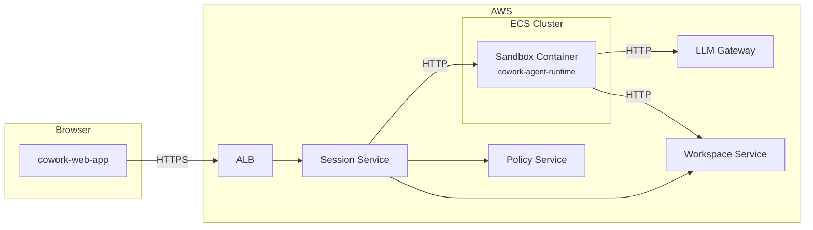
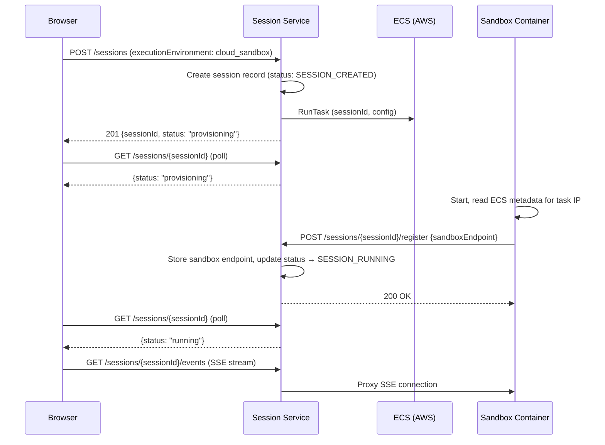
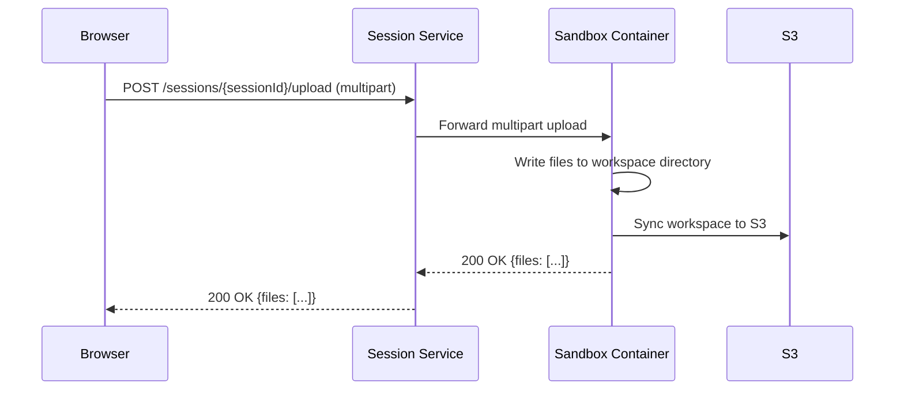
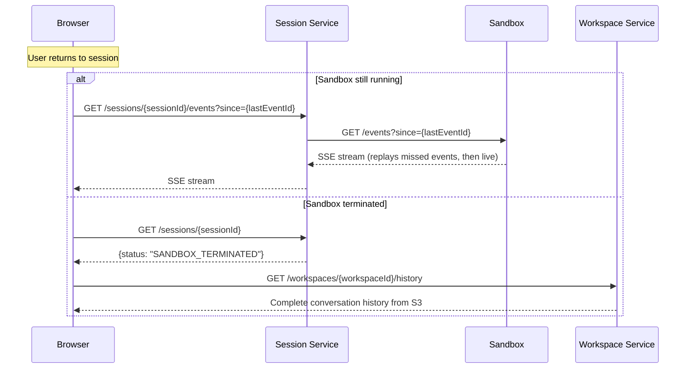
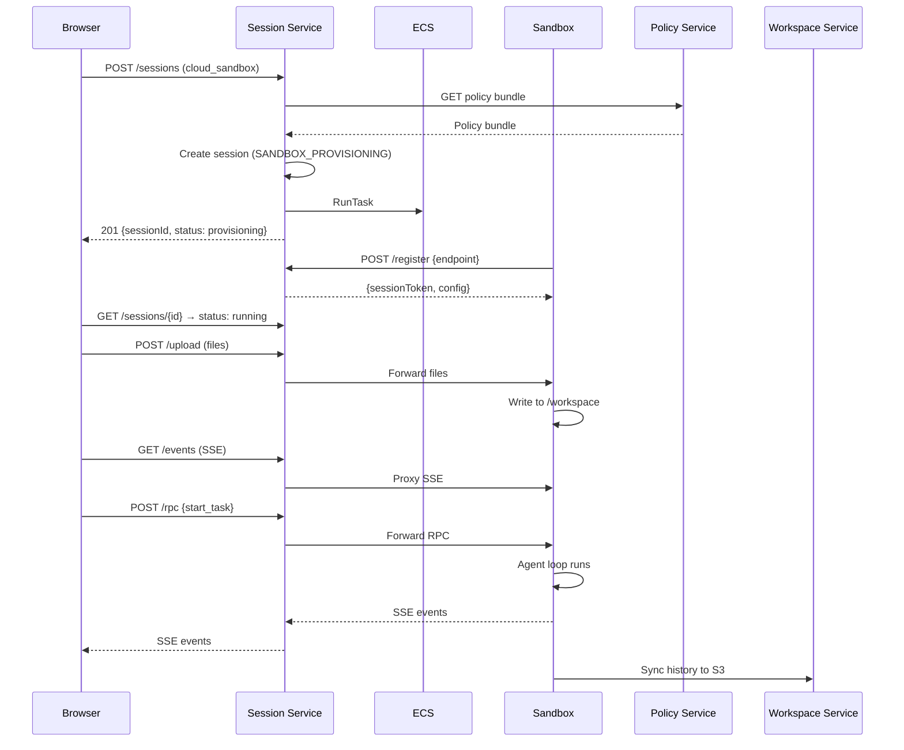
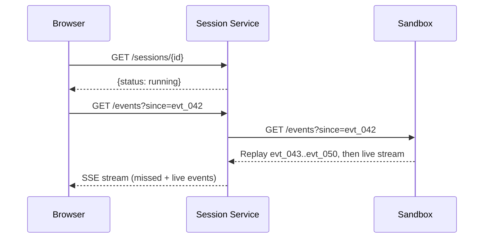

# Web Execution — Component Design

**Repos:** `cowork-web-app` (new), `cowork-agent-runtime`, `cowork-session-service`
**Bounded Context:** WebExecution
**Phase:** 3
**Depends on:** Session Service, Workspace Service, Policy Service, LLM Gateway

---

The web execution feature allows users to run the same agent runtime in a cloud sandbox accessible from a web browser, with full parity to the desktop experience. Users can submit tasks, navigate away, and return later to see the complete event history as if they never left.

This document describes the sandbox lifecycle, transport layer, provisioning flow, and the new `cowork-web-app` frontend. For the agent runtime internals, see [local-agent-host.md](local-agent-host.md). For the tool execution layer, see [local-tool-runtime.md](local-tool-runtime.md).

**Prerequisites:** [architecture.md](../architecture.md) (Section 13 — Web Extension), [session-service.md](../services/session-service.md), [workspace-service.md](../services/workspace-service.md)

---

## 1. Overview

### What this feature does

- Runs `cowork-agent-runtime` in an ECS Fargate task (one container per session)
- Provides a web UI (`cowork-web-app`) with the same conversation, approval, and patch preview experience as the desktop app
- Proxies all browser traffic through the Session Service — the browser never connects directly to sandbox containers
- Streams events from the sandbox to the browser via SSE (Server-Sent Events)
- Persists session history to the Workspace Service so users can navigate away and reconnect without losing context
- Supports file upload into the sandbox workspace and configurable network access

### What this feature does NOT do

- Replace the desktop app — desktop remains the primary experience for local file access
- Provide persistent storage between sessions — each sandbox is ephemeral
- Run multiple sessions in the same container — one session = one ECS task
- Allow direct network access to sandbox containers from the browser

### Key constraints

- **Feature parity with desktop**: The agent loop, tool set, policy enforcement, and approval flow are identical. Only the transport layer and file access model differ.
- **Ephemeral sandboxes**: Each session gets a fresh container. When the session ends, the container is destroyed. All durable state lives in S3 (Workspace Service).
- **Session Service as proxy**: All traffic between the browser and the sandbox flows through the Session Service. The browser has no knowledge of sandbox IPs or container identifiers.

---

## 2. Architecture

### System Context



### Desktop vs Web Comparison

| Aspect | Desktop | Web |
|--------|---------|-----|
| Agent runtime location | User's machine (child process) | ECS Fargate task (cloud) |
| Transport to frontend | JSON-RPC 2.0 over stdio | SSE (events) + HTTP POST (commands) via Session Service proxy |
| File access | Direct filesystem | S3-backed workspace synced to container local disk |
| Session creation | Instant (spawn process) | Async (provision ECS task, wait for healthy) |
| Reconnect after disconnect | Checkpoint file on disk | In-memory thread in sandbox + Workspace Service history |
| Network access | Unrestricted (user's machine) | Configurable — toggle on/off per session |
| Lifetime | Tied to desktop app process | Idle timeout + max duration limits |

---

## 3. Sandbox Lifecycle

### 3.1 Provisioning Flow

Session creation triggers ECS task provisioning. Because ECS provisioning takes time (typically 15–45 seconds), the flow is asynchronous — the browser polls until the sandbox is ready.



**Key decisions:**

1. **Async provisioning (not blocking)**: `POST /sessions` returns immediately with `status: "provisioning"`. The browser polls `GET /sessions/{sessionId}` until status becomes `SESSION_RUNNING`. This avoids HTTP request timeouts during ECS provisioning.

2. **Sandbox self-registration**: The container reads its own IP from the ECS task metadata endpoint (`$ECS_CONTAINER_METADATA_URI_V4`) and registers with the Session Service. This avoids the Session Service needing to poll ECS for task IPs.

3. **Warm pool (Phase 2 optimization)**: Pre-provisioned idle containers that can be assigned to sessions instantly. Reduces provisioning time from 15–45s to <3s. Not required for initial launch.

### 3.2 Session Status Extensions

The existing session status state machine is extended with sandbox-specific states:

| Status | Meaning |
|--------|---------|
| `SESSION_CREATED` | Session record created, ECS task requested |
| `SANDBOX_PROVISIONING` | ECS task is starting (new) |
| `SANDBOX_READY` | Container registered, ready to accept work (new) |
| `SESSION_RUNNING` | Task in progress |
| `SESSION_PAUSED` | Waiting for user input / approval |
| `SESSION_COMPLETED` | Agent finished |
| `SESSION_FAILED` | Unrecoverable error |
| `SESSION_CANCELLED` | User cancelled |
| `SANDBOX_TERMINATED` | Container shut down (idle timeout, max duration, or explicit) (new) |

Desktop sessions skip `SANDBOX_PROVISIONING` and `SANDBOX_READY` — they transition directly from `SESSION_CREATED` to `SESSION_RUNNING` as before.

### 3.3 Sandbox Termination

Sandboxes are terminated when any of these conditions are met:

| Condition | Default | Configurable |
|-----------|---------|-------------|
| Session completed/failed/cancelled | — | No |
| Idle timeout (no user activity) | 30 minutes | Yes (policy) |
| Max session duration | 4 hours | Yes (policy) |
| Concurrent session limit per user | 3 | Yes (policy) |

On termination:
1. Agent runtime performs graceful shutdown (flush logs, sync final state to Workspace Service)
2. Session Service updates status to `SANDBOX_TERMINATED`
3. ECS task is stopped
4. Container and local disk are destroyed

---

## 4. Transport Layer

### 4.1 Desktop Transport (Existing)

The Desktop App communicates with the agent runtime via JSON-RPC 2.0 over stdio. The `StdioTransport` in `agent_host/server/` handles framing and dispatch.

### 4.2 Web Transport (New)

The web transport replaces stdio with HTTP, using two channels:

| Channel | Direction | Protocol | Purpose |
|---------|-----------|----------|---------|
| Event stream | Sandbox → Browser | SSE (`text/event-stream`) | Agent events (LLM chunks, tool results, status changes, approvals) |
| Commands | Browser → Sandbox | HTTP POST | User actions (start task, approve/deny, cancel, send message) |

Both channels are proxied through the Session Service — the browser connects to Session Service endpoints, which forward to the sandbox's internal IP.

### 4.3 HttpTransport

A new `HttpTransport` class in `agent_host/server/` provides the same interface as `StdioTransport` but over HTTP:

```python
# agent_host/server/http_transport.py

class HttpTransport:
    """HTTP transport for web execution.

    Exposes:
    - POST /rpc     — JSON-RPC 2.0 request handling (same MethodDispatcher)
    - GET  /events  — SSE stream of SessionEvents
    - GET  /health  — Container health check
    """
```

The `MethodDispatcher` is shared between both transports — the same handlers process `start_task`, `approve`, `cancel_task`, `shutdown`, etc. The only difference is how messages are framed and delivered.

**Event streaming:** The `EventEmitter` already produces `SessionEvent` objects. `HttpTransport` subscribes to the emitter and pushes events as SSE:

```
event: llm_chunk
data: {"type": "llm_chunk", "content": "Here's how to fix that..."}

event: tool_started
data: {"type": "tool_started", "tool": "WriteFile", "args": {"path": "src/main.py"}}

event: approval_required
data: {"type": "approval_required", "approvalId": "apr_123", "tool": "RunCommand", ...}

event: task_completed
data: {"type": "task_completed", "taskId": "task_456", "status": "completed"}
```

### 4.4 Session Service Proxy

The Session Service routes browser requests to the correct sandbox using the registered `sandboxEndpoint`:

```
Browser → POST /sessions/{sessionId}/rpc     → Session Service → POST http://{sandboxIp}:8080/rpc
Browser → GET  /sessions/{sessionId}/events   → Session Service → GET  http://{sandboxIp}:8080/events (SSE proxy)
Browser → POST /sessions/{sessionId}/upload   → Session Service → multipart forward to sandbox
```

**Proxy implementation:** The Session Service maintains an in-memory map of `sessionId → sandboxEndpoint`. On proxy requests, it:
1. Looks up the sandbox endpoint for the session
2. Validates the session is in a running state
3. Forwards the request (streaming for SSE, buffered for RPC/upload)
4. Returns the sandbox response to the browser

If the sandbox is unreachable (container crashed, network issue), the proxy returns a `503 Service Unavailable` with a structured error indicating the sandbox state.

---

## 5. File Access and Workspace

### 5.1 Cloud Workspace

Web sessions use a `cloud`-scoped workspace. Unlike `local` workspaces (which reference files on the user's machine), cloud workspaces are fully managed:

| Aspect | Local Workspace | Cloud Workspace |
|--------|----------------|-----------------|
| Source files | User's filesystem | S3 bucket → synced to container local disk |
| File upload | Not needed (direct access) | Upload via Session Service → sandbox |
| Persistence | Files persist on user's machine | Ephemeral in container, durable in S3 |
| Artifact storage | Upload to Workspace Service | Same — upload to Workspace Service |

### 5.2 File Upload Flow

Users can upload files at session creation or during a session:



**Upload limits:**
- Max file size: 50 MB per file
- Max total upload per session: 500 MB
- Allowed file types: configurable via policy (default: common source code, documents, images)

### 5.3 Workspace Sync

The sandbox container syncs its local workspace to S3 periodically and on key events:

| Trigger | Direction |
|---------|-----------|
| Session start (files uploaded) | S3 → Container |
| After each task completion | Container → S3 |
| Every N steps (configurable, default 10) | Container → S3 |
| Session end (graceful shutdown) | Container → S3 |

Sync uses the existing `WORKSPACE_SYNC_INTERVAL` mechanism in the agent runtime, extended to sync to S3 via the Workspace Service rather than local checkpoint files.

### 5.4 File Download

Users can download files or directories from the sandbox workspace:

```
GET /sessions/{sessionId}/files/{path}       → single file download
GET /sessions/{sessionId}/files?archive=true → zip archive of workspace
```

These are proxied through the Session Service to the sandbox.

---

## 6. Reconnect and History

### 6.1 Problem

Users must be able to navigate away from a web session and return later to see the complete event history — as if they never left. This is not an issue on desktop because the Desktop App is a persistent process.

### 6.2 Solution: Dual Source of Truth

Two sources of truth work together:

| Source | Scope | Durability |
|--------|-------|-----------|
| Sandbox in-memory thread | Live, complete (all events since session start) | Ephemeral — lost when container terminates |
| Workspace Service history | Durable (synced periodically) | Persistent in S3 |

**Reconnect flow:**



**While sandbox is alive:** The sandbox replays missed events from its in-memory thread. The browser sends the last event ID it received; the sandbox streams everything after that, then continues with live events. No separate event persistence table needed.

**After sandbox terminated:** The browser fetches the complete conversation history from the Workspace Service. This is the same history endpoint used by the desktop app for session history.

### 6.3 No Separate Event Table

We explicitly avoid a `session-events` DynamoDB table. The Workspace Service already stores conversation history (messages, tool calls, results) as part of its artifact storage. The sandbox's in-memory thread handles reconnect for live sessions. This keeps the architecture simple and avoids write amplification from persisting every SSE event.

---

## 7. Authentication and Authorization

### 7.1 Browser Authentication

The `cowork-web-app` authenticates users via OIDC:

1. User visits web app → redirected to OIDC provider (e.g., Auth0, Okta, Cognito)
2. After login, browser receives an access token (JWT)
3. All API calls include `Authorization: Bearer {token}` header
4. Session Service validates the token on every request

### 7.2 Session Ownership

The Session Service enforces that:
- Only the session owner (matching `userId` from the JWT) can interact with a session
- Proxy requests validate session ownership before forwarding to sandbox
- File uploads and downloads are scoped to the session's workspace

### 7.3 Sandbox Authentication

The sandbox container authenticates to backend services using:
- An IAM task role (for S3, DynamoDB access)
- A session-scoped token issued by the Session Service at registration time (for Workspace Service, LLM Gateway calls)

The sandbox never receives or stores the user's OIDC token.

---

## 8. Network Access Control

### 8.1 Configurable Network Access

Web sessions support toggling network access for the agent's tools:

| Setting | Behavior |
|---------|----------|
| `networkAccess: "enabled"` | `HttpRequest`, `FetchUrl`, `WebSearch` tools are available |
| `networkAccess: "disabled"` | Network tools are removed from the tool set; outbound traffic blocked via security group |

This is controlled via the policy bundle — the Policy Service includes or excludes `Network.Http` and `Search.Web` capabilities based on the session configuration.

### 8.2 Security Group Configuration

Each sandbox ECS task runs in a security group with:
- **Always allowed:** Outbound to ALB (Session Service, Workspace Service, LLM Gateway) on port 443
- **Always allowed:** Outbound to S3 via VPC endpoint
- **Conditionally allowed:** General outbound internet access — only when `networkAccess: "enabled"`
- **Inbound:** Only from Session Service security group on port 8080

---

## 9. ECS Task Configuration

### 9.1 Task Definition

```
Family: cowork-{env}-sandbox
CPU: 1024 (1 vCPU)
Memory: 2048 MB
Network mode: awsvpc
Platform: Linux/ARM64
```

**Container definition:**

| Parameter | Value |
|-----------|-------|
| Image | `cowork-agent-runtime:latest` (same image as desktop, different entrypoint) |
| Entrypoint | `python -m agent_host.main --transport http` |
| Port | 8080 |
| Health check | `GET /health` every 10s, 3 retries |
| Log driver | `awslogs` → CloudWatch |

**Environment variables (injected by Session Service via ECS RunTask overrides):**

| Variable | Source |
|----------|--------|
| `TRANSPORT_MODE` | `http` |
| `SESSION_ID` | From session creation |
| `SESSION_SERVICE_URL` | Service discovery |
| `WORKSPACE_SERVICE_URL` | Service discovery |
| `LLM_GATEWAY_ENDPOINT` | Service discovery |
| `LLM_GATEWAY_AUTH_TOKEN` | Secrets Manager |
| `SANDBOX_PORT` | `8080` |
| `WORKSPACE_DIR` | `/workspace` |

### 9.2 Entrypoint Selection

The `cowork-agent-runtime` image supports two transport modes via the `--transport` flag:

```python
# agent_host/main.py

if args.transport == "stdio":
    transport = StdioTransport(dispatcher)
elif args.transport == "http":
    transport = HttpTransport(dispatcher, port=config.sandbox_port)
```

The same codebase, same Docker image, same agent loop — only the transport layer differs.

### 9.3 Resource Limits

| Resource | Default | Max |
|----------|---------|-----|
| CPU | 1 vCPU | 2 vCPU |
| Memory | 2 GB | 4 GB |
| Disk (ephemeral) | 20 GB | 50 GB |
| Execution timeout | 4 hours | 8 hours |

Resource limits are configurable per tenant via the policy bundle.

---

## 10. Session Service Changes

### 10.1 New Endpoints

| Method | Path | Purpose |
|--------|------|---------|
| `POST` | `/sessions/{sessionId}/register` | Sandbox self-registration (internal, not exposed to browser) |
| `GET` | `/sessions/{sessionId}/events` | SSE proxy to sandbox event stream |
| `POST` | `/sessions/{sessionId}/rpc` | JSON-RPC proxy to sandbox |
| `POST` | `/sessions/{sessionId}/upload` | File upload proxy to sandbox |
| `GET` | `/sessions/{sessionId}/files/{path}` | File download proxy from sandbox |
| `GET` | `/sessions/{sessionId}/files` | Workspace archive download |

### 10.2 Registration Endpoint

Called by the sandbox container during startup:

**Request:**
```json
{
  "sandboxEndpoint": "http://10.0.1.42:8080",
  "taskArn": "arn:aws:ecs:us-east-1:123456789:task/cowork-dev/abc123"
}
```

**Behavior:**
1. Validate the session exists and is in `SANDBOX_PROVISIONING` state
2. Store `sandboxEndpoint` and `taskArn` on the session record
3. Update session status to `SANDBOX_READY`
4. Return a session-scoped auth token for the sandbox to use with backend services

**Response:**
```json
{
  "sessionToken": "sandbox_tok_...",
  "workspaceServiceUrl": "https://...",
  "llmGatewayEndpoint": "https://..."
}
```

### 10.3 Session Record Extensions

New fields on the session DynamoDB record for web sessions:

| Field | Type | Description |
|-------|------|-------------|
| `sandboxEndpoint` | string | Internal IP:port of the sandbox container |
| `taskArn` | string | ECS task ARN for lifecycle management |
| `networkAccess` | string | `enabled` or `disabled` |
| `lastActivityAt` | datetime | Last user interaction (for idle timeout) |

### 10.4 Idle Timeout Enforcement

A periodic check terminates sandbox sessions that have been idle too long.

**Multi-instance safety:** The Session Service runs multiple instances behind an ALB. All instances execute the idle check independently, so the termination flow must be safe under concurrent execution.

**Phase 3a — Idempotent check in each instance:**

Each instance runs the idle check on a configurable interval (default: every 5 minutes):

1. Query sessions where `executionEnvironment = cloud_sandbox` and `status` is active
2. For each session, check if `now - lastActivityAt > idleTimeout`
3. Attempt a DynamoDB conditional update: `SET status = SANDBOX_TERMINATED WHERE status IN (SESSION_RUNNING, SESSION_PAUSED)`. Only one instance wins the condition check — others get `ConditionalCheckFailedException` and skip.
4. The winning instance sends `shutdown` to the sandbox and calls ECS `StopTask` (which is itself idempotent)

This is simple and correct. Multiple instances may scan the same sessions, but only one performs the termination. The overhead is acceptable at low-to-moderate scale.

**Phase 3c — EventBridge scheduled rule:**

At higher scale (hundreds of concurrent sandboxes), move the idle check out of the service entirely:

- EventBridge rule on a 5-minute schedule triggers a Lambda function
- Lambda queries for idle sessions and terminates them
- Single execution per interval — no duplication, no conditional update needed
- Session Service instances no longer run the background task

---

## 11. cowork-web-app

### 11.1 Repository Structure

A new repo `cowork-web-app`:

| Item | Tech |
|------|------|
| Framework | React (Vite) |
| Language | TypeScript |
| Auth | OIDC (via `oidc-client-ts` or similar) |
| State | Zustand (same pattern as desktop app) |
| Styling | Tailwind CSS |

### 11.2 Views

| View | Description |
|------|-------------|
| Session list | User's active and recent sessions |
| Conversation | Chat interface — message input, LLM responses, tool call results |
| File browser | Browse/download workspace files |
| Approval dialog | Same approval flow as desktop (approve/deny with optional modifications) |
| Patch preview | Same diff view as desktop for file changes |
| Settings | Session configuration (network access toggle, resource limits) |

### 11.3 SSE Client

The web app maintains an SSE connection for live sessions:

```typescript
const eventSource = new EventSource(`/sessions/${sessionId}/events`);

eventSource.addEventListener("llm_chunk", (e) => { /* append to conversation */ });
eventSource.addEventListener("tool_started", (e) => { /* show tool activity */ });
eventSource.addEventListener("tool_completed", (e) => { /* show tool result */ });
eventSource.addEventListener("approval_required", (e) => { /* show approval dialog */ });
eventSource.addEventListener("task_completed", (e) => { /* update status */ });
```

On disconnect, the client automatically reconnects with `Last-Event-ID` to resume from where it left off.

### 11.4 Command Submission

User actions are sent as JSON-RPC calls via HTTP POST:

```typescript
// Start a new task
await fetch(`/sessions/${sessionId}/rpc`, {
  method: "POST",
  body: JSON.stringify({
    jsonrpc: "2.0",
    method: "start_task",
    params: { prompt: "Fix the login bug" },
    id: 1,
  }),
});
```

---

## 12. Data Flow Summary

### New Session (Web)



### Reconnect After Navigation



---

## 13. Security Considerations

| Concern | Mitigation |
|---------|-----------|
| Sandbox escape | ECS Fargate — no host access, read-only root filesystem (workspace dir is writable volume) |
| Data exfiltration | Network access toggle, egress restricted by security group, no access to other sessions |
| Session hijacking | OIDC token validation on every request, session ownership enforcement |
| Sandbox impersonation | Registration endpoint validates ECS task ARN matches a task launched by Session Service |
| Resource abuse | Per-user concurrent session limits, idle timeout, max duration, CPU/memory caps |
| File upload attacks | File size limits, type validation, virus scanning (Phase 2) |
| Cross-session access | Each sandbox runs in its own ECS task with unique IAM credentials scoped to its workspace |

---

## 14. Observability

### Logs

- Sandbox container logs → CloudWatch Logs (via `awslogs` driver)
- Log group: `/cowork/{env}/sandbox/{sessionId}`
- Same `structlog` JSON format as all other services
- Session ID, tenant ID, user ID bound as context vars

### Metrics

| Metric | Type | Description |
|--------|------|-------------|
| `sandbox.provision_duration` | histogram | Time from CreateSession to SANDBOX_READY |
| `sandbox.active_count` | gauge | Currently running sandbox containers |
| `sandbox.idle_terminated` | counter | Sessions terminated due to idle timeout |
| `sandbox.max_duration_terminated` | counter | Sessions terminated due to max duration |
| `sandbox.proxy_latency` | histogram | Session Service → sandbox request latency |

### Health Checks

The sandbox container exposes `GET /health` (liveness) and `GET /ready` (readiness). The Session Service health check for sandbox proxying depends on the ECS task being in `RUNNING` state.

---

## 15. Rollout Plan

### Phase 3a — MVP

- Single ECS task per session (no warm pool)
- SSE + HTTP POST transport via Session Service proxy
- File upload and download
- Reconnect via sandbox in-memory replay
- Network access toggle
- OIDC authentication
- Basic web UI (conversation, approval, file browser)
- Idle timeout and max duration enforcement

### Phase 3b — Optimization

- Warm pool for instant provisioning (<3s)
- Connection draining on sandbox shutdown
- Workspace snapshot/restore (resume from terminated sessions)
- Enhanced file management (inline editor, tree view)
- Virus scanning for uploads

### Phase 3c — Scale

- Auto-scaling warm pool based on usage patterns
- Regional sandbox deployment (closest to user)
- GPU-enabled sandbox option for ML workloads
- Shared workspace across sessions (team collaboration)

---

## 16. Open Questions

| # | Question | Status |
|---|----------|--------|
| 1 | Should the web app support real-time collaborative viewing (multiple users watching the same session)? | Deferred to Phase 4 |
| 2 | What OIDC provider(s) to support at launch? | TBD — depends on customer requirements |
| 3 | Should sandbox containers have access to customer VPCs via VPC peering for internal API access? | Deferred — complex networking, evaluate demand |
| 4 | Max concurrent sandbox containers per environment for cost management? | TBD — needs capacity planning |
