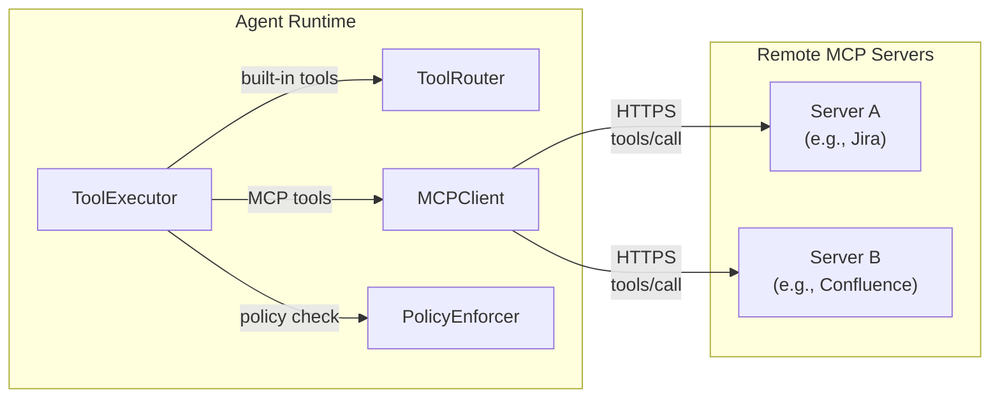
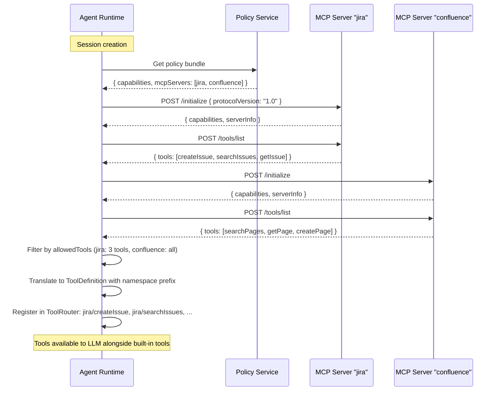
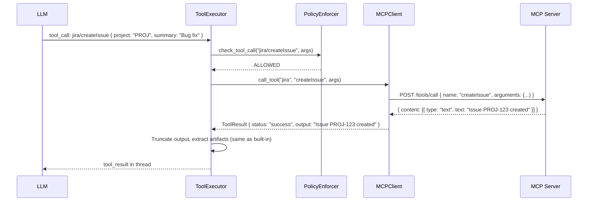

# MCP Client — Design Doc

**Status:** Proposed
**Scope:** cowork-agent-runtime, cowork-platform, cowork-policy-service
**Date:** 2026-03-28
**Roadmap:** Phase A, item A1
**Supersedes:** `local-tool-runtime.md` Section 9 (high-level outline retained there, detailed design here)

---

## Problem

The agent can only use 16 built-in tools. Organizations need custom tools — internal APIs, proprietary databases, third-party SaaS integrations — without modifying the agent runtime. MCP (Model Context Protocol) provides a standard way for external servers to expose tools that the agent can discover and call.

---

## Goals

1. Agent discovers and calls tools from remote MCP servers as naturally as built-in tools
2. MCP tools go through the same policy enforcement, approval gating, and output handling as built-in tools
3. Works in both desktop (stdio) and web sandbox (SQS worker) modes
4. Secure: TLS required, credentials managed centrally, no plaintext secrets in logs
5. Resilient: transient failures don't crash the agent, unavailable servers degrade gracefully

## Non-Goals

- Running MCP servers (we only build the client)
- MCP server-side authentication standards (we support token-based auth; server manages its own auth)
- Local MCP servers via stdio (desktop-only; Phase 3 consideration)

---

## MCP Protocol

**Version:** MCP 1.0 (streamable HTTP transport)

**Transport:** HTTPS — all communication over TLS. No plaintext HTTP.

**Key operations:**
- `initialize` — capability negotiation, protocol version agreement
- `tools/list` — server returns its tool manifest (name, description, inputSchema per tool)
- `tools/call` — invoke a tool with arguments, receive structured result

**HTTP client:** `httpx.AsyncClient` with connection pooling (same library used for all outbound HTTP in agent-runtime).

---

## Architecture

### Component Diagram



### How MCP Tools Integrate with Existing Pipeline

MCP tools flow through the **exact same pipeline** as built-in tools:

```
LLM calls tool "jira/createIssue"
  → ToolExecutor receives tool call
  → Recognizes MCP namespace prefix ("jira/")
  → PolicyEnforcer.check_tool_call("jira/createIssue", args)
  → If APPROVAL_REQUIRED: ApprovalGate.request_approval()
  → MCPClient.call_tool("jira", "createIssue", args)
  → Response translated to ToolResult
  → Output truncation, artifact extraction (same as built-in)
  → Result added to thread
```

The LLM doesn't know or care whether a tool is built-in or MCP. The tool definitions look identical.

---

## MCP Server Configuration

### Where Config Lives

MCP server configuration is part of the **policy bundle**, delivered by the Policy Service at session creation. This ensures:
- Centralized governance (tenant admin controls which MCP servers are available)
- Per-session scoping (different sessions can have different servers)
- Credential delivery via the same secure channel as other policy data

### Schema

```json
{
    "policyBundle": {
        "capabilities": [...],
        "mcpServers": [
            {
                "name": "jira",
                "endpointUrl": "https://mcp-jira.internal.company.com",
                "authentication": {
                    "type": "bearer",
                    "tokenSecretArn": "arn:aws:secretsmanager:us-east-1:123:secret/mcp-jira-token"
                },
                "allowedTools": ["createIssue", "searchIssues", "getIssue"],
                "timeout": 30,
                "maxRetries": 3
            },
            {
                "name": "confluence",
                "endpointUrl": "https://mcp-confluence.internal.company.com",
                "authentication": {
                    "type": "bearer",
                    "tokenSecretArn": "arn:aws:secretsmanager:us-east-1:123:secret/mcp-confluence-token"
                },
                "allowedTools": null,
                "timeout": 30,
                "maxRetries": 3
            }
        ]
    }
}
```

| Field | Type | Required | Description |
|---|---|---|---|
| `name` | string | Yes | Server name — used as namespace prefix. Must be unique within the policy bundle. Alphanumeric + hyphens only. |
| `endpointUrl` | string | Yes | HTTPS URL of the MCP server. Must start with `https://`. |
| `authentication` | object | Yes | Auth config (see below). |
| `allowedTools` | string[] or null | No | If set, only these tools are registered from the server. If null, all tools from the manifest are registered. |
| `timeout` | integer | No | Per-tool-call timeout in seconds (default: 30). |
| `maxRetries` | integer | No | Max retries for transient errors (default: 3). |

### Authentication

Phase 1 supports bearer token auth:

```json
{
    "type": "bearer",
    "tokenSecretArn": "arn:aws:secretsmanager:us-east-1:123:secret/mcp-token"
}
```

| Field | Type | Description |
|---|---|---|
| `type` | `"bearer"` | Auth type. Phase 1: bearer only. Phase 3: add `"mtls"`. |
| `tokenSecretArn` | string | ARN of the Secrets Manager secret containing the bearer token. |

**Token resolution flow:**
- **Web sandbox:** Session Service resolves the secret ARN at session creation, injects the actual token into the policy bundle before returning to the agent runtime. The agent runtime never calls Secrets Manager directly.
- **Desktop:** Agent runtime resolves the secret via local credential store or environment variable. `tokenSecretArn` is replaced with `tokenEnvVar` pointing to a local env var name.

**Desktop alternative:**
```json
{
    "type": "bearer",
    "tokenEnvVar": "JIRA_MCP_TOKEN"
}
```

Token is passed in the `Authorization: Bearer {token}` header on every MCP HTTP request.

---

## Lifecycle

### Discovery and Registration



**Timing:** Discovery happens once at session initialization, after the policy bundle is received. Not per tool call.

**Caching:** Tool manifests are cached for the session lifetime. No re-discovery mid-session. If a server adds/removes tools, it takes effect on the next session.

**Failure during discovery:** If an MCP server is unreachable during discovery, log a warning and skip it. The agent operates without that server's tools. No session failure.

### Tool Execution



### Shutdown

On session end:
1. Close all MCP HTTP connections (drain connection pool)
2. Clear cached tool manifests
3. No server-side cleanup needed (MCP is stateless per-call)

---

## Desktop vs Sandbox Mode

| Aspect | Desktop (stdio) | Sandbox (SQS worker) |
|---|---|---|
| Connection lifetime | Session lifetime — persistent `httpx.AsyncClient` per server | Session lifetime — same, since each SQS worker serves one session then exits |
| Discovery | Once at session init | Once at session init (after SQS pickup + registration) |
| Credential source | Local env var (`tokenEnvVar`) | Secrets Manager ARN resolved by Session Service (`tokenSecretArn`) |
| Connection pooling | Per-process, reused across calls within session | Per-process, reused across calls within session |
| Shutdown | On session end / app close | On SIGTERM / session end / process exit |

**Key insight:** Both modes have the same lifecycle — one session per process, connections live for the session. The SQS worker model (task terminates after session) means no cross-session connection reuse, which is fine. Each new session gets fresh MCP connections.

No special pooling or caching infrastructure needed beyond `httpx.AsyncClient`'s built-in connection pool.

---

## Tool Namespace and Naming

**Format:** `{serverName}/{toolName}`

**Examples:**
- `jira/createIssue`
- `jira/searchIssues`
- `confluence/searchPages`

**Rules:**
- `serverName` must be unique within the policy bundle (enforced at policy creation)
- `serverName` is alphanumeric + hyphens only (no `/`, no spaces)
- `toolName` comes from the MCP server's manifest (as-is)
- Full namespaced name used in policy capabilities, tool definitions, and tool calls

**Collision prevention:**
- Built-in tools have no prefix (e.g., `ReadFile`, `RunCommand`)
- MCP tools always have a prefix (e.g., `jira/createIssue`)
- No collision possible between built-in and MCP tools
- Collision between two servers prevented by unique `serverName` requirement

---

## Policy Integration

### Capability Mapping

MCP tools map to a single capability: `MCP.{serverName}`

```json
{
    "name": "MCP.jira",
    "scope": {
        "allowedTools": ["createIssue", "searchIssues", "getIssue"]
    },
    "requiresApproval": false,
    "riskLevel": "medium"
}
```

| Field | Description |
|---|---|
| `name` | `MCP.{serverName}` — one capability per MCP server |
| `scope.allowedTools` | Which tools from this server are permitted (redundant with mcpServers.allowedTools but enforced at policy level) |
| `requiresApproval` | If true, all tool calls to this server require user approval |
| `riskLevel` | Risk level for all tools from this server (can be overridden per tool in future) |

**PolicyEnforcer check flow:**
1. Extract server name from tool call: `"jira/createIssue"` → server `"jira"`, tool `"createIssue"`
2. Check capability `MCP.jira` exists → if not, DENIED
3. Check `scope.allowedTools` includes `"createIssue"` → if not, DENIED
4. Check `requiresApproval` → if true, return APPROVAL_REQUIRED
5. Return ALLOWED

### Tool Definition for LLM

MCP tools appear in the LLM's tool list identically to built-in tools:

```json
{
    "type": "function",
    "function": {
        "name": "jira/createIssue",
        "description": "Create a new Jira issue in a project",
        "parameters": {
            "type": "object",
            "properties": {
                "project": { "type": "string", "description": "Project key" },
                "summary": { "type": "string", "description": "Issue summary" },
                "description": { "type": "string", "description": "Issue description" }
            },
            "required": ["project", "summary"]
        }
    }
}
```

The `parameters` schema comes directly from the MCP server's tool manifest `inputSchema`.

---

## Error Handling and Resilience

### Retry Strategy

```python
RETRY_CONFIG = {
    "max_retries": 3,           # Per server config, default 3
    "base_delay": 0.5,          # Seconds
    "max_delay": 10,            # Seconds
    "jitter": True,             # Random jitter 0-25% of delay
    "retryable_status_codes": {500, 502, 503, 504, 429},
}
```

**Retry flow:**
1. Call MCP server
2. If retryable error (5xx, 429, timeout, connection error): wait with exponential backoff, retry
3. If 429 with `Retry-After` header: use that delay
4. After max retries: return failed ToolResult with error description
5. If non-retryable error (4xx except 429): return failed ToolResult immediately

### Circuit Breaker

Per-server circuit breaker prevents hammering a down server:

| State | Behavior |
|---|---|
| **Closed** (normal) | Calls go through. Track consecutive failures. |
| **Open** (broken) | Calls fail immediately with "server unavailable." No HTTP request made. |
| **Half-Open** (testing) | Allow one call through. If success → Closed. If fail → Open. |

**Thresholds:**
- Closed → Open: 5 consecutive failures
- Open → Half-Open: 30 seconds after last failure
- Half-Open → Closed: 1 successful call
- Half-Open → Open: 1 failed call

**When circuit is open:**
- Tool calls to that server return: `{ status: "failed", error: "MCP server 'jira' is temporarily unavailable. It will be retried automatically." }`
- LLM sees the failure and can choose to proceed without that tool
- No user notification needed — the error is part of normal tool result flow

### Timeout Handling

Three timeout levels:

| Timeout | Default | Configurable | Scope |
|---|---|---|---|
| Connection timeout | 5s | No | Establishing TCP + TLS connection |
| Read timeout | Per-server `timeout` (default 30s) | Yes (in policy) | Waiting for server response |
| Total call timeout | `timeout + 5s` | Derived | Includes retry overhead |

### Response Validation

After receiving an MCP response:
1. Validate JSON structure matches MCP protocol
2. Check `content` array exists and is non-empty
3. Reject responses >10MB (size cap)
4. Translate to ToolResult format

Invalid responses → ToolResult with `status: "failed"` and descriptive error.

---

## MCP Response Translation

### Text Content

```python
# MCP response
{ "content": [{ "type": "text", "text": "Issue PROJ-123 created" }] }

# → ToolResult
{ "status": "success", "output": "Issue PROJ-123 created" }
```

Multiple text blocks concatenated with `\n\n`:

```python
# MCP response with multiple text blocks
{ "content": [
    { "type": "text", "text": "Found 3 results:" },
    { "type": "text", "text": "1. PROJ-101\n2. PROJ-102\n3. PROJ-103" }
]}

# → ToolResult
{ "status": "success", "output": "Found 3 results:\n\n1. PROJ-101\n2. PROJ-102\n3. PROJ-103" }
```

### Image Content

```python
# MCP response with image
{ "content": [
    { "type": "text", "text": "Screenshot of the dashboard" },
    { "type": "image", "data": "base64...", "mimeType": "image/png" }
]}

# → ToolResult with artifact
{
    "status": "success",
    "output": "Screenshot of the dashboard",
    "image_url": "data:image/png;base64,..."
}
```

Image content becomes a multimodal tool result — same handling as `ViewImage` tool.

### Error Content

```python
# MCP response with isError
{ "content": [{ "type": "text", "text": "Project PROJ not found" }], "isError": true }

# → ToolResult
{ "status": "failed", "error": { "message": "Project PROJ not found", "code": "MCP_TOOL_ERROR" } }
```

---

## Module Structure

```
cowork-agent-runtime/src/tool_runtime/mcp/
    __init__.py
    client.py          — MCPClient: manages connections to multiple servers
    connection.py       — MCPConnection: single server connection + circuit breaker
    discovery.py        — Tool manifest fetching and translation
    executor.py         — Tool call forwarding and response translation
    config.py           — MCPServerConfig dataclass (parsed from policy bundle)
```

### MCPClient (top-level facade)

```python
class MCPClient:
    """Manages MCP connections to multiple servers."""

    async def initialize(self, servers: list[MCPServerConfig]) -> None:
        """Connect to all servers, discover tools. Called once at session init."""

    def get_tool_definitions(self) -> list[dict[str, Any]]:
        """Return ToolDefinition dicts for all discovered MCP tools."""

    async def call_tool(self, server_name: str, tool_name: str, arguments: dict) -> ToolResult:
        """Forward a tool call to the appropriate server."""

    async def close(self) -> None:
        """Close all connections. Called at session end."""
```

### MCPConnection (per-server)

```python
class MCPConnection:
    """Connection to a single MCP server with retry and circuit breaker."""

    async def connect(self) -> None:
        """Initialize connection: HTTP client + MCP handshake."""

    async def discover_tools(self) -> list[MCPToolManifest]:
        """Fetch tools/list and return translated manifests."""

    async def call_tool(self, tool_name: str, arguments: dict) -> MCPResponse:
        """Call tools/call with retry + circuit breaker."""

    async def close(self) -> None:
        """Close HTTP client."""
```

---

## Integration with ToolRouter

### Registration

At session initialization, after MCPClient discovers tools:

```python
# In SessionManager._init_components() or LoopRuntime initialization
mcp_client = MCPClient()
await mcp_client.initialize(policy_bundle.mcp_servers)

# Register MCP tools in ToolRouter
for tool_def in mcp_client.get_tool_definitions():
    tool_router.register_mcp_tool(tool_def, mcp_client)
```

### Dispatch

ToolRouter detects MCP tools by namespace prefix:

```python
def execute(self, request: ToolRequest, context: ExecutionContext) -> ToolResult:
    if "/" in request.tool_name:
        # MCP tool — delegate to MCPClient
        server_name, tool_name = request.tool_name.split("/", 1)
        return await self._mcp_client.call_tool(server_name, tool_name, request.arguments)
    else:
        # Built-in tool
        return await self._tools[request.tool_name].execute(request, context)
```

### Parallel Execution

MCP tool calls follow the same parallel execution rules as built-in tools:
- MCP tools are treated as external tools (not agent-internal)
- Multiple MCP calls to **different servers** can run in parallel
- Multiple MCP calls to the **same server** run in parallel (server handles concurrency)
- MCP calls can run in parallel with built-in read tools

---

## Files Changed

| File | Changes |
|---|---|
| **New:** `tool_runtime/mcp/client.py` | MCPClient facade |
| **New:** `tool_runtime/mcp/connection.py` | Per-server connection with retry + circuit breaker |
| **New:** `tool_runtime/mcp/discovery.py` | Tool manifest fetch + translation |
| **New:** `tool_runtime/mcp/executor.py` | Tool call forwarding + response translation |
| **New:** `tool_runtime/mcp/config.py` | MCPServerConfig dataclass |
| `tool_runtime/router/__init__.py` | Register MCP tools, dispatch by namespace prefix |
| `agent_host/session/session_manager.py` | Initialize MCPClient at session start, close at session end |
| `agent_host/loop/tool_executor.py` | MCP tools in parallel execution grouping (treated as external) |
| `cowork-platform/contracts/schemas/policy-bundle.json` | Add `mcpServers` array to policy bundle schema |
| `cowork-policy-service` | Generate `mcpServers` config and `MCP.*` capabilities |

---

## Tests

### Unit Tests

- MCPConnection: connect, discover tools, call tool, retry on 5xx, circuit breaker transitions
- MCPClient: initialize multiple servers, get_tool_definitions, call_tool routing, close
- Discovery: manifest translation (MCP → ToolDefinition), namespace prefixing, allowedTools filtering
- Response translation: text, multiple text blocks, image, error, invalid JSON, oversized response
- Circuit breaker: closed → open after 5 failures, open → half-open after 30s, half-open → closed on success
- Policy integration: MCP.{serverName} capability check, allowedTools scope, approval requirement

### Integration Tests

- Connect to a test MCP server (httpbin or custom mock), discover tools, call tool, verify result
- Server unavailable at discovery → skip server, session continues
- Server goes down mid-session → circuit breaker opens, calls fail gracefully
- Large response (>10MB) → rejected with error

---

## Security Considerations

| Concern | Mitigation |
|---|---|
| Plaintext credentials | Tokens resolved from Secrets Manager (web) or env var (desktop). Never in logs, never in DynamoDB. |
| MCP server impersonation | TLS required. `httpx` validates certificates by default. |
| Malicious tool manifest | `allowedTools` in policy bundle limits which tools are registered. Unknown tools ignored. |
| Response injection | Response validated against MCP protocol structure. Content >10MB rejected. |
| Data exfiltration via tool input | PolicyEnforcer checks all tool calls before dispatch. Approval gating for sensitive servers. |
| Log exposure | Tool arguments and results follow existing log sanitization (no sensitive data in structlog). |

---

## Backward Compatibility

- No `mcpServers` in policy bundle → no MCP tools discovered → agent works with built-in tools only
- Existing policy bundles without `mcpServers` field are valid (field is optional, default empty array)
- No changes to existing tool definitions, tool execution, or LLM interaction
- MCP tools are additive — they extend the tool set, never replace built-in tools
