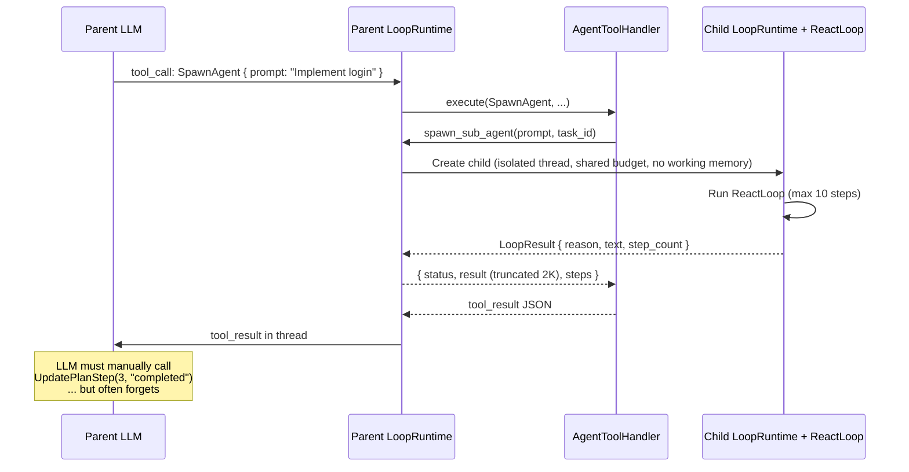
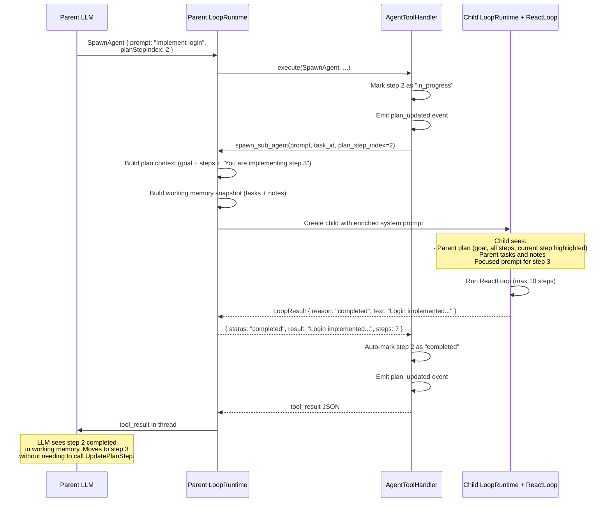
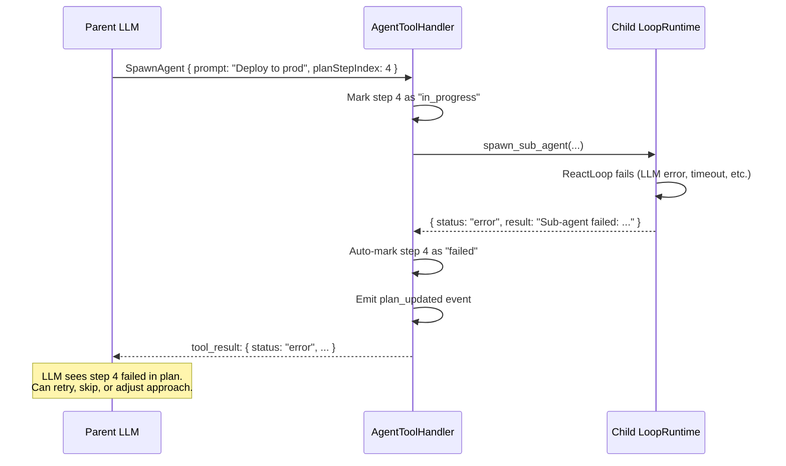

# Plan & Sub-Agent Improvements — Design Doc

**Status:** Implementation Ready
**Scope:** cowork-agent-sdk, cowork-agent-runtime
**Date:** 2026-03-28
**Roadmap:** Phase A, items A1-A5
**Branch:** `feature/phase-a-implementation` (single branch for all Phase A work)

---

## Problem

Sub-agents are completely isolated from the parent's plan. When the agent follows a multi-step plan and spawns sub-agents to execute steps, seven gaps cause unreliable execution:

1. **LLM doesn't use SpawnAgent during plans:** The `EnterPlanMode` tool description says "only read-only tools are available" — the LLM interprets this as SpawnAgent being blocked. In reality, SpawnAgent is an agent-internal tool and remains available during plan mode. The description is misleading.
2. **No system prompt guidance for delegation:** The plan execution guidance never suggests using SpawnAgent to delegate steps. The LLM defaults to doing everything itself.
3. **No plan visibility:** Sub-agent doesn't know which step it's working on or what the overall goal is
4. **No automatic plan updates:** Parent must manually call `UpdatePlanStep` after sub-agent returns — LLM often forgets, leaving steps stuck in "in_progress"
5. **No failure state:** PlanStep has no "failed" status — a crashed sub-agent leaves the step permanently stuck
6. **Truncated results:** Sub-agent output capped at 2000 characters — complex work is silently lost
7. **No context inheritance:** Sub-agent starts with empty working memory — no visibility into parent's task tracker, notes, or broader plan

These gaps mean that plan execution with sub-agents is fragile — the LLM rarely delegates to sub-agents during plans, and when it does, plan state management depends entirely on the LLM remembering to update it manually.

---

## Current Architecture

### How Sub-agents Work Today



### What the Child Receives

| Component | Shared? | Value |
|---|---|---|
| MessageThread | **No** — fresh, empty | Only contains: system prompt + user prompt (the `prompt` parameter) |
| TokenBudget | **Yes** — shared | Draws from parent's remaining budget |
| WorkingMemory | **No** — None | No task tracker, no plan, no notes |
| PolicyEnforcer | **Yes** — shared | Same capabilities as parent |
| ErrorRecovery | **No** — fresh | Independent failure tracking |
| Tools | **Yes** — same ToolRouter | Same external tools, but no agent-internal tools (no UpdatePlanStep, no SaveMemory) |
| EventEmitter | **Yes** — shared | Events flow to same stream |
| Max steps | Fixed 10 | Not configurable per spawn |

### What the Child Does NOT Receive

- Parent's plan (goal, steps, current progress)
- Parent's working memory (task tracker, notes)
- Parent's conversation context
- Which plan step it's implementing
- What other steps exist (before/after)
- Agent-internal tools (UpdatePlanStep, SaveMemory, etc.)

---

## Changes

### Fix: EnterPlanMode Tool Description

**File:** `cowork-agent-runtime/src/agent_host/loop/agent_tools.py`

The `EnterPlanMode` tool description currently says "only read-only tools are available." This is misleading — only external tools are restricted. Agent-internal tools (SpawnAgent, CreatePlan, UpdatePlanStep, memory tools) remain available.

**Current description (inaccurate):**
```
Enter plan mode for exploration. Only read-only tools are available.
```

**Updated description:**
```
Enter plan mode for exploration. Only read-only external tools are available
(ReadFile, ListDirectory, FindFiles, GrepFiles, ViewImage, FetchUrl, WebSearch).
Agent-internal tools remain available: SpawnAgent, CreatePlan, UpdatePlanStep,
SaveMemory, RecallMemory, ListMemories.
```

### Fix: System Prompt Guidance for Delegation

**File:** `cowork-agent-sdk/src/agent_sdk/loop/system_prompt.py`

Add guidance for using SpawnAgent during plan execution. This goes after the existing plan step guidance:

**Add after the existing plan step guidance:**
```
- For complex plan steps, you may delegate to a sub-agent using SpawnAgent
  with the planStepIndex parameter. The sub-agent will receive the plan context
  and the step will be automatically updated on completion. Use sub-agents for
  steps that are self-contained and don't depend on your current conversation state.
```

This guidance only becomes fully effective after A7 (auto-update) is implemented — but fixing the description (above) and adding the guidance together ensures the LLM knows delegation is available.

---

### A8: Add "failed" Status to PlanStep

**File:** `cowork-agent-sdk/src/agent_sdk/memory/plan.py`

Add `"failed"` to the PlanStep status literal:

```python
@dataclass
class PlanStep:
    description: str
    status: Literal["pending", "in_progress", "completed", "skipped", "failed"] = "pending"
    acceptance_criteria: list[str] | None = None  # Future: Phase B1
```

**Plan rendering update:**
- Failed steps render with a distinct marker: `[failed]`
- Plan continuation logic: failed steps are treated as "resolved" (don't block task completion, same as completed/skipped)

**UpdatePlanStep tool update:**
- Accept `"failed"` as a valid status value
- Log `plan_step_failed` event with step index and description

**ReactLoop update** (`react_loop.py`, plan continuation check):
```python
# Current: checks pending + in_progress
incomplete = any(s.status in ("pending", "in_progress") for s in plan.steps)

# Updated: same — failed steps don't block completion
# "failed" is resolved, like "completed" and "skipped"
```

No change needed in ReactLoop — the existing check already only blocks on `pending` and `in_progress`.

### A6: Pass Plan Context to Sub-agents

**File:** `cowork-agent-runtime/src/agent_host/loop/loop_runtime.py` — `spawn_sub_agent()`

When the parent has an active plan, include a plan summary in the sub-agent's system prompt context.

**New helper** in `agent_host/loop/plan_context.py`:

```python
def build_sub_agent_plan_context(
    plan: Plan,
    current_step_index: int | None = None,
) -> str:
    """Build a plan context summary for sub-agent injection."""
    lines = [f"## Parent Agent Plan\nGoal: {plan.goal}"]

    for i, step in enumerate(plan.steps):
        prefix = "→ " if i == current_step_index else "  "
        lines.append(f"{prefix}{i + 1}. [{step.status}] {step.description}")

    if current_step_index is not None and current_step_index < len(plan.steps):
        step = plan.steps[current_step_index]
        lines.append(f"\nYou are implementing step {current_step_index + 1}: {step.description}")
        lines.append("Focus on this step only. The parent agent handles the overall plan.")

    return "\n".join(lines)
```

**Changes to `spawn_sub_agent()`:**

```python
async def spawn_sub_agent(
    self,
    prompt: str,
    parent_task_id: str,
    plan_step_index: int | None = None,  # NEW
) -> dict[str, Any]:
    # Build context from parent's plan
    plan_context = ""
    if self.working_memory and self.working_memory.plan:
        plan_context = build_sub_agent_plan_context(
            self.working_memory.plan,
            current_step_index=plan_step_index,
        )

    # Build working memory snapshot (A10)
    wm_snapshot = ""
    if self.working_memory:
        wm_snapshot = self._build_working_memory_snapshot()

    # Combine context
    context_parts = [p for p in [plan_context, wm_snapshot] if p]
    full_context = "\n\n".join(context_parts) if context_parts else None

    # Create child with context injected into system prompt
    child_system_prompt = self._build_sub_agent_system_prompt(prompt, full_context)
    # ... rest of spawn logic
```

**SpawnAgent tool parameter update:**

```python
# In agent_tools.py, SpawnAgent tool definition
{
    "name": "SpawnAgent",
    "description": "Spawn a sub-agent to handle a focused task...",
    "parameters": {
        "prompt": {"type": "string", "description": "Task for the sub-agent"},
        "maxSteps": {"type": "integer", "description": "Max steps (default: 10)"},
        "planStepIndex": {"type": "integer", "description": "Plan step this sub-agent implements (0-based). Enables plan context injection and auto-update on completion."}
    }
}
```

### A7: Auto-Update Plan Step on Sub-agent Return

**File:** `cowork-agent-runtime/src/agent_host/loop/agent_tools.py` — `_handle_spawn_agent()`

When `planStepIndex` is provided and the sub-agent returns, automatically update the plan step status.

```python
async def _handle_spawn_agent(self, arguments: dict) -> dict:
    prompt = arguments.get("prompt", "")
    max_steps = arguments.get("maxSteps", 10)
    plan_step_index = arguments.get("planStepIndex")  # NEW

    # Mark step as in_progress if not already
    if plan_step_index is not None and self._working_memory and self._working_memory.plan:
        plan = self._working_memory.plan
        if 0 <= plan_step_index < len(plan.steps):
            if plan.steps[plan_step_index].status == "pending":
                plan.steps[plan_step_index].status = "in_progress"
                self._notify_plan_updated()

    # Spawn the sub-agent
    result = await self._spawn_sub_agent(prompt, task_id, plan_step_index=plan_step_index)

    # Auto-update plan step based on result
    if plan_step_index is not None and self._working_memory and self._working_memory.plan:
        plan = self._working_memory.plan
        if 0 <= plan_step_index < len(plan.steps):
            if result.get("status") == "completed":
                plan.steps[plan_step_index].status = "completed"
                logger.info("plan_step_auto_completed", step_index=plan_step_index)
            elif result.get("status") in ("error", "max_steps_exceeded"):
                plan.steps[plan_step_index].status = "failed"
                logger.info("plan_step_auto_failed", step_index=plan_step_index)
            self._notify_plan_updated()

    return result
```

**Key behaviors:**
- `planStepIndex` is optional — existing SpawnAgent calls without it work unchanged
- Step auto-transitions to `in_progress` at spawn time (if still `pending`)
- Step auto-transitions to `completed` on success or `failed` on error
- `plan_updated` event emitted after each transition (UI sees real-time progress)
- LLM can still manually call `UpdatePlanStep` to override (e.g., mark as `skipped`)

### A9: Improve Sub-agent Result Handling

**File:** `cowork-agent-runtime/src/agent_host/loop/loop_runtime.py` — `spawn_sub_agent()`

**Changes:**

1. Increase default result limit from 2000 to 8000 characters
2. For results exceeding the limit, write full result to workspace file

```python
_RESULT_MAX_CHARS = 8000  # Increased from 2000

async def spawn_sub_agent(self, prompt, parent_task_id, plan_step_index=None):
    # ... run child loop ...

    result_text = result.text or ""

    # If result exceeds limit, write to workspace file
    full_result_path = None
    if len(result_text) > _RESULT_MAX_CHARS and self._workspace_dir:
        result_filename = f".cowork/sub-agent-results/{result.task_id or 'unknown'}.md"
        result_path = os.path.join(self._workspace_dir, result_filename)
        os.makedirs(os.path.dirname(result_path), exist_ok=True)
        with open(result_path, "w") as f:
            f.write(result_text)
        full_result_path = result_path
        result_text = result_text[:_RESULT_MAX_CHARS] + f"\n\n[Full result saved to {result_filename}]"

    return {
        "status": "completed" if result.reason == "completed" else result.reason,
        "result": result_text,
        "steps": result.step_count,
        "fullResultPath": full_result_path,
    }
```

### A10: Pass Read-Only Working Memory to Sub-agents

**File:** `cowork-agent-runtime/src/agent_host/loop/loop_runtime.py`

Create a read-only snapshot of the parent's working memory and include it in the sub-agent's context.

```python
def _build_working_memory_snapshot(self) -> str:
    """Build a read-only summary of working memory for sub-agent context."""
    if not self.working_memory:
        return ""

    parts = []

    # Task tracker summary
    tasks = self.working_memory.task_tracker.render()
    if tasks:
        parts.append("## Parent Tasks\n" + tasks)

    # Notes
    if self.working_memory.notes:
        parts.append("## Parent Notes\n" + "\n".join(f"- {n}" for n in self.working_memory.notes))

    return "\n\n".join(parts) if parts else ""
```

This is injected into the sub-agent's system prompt alongside the plan context (A6). The sub-agent sees it as context, not editable working memory — it cannot modify the parent's state.

**Note:** The plan is NOT included here — it's handled separately by A6's `build_sub_agent_plan_context()` to keep the rendering distinct and focused.

---

## Wiring: How It All Fits Together

### Sub-agent Spawn with Plan (after all changes)



### Sub-agent Failure with Plan



---

## Files Changed

| File | Changes |
|---|---|
| `cowork-agent-sdk/src/agent_sdk/loop/system_prompt.py` | Add guidance for delegating plan steps to sub-agents via SpawnAgent with `planStepIndex`. |
| `cowork-agent-sdk/src/agent_sdk/memory/plan.py` | Add `"failed"` to PlanStep status. Add optional `acceptance_criteria` field (placeholder for Phase B1). |
| `cowork-agent-sdk/src/agent_sdk/loop/react_loop.py` | No changes needed — existing continuation logic already only blocks on `pending`/`in_progress`. |
| `cowork-agent-runtime/src/agent_host/loop/agent_tools.py` | Fix EnterPlanMode description. Add `planStepIndex` parameter to SpawnAgent. Auto-update plan step on sub-agent return. |
| `cowork-agent-runtime/src/agent_host/loop/loop_runtime.py` | Accept `plan_step_index` in `spawn_sub_agent()`. Build plan context + working memory snapshot. Increase result limit. Write large results to workspace file. |
| **New:** `cowork-agent-runtime/src/agent_host/loop/plan_context.py` | `build_sub_agent_plan_context()` helper. |

---

## Tests

### Unit Tests

- EnterPlanMode description includes SpawnAgent as available
- System prompt includes delegation guidance when plan guidance is rendered
- `PlanStep` accepts `"failed"` status, renders correctly
- `UpdatePlanStep` with `"failed"` status works
- `build_sub_agent_plan_context()` generates correct markdown for various plan states
- `_build_working_memory_snapshot()` generates correct summary
- `_handle_spawn_agent()` with `planStepIndex`:
  - Marks step `in_progress` on spawn
  - Marks step `completed` on success
  - Marks step `failed` on error
  - Emits `plan_updated` events at each transition
  - Does nothing when `planStepIndex` is None (backward compat)
- Sub-agent result >8000 chars writes to workspace file
- Sub-agent result ≤8000 chars returned inline

### Integration Tests

- Full plan execution with sub-agents: create plan → spawn sub-agents with `planStepIndex` → verify plan auto-updates → task completes
- Sub-agent failure during plan: spawn fails → step marked failed → parent continues with remaining steps
- Sub-agent with large result: verify full result accessible via workspace file

---

## Backward Compatibility

- `SpawnAgent` without `planStepIndex` works exactly as today — no auto-updates, no plan context
- `UpdatePlanStep` still accepts manual calls — LLM can override auto-updates
- `PlanStep` status `"failed"` is additive — existing plans with `pending`/`in_progress`/`completed`/`skipped` are unaffected
- Sub-agent result limit increase (2K→8K) only affects the return value, not the thread history format

---

## Implementation Plan

### Codebase Context (Current State)

Key structures discovered during implementation readiness review:

**`PlanStep`** (`agent_sdk/memory/plan.py:9-14`): Dataclass with `description: str` and `status: Literal["pending", "in_progress", "completed", "skipped"]`. No other fields.

**`Plan.render()`** (`agent_sdk/memory/plan.py:24-45`): Generates markdown with `[status]` badges per step. Shows in_progress guidance and pending guidance. Injected via `WorkingMemory.render()` into every LLM call.

**`WorkingMemory`** (`agent_sdk/memory/working_memory.py`): Has `.task_tracker` (TaskTracker), `.plan` (Plan | None), `.notes` (list[str]). `render()` combines all three as markdown. Checkpoint round-trip support.

**`UpdatePlanStep` handler** (`agent_runtime/agent_host/loop/agent_tools.py:414-444`): Validates `stepIndex` (int, in range) and `status` (one of `in_progress`, `completed`, `skipped`). Calls `_notify_plan_updated()` which triggers the `plan_updated` event via `on_plan_updated` callback → `LoopRuntime` → `EventEmitter`.

**`EnterPlanMode` tool definition** (`agent_tools.py:191-198`): Description says "only read-only tools are available" — misleading because SpawnAgent and other agent-internal tools remain available.

**`SpawnAgent` handler** (`agent_tools.py:482-495`): Accepts `task` (required) and `context` (optional). Delegates to `self._spawn_sub_agent()` callback → `LoopRuntime.spawn_sub_agent()`.

**`spawn_sub_agent()`** (`loop_runtime.py:287-397`): Creates child `LoopRuntime` with fresh thread, shared LLM client/budget/policy. System prompt built from task + context. `_RESULT_MAX_CHARS = 2000`. Result dict: `{ status, result, steps }`. `result.reason` is a string: `"completed"`, `"max_steps"`, `"cancelled"`, `"budget_exceeded"`.

**`ReactLoop` plan continuation** (`react_loop.py:100-137`): When agent signals completion (no tool calls, stop_reason="stop") and plan has incomplete steps (`status in ("pending", "in_progress")`), injects "continue with next step" and re-enters loop. Adding `"failed"` requires NO change here — failed steps are already not in `("pending", "in_progress")`.

**`ExecutionContext`** (`tool_runtime/models.py:25-43`): Frozen dataclass. Adding `on_output_chunk` field requires either making it non-frozen or using a separate callback mechanism.

### Resolved Ambiguities

| Question | Resolution |
|----------|-----------|
| How is sub-agent context injected? | Via `system_prompt` string in `_run_sub_agent()` (line 323-332). Plan context + working memory snapshot appended as text. Naturally read-only. |
| What does `result.reason` contain? | `LoopResult.reason` — string: `"completed"`, `"max_steps"`, `"cancelled"`, `"budget_exceeded"` |
| Where is `_notify_plan_updated()`? | `AgentToolHandler._notify_plan_updated()` (agent_tools.py:446-455) → `on_plan_updated` callback → `LoopRuntime.emit_plan_updated()` → `EventEmitter` |
| How to enforce read-only working memory for sub-agents? | Text injection into system prompt — naturally read-only. No object reference shared. |
| Sub-agent result file path: absolute or relative? | Absolute path (for `ReadFile` tool compatibility). Logged as relative from workspace for display. |
| File write failure for large results? | Fall back to inline truncation with `logger.warning`. Never crash. |
| Should `acceptance_criteria` be added to PlanStep? | No — deferred to Phase D1 (Sprint Contracts). Keep PlanStep minimal for now. |

### Implementation Order

All A1-A5 changes land in one feature branch across `cowork-agent-sdk` and `cowork-agent-runtime`.

**Step 1: A1 — Add "failed" status** (`cowork-agent-sdk`)
- Modify `PlanStep.status` literal type
- Update `Plan.render()` to show `[FAILED]` distinctly
- Extend tests in `test_plan.py`

**Step 2: A1 continued — UpdatePlanStep accepts "failed"** (`cowork-agent-runtime`)
- Update `_handle_update_plan_step()` to accept `"failed"` in status validation
- Add test in `test_agent_tools.py`

**Step 3: A2 — Plan context for sub-agents** (`cowork-agent-runtime`)
- Create `agent_host/loop/plan_context.py` with `build_sub_agent_plan_context(plan, current_step_index)`
- Modify `loop_runtime.py`: add `plan_step_index` parameter to `spawn_sub_agent()` and `_run_sub_agent()`, inject plan context into system prompt
- Update `agent_tools.py`: `_handle_spawn_agent()` passes `plan_step_index` from arguments
- Add SpawnAgent `planStepIndex` parameter to tool definition
- Fix `EnterPlanMode` description to list available agent-internal tools
- Add tests for `build_sub_agent_plan_context()` and context injection

**Step 4: A3 — Auto-update plan step** (`cowork-agent-runtime`)
- Modify `_handle_spawn_agent()`: mark step `in_progress` before spawn, mark `completed`/`failed` after return, call `_notify_plan_updated()` at each transition
- Add tests for auto-transitions and event emission

**Step 5: A4 — Improve result handling** (`cowork-agent-runtime`)
- Change `_RESULT_MAX_CHARS` from `2000` to `8000`
- Add workspace file write for oversized results in `_run_sub_agent()`
- Add tests for inline, file-based, and fallback scenarios

**Step 6: A5 — Working memory snapshot** (`cowork-agent-runtime`)
- Add `_build_working_memory_snapshot()` to `LoopRuntime`
- Inject snapshot into sub-agent system prompt in `_run_sub_agent()` (after plan context, before "Focus on the assigned task")
- Add tests for snapshot content and injection

---

## Definition of Done — A1 through A5

### A1: Add "failed" Status to PlanStep

**Code changes:**
| File | Change |
|------|--------|
| `cowork-agent-sdk/src/agent_sdk/memory/plan.py` | Add `"failed"` to `PlanStep.status` Literal. Update `Plan.render()` to show `[FAILED]` marker. |
| `cowork-agent-runtime/src/agent_host/loop/agent_tools.py` | Update `_handle_update_plan_step()` to accept `"failed"` in status validation (line: `status not in ("in_progress", "completed", "skipped")` → add `"failed"`). |

**Tests:**
| Test | File | Assertion |
|------|------|-----------|
| `test_plan_step_failed_status_valid` | `agent_sdk/.../test_plan.py` | `PlanStep(status="failed")` doesn't raise |
| `test_plan_render_failed_step` | `agent_sdk/.../test_plan.py` | Rendered output contains `[FAILED]` |
| `test_plan_render_failed_not_in_progress_guidance` | `agent_sdk/.../test_plan.py` | Failed step doesn't trigger "still marked in_progress" guidance |
| `test_plan_checkpoint_round_trip_with_failed` | `agent_sdk/.../test_plan.py` | Checkpoint preserves `"failed"` status |
| `test_update_plan_step_accepts_failed` | `agent_runtime/.../test_agent_tools.py` | `UpdatePlanStep(stepIndex=0, status="failed")` returns success |

**Acceptance criteria:**
- [ ] `PlanStep(status="failed")` is valid
- [ ] `Plan.render()` shows failed steps with `[FAILED]` marker (uppercase, visually distinct)
- [ ] ReactLoop plan continuation treats failed as resolved — no code change needed, verified by existing logic
- [ ] Checkpoint round-trip preserves "failed"
- [ ] `UpdatePlanStep` accepts "failed" status
- [ ] `make check` passes in both repos

---

### A2: Pass Plan Context to Sub-agents

**Code changes:**
| File | Change |
|------|--------|
| **New:** `cowork-agent-runtime/src/agent_host/loop/plan_context.py` | `build_sub_agent_plan_context(plan: Plan, current_step_index: int \| None) -> str` — markdown with goal, steps+status, current step highlighted with `→` |
| `cowork-agent-runtime/src/agent_host/loop/loop_runtime.py` | `spawn_sub_agent()` and `_run_sub_agent()` gain `plan_step_index: int \| None = None`. When plan exists, build plan context and inject into system prompt. |
| `cowork-agent-runtime/src/agent_host/loop/agent_tools.py` | `_handle_spawn_agent()` extracts `planStepIndex` from arguments, passes to `spawn_sub_agent()`. SpawnAgent tool definition gains `planStepIndex` (integer, optional). |
| `cowork-agent-runtime/src/agent_host/loop/agent_tools.py` | Fix EnterPlanMode description: list SpawnAgent and other agent-internal tools as available. |

**Tests:**
| Test | File | Assertion |
|------|------|-----------|
| `test_build_plan_context_with_current_step` | `agent_runtime/.../test_plan_context.py` | Current step marked with `→`, others without |
| `test_build_plan_context_shows_all_statuses` | `agent_runtime/.../test_plan_context.py` | Completed, pending, failed, in_progress all rendered |
| `test_build_plan_context_no_step_index` | `agent_runtime/.../test_plan_context.py` | Plan included without "You are implementing" message |
| `test_build_plan_context_no_plan` | `agent_runtime/.../test_plan_context.py` | Returns empty string when plan is None |
| `test_spawn_sub_agent_with_plan_injects_context` | `agent_runtime/.../test_loop_runtime.py` | System prompt contains plan goal and step descriptions |
| `test_spawn_sub_agent_without_plan_unchanged` | `agent_runtime/.../test_loop_runtime.py` | No plan context in system prompt when no plan |
| `test_enter_plan_mode_description_includes_spawn_agent` | `agent_runtime/.../test_agent_tools.py` | Description mentions SpawnAgent |
| `test_spawn_agent_tool_definition_has_plan_step_index` | `agent_runtime/.../test_agent_tools.py` | Tool definition includes `planStepIndex` parameter |

**Acceptance criteria:**
- [ ] Sub-agent system prompt includes parent plan goal + all steps with statuses
- [ ] Current step highlighted with `→` when `planStepIndex` provided
- [ ] No plan → no context injection (backward compatible)
- [ ] EnterPlanMode description accurately lists available tools
- [ ] SpawnAgent tool definition includes `planStepIndex` (integer, optional, described)
- [ ] `make check` passes

---

### A3: Auto-Update Plan Step on Sub-agent Return

**Code changes:**
| File | Change |
|------|--------|
| `cowork-agent-runtime/src/agent_host/loop/agent_tools.py` | `_handle_spawn_agent()`: Before spawn — mark step `in_progress` if currently `pending`. After spawn — mark `completed` if `result["status"] == "completed"`, mark `failed` if `result["status"]` in `("error", "max_steps")`. Call `_notify_plan_updated()` after each transition. Guard: validate `planStepIndex` is in range, log warning and skip auto-update if invalid. |

**Tests:**
| Test | File | Assertion |
|------|------|-----------|
| `test_spawn_agent_marks_step_in_progress` | `test_agent_tools.py` | Step transitions pending → in_progress before spawn |
| `test_spawn_agent_completed_marks_step_completed` | `test_agent_tools.py` | Step transitions to completed on success |
| `test_spawn_agent_error_marks_step_failed` | `test_agent_tools.py` | Step transitions to failed on error |
| `test_spawn_agent_max_steps_marks_step_failed` | `test_agent_tools.py` | Step transitions to failed on max_steps |
| `test_spawn_agent_emits_plan_updated` | `test_agent_tools.py` | `_on_plan_updated` callback called at each transition |
| `test_spawn_agent_invalid_step_index_no_crash` | `test_agent_tools.py` | Out-of-range index logs warning, no crash, no auto-update |
| `test_spawn_agent_no_plan_step_index_unchanged` | `test_agent_tools.py` | No plan auto-update when planStepIndex absent |
| `test_spawn_agent_no_plan_with_step_index_no_crash` | `test_agent_tools.py` | planStepIndex provided but no plan exists → no crash |

**Acceptance criteria:**
- [ ] Plan step auto-transitions: pending → in_progress → completed/failed
- [ ] `plan_updated` event emitted after each transition
- [ ] Invalid step index: log warning, skip auto-update, don't crash
- [ ] No plan + planStepIndex: skip auto-update, don't crash
- [ ] SpawnAgent without `planStepIndex` works exactly as before
- [ ] `make check` passes

---

### A4: Improve Sub-agent Result Handling

**Code changes:**
| File | Change |
|------|--------|
| `cowork-agent-runtime/src/agent_host/loop/loop_runtime.py` | Change `_RESULT_MAX_CHARS` from `2000` to `8000`. In `_run_sub_agent()`: if `len(result_text) > _RESULT_MAX_CHARS` and `self._workspace_dir` is set, write full result to `{workspace_dir}/.cowork/sub-agent-results/{sub_task_id}.md`, truncate inline result, append `"[Full result saved to {path}]"`. On `OSError`: log warning, fall back to inline truncation. |

**Tests:**
| Test | File | Assertion |
|------|------|-----------|
| `test_sub_agent_result_under_limit_inline` | `test_loop_runtime.py` | Results ≤8000 chars returned as-is, no file written |
| `test_sub_agent_result_over_limit_writes_file` | `test_loop_runtime.py` | Results >8000 chars: file created, inline truncated with path ref |
| `test_sub_agent_result_file_content_is_full` | `test_loop_runtime.py` | Workspace file contains complete untruncated result |
| `test_sub_agent_result_write_failure_fallback` | `test_loop_runtime.py` | OSError on write → inline truncation, no crash |
| `test_sub_agent_result_no_workspace_dir` | `test_loop_runtime.py` | No workspace dir → inline truncation only |

**Acceptance criteria:**
- [ ] Results ≤8000 chars returned inline (no file)
- [ ] Results >8000 chars: full result in workspace file, inline truncated with path reference
- [ ] File write failure → graceful fallback to inline truncation (no crash)
- [ ] No workspace directory → inline truncation only
- [ ] `make check` passes

---

### A5: Pass Read-Only Working Memory to Sub-agents

**Code changes:**
| File | Change |
|------|--------|
| `cowork-agent-runtime/src/agent_host/loop/loop_runtime.py` | Add `_build_working_memory_snapshot(self) -> str`. Renders task tracker via `self.working_memory.task_tracker.render()` and notes as `"- {note}"` bullet list. Excludes plan (handled by plan context in A2). Returns empty string if no working memory or empty. In `_run_sub_agent()`: append snapshot to system prompt after plan context. |

**Tests:**
| Test | File | Assertion |
|------|------|-----------|
| `test_working_memory_snapshot_includes_tasks` | `test_loop_runtime.py` | Task tracker content appears in snapshot |
| `test_working_memory_snapshot_includes_notes` | `test_loop_runtime.py` | Notes rendered as bullet list |
| `test_working_memory_snapshot_empty` | `test_loop_runtime.py` | Returns "" when no working memory |
| `test_working_memory_snapshot_excludes_plan` | `test_loop_runtime.py` | Plan not in snapshot (handled separately by A2) |
| `test_spawn_sub_agent_injects_working_memory` | `test_loop_runtime.py` | Sub-agent system prompt contains task/note content |

**Acceptance criteria:**
- [ ] Sub-agent sees parent's task list and notes in system prompt
- [ ] Plan not duplicated (A2 handles plan context separately)
- [ ] Empty working memory → no empty sections injected
- [ ] Read-only by nature (text in system prompt)
- [ ] `make check` passes
