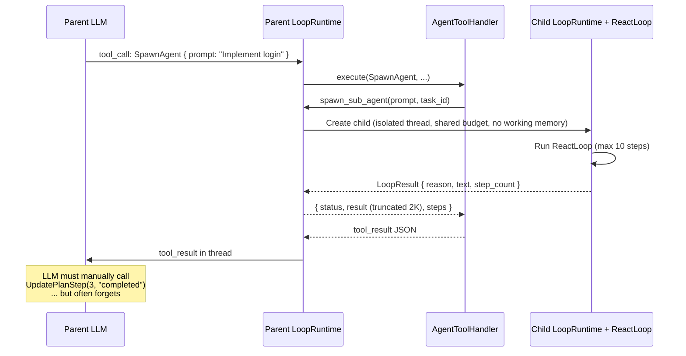
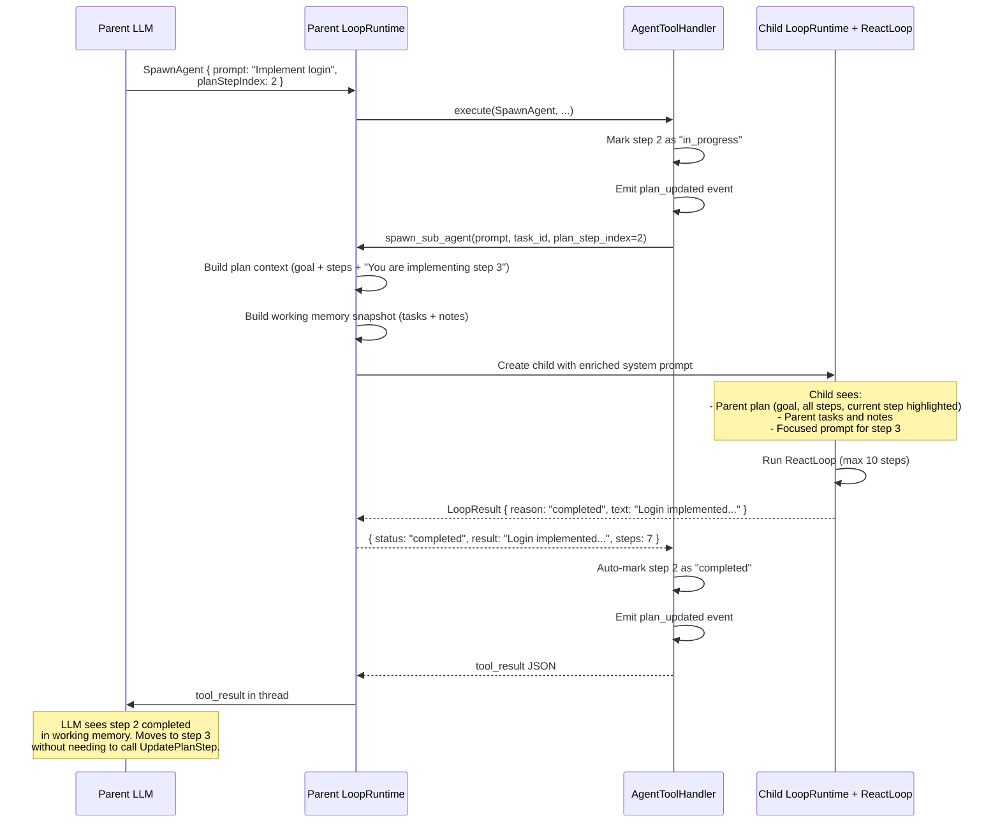
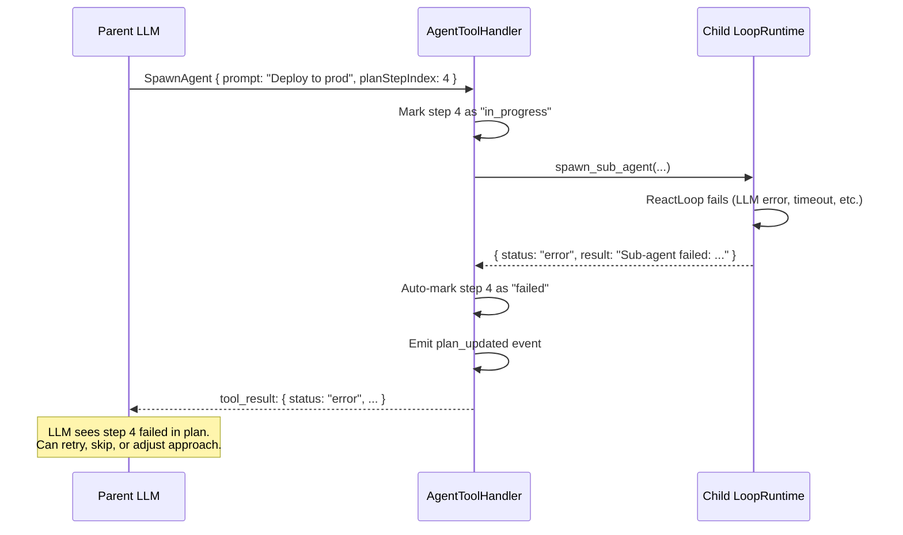

# Plan & Sub-Agent Improvements — Design Doc

**Status:** Proposed
**Scope:** cowork-agent-sdk, cowork-agent-runtime
**Date:** 2026-03-28
**Roadmap:** Phase A, items A6-A10

---

## Problem

Sub-agents are completely isolated from the parent's plan. When the agent follows a multi-step plan and spawns sub-agents to execute steps, seven gaps cause unreliable execution:

1. **LLM doesn't use SpawnAgent during plans:** The `EnterPlanMode` tool description says "only read-only tools are available" — the LLM interprets this as SpawnAgent being blocked. In reality, SpawnAgent is an agent-internal tool and remains available during plan mode. The description is misleading.
2. **No system prompt guidance for delegation:** The plan execution guidance never suggests using SpawnAgent to delegate steps. The LLM defaults to doing everything itself.
3. **No plan visibility:** Sub-agent doesn't know which step it's working on or what the overall goal is
4. **No automatic plan updates:** Parent must manually call `UpdatePlanStep` after sub-agent returns — LLM often forgets, leaving steps stuck in "in_progress"
5. **No failure state:** PlanStep has no "failed" status — a crashed sub-agent leaves the step permanently stuck
6. **Truncated results:** Sub-agent output capped at 2000 characters — complex work is silently lost
7. **No context inheritance:** Sub-agent starts with empty working memory — no visibility into parent's task tracker, notes, or broader plan

These gaps mean that plan execution with sub-agents is fragile — the LLM rarely delegates to sub-agents during plans, and when it does, plan state management depends entirely on the LLM remembering to update it manually.

---

## Current Architecture

### How Sub-agents Work Today



### What the Child Receives

| Component | Shared? | Value |
|---|---|---|
| MessageThread | **No** — fresh, empty | Only contains: system prompt + user prompt (the `prompt` parameter) |
| TokenBudget | **Yes** — shared | Draws from parent's remaining budget |
| WorkingMemory | **No** — None | No task tracker, no plan, no notes |
| PolicyEnforcer | **Yes** — shared | Same capabilities as parent |
| ErrorRecovery | **No** — fresh | Independent failure tracking |
| Tools | **Yes** — same ToolRouter | Same external tools, but no agent-internal tools (no UpdatePlanStep, no SaveMemory) |
| EventEmitter | **Yes** — shared | Events flow to same stream |
| Max steps | Fixed 10 | Not configurable per spawn |

### What the Child Does NOT Receive

- Parent's plan (goal, steps, current progress)
- Parent's working memory (task tracker, notes)
- Parent's conversation context
- Which plan step it's implementing
- What other steps exist (before/after)
- Agent-internal tools (UpdatePlanStep, SaveMemory, etc.)

---

## Changes

### Fix: EnterPlanMode Tool Description

**File:** `cowork-agent-runtime/src/agent_host/loop/agent_tools.py`

The `EnterPlanMode` tool description currently says "only read-only tools are available." This is misleading — only external tools are restricted. Agent-internal tools (SpawnAgent, CreatePlan, UpdatePlanStep, memory tools) remain available.

**Current description (inaccurate):**
```
Enter plan mode for exploration. Only read-only tools are available.
```

**Updated description:**
```
Enter plan mode for exploration. Only read-only external tools are available
(ReadFile, ListDirectory, FindFiles, GrepFiles, ViewImage, FetchUrl, WebSearch).
Agent-internal tools remain available: SpawnAgent, CreatePlan, UpdatePlanStep,
SaveMemory, RecallMemory, ListMemories.
```

### Fix: System Prompt Guidance for Delegation

**File:** `cowork-agent-sdk/src/agent_sdk/loop/system_prompt.py`

Add guidance for using SpawnAgent during plan execution. This goes after the existing plan step guidance:

**Add after the existing plan step guidance:**
```
- For complex plan steps, you may delegate to a sub-agent using SpawnAgent
  with the planStepIndex parameter. The sub-agent will receive the plan context
  and the step will be automatically updated on completion. Use sub-agents for
  steps that are self-contained and don't depend on your current conversation state.
```

This guidance only becomes fully effective after A7 (auto-update) is implemented — but fixing the description (above) and adding the guidance together ensures the LLM knows delegation is available.

---

### A8: Add "failed" Status to PlanStep

**File:** `cowork-agent-sdk/src/agent_sdk/memory/plan.py`

Add `"failed"` to the PlanStep status literal:

```python
@dataclass
class PlanStep:
    description: str
    status: Literal["pending", "in_progress", "completed", "skipped", "failed"] = "pending"
    acceptance_criteria: list[str] | None = None  # Future: Phase B1
```

**Plan rendering update:**
- Failed steps render with a distinct marker: `[failed]`
- Plan continuation logic: failed steps are treated as "resolved" (don't block task completion, same as completed/skipped)

**UpdatePlanStep tool update:**
- Accept `"failed"` as a valid status value
- Log `plan_step_failed` event with step index and description

**ReactLoop update** (`react_loop.py`, plan continuation check):
```python
# Current: checks pending + in_progress
incomplete = any(s.status in ("pending", "in_progress") for s in plan.steps)

# Updated: same — failed steps don't block completion
# "failed" is resolved, like "completed" and "skipped"
```

No change needed in ReactLoop — the existing check already only blocks on `pending` and `in_progress`.

### A6: Pass Plan Context to Sub-agents

**File:** `cowork-agent-runtime/src/agent_host/loop/loop_runtime.py` — `spawn_sub_agent()`

When the parent has an active plan, include a plan summary in the sub-agent's system prompt context.

**New helper** in `agent_host/loop/plan_context.py`:

```python
def build_sub_agent_plan_context(
    plan: Plan,
    current_step_index: int | None = None,
) -> str:
    """Build a plan context summary for sub-agent injection."""
    lines = [f"## Parent Agent Plan\nGoal: {plan.goal}"]

    for i, step in enumerate(plan.steps):
        prefix = "→ " if i == current_step_index else "  "
        lines.append(f"{prefix}{i + 1}. [{step.status}] {step.description}")

    if current_step_index is not None and current_step_index < len(plan.steps):
        step = plan.steps[current_step_index]
        lines.append(f"\nYou are implementing step {current_step_index + 1}: {step.description}")
        lines.append("Focus on this step only. The parent agent handles the overall plan.")

    return "\n".join(lines)
```

**Changes to `spawn_sub_agent()`:**

```python
async def spawn_sub_agent(
    self,
    prompt: str,
    parent_task_id: str,
    plan_step_index: int | None = None,  # NEW
) -> dict[str, Any]:
    # Build context from parent's plan
    plan_context = ""
    if self.working_memory and self.working_memory.plan:
        plan_context = build_sub_agent_plan_context(
            self.working_memory.plan,
            current_step_index=plan_step_index,
        )

    # Build working memory snapshot (A10)
    wm_snapshot = ""
    if self.working_memory:
        wm_snapshot = self._build_working_memory_snapshot()

    # Combine context
    context_parts = [p for p in [plan_context, wm_snapshot] if p]
    full_context = "\n\n".join(context_parts) if context_parts else None

    # Create child with context injected into system prompt
    child_system_prompt = self._build_sub_agent_system_prompt(prompt, full_context)
    # ... rest of spawn logic
```

**SpawnAgent tool parameter update:**

```python
# In agent_tools.py, SpawnAgent tool definition
{
    "name": "SpawnAgent",
    "description": "Spawn a sub-agent to handle a focused task...",
    "parameters": {
        "prompt": {"type": "string", "description": "Task for the sub-agent"},
        "maxSteps": {"type": "integer", "description": "Max steps (default: 10)"},
        "planStepIndex": {"type": "integer", "description": "Plan step this sub-agent implements (0-based). Enables plan context injection and auto-update on completion."}
    }
}
```

### A7: Auto-Update Plan Step on Sub-agent Return

**File:** `cowork-agent-runtime/src/agent_host/loop/agent_tools.py` — `_handle_spawn_agent()`

When `planStepIndex` is provided and the sub-agent returns, automatically update the plan step status.

```python
async def _handle_spawn_agent(self, arguments: dict) -> dict:
    prompt = arguments.get("prompt", "")
    max_steps = arguments.get("maxSteps", 10)
    plan_step_index = arguments.get("planStepIndex")  # NEW

    # Mark step as in_progress if not already
    if plan_step_index is not None and self._working_memory and self._working_memory.plan:
        plan = self._working_memory.plan
        if 0 <= plan_step_index < len(plan.steps):
            if plan.steps[plan_step_index].status == "pending":
                plan.steps[plan_step_index].status = "in_progress"
                self._notify_plan_updated()

    # Spawn the sub-agent
    result = await self._spawn_sub_agent(prompt, task_id, plan_step_index=plan_step_index)

    # Auto-update plan step based on result
    if plan_step_index is not None and self._working_memory and self._working_memory.plan:
        plan = self._working_memory.plan
        if 0 <= plan_step_index < len(plan.steps):
            if result.get("status") == "completed":
                plan.steps[plan_step_index].status = "completed"
                logger.info("plan_step_auto_completed", step_index=plan_step_index)
            elif result.get("status") in ("error", "max_steps_exceeded"):
                plan.steps[plan_step_index].status = "failed"
                logger.info("plan_step_auto_failed", step_index=plan_step_index)
            self._notify_plan_updated()

    return result
```

**Key behaviors:**
- `planStepIndex` is optional — existing SpawnAgent calls without it work unchanged
- Step auto-transitions to `in_progress` at spawn time (if still `pending`)
- Step auto-transitions to `completed` on success or `failed` on error
- `plan_updated` event emitted after each transition (UI sees real-time progress)
- LLM can still manually call `UpdatePlanStep` to override (e.g., mark as `skipped`)

### A9: Improve Sub-agent Result Handling

**File:** `cowork-agent-runtime/src/agent_host/loop/loop_runtime.py` — `spawn_sub_agent()`

**Changes:**

1. Increase default result limit from 2000 to 8000 characters
2. For results exceeding the limit, write full result to workspace file

```python
_RESULT_MAX_CHARS = 8000  # Increased from 2000

async def spawn_sub_agent(self, prompt, parent_task_id, plan_step_index=None):
    # ... run child loop ...

    result_text = result.text or ""

    # If result exceeds limit, write to workspace file
    full_result_path = None
    if len(result_text) > _RESULT_MAX_CHARS and self._workspace_dir:
        result_filename = f".cowork/sub-agent-results/{result.task_id or 'unknown'}.md"
        result_path = os.path.join(self._workspace_dir, result_filename)
        os.makedirs(os.path.dirname(result_path), exist_ok=True)
        with open(result_path, "w") as f:
            f.write(result_text)
        full_result_path = result_path
        result_text = result_text[:_RESULT_MAX_CHARS] + f"\n\n[Full result saved to {result_filename}]"

    return {
        "status": "completed" if result.reason == "completed" else result.reason,
        "result": result_text,
        "steps": result.step_count,
        "fullResultPath": full_result_path,
    }
```

### A10: Pass Read-Only Working Memory to Sub-agents

**File:** `cowork-agent-runtime/src/agent_host/loop/loop_runtime.py`

Create a read-only snapshot of the parent's working memory and include it in the sub-agent's context.

```python
def _build_working_memory_snapshot(self) -> str:
    """Build a read-only summary of working memory for sub-agent context."""
    if not self.working_memory:
        return ""

    parts = []

    # Task tracker summary
    tasks = self.working_memory.task_tracker.render()
    if tasks:
        parts.append("## Parent Tasks\n" + tasks)

    # Notes
    if self.working_memory.notes:
        parts.append("## Parent Notes\n" + "\n".join(f"- {n}" for n in self.working_memory.notes))

    return "\n\n".join(parts) if parts else ""
```

This is injected into the sub-agent's system prompt alongside the plan context (A6). The sub-agent sees it as context, not editable working memory — it cannot modify the parent's state.

**Note:** The plan is NOT included here — it's handled separately by A6's `build_sub_agent_plan_context()` to keep the rendering distinct and focused.

---

## Wiring: How It All Fits Together

### Sub-agent Spawn with Plan (after all changes)



### Sub-agent Failure with Plan



---

## Files Changed

| File | Changes |
|---|---|
| `cowork-agent-sdk/src/agent_sdk/loop/system_prompt.py` | Add guidance for delegating plan steps to sub-agents via SpawnAgent with `planStepIndex`. |
| `cowork-agent-sdk/src/agent_sdk/memory/plan.py` | Add `"failed"` to PlanStep status. Add optional `acceptance_criteria` field (placeholder for Phase B1). |
| `cowork-agent-sdk/src/agent_sdk/loop/react_loop.py` | No changes needed — existing continuation logic already only blocks on `pending`/`in_progress`. |
| `cowork-agent-runtime/src/agent_host/loop/agent_tools.py` | Fix EnterPlanMode description. Add `planStepIndex` parameter to SpawnAgent. Auto-update plan step on sub-agent return. |
| `cowork-agent-runtime/src/agent_host/loop/loop_runtime.py` | Accept `plan_step_index` in `spawn_sub_agent()`. Build plan context + working memory snapshot. Increase result limit. Write large results to workspace file. |
| **New:** `cowork-agent-runtime/src/agent_host/loop/plan_context.py` | `build_sub_agent_plan_context()` helper. |

---

## Tests

### Unit Tests

- EnterPlanMode description includes SpawnAgent as available
- System prompt includes delegation guidance when plan guidance is rendered
- `PlanStep` accepts `"failed"` status, renders correctly
- `UpdatePlanStep` with `"failed"` status works
- `build_sub_agent_plan_context()` generates correct markdown for various plan states
- `_build_working_memory_snapshot()` generates correct summary
- `_handle_spawn_agent()` with `planStepIndex`:
  - Marks step `in_progress` on spawn
  - Marks step `completed` on success
  - Marks step `failed` on error
  - Emits `plan_updated` events at each transition
  - Does nothing when `planStepIndex` is None (backward compat)
- Sub-agent result >8000 chars writes to workspace file
- Sub-agent result ≤8000 chars returned inline

### Integration Tests

- Full plan execution with sub-agents: create plan → spawn sub-agents with `planStepIndex` → verify plan auto-updates → task completes
- Sub-agent failure during plan: spawn fails → step marked failed → parent continues with remaining steps
- Sub-agent with large result: verify full result accessible via workspace file

---

## Backward Compatibility

- `SpawnAgent` without `planStepIndex` works exactly as today — no auto-updates, no plan context
- `UpdatePlanStep` still accepts manual calls — LLM can override auto-updates
- `PlanStep` status `"failed"` is additive — existing plans with `pending`/`in_progress`/`completed`/`skipped` are unaffected
- Sub-agent result limit increase (2K→8K) only affects the return value, not the thread history format
