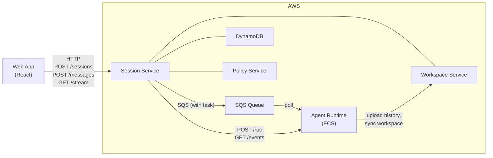
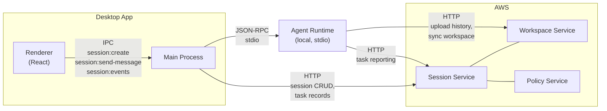
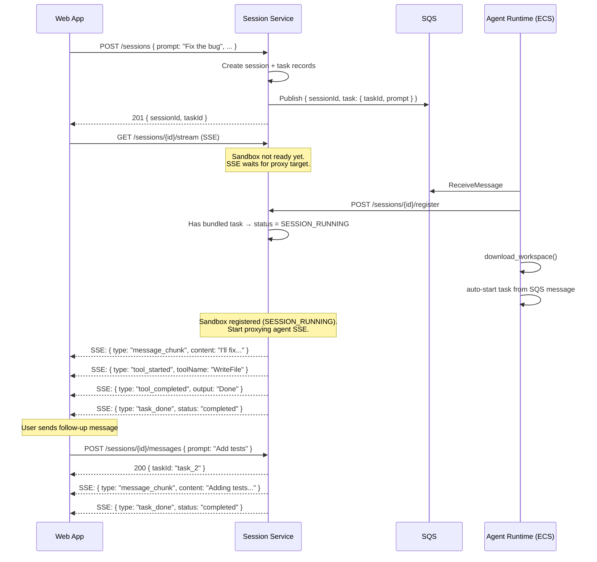
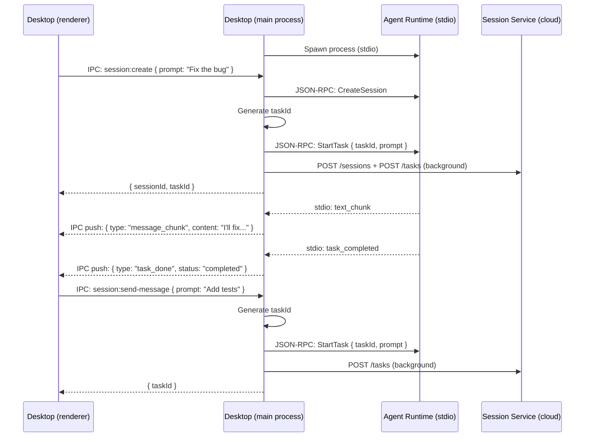
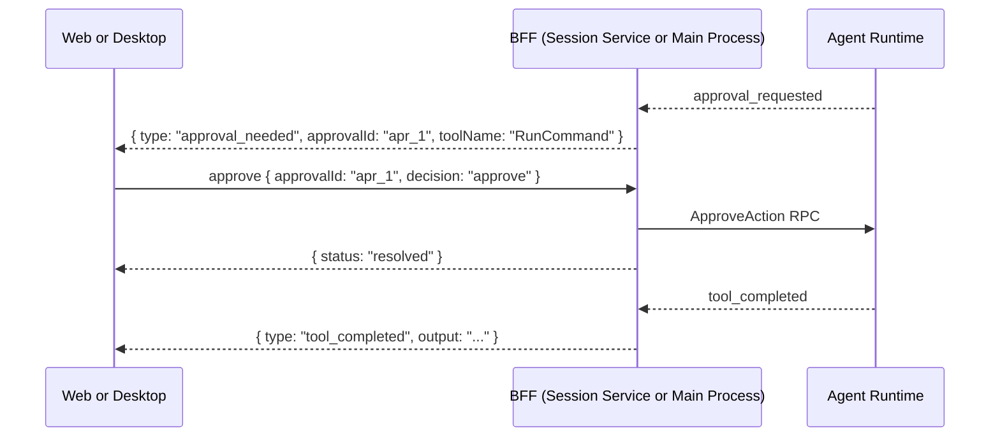

# Simplified Session API — Design Doc

**Status:** Proposed
**Scope:** Session Service, Agent Runtime, Platform Contracts, Web App, Desktop App
**Date:** 2026-03-21

---

## Problem

The current API exposes backend internals to frontend clients:

1. Sending a message requires 2 calls: `POST /tasks` (create record) + `POST /rpc` (JSON-RPC `StartTask`)
2. Frontend constructs JSON-RPC envelopes, generates task IDs, parses protocol responses
3. Frontend polls `GET /sessions/{id}` after session creation to detect sandbox readiness
4. SSE exposes 18+ internal event types — frontend uses ~6

## Goals

1. One API call per user action
2. No JSON-RPC or task ID management in frontend
3. No polling for sandbox readiness
4. Simplified event stream
5. Same logical contract for Web and Desktop
6. Backward compatible — existing endpoints stay for internal use

---

## Key Design Decision: Bundled First Task

The user's intent when creating a session is always "I want to start working on something." Rather than creating a session and then separately sending a message, **the first prompt is bundled with session creation.**

`POST /sessions` gains an optional `prompt` field. When present, Session Service creates the session, creates the task record, and includes the task in the SQS message. The sandbox picks up the message, registers, downloads workspace, and **immediately starts the task** — no second call, no polling, no SSE notification coordination.

This eliminates the need for:
- Frontend polling for `SANDBOX_READY`
- In-memory SSE waiter maps in Session Service (which don't scale across instances)
- A separate `POST /messages` call for the first message

For **subsequent messages** within the same session, `POST /sessions/{id}/messages` handles orchestration (task record + RPC dispatch) in one call.

---

## Architecture

The simplified API is a **shared contract** implemented in two places:

- **Web**: Session Service hosts HTTP endpoints
- **Desktop**: Electron main process hosts IPC handlers

This split exists because the cloud cannot reach the user's desktop machine — Session Service can proxy to ECS sandboxes but not to a local agent-runtime behind NAT/firewall.

### Component Diagram

#### Web



#### Desktop



Note: On desktop, both the main process and the agent-runtime communicate with cloud services. The main process handles session lifecycle; the agent-runtime handles task reporting, history upload, and workspace sync.

### Shared Contract

| Operation | Web (HTTP) | Desktop (IPC) | Request | Response |
|---|---|---|---|---|
| Create + first message | `POST /sessions` | `session:create` | `{ ..., prompt, taskOptions? }` | `{ sessionId, taskId? }` |
| Subsequent messages | `POST /sessions/{id}/messages` | `session:send-message` | `{ prompt, options? }` | `{ taskId }` |
| Cancel | `POST /sessions/{id}/cancel` | `session:cancel` | — | `{ cancelled, taskId? }` |
| Approve | `POST /sessions/{id}/approve` | `session:approve` | `{ approvalId, decision }` | `{ status }` |
| Event stream | `GET /sessions/{id}/stream` | `session:events` (IPC push) | — | Simplified events |

---

## Endpoint Changes

### POST /sessions (modified — optional prompt)

Creates a session. If `prompt` is provided, also creates a task record and includes it in the SQS dispatch. The sandbox auto-starts the task on pickup.

**Request (with prompt — typical):**
```json
{
    "tenantId": "t1",
    "userId": "u1",
    "executionEnvironment": "cloud_sandbox",
    "workspaceHint": null,
    "clientInfo": {
        "desktopAppVersion": "1.0.0",
        "localAgentHostVersion": "1.0.0"
    },
    "supportedCapabilities": ["File.Read", "File.Write", "Shell.Exec"],
    "networkAccess": "enabled",
    "prompt": "Fix the authentication bug in login.py",
    "taskOptions": {
        "maxSteps": 50,
        "planOnly": false
    }
}
```

| Field | Type | Required | Description |
|---|---|---|---|
| `tenantId` | string | Yes | Tenant identifier |
| `userId` | string | Yes | User identifier |
| `executionEnvironment` | `"desktop"` or `"cloud_sandbox"` | Yes | Where the agent runs |
| `workspaceHint` | object or null | No | `{ workspaceId }` to reuse, `{ localPaths }` for desktop, `null` for new |
| `clientInfo` | object | No | Client version info for compatibility check |
| `supportedCapabilities` | string[] | No | Requested capabilities (e.g., `File.Read`, `Shell.Exec`) |
| `networkAccess` | `"enabled"` or `"disabled"` | No | Sandbox network access (cloud_sandbox only) |
| `prompt` | string | **No (new, optional)** | First task prompt. If provided, task is created and bundled with SQS dispatch |
| `taskOptions` | object | No | `{ maxSteps, planOnly }`. Only used when `prompt` is provided |

**Request (without prompt — session only):**
```json
{
    "tenantId": "t1",
    "userId": "u1",
    "executionEnvironment": "cloud_sandbox",
    "supportedCapabilities": ["File.Read", "File.Write", "Shell.Exec"]
}
```

**Response (201):**
```json
{
    "sessionId": "sess_123",
    "workspaceId": "ws_456",
    "compatibilityStatus": "compatible",
    "status": "SANDBOX_PROVISIONING",
    "taskId": "task_789",
    "featureFlags": {
        "approvalUiEnabled": false,
        "mcpEnabled": false
    }
}
```

| Field | Type | Description |
|---|---|---|
| `sessionId` | string | Created session ID |
| `workspaceId` | string | Resolved or created workspace ID |
| `compatibilityStatus` | string | `"compatible"` or `"incompatible"` |
| `status` | string | `"SANDBOX_PROVISIONING"` (cloud_sandbox only) |
| `taskId` | string or null | Present only when `prompt` was provided |
| `policyBundle` | object | Present for desktop sessions (fetched at creation) |
| `featureFlags` | object | Feature toggles |

**Internal flow (with prompt):**
1. Create session record in DynamoDB (`SANDBOX_PROVISIONING`)
2. Generate `taskId`, create task record in DynamoDB
3. Publish to SQS — message includes session config AND task info
4. Return `{ sessionId, taskId, status }`

**Internal flow (without prompt):**
Unchanged from today — creates session, publishes to SQS, returns.

### Registration status with bundled task

At registration time, Session Service knows whether the session has a bundled task (it created the task record in `POST /sessions`). The registration handler transitions to the appropriate status:

```python
if session_has_bundled_task:
    new_status = "SESSION_RUNNING"   # Task will auto-start immediately
else:
    new_status = "SANDBOX_READY"     # Waiting for POST /messages
```

This avoids the agent-runtime needing to call back to update status. The status is accurate — by the time registration + workspace download completes, the task is starting. If the auto-start fails, the agent-runtime reports the failure through the normal event stream (`task_failed`).

### SQS Message Schema (extended)

```json
{
    "sessionId": "sess_123",
    "registrationToken": "tok_abc",
    "sessionServiceUrl": "https://...",
    "workspaceServiceUrl": "https://...",
    "publishedAt": "2026-03-21T10:00:00Z",
    "task": {
        "taskId": "task_789",
        "prompt": "Fix the authentication bug in login.py",
        "maxSteps": 50
    }
}
```

`task` is `null` when no prompt was provided. The sandbox checks for it on startup.

### Sandbox Startup (modified)

After registration and workspace download, the sandbox checks for a bundled task:

```python
# In sandbox startup (after registration + workspace sync)
if sqs_config.task:
    # Auto-start the task — no RPC needed
    await session_manager.start_task({
        "taskId": sqs_config.task.task_id,
        "prompt": sqs_config.task.prompt,
        "taskOptions": {"maxSteps": sqs_config.task.max_steps},
    })
```

Events flow immediately through the agent-runtime's HTTP transport. The frontend connects to `/stream` and receives events as they happen.

---

## New Endpoints

### POST /sessions/{id}/messages

Send a subsequent message (after the first task completes). One call replaces `POST /tasks` + `POST /rpc StartTask`.

**Request:**
```json
{
    "prompt": "Now add unit tests for the fix",
    "taskOptions": {
        "maxSteps": 50,
        "planOnly": false
    }
}
```

| Field | Type | Required | Description |
|---|---|---|---|
| `prompt` | string | Yes | User message / task prompt |
| `taskOptions` | object | No | `{ maxSteps, planOnly }` |
| `taskOptions.maxSteps` | integer | No | Max agent loop steps (1-200, default 50) |
| `taskOptions.planOnly` | boolean | No | If true, agent creates a plan without executing |

**Response (200):**
```json
{
    "taskId": "task_abc",
    "status": "running"
}
```

| Field | Type | Description |
|---|---|---|
| `taskId` | string | Generated task ID |
| `status` | string | `"running"` |

**Errors:**
- `404` — session not found
- `403` — not session owner
- `409` — session not active, or a task is already running
- `502` — agent runtime unreachable

**Internal flow:**
1. Validate session is active and caller owns it
2. Proxy `GetSessionState` RPC to agent runtime — check if a task is running
3. If task running → return 409 immediately (no DynamoDB write)
4. Generate `taskId`, create task record in DynamoDB
5. Proxy `StartTask` JSON-RPC to agent runtime with `{ taskId, prompt, taskOptions }`
6. Return `{ taskId, status: "running" }`

The state check (step 2) queries the agent-runtime directly — it's the source of truth for whether a task is running. This avoids writing a task record and then rolling it back if the agent rejects the start. The round-trip to the sandbox (~5-10ms on the same VPC) is cheaper than a DynamoDB write + rollback.

### POST /sessions/{id}/cancel

Cancel the running task, or cancel the session if no task is running.

**Request:** No body required.

**Response (200) — task cancelled:**
```json
{
    "cancelled": "task",
    "taskId": "task_abc"
}
```

**Response (200) — session cancelled:**
```json
{
    "cancelled": "session",
    "sessionId": "sess_123"
}
```

| Field | Type | Description |
|---|---|---|
| `cancelled` | `"task"` or `"session"` | What was cancelled |
| `taskId` | string | Present when a task was cancelled |
| `sessionId` | string | Present when the session was cancelled |

**Errors:**
- `404` — session not found
- `403` — not session owner
- `409` — session already in terminal state
- `502` — agent runtime unreachable

**Internal flow:**
1. Validate session exists and caller owns it
2. Proxy `GetSessionState` RPC to agent runtime — check if a task is running
3. If task running → proxy `CancelTask` RPC → return `{ cancelled: "task", taskId }`
4. If no task running → cancel session in DynamoDB → return `{ cancelled: "session", sessionId }`

### POST /sessions/{id}/approve

Resolve a pending approval decision.

**Request:**
```json
{
    "approvalId": "apr_123",
    "decision": "approve"
}
```

| Field | Type | Required | Description |
|---|---|---|---|
| `approvalId` | string | Yes | ID of the pending approval (from `approval_needed` event) |
| `decision` | `"approve"` or `"denied"` | Yes | User's decision |

**Response (200):**
```json
{
    "approvalId": "apr_123",
    "decision": "approve",
    "status": "delivered"
}
```

| Field | Type | Description |
|---|---|---|
| `approvalId` | string | The approval that was resolved |
| `decision` | string | The decision that was applied |
| `status` | string | `"delivered"` if a pending approval was found, `"not_found"` if no pending approval with this ID |

**Errors:**
- `404` — session not found
- `403` — not session owner
- `502` — agent runtime unreachable

**Internal flow:**
1. Validate session is active and caller owns it
2. Proxy `ApproveAction` JSON-RPC to agent runtime with `{ approvalId, decision }`
3. Return `{ approvalId, decision, status }` — agent-runtime returns `"delivered"` or `"not_found"`

### GET /sessions/{id}/stream

Simplified SSE event stream. Maps internal agent events to frontend-friendly types.

**Query params:**
- `since={eventId}` — replay events after this ID (for reconnect)

**Headers:**
- `X-User-Id` — session ownership validation (replaced by OIDC token after Step 14)

**SSE format:**
```
id: 42
event: session_event
data: {"type":"message_chunk","content":"Here's how to fix...","taskId":"task_abc"}

id: 43
event: session_event
data: {"type":"tool_started","toolName":"WriteFile","toolCallId":"tc_1","taskId":"task_abc","arguments":{"path":"src/login.py"}}

id: 44
event: session_event
data: {"type":"tool_completed","toolCallId":"tc_1","output":"File written","status":"success","taskId":"task_abc"}

id: 45
event: session_event
data: {"type":"approval_needed","approvalId":"apr_1","toolName":"RunCommand","description":"rm -rf /tmp/cache","riskLevel":"high","taskId":"task_abc"}

id: 46
event: session_event
data: {"type":"task_done","taskId":"task_abc","status":"completed"}
```

**Errors:**
- `404` — session not found
- `403` — not session owner
- `502` — agent runtime unreachable (SSE closes, client reconnects with `since=`)

---

## Simplified Events

`/stream` maps 18+ internal events to 7 simplified types:

| Internal event | Simplified type | Payload fields |
|---|---|---|
| `text_chunk` | `message_chunk` | `content` (string), `taskId` (string) |
| `tool_requested` | `tool_started` | `toolName` (string), `toolCallId` (string), `arguments` (object), `taskId` (string) |
| `tool_completed` | `tool_completed` | `toolCallId` (string), `output` (string), `status` (string), `taskId` (string) |
| `approval_requested` | `approval_needed` | `approvalId` (string), `toolName` (string), `description` (string), `riskLevel` (string), `taskId` (string) |
| `approval_resolved` | `approval_resolved` | `approvalId` (string), `decision` (string), `taskId` (string) |
| `task_completed` | `task_done` | `taskId` (string), `status`: `"completed"` |
| `task_failed` | `task_done` | `taskId` (string), `status`: `"failed"`, `error` (string) |
| `step_limit_approaching` | `warning` | `message` (string), `currentStep` (int), `maxSteps` (int) |

**Dropped** (internal implementation detail, not useful to UI):
`session_created`, `session_started`, `step_started`, `step_completed`, `llm_request_started`, `llm_request_completed`, `checkpoint_saved`, `verification_started`, `verification_completed`, `context_compacted`, `llm_retry`.

Raw `GET /sessions/{id}/events` remains available for debugging and advanced integrations.

### Shared event mapping contract

The event mapping is implemented in two places — Session Service (Python, for web `/stream`) and Desktop main process (TypeScript, for IPC events). To prevent drift, the mapping table lives in `cowork-platform` as the source of truth:

```
cowork-platform/contracts/enums/simplified-event-mapping.json
```

Both implementations reference this file. CI validates that the mapping is consistent. If a new internal event type is added, the mapping file determines whether it's exposed to frontends or dropped.

---

## How Each BFF Works Internally

| Step | Web BFF (Session Service) | Desktop BFF (Main Process) |
|---|---|---|
| **Create + first message** | Session + task record in DynamoDB → SQS with task → return | Session via agent-runtime stdio → task record via Session Service HTTP → return |
| **Subsequent messages** | Generate taskId → DynamoDB task record → proxy `StartTask` RPC | Generate taskId → `StartTask` JSON-RPC via stdio → task record via HTTP |
| **Cancel** | Proxy `CancelTask` RPC to sandbox | `CancelTask` JSON-RPC via stdio |
| **Approve** | Proxy `ApproveAction` RPC to sandbox | `ApproveAction` JSON-RPC via stdio |
| **Events** | Proxy agent SSE → map events → push to client SSE | Receive stdio notifications → map events → push to renderer via IPC |

---

## Web Session Lifecycle



## Desktop Session Lifecycle



## Approval Flow



---

## What Changes in Agent Runtime

The SQS consumer and sandbox startup gain awareness of the bundled task:

**SQS message parsing** — `SqsSessionConfig` gets an optional `task` field:
```python
@dataclass(frozen=True)
class SqsTaskConfig:
    task_id: str
    prompt: str
    max_steps: int = 50

@dataclass(frozen=True)
class SqsSessionConfig:
    session_id: str
    registration_token: str
    session_service_url: str
    workspace_service_url: str
    receipt_handle: str
    task: SqsTaskConfig | None = None  # Bundled first task
```

**Sandbox startup** — after registration and workspace sync, auto-start the task:
```python
# In main.py run_http(), after init_from_registration():
if sqs_config.task:
    logger.info("auto_starting_task", task_id=sqs_config.task.task_id)
    await session_manager.start_task({
        "taskId": sqs_config.task.task_id,
        "prompt": sqs_config.task.prompt,
        "taskOptions": {"maxSteps": sqs_config.task.max_steps},
    })
```

---

## SSE `/stream` During Provisioning

When the frontend connects to `/stream` while the sandbox is still provisioning, the SSE connection opens but no events flow yet. The `/stream` endpoint:

1. Checks session status
2. If `SANDBOX_PROVISIONING` or `SANDBOX_READY` with no sandbox endpoint yet — holds the connection open
3. Periodically retries resolving the sandbox endpoint (every 2s, from DynamoDB cache)
4. Once sandbox is registered — starts proxying agent SSE events
5. Events from the auto-started task arrive immediately (the sandbox started working as soon as it registered)

This is a lightweight retry on the proxy resolution, not a notification system. The retry loop is bounded by the session's provisioning timeout (180s). If the sandbox never registers, the SSE connection returns an error event and closes.

The frontend sees: open SSE connection → brief wait → events start flowing. No separate status polling or notification coordination needed.

---

## Desktop App Impact

These changes are web-focused. Desktop is unaffected in Phases 1-2:

| Change | Desktop impact |
|---|---|
| `POST /sessions` with prompt | None — desktop uses agent-runtime stdio |
| `POST /sessions/{id}/messages` | None — Stage 3 IPC equivalent |
| `/cancel`, `/approve` | None — Stage 3 IPC equivalent |
| `/stream` event mapping | **Shared contract needed** — mapping logic in `cowork-platform` prevents drift between Python (Session Service) and TypeScript (desktop main process) |
| Registration status for bundled tasks | None — desktop doesn't use SQS |
| SQS task bundling | None — desktop doesn't use SQS |

Desktop gains value in **Stage 3** when IPC handlers are refactored to the simplified contract. Until then, desktop continues working exactly as today.

---

## Migration Path

### Stage 1: Session Service + Agent Runtime

- Add optional `prompt`/`taskOptions` to `POST /sessions` — creates task record, includes in SQS
- Add `/messages`, `/cancel`, `/approve` endpoints (orchestrate task + RPC)
- Add `/stream` endpoint (event mapping + proxy retry during provisioning)
- Agent runtime: parse `task` from SQS message, auto-start after registration
- Platform: update schemas

### Stage 2: Web App

- Use `POST /sessions` with prompt for first message
- Use `POST /messages` for follow-ups
- Use `GET /stream` for events
- Remove JSON-RPC, task ID generation, polling

### Stage 3: Desktop App

- Refactor IPC handlers to match shared contract
- Event mapping in main process (stdio notifications → simplified types)
- Extract shared `SessionClient` TypeScript interface

### Stage 4: Cleanup

- Mark `/rpc` and `/events` as internal
- Remove `X-User-Id` header (OIDC auth)

---

## Repos Affected

| Repo | Changes | Phase |
|---|---|---|
| `cowork-session-service` | `POST /sessions` with prompt, `/messages`, `/cancel`, `/approve`, `/stream`, event mapper | 1 |
| `cowork-agent-runtime` | SQS consumer parses `task` field, auto-start task after registration | 1 |
| `cowork-platform` | Simplified event types, updated session creation schema, `/messages` schema | 1 |
| `cowork-web-app` | New API client, remove JSON-RPC/polling, use `/stream` | 2 |
| `cowork-desktop-app` | Refactor IPC handlers, event mapping, shared SessionClient | 3 |

---

## Open Questions

| # | Question |
|---|---|
| 1 | Should `/stream` replay conversation history on connect (so frontend renders without separate fetch)? |
| 2 | Should `/cancel` be two separate endpoints for task vs session, or auto-detect? |
| 3 | Should `/stream` support `?detail=full` to return raw unfiltered events? |
| 4 | For resumed sessions: should `POST /sessions/{id}/resume` also accept a `prompt` to bundle the next task? |
