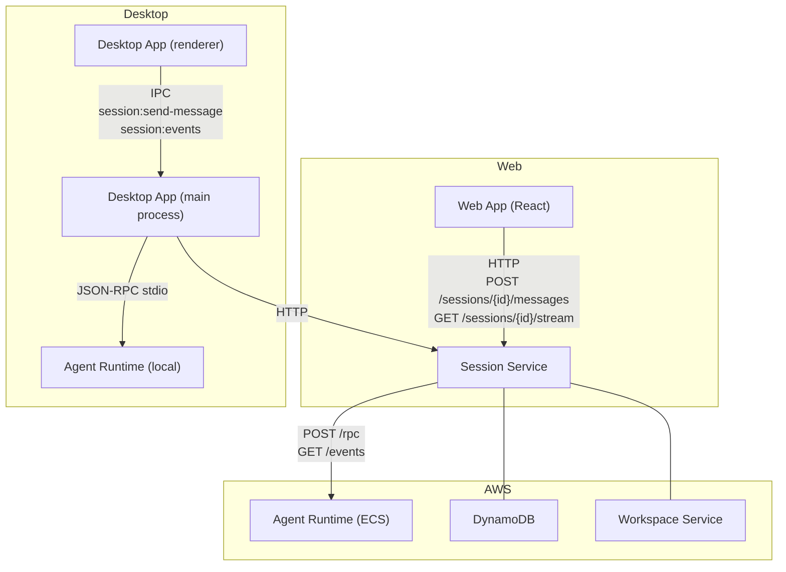
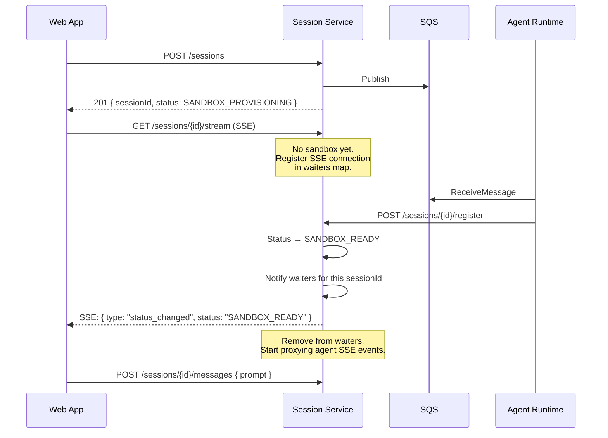
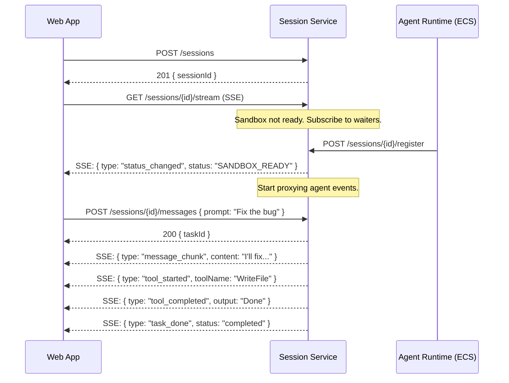
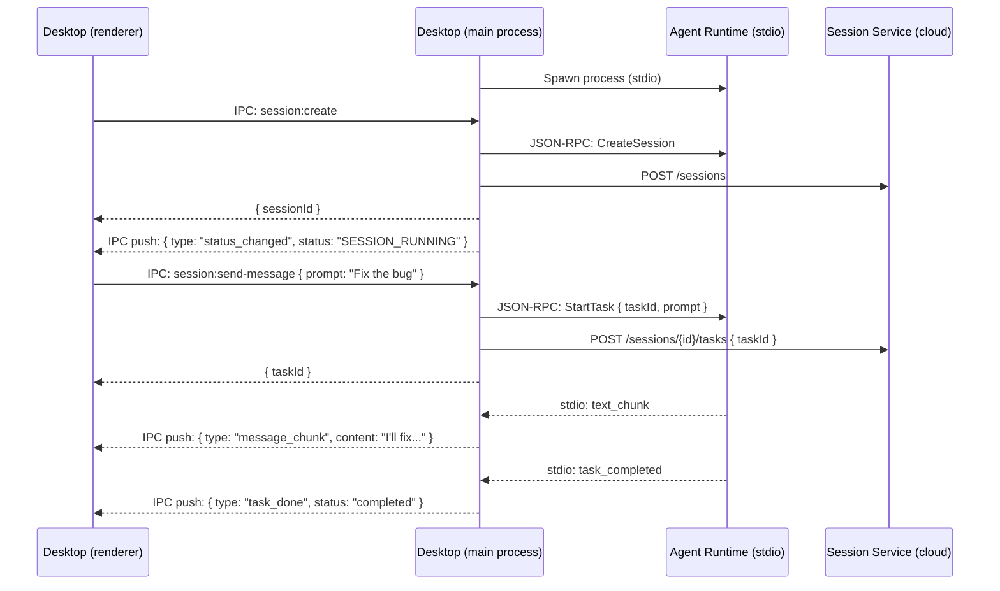
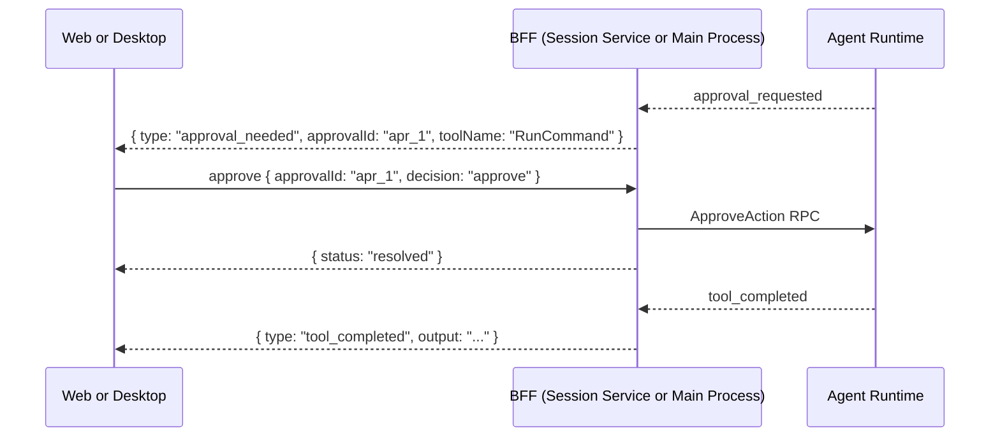

# Simplified Session API — Design Doc

**Status:** Proposed
**Scope:** Session Service, Platform Contracts, Web App, Desktop App
**Date:** 2026-03-21

---

## Problem

The current API exposes backend internals to frontend clients:

1. Sending a message requires 2 calls: `POST /tasks` (create record) + `POST /rpc` (JSON-RPC `StartTask`)
2. Frontend constructs JSON-RPC envelopes, generates task IDs, parses protocol responses
3. Frontend polls `GET /sessions/{id}` after session creation to detect sandbox readiness
4. SSE exposes 18+ internal event types — frontend uses ~6

## Goals

1. One API call per user action
2. No JSON-RPC or task ID management in frontend
3. Push-based sandbox readiness (no polling)
4. Simplified event stream
5. Same logical contract for Web and Desktop
6. Backward compatible — existing endpoints stay for internal use

---

## Architecture

The simplified API is a **shared contract** implemented in two places:

- **Web**: Session Service hosts HTTP endpoints
- **Desktop**: Electron main process hosts IPC handlers

This split exists because the cloud cannot reach the user's desktop machine — Session Service can proxy to ECS sandboxes but not to a local agent-runtime behind NAT/firewall.

### Component Diagram



### Shared Contract

Both implementations expose the same operations:

| Operation | Web (HTTP) | Desktop (IPC) | Request | Response |
|---|---|---|---|---|
| Send message | `POST /sessions/{id}/messages` | `session:send-message` | `{ prompt, options? }` | `{ taskId, status }` |
| Cancel | `POST /sessions/{id}/cancel` | `session:cancel` | — | `{ cancelled, taskId? }` |
| Approve | `POST /sessions/{id}/approve` | `session:approve` | `{ approvalId, decision }` | `{ status }` |
| Event stream | `GET /sessions/{id}/stream` | `session:events` (IPC push) | — | Simplified events |

React UI components share a `SessionClient` interface — web uses `fetch()`, desktop uses `ipcRenderer.invoke()`.

---

## New Endpoints (Session Service)

### POST /sessions/{id}/messages

Send a message and start a task. One call replaces `POST /tasks` + `POST /rpc StartTask`.

**Request:**
```json
{ "prompt": "Fix the login bug", "options": { "maxSteps": 50 } }
```

**Response (200):**
```json
{ "taskId": "task_abc", "status": "running" }
```

**Errors:** 404 (not found), 403 (not owner), 409 (not active or task running), 502 (agent unreachable)

**Internal flow:**
1. Validate session is active and caller owns it
2. Generate `taskId`, create task record in DynamoDB
3. Proxy `StartTask` JSON-RPC to agent runtime
4. Return `{ taskId, status }`

### POST /sessions/{id}/cancel

Cancel the running task, or cancel the session if no task is running.

**Response (200):**
```json
{ "cancelled": "task", "taskId": "task_abc" }
```

### POST /sessions/{id}/approve

Resolve a pending approval.

**Request:**
```json
{ "approvalId": "apr_1", "decision": "approve" }
```

**Response (200):**
```json
{ "approvalId": "apr_1", "status": "resolved" }
```

### GET /sessions/{id}/stream

Simplified SSE event stream. Maps internal events to frontend-friendly types. Pushes status changes (no polling needed).

---

## Simplified Events

The `/stream` endpoint maps 18+ internal events to 7 frontend types:

| Internal event | Simplified type | Payload |
|---|---|---|
| `text_chunk` | `message_chunk` | `{ content, taskId }` |
| `tool_requested` | `tool_started` | `{ toolName, toolCallId, taskId }` |
| `tool_completed` | `tool_completed` | `{ toolCallId, output, taskId }` |
| `approval_requested` | `approval_needed` | `{ approvalId, toolName, riskLevel }` |
| `task_completed` | `task_done` | `{ taskId, status: "completed" }` |
| `task_failed` | `task_done` | `{ taskId, status: "failed", error }` |
| (status transition) | `status_changed` | `{ status }` |

Dropped: `step_started`, `step_completed`, `llm_request_started`, `llm_request_completed`, `checkpoint_saved`, `verification_started`, `verification_completed`, `context_compacted`.

The raw `GET /sessions/{id}/events` endpoint remains available for debugging and advanced use.

---

## Push-Based Sandbox Readiness

### Problem with polling

Currently, after `POST /sessions`, the frontend polls `GET /sessions/{id}` every second to detect `SANDBOX_READY`. With `/stream`, we need status changes pushed via SSE — but the sandbox hasn't registered yet, so there's no agent-runtime to proxy events from.

### Solution: Registration-triggered notification

Session Service maintains an in-memory map of `sessionId → waiting SSE connections`. When a client connects to `/stream` before the sandbox is ready, it subscribes. When the sandbox calls `POST /sessions/{id}/register`, the registration handler pushes the status event directly:



No polling. The status event is pushed the instant the sandbox registers. The SSE connection transitions from "waiting for sandbox" to "proxying agent events" seamlessly.

### Implementation

```python
class SseNotifier:
    """In-memory pub/sub for session status changes."""

    _waiters: dict[str, list[asyncio.Queue]] = {}

    def subscribe(self, session_id: str) -> asyncio.Queue:
        queue = asyncio.Queue()
        self._waiters.setdefault(session_id, []).append(queue)
        return queue

    def unsubscribe(self, session_id: str, queue: asyncio.Queue):
        if session_id in self._waiters:
            self._waiters[session_id] = [q for q in self._waiters[session_id] if q is not queue]

    def notify(self, session_id: str, event: dict):
        for queue in self._waiters.get(session_id, []):
            queue.put_nowait(event)
```

In `register_sandbox()`:
```python
await self._repo.register_sandbox(session_id, endpoint, "SANDBOX_READY")
self._sse_notifier.notify(session_id, {"type": "status_changed", "status": "SANDBOX_READY"})
```

In `/stream` handler:
```python
if session.status == "SANDBOX_PROVISIONING":
    # Wait for sandbox to register
    queue = sse_notifier.subscribe(session_id)
    try:
        event = await asyncio.wait_for(queue.get(), timeout=180)
        yield format_sse(event)
    finally:
        sse_notifier.unsubscribe(session_id, queue)

# Now proxy agent-runtime SSE events with mapping
async for raw_event in proxy_agent_sse(sandbox_endpoint):
    mapped = map_event(raw_event)
    if mapped:
        yield format_sse(mapped)
```

Multi-instance safety: Each Session Service instance maintains its own waiter map. The registration request hits one instance (via ALB) — that instance notifies its local waiters. If the SSE connection is on a different instance, the client's SSE will detect the status change on the next proxy attempt (reconnect). For production, a shared notification mechanism (Redis pub/sub or SNS) can be added later.

---

## How Each BFF Works Internally

| Step | Web BFF (Session Service) | Desktop BFF (Main Process) |
|---|---|---|
| **Send message** | Generate taskId → DynamoDB task record → proxy `StartTask` RPC to sandbox | Generate taskId → `StartTask` JSON-RPC via stdio → HTTP task record to Session Service |
| **Cancel** | Proxy `CancelTask` RPC to sandbox | `CancelTask` JSON-RPC via stdio |
| **Approve** | Proxy `ApproveAction` RPC to sandbox | `ApproveAction` JSON-RPC via stdio |
| **Events** | Proxy agent SSE → map events → push to client SSE | Receive stdio notifications → map events → push to renderer via IPC |
| **Session CRUD** | Direct DynamoDB | HTTP to Session Service (cloud) |

---

## Web Session Lifecycle



## Desktop Session Lifecycle



## Approval Flow (same for both)



---

## Migration Path

### Phase 1: Session Service endpoints

Add `/messages`, `/cancel`, `/approve`, `/stream` to Session Service. Implement `SseNotifier` for push-based status. Event mapper for simplified types. Existing endpoints unchanged.

### Phase 2: Web App migration

Web App switches to new endpoints. Remove JSON-RPC from frontend. Remove polling. Use `/stream` for events.

### Phase 3: Desktop App migration

Refactor IPC handlers to simplified contract. Event mapping in main process. Extract shared `SessionClient` TypeScript interface.

### Phase 4: Cleanup

Mark `/rpc` and `/events` as internal. Remove `X-User-Id` header (OIDC auth).

---

## Repos Affected

| Repo | Changes | Phase |
|---|---|---|
| `cowork-session-service` | `/messages`, `/cancel`, `/approve`, `/stream`, SseNotifier, event mapper | 1 |
| `cowork-platform` | Simplified event types, request/response schemas | 1 |
| `cowork-web-app` | New API client, remove JSON-RPC, use `/stream` | 2 |
| `cowork-desktop-app` | Refactor IPC handlers, event mapping, shared SessionClient | 3 |
| `cowork-agent-runtime` | No changes | — |

---

## Open Questions

| # | Question |
|---|---|
| 1 | Should `/stream` replay conversation history on connect (so frontend renders immediately without separate fetch)? |
| 2 | Should `/cancel` be two separate endpoints (`/cancel-task` and `/cancel-session`) for clarity? |
| 3 | Should the event mapper support `?detail=full` for power users who want raw events on `/stream`? |
| 4 | For multi-instance Session Service: should `SseNotifier` use Redis pub/sub from day one, or start in-memory and migrate? |
