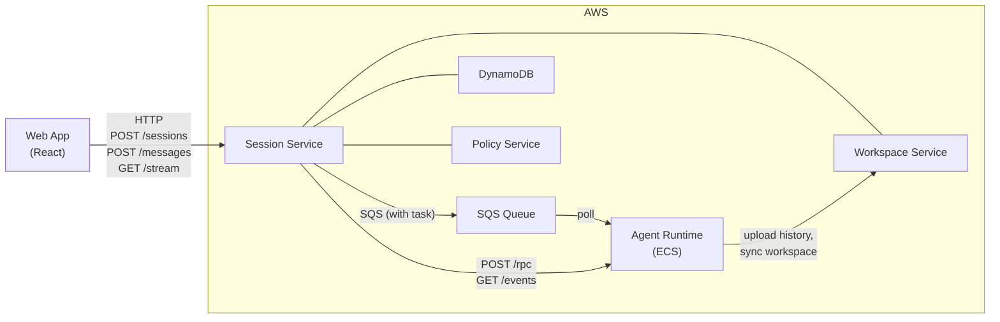
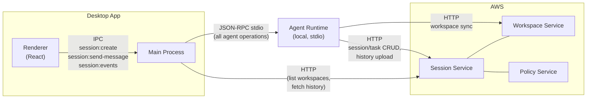
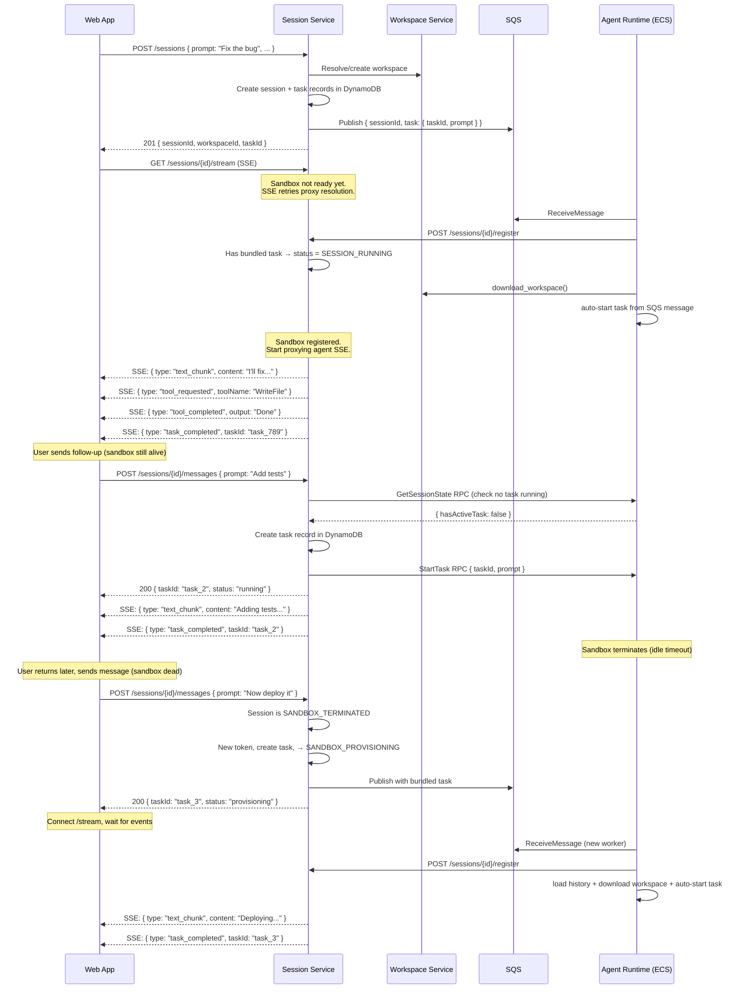
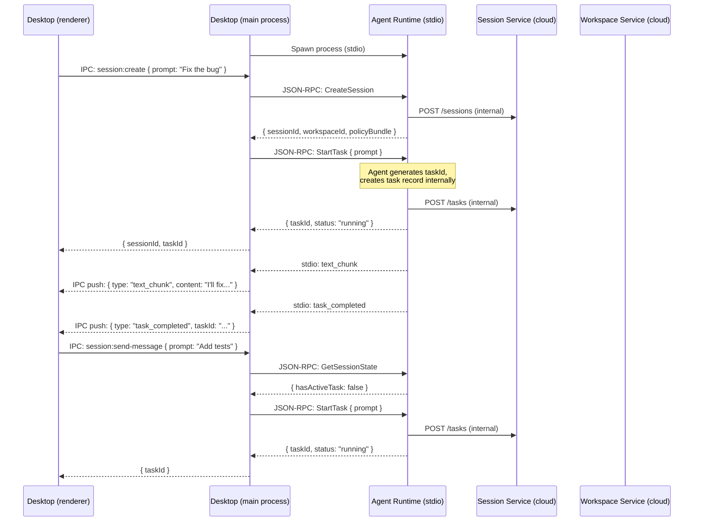
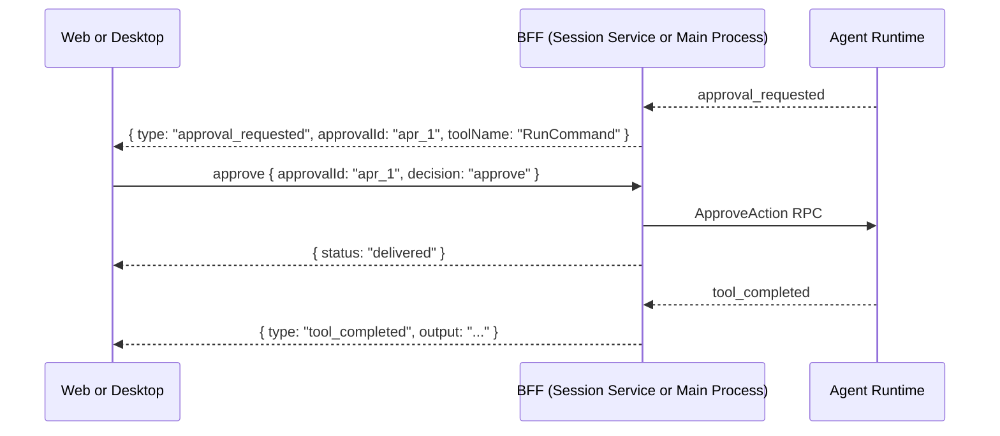

# Simplified Session API — Design Doc

**Status:** Proposed
**Scope:** Session Service, Agent Runtime, Platform Contracts, Web App, Desktop App
**Date:** 2026-03-21

---

## Problem

The current API exposes backend internals to frontend clients:

1. Sending a message requires 2 calls: `POST /tasks` (create record) + `POST /rpc` (JSON-RPC `StartTask`)
2. Frontend constructs JSON-RPC envelopes, generates task IDs, parses protocol responses
3. Frontend polls `GET /sessions/{id}` after session creation to detect sandbox readiness
4. SSE exposes 18+ internal event types — frontend uses ~6

## Goals

1. One API call per user action
2. No JSON-RPC or task ID management in frontend
3. No polling for sandbox readiness
4. Simplified event stream
5. Same logical contract for Web and Desktop
6. Backward compatible — existing endpoints stay for internal use

---

## Key Design Decision: Bundled First Task

The user's intent when creating a session is always "I want to start working on something." Rather than creating a session and then separately sending a message, **the first prompt is bundled with session creation.**

`POST /sessions` gains an optional `prompt` field. When present, Session Service creates the session, creates the task record, and includes the task in the SQS message. The sandbox picks up the message, registers, downloads workspace, and **immediately starts the task** — no second call, no polling, no SSE notification coordination.

This eliminates the need for:
- Frontend polling for `SANDBOX_READY`
- In-memory SSE waiter maps in Session Service (which don't scale across instances)
- A separate `POST /messages` call for the first message

For **all subsequent messages**, `POST /sessions/{id}/messages` is the universal entry point. It detects the sandbox state and does the right thing:
- **Sandbox alive** → check agent state, create task, proxy `StartTask` RPC
- **Sandbox dead** (terminated, completed, failed, cancelled) → generate new token, re-provision via SQS with bundled task

The frontend never checks sandbox status. It just sends messages.

---

## Architecture

The simplified API is a **shared contract** implemented in two places:

- **Web**: Session Service hosts HTTP endpoints
- **Desktop**: Electron main process hosts IPC handlers

This split exists because the cloud cannot reach the user's desktop machine — Session Service can proxy to ECS sandboxes but not to a local agent-runtime behind NAT/firewall.

### Component Diagram

#### Web



#### Desktop



Note: The main process is a thin forwarder — it sends stdio RPCs and filters events. The agent-runtime handles all session/task lifecycle communication with cloud services internally. The main process only calls Session Service directly for UI-specific queries (list workspaces, fetch history) that the agent-runtime doesn't handle.

### Shared Contract

| Operation | Web (HTTP) | Desktop (IPC) | Request | Response |
|---|---|---|---|---|
| New session | `POST /sessions` | `session:create` | `{ ..., prompt?, taskOptions? }` | `{ sessionId, taskId? }` |
| Send message | `POST /sessions/{id}/messages` | `session:send-message` | `{ prompt, taskOptions? }` | `{ taskId, status }` |
| Cancel | `POST /sessions/{id}/cancel` | `session:cancel` | — | `{ cancelled, taskId? }` |
| Approve | `POST /sessions/{id}/approve` | `session:approve` | `{ approvalId, decision }` | `{ status }` |
| Event stream | `GET /sessions/{id}/stream` | `session:events` (IPC push) | — | Filtered events |

`/messages` is the universal entry point for existing sessions — it handles active sandboxes (proxy RPC), dead sandboxes (re-provision via SQS), and task-running checks internally. The frontend never checks sandbox state.

---

## Endpoint Changes

### POST /sessions (modified — optional prompt)

Creates a session. If `prompt` is provided, also creates a task record and includes it in the SQS dispatch. The sandbox auto-starts the task on pickup.

**Request (with prompt — typical):**
```json
{
    "tenantId": "t1",
    "userId": "u1",
    "executionEnvironment": "cloud_sandbox",
    "workspaceHint": null,
    "clientInfo": {
        "desktopAppVersion": "1.0.0",
        "localAgentHostVersion": "1.0.0"
    },
    "supportedCapabilities": ["File.Read", "File.Write", "Shell.Exec"],
    "networkAccess": "enabled",
    "prompt": "Fix the authentication bug in login.py",
    "taskOptions": {
        "maxSteps": 50,
        "planOnly": false
    }
}
```

| Field | Type | Required | Description |
|---|---|---|---|
| `tenantId` | string | Yes | Tenant identifier |
| `userId` | string | Yes | User identifier |
| `executionEnvironment` | `"desktop"` or `"cloud_sandbox"` | Yes | Where the agent runs |
| `workspaceHint` | object or null | No | `{ workspaceId }` to reuse, `{ localPaths }` for desktop, `null` for new |
| `clientInfo` | object | No | Client version info for compatibility check |
| `supportedCapabilities` | string[] | No | Requested capabilities (e.g., `File.Read`, `Shell.Exec`) |
| `networkAccess` | `"enabled"` or `"disabled"` | No | Sandbox network access (cloud_sandbox only) |
| `prompt` | string | **No (new, optional)** | First task prompt. If provided, task is created and bundled with SQS dispatch |
| `taskOptions` | object | No | `{ maxSteps, planOnly }`. Only used when `prompt` is provided |

**Request (without prompt — session only):**
```json
{
    "tenantId": "t1",
    "userId": "u1",
    "executionEnvironment": "cloud_sandbox",
    "supportedCapabilities": ["File.Read", "File.Write", "Shell.Exec"]
}
```

**Response (201):**
```json
{
    "sessionId": "sess_123",
    "workspaceId": "ws_456",
    "compatibilityStatus": "compatible",
    "status": "SANDBOX_PROVISIONING",
    "taskId": "task_789",
    "featureFlags": {
        "approvalUiEnabled": false,
        "mcpEnabled": false
    }
}
```

| Field | Type | Description |
|---|---|---|
| `sessionId` | string | Created session ID |
| `workspaceId` | string | Resolved or created workspace ID |
| `compatibilityStatus` | string | `"compatible"` or `"incompatible"` |
| `status` | string | `"SANDBOX_PROVISIONING"` (cloud_sandbox only) |
| `taskId` | string or null | Present only when `prompt` was provided |
| `policyBundle` | object | Present for desktop sessions (fetched at creation) |
| `featureFlags` | object | Feature toggles |

**Internal flow (with prompt):**
1. Resolve or create workspace via Workspace Service
2. Create session record in DynamoDB (`SANDBOX_PROVISIONING`)
3. Generate `taskId`, create task record in DynamoDB
4. Publish to SQS — message includes session config AND task info
5. Return `{ sessionId, workspaceId, taskId, status }`

Note: If the sandbox never starts (provisioning timeout), the lifecycle manager transitions the session to `SESSION_FAILED` and must also fail the task record to prevent orphaned tasks in "created" state.

**Internal flow (without prompt):**
Unchanged from today — creates session, publishes to SQS, returns.

### Registration status with bundled task

At registration time, Session Service knows whether the session has a bundled task (it created the task record in `POST /sessions`). The registration handler transitions to the appropriate status:

```python
if session_has_bundled_task:
    new_status = "SESSION_RUNNING"   # Task will auto-start immediately
else:
    new_status = "SANDBOX_READY"     # Waiting for POST /messages
```

This avoids the agent-runtime needing to call back to update status. The status is accurate — by the time registration + workspace download completes, the task is starting. If the auto-start fails, the agent-runtime reports the failure through the normal event stream (`task_failed`).

### SQS Message Schema (extended)

```json
{
    "sessionId": "sess_123",
    "registrationToken": "tok_abc",
    "sessionServiceUrl": "https://...",
    "workspaceServiceUrl": "https://...",
    "publishedAt": "2026-03-21T10:00:00Z",
    "task": {
        "taskId": "task_789",
        "prompt": "Fix the authentication bug in login.py",
        "maxSteps": 50
    }
}
```

`task` is `null` when no prompt was provided. The sandbox checks for it on startup.

### Sandbox Startup (modified)

After registration and workspace download, the sandbox checks for a bundled task:

```python
# In sandbox startup (after registration + workspace sync)
if sqs_config.task:
    # Auto-start the task — no RPC needed
    await session_manager.start_task({
        "taskId": sqs_config.task.task_id,
        "prompt": sqs_config.task.prompt,
        "taskOptions": {"maxSteps": sqs_config.task.max_steps},
    })
```

Events flow immediately through the agent-runtime's HTTP transport. The frontend connects to `/stream` and receives events as they happen.

---

## New Endpoints

### POST /sessions/{id}/messages

Universal entry point for sending a message to an existing session. Handles all scenarios — active sandbox, dead sandbox, re-provisioning — internally. The frontend never checks sandbox state.

**Request:**
```json
{
    "prompt": "Now add unit tests for the fix",
    "taskOptions": {
        "maxSteps": 50,
        "planOnly": false
    }
}
```

| Field | Type | Required | Description |
|---|---|---|---|
| `prompt` | string | Yes | User message / task prompt |
| `taskOptions` | object | No | `{ maxSteps, planOnly }` |
| `taskOptions.maxSteps` | integer | No | Max agent loop steps (1-200, default 50) |
| `taskOptions.planOnly` | boolean | No | If true, agent creates a plan without executing |

**Response (200) — sandbox alive:**
```json
{
    "taskId": "task_abc",
    "status": "running"
}
```

**Response (200) — sandbox dead, re-provisioning:**
```json
{
    "taskId": "task_abc",
    "status": "provisioning"
}
```

| Field | Type | Description |
|---|---|---|
| `taskId` | string | Generated task ID |
| `status` | string | `"running"` (sandbox alive, task started) or `"provisioning"` (sandbox dead, re-provisioning via SQS with bundled task) |

**Errors:**
- `404` — session not found
- `403` — not session owner
- `409` — a task is already running
- `502` — agent runtime unreachable (sandbox alive but not responding)

**Internal flow:**
1. Validate session exists and caller owns it
2. Check session status:

   **If `SANDBOX_PROVISIONING`** → return 409 "session still provisioning, please wait"

   **If active** (`SANDBOX_READY`, `SESSION_RUNNING`, `WAITING_FOR_*`, `SESSION_PAUSED`):
   3a. Proxy `GetSessionState` RPC to agent runtime — check if a task is running
   4a. If task running → return 409 "task already running"
   5a. Generate `taskId`, create task record in DynamoDB
   6a. Proxy `StartTask` JSON-RPC to agent runtime with `{ taskId, prompt, taskOptions }`
   7a. Return `{ taskId, status: "running" }`

   **If ended** (`SANDBOX_TERMINATED`, `SESSION_COMPLETED`, `SESSION_FAILED`, `SESSION_CANCELLED`):
   3b. Generate fresh `registrationToken`
   4b. Generate `taskId`, create task record in DynamoDB
   5b. Transition session to `SANDBOX_PROVISIONING`
   6b. Publish to SQS with bundled task `{ sessionId, registrationToken, task: { taskId, prompt } }`
   7b. Return `{ taskId, status: "provisioning" }`

The frontend handles both responses the same way — connect to `GET /stream`, events arrive when the task starts (immediately if alive, after provisioning if dead).

### POST /sessions/{id}/cancel

Cancel the running task, or cancel the session if no task is running.

**Request:** No body required.

**Response (200) — task cancelled:**
```json
{
    "cancelled": "task",
    "taskId": "task_abc"
}
```

**Response (200) — session cancelled:**
```json
{
    "cancelled": "session",
    "sessionId": "sess_123"
}
```

| Field | Type | Description |
|---|---|---|
| `cancelled` | `"task"` or `"session"` | What was cancelled |
| `taskId` | string | Present when a task was cancelled |
| `sessionId` | string | Present when the session was cancelled |

**Errors:**
- `404` — session not found
- `403` — not session owner
- `409` — session not active (still provisioning, or already cancelled)
- `502` — agent runtime unreachable

**Internal flow:**
1. Validate session exists and caller owns it
2. If session is `SANDBOX_PROVISIONING` → cancel session in DynamoDB → return `{ cancelled: "session" }`. The SQS message is already published; the worker will attempt registration, fail (session is `SESSION_CANCELLED`), and the message goes to DLQ after 3 attempts. This is expected.
3. If session is already ended (terminated/completed/failed/cancelled) → return `{ cancelled: "session" }`
4. Proxy `GetSessionState` RPC to agent runtime — check if a task is running
5. If task running → proxy `CancelTask` RPC → return `{ cancelled: "task", taskId }`
6. If no task running → cancel session in DynamoDB → return `{ cancelled: "session", sessionId }`
7. If sandbox unreachable (502) → fall back to cancel session in DynamoDB → return `{ cancelled: "session", sessionId }`

If a bundled task was created with the session, the cancel should also fail the task record to prevent orphaned tasks.

### POST /sessions/{id}/approve

Resolve a pending approval decision.

**Request:**
```json
{
    "approvalId": "apr_123",
    "decision": "approve"
}
```

| Field | Type | Required | Description |
|---|---|---|---|
| `approvalId` | string | Yes | ID of the pending approval (from `approval_requested` event) |
| `decision` | `"approve"` or `"denied"` | Yes | User's decision |

**Response (200):**
```json
{
    "approvalId": "apr_123",
    "decision": "approve",
    "status": "delivered"
}
```

| Field | Type | Description |
|---|---|---|
| `approvalId` | string | The approval that was resolved |
| `decision` | string | The decision that was applied |
| `status` | string | `"delivered"` if a pending approval was found, `"not_found"` if no pending approval with this ID |

**Errors:**
- `404` — session not found
- `403` — not session owner
- `502` — agent runtime unreachable

**Internal flow:**
1. Validate session is active and caller owns it
2. Proxy `ApproveAction` JSON-RPC to agent runtime with `{ approvalId, decision }`
3. Return `{ approvalId, decision, status }` — agent-runtime returns `"delivered"` or `"not_found"`

### GET /sessions/{id}/stream

Simplified SSE event stream. Filters internal agent events to frontend-relevant types only.

**Query params:**
- `since={eventId}` — replay events after this ID (for reconnect)

**Headers:**
- `X-User-Id` — session ownership validation (replaced by OIDC token after Step 14)

**SSE format:**
```
id: 42
event: session_event
data: {"type":"text_chunk","content":"Here's how to fix...","taskId":"task_abc"}

id: 43
event: session_event
data: {"type":"tool_requested","toolName":"WriteFile","toolCallId":"tc_1","taskId":"task_abc","arguments":{"path":"src/login.py"}}

id: 44
event: session_event
data: {"type":"tool_completed","toolCallId":"tc_1","output":"File written","status":"success","taskId":"task_abc"}

id: 45
event: session_event
data: {"type":"approval_requested","approvalId":"apr_1","toolName":"RunCommand","description":"rm -rf /tmp/cache","riskLevel":"high","taskId":"task_abc"}

id: 46
event: session_event
data: {"type":"task_completed","taskId":"task_abc","status":"completed"}
```

**Errors:**
- `404` — session not found
- `403` — not session owner
- `502` — agent runtime unreachable (SSE closes, client reconnects with `since=`)

---

## Simplified Events

`/stream` filters internal events — passes through UI-relevant types with unchanged names and payloads, drops internal-only types. No new event names or enums.

**Passed through (unchanged):**

| Event type | Payload fields |
|---|---|
| `text_chunk` | `content`, `taskId` |
| `tool_requested` | `toolName`, `toolCallId`, `arguments`, `taskId` |
| `tool_completed` | `toolCallId`, `output`, `status`, `taskId` |
| `approval_requested` | `approvalId`, `toolName`, `description`, `riskLevel`, `taskId` |
| `approval_resolved` | `approvalId`, `decision`, `taskId` |
| `task_completed` | `taskId`, `status` |
| `task_failed` | `taskId`, `reason`, `errorCode` |
| `step_limit_approaching` | `currentStep`, `maxSteps` |
| `context_compacted` | `droppedCount`, `preCount`, `postCount` |
| `verification_started` | `taskId` |
| `verification_completed` | `taskId` |
| `checkpoint_saved` | `taskId` |

**Dropped:**

| Event type | Reason |
|---|---|
| `session_created` | Internal lifecycle — frontend already knows from `POST /sessions` response |
| `session_started` | Internal lifecycle |
| `step_started` | Too granular — one per LLM call, adds noise |
| `step_completed` | Too granular |
| `llm_request_started` | Internal LLM client detail |
| `llm_request_completed` | Internal LLM client detail |
| `llm_retry` | Internal retry logic |

Raw `GET /sessions/{id}/events` remains available for debugging and advanced integrations.

### Shared event filter contract

The event filter (which types to pass through vs drop) is implemented in two places — Session Service (Python, for web `/stream`) and Desktop main process (TypeScript, for IPC events). To prevent drift, the allow-list lives in `cowork-platform` as the source of truth:

```
cowork-platform/contracts/enums/frontend-event-types.json
```

Both implementations reference this file. Event names and payload shapes are unchanged — the filter only controls which types reach the frontend. If a new internal event type is added, it's dropped by default until explicitly added to the allow-list.

---

## How Each BFF Works Internally

**Key difference:** On web, Session Service orchestrates everything (DynamoDB writes + RPC proxy). On desktop, the agent-runtime handles backend communication internally — `CreateSession` RPC creates the session record, `start_task()` creates the task record. The desktop main process is a thin forwarder.

| Step | Web BFF (Session Service) | Desktop BFF (Main Process) |
|---|---|---|
| **New session** | Resolve workspace → create session (+ task) in DynamoDB → SQS (with task if prompt) → return `{ sessionId, taskId? }` | `CreateSession` stdio RPC → (optionally) `StartTask` stdio RPC → return `{ sessionId, taskId? }` |
| **Send message (sandbox alive)** | `GetSessionState` RPC → create task in DynamoDB → proxy `StartTask` RPC → return `{ taskId, status: "running" }` | `GetSessionState` stdio RPC → `StartTask` stdio RPC → return `{ taskId }` |
| **Send message (sandbox dead)** | New token → create task in DynamoDB → `SANDBOX_PROVISIONING` → SQS with bundled task → return `{ taskId, status: "provisioning" }` | Not applicable — desktop agent-runtime is always alive while app is open |
| **Cancel** | `GetSessionState` RPC → if task: proxy `CancelTask` RPC; if not: cancel session in DynamoDB | `GetSessionState` stdio RPC → if task: `CancelTask` stdio RPC; if not: cancel via Session Service HTTP |
| **Approve** | Proxy `ApproveAction` RPC to sandbox | `ApproveAction` stdio RPC |
| **Events** | Proxy agent SSE → filter to allowed types → push to client SSE | Receive stdio notifications → filter to allowed types → push to renderer via IPC |
| **List workspaces, history** | Direct DynamoDB / Workspace Service | HTTP to Session Service / Workspace Service |

The desktop main process only calls Session Service HTTP for operations the agent-runtime doesn't handle: listing workspaces, fetching session history for UI display, and session cancel (when no task is running). The "sandbox dead" path is web-only — on desktop, the agent-runtime process lives as long as the app is open.

---

## Web Session Lifecycle



## Desktop Session Lifecycle



Note: The main process does not call Session Service for session/task creation — the agent-runtime handles that internally via its `SessionClient`. The main process forwards stdio RPCs, checks agent state, and filters events. It only calls Session Service directly for UI queries (list workspaces, fetch history).

**Crash recovery:** If the agent-runtime process crashes (pipe EOF), the main process detects it, pushes an error event to the renderer, and offers to restart. Session history is preserved in Workspace Service — the user can restart the agent and resume.

## Approval Flow



---

## What Changes in Agent Runtime

The SQS consumer and sandbox startup gain awareness of the bundled task:

**SQS message parsing** — `SqsSessionConfig` gets an optional `task` field:
```python
@dataclass(frozen=True)
class SqsTaskConfig:
    task_id: str
    prompt: str
    max_steps: int = 50

@dataclass(frozen=True)
class SqsSessionConfig:
    session_id: str
    registration_token: str
    session_service_url: str
    workspace_service_url: str
    receipt_handle: str
    task: SqsTaskConfig | None = None  # Bundled first task
```

**Sandbox startup** — after registration and workspace sync, auto-start the task:
```python
# In main.py run_http(), after init_from_registration():
if sqs_config.task:
    logger.info("auto_starting_task", task_id=sqs_config.task.task_id)
    await session_manager.start_task({
        "taskId": sqs_config.task.task_id,
        "prompt": sqs_config.task.prompt,
        "taskOptions": {"maxSteps": sqs_config.task.max_steps},
    })
```

---

## SSE `/stream` During Provisioning

When the frontend connects to `/stream` while the sandbox is still provisioning, the SSE connection opens but no events flow yet. The `/stream` endpoint:

1. Checks session status
2. If `SANDBOX_PROVISIONING` or `SANDBOX_READY` with no sandbox endpoint yet — holds the connection open
3. Periodically retries resolving the sandbox endpoint (every 2s, **directly from DynamoDB** — no cache). Proxy cache is bypassed for provisioning/ready states because the cache is per-instance and the registration may have been handled by a different Session Service instance.
4. Once sandbox endpoint is found — starts proxying agent SSE events (with `since=0` to replay all buffered events)
5. Events from the auto-started task arrive immediately (the sandbox started working as soon as it registered)

Once the session reaches `SESSION_RUNNING`, subsequent `/stream` reconnects use the normal proxy cache (endpoint is stable).

This is a lightweight retry on the proxy resolution, not a notification system. The retry loop is bounded by the session's provisioning timeout (180s). If the sandbox never registers, the SSE connection returns an error event and closes.

The frontend sees: open SSE connection → brief wait → events start flowing. No separate status polling or notification coordination needed.

---

## Desktop App Impact

These changes are web-focused. Desktop is unaffected in Stages 1-2:

| Change | Desktop impact |
|---|---|
| `POST /sessions` with prompt | None — desktop uses agent-runtime stdio |
| `POST /sessions/{id}/messages` | None — Stage 3 IPC equivalent |
| `/cancel`, `/approve` | None — Stage 3 IPC equivalent |
| `/stream` event filter | **Shared contract needed** — event allow-list in `cowork-platform` prevents drift between Python (Session Service) and TypeScript (desktop main process) |
| Registration status for bundled tasks | None — desktop doesn't use SQS |
| SQS task bundling | None — desktop doesn't use SQS |

Desktop gains value in **Stage 3** when IPC handlers are refactored to the simplified contract. Until then, desktop continues working exactly as today.

---

## Migration Path

### Stage 1: Session Service + Agent Runtime

**Work:**
- Add optional `prompt`/`taskOptions` to `POST /sessions` — creates task record, includes in SQS
- Add `/messages`, `/cancel`, `/approve` endpoints (orchestrate task + RPC)
- Add `/stream` endpoint (event filtering + proxy retry during provisioning)
- Agent runtime: parse `task` from SQS message, auto-start after registration
- Platform: update schemas, add frontend event allow-list

**Definition of done:**
- `POST /sessions` with `prompt` creates session + task record and includes task in SQS message
- `POST /sessions` without `prompt` behaves identically to today (no regression)
- `POST /messages` with active sandbox: checks agent state via `GetSessionState`, creates task, proxies `StartTask`, returns `{ taskId, status: "running" }`
- `POST /messages` with dead sandbox: generates new token, creates task, transitions to `SANDBOX_PROVISIONING`, publishes SQS with bundled task, returns `{ taskId, status: "provisioning" }`
- `POST /cancel` auto-detects task vs session cancel via `GetSessionState`
- `POST /approve` proxies `ApproveAction` and returns agent-runtime response
- `GET /stream` filters events to allow-list, retries proxy resolution during provisioning, closes on timeout
- Agent runtime auto-starts bundled task after registration + workspace download
- Registration sets `SESSION_RUNNING` when bundled task exists, `SANDBOX_READY` otherwise
- All existing endpoints unchanged (backward compatible)
- Lifecycle manager fails orphaned task records when session fails (provisioning timeout)
- Proxy cache bypassed during provisioning/ready states (multi-instance safe)
- Cancel during provisioning marks session cancelled + fails bundled task record
- Unit tests for all new endpoints (Session Service)
- Unit tests for SQS task parsing and auto-start (agent runtime)
- E2E test: `POST /sessions` with prompt → `/stream` SSE → events arrive → `task_completed`
- E2E test: `POST /sessions` without prompt → `/messages` (sandbox alive) → events → `task_completed`
- E2E test: `/messages` on terminated session → re-provisions via SQS → events arrive → `task_completed`
- `make check` passes on session-service, agent-runtime, cowork-platform

### Stage 2: Web App

**Work:**
- Update API client to use `POST /sessions` with prompt and `POST /messages`
- Replace `POST /rpc` calls with new endpoints
- Replace `GET /events` with `GET /stream`
- Remove JSON-RPC envelope construction and task ID generation
- Remove polling loop for sandbox readiness (SSE handles it)

**Definition of done:**
- Web app creates sessions with `POST /sessions { prompt }` — one call
- Follow-up messages via `POST /messages` — one call, no JSON-RPC
- Approval via `POST /approve` — no JSON-RPC
- Cancel via `POST /cancel` — no JSON-RPC
- Events via `GET /stream` — filtered types only
- No `jsonrpc`, `id`, or `taskId` construction anywhere in frontend code
- No polling for `SANDBOX_READY` — SSE stream receives events when ready
- All Vitest tests passing
- Manual E2E test: create session with prompt → see LLM response → send follow-up → approve tool → cancel

### Stage 3: Desktop App

**Work:**
- Refactor IPC handlers to match simplified contract (`session:create`, `session:send-message`, `session:cancel`, `session:approve`)
- Main process becomes a thin stdio forwarder — no task ID generation, no direct Session Service calls for session/task CRUD
- Event filtering in main process (stdio notifications → allowed types only)
- Extract shared `SessionClient` TypeScript interface for React component reuse

**Definition of done:**
- Renderer calls `session:create`, `session:send-message`, `session:cancel`, `session:approve` — no agent-specific IPC channels
- Main process forwards to agent-runtime via stdio, does not construct JSON-RPC in renderer
- Events filtered using the same allow-list from `cowork-platform`
- Shared `SessionClient` interface used by both web and desktop React components
- Desktop app works end-to-end: create session → send message → approve tool → cancel
- Agent-runtime crash detected (pipe EOF) → error event to renderer → restart offered
- No regression in existing desktop functionality
- All existing tests passing

### Stage 4: Cleanup

**Work:**
- Mark `/rpc` and `/events` as internal-only in docs and API gateway config
- Remove `X-User-Id` header — auth from OIDC token (depends on Step 14)

**Definition of done:**
- `/rpc` and `/events` not exposed to frontend clients (internal/debug only)
- All frontend auth via OIDC token — no manual header management
- API docs updated to reflect internal vs public endpoints

---

## Repos Affected

| Repo | Changes | Stage |
|---|---|---|
| `cowork-session-service` | `POST /sessions` with prompt, `/messages`, `/cancel`, `/approve`, `/stream`, event filter | 1 |
| `cowork-agent-runtime` | SQS consumer parses `task` field, auto-start task after registration | 1 |
| `cowork-platform` | Frontend event allow-list, updated session creation schema, `/messages` schema | 1 |
| `cowork-web-app` | New API client, remove JSON-RPC/polling, use `/stream` | 2 |
| `cowork-desktop-app` | Refactor IPC handlers, event filtering, shared SessionClient | 3 |

---

## Known Gaps and Mitigations

**Orphaned task records on provisioning timeout:** `POST /sessions` with prompt creates the task record immediately. If the sandbox never starts, the provisioning timeout marks the session `SESSION_FAILED` but the task stays in "created" state. **Mitigation:** The lifecycle manager should fail the task record when it fails the session.

**Proxy cache stale after registration:** The proxy endpoint cache is in-memory per Session Service instance. Instance A handles registration (stores endpoint), but Instance B serves the `/stream` SSE connection — its cache is stale for up to 30s. Cross-instance cache invalidation adds complexity. **Mitigation:** Bypass cache for sessions in `SANDBOX_PROVISIONING` or `SANDBOX_READY` states — read directly from DynamoDB. Only cache for established sessions (`SESSION_RUNNING` and beyond) where the endpoint is stable. The `/stream` retry during provisioning (~7 DynamoDB reads over 15s) is negligible.

**Desktop agent-runtime crash:** If the agent-runtime process crashes, the stdio pipe breaks. The main process needs to detect this. **Mitigation:** Main process listens for process exit/pipe EOF, notifies the renderer with an error event, and offers to restart the agent-runtime. Session history is preserved in Workspace Service.

**Cancel during provisioning:** When a user cancels during `SANDBOX_PROVISIONING`, the SQS message is already published. A worker will pick it up, attempt registration, fail (session is `SESSION_CANCELLED`), and the message goes to DLQ after 3 attempts. This is expected behavior — the DLQ alarm fires but is not a bug.

---

## Design Decisions (from open questions)

**History replay on `/stream`**: No. SSE is for live events. Frontend fetches history from Workspace Service on page load (existing pattern). Mixing history into the SSE stream conflates two concerns.

**`/cancel` auto-detect vs separate endpoints**: Single endpoint, auto-detects via `GetSessionState` RPC. Described in internal flow above.

**Raw events on `/stream`**: No. `GET /sessions/{id}/events` already serves raw unfiltered events. Two endpoints, clear purpose — `/stream` for frontends, `/events` for debugging.

**No separate `/resume` endpoint**: `POST /sessions/{id}/messages` is the universal entry point for existing sessions. It detects sandbox state internally — if alive, proxies RPC; if dead, re-provisions via SQS with bundled task. The frontend never checks sandbox status. The existing `POST /sessions/{id}/resume` (backend endpoint) is retained for internal use but not exposed as a simplified API.
