# Simplified Session API — Design Doc

**Status:** Proposed
**Scope:** Session Service, Platform Contracts, Web App, Desktop App
**Date:** 2026-03-21

---

## Problem

The current API exposes backend implementation details to frontend clients. A single user action ("send a message") requires multiple coordinated API calls, and the frontend must understand JSON-RPC protocol internals, task lifecycle management, and sandbox provisioning state.

### Current pain points

1. **Multi-call user actions**: Sending a message requires `POST /tasks` (create task record) + `POST /rpc` (JSON-RPC `StartTask` to agent-runtime). Frontend generates task IDs, constructs JSON-RPC envelopes, and handles two independent failure modes.

2. **Protocol leakage**: Frontend constructs JSON-RPC 2.0 payloads (`{ jsonrpc: "2.0", id: ..., method: "StartTask", params: ... }`), manages request IDs, and parses JSON-RPC error responses — all implementation details of the agent-runtime transport.

3. **Polling burden**: After session creation, the frontend polls `GET /sessions/{id}` until sandbox is ready. No push notification for state transitions.

4. **Raw internal events**: The SSE stream exposes 18+ internal event types (`step_started`, `llm_request_started`, `checkpoint_saved`, etc.) that the UI maps to ~6 user-visible states.

5. **Auth hack**: The proxy uses `X-User-Id` header for ownership validation — a placeholder that frontend must manage manually.

6. **Divergent paths**: Desktop App calls agent-runtime via stdio JSON-RPC + Session Service REST. Web App calls Session Service proxy which forwards JSON-RPC over HTTP. Same logical actions, different wiring.

---

## Goals

1. One API call per user action — no multi-step orchestration in the frontend
2. No JSON-RPC awareness in frontend clients
3. No task ID generation in frontend clients
4. Push-based status updates via SSE (no polling for sandbox readiness)
5. Simplified event stream for UI consumption
6. Same API surface for Web App and Desktop App
7. Auth derived from OIDC token, not manual headers
8. Backward compatible — existing endpoints remain for internal service-to-service use

## Non-Goals

- Replacing the internal JSON-RPC protocol between Session Service and agent-runtime
- Changing the agent-runtime's transport layer (stdio or HTTP)
- Removing the existing `/sessions/*` REST endpoints (they stay for backward compat)

---

## Current Architecture

### Current: Web App sends a message

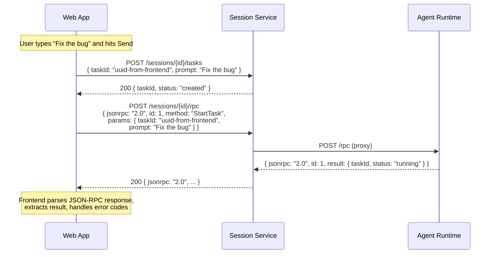

**Frontend code today:**
```typescript
// Web App must: generate task ID, create task record, send JSON-RPC, parse response
async createTask(sessionId: string, prompt: string): Promise<TaskResponse> {
    const taskId = crypto.randomUUID();  // Frontend generates ID
    await fetch(`/sessions/${sessionId}/tasks`, {  // Call 1: create record
        method: "POST",
        body: JSON.stringify({ taskId, prompt }),
    });
    await this.sendRpc(sessionId, "StartTask", { taskId, prompt });  // Call 2: JSON-RPC
    return task;
}

async sendRpc(sessionId, method, params) {
    const resp = await fetch(`/sessions/${sessionId}/rpc`, {
        body: JSON.stringify({
            jsonrpc: "2.0",           // Protocol details
            id: crypto.randomUUID(),  // Request ID management
            method,                   // Internal method name
            params,
        }),
    });
    const data = await resp.json();
    if (data.error) throw new RpcError(data.error.code, data.error.message);
    return data.result;
}
```

### Current: Web App creates a session

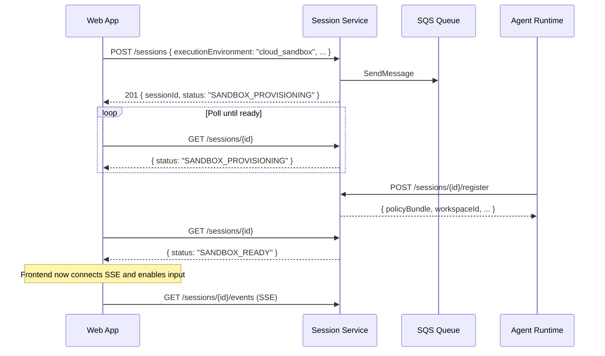

### Current: Desktop App sends a message

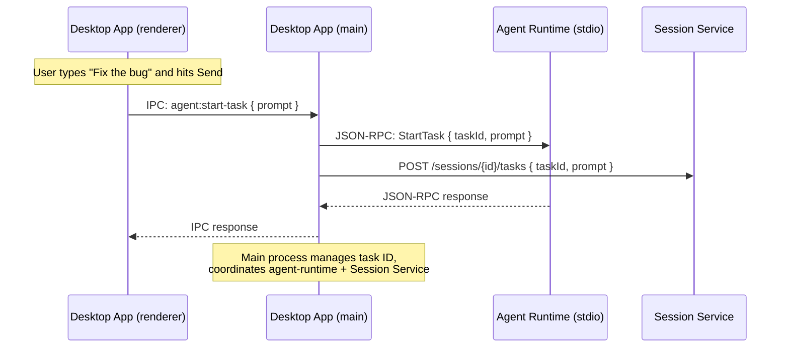

### Current: SSE event handling

```mermaid
flowchart LR
    A[Agent Runtime] -->|18+ event types| B[Session Service Proxy]
    B -->|raw events| C[Web App]
    C -->|maps to UI states| D[Conversation Store]

    subgraph "Internal events (all exposed to frontend)"
        E[session_created]
        F[step_started]
        G[llm_request_started]
        H[text_chunk]
        I[llm_request_completed]
        J[tool_requested]
        K[tool_completed]
        L[step_completed]
        M[checkpoint_saved]
        N[verification_started]
        O[verification_completed]
        P[task_completed]
        Q[task_failed]
        R[approval_requested]
        S[context_compacted]
    end

    subgraph "What UI actually uses (~6)"
        H
        J
        K
        P
        Q
        R
    end
```

---

## Proposed Architecture

### Proposed: Web App sends a message

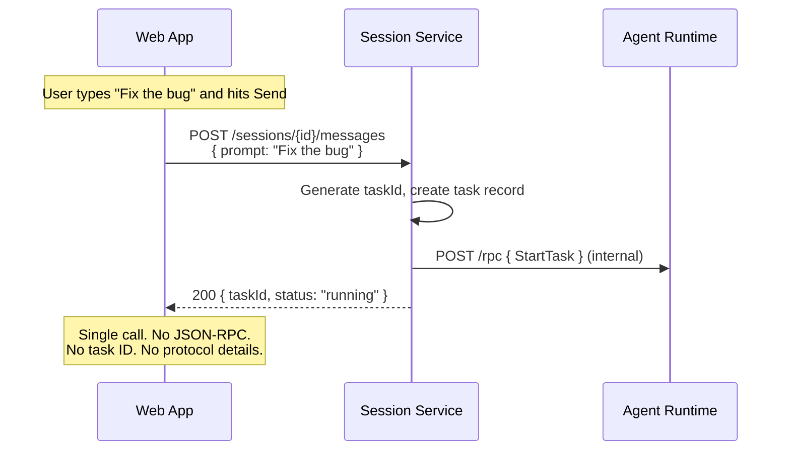

**Frontend code proposed:**
```typescript
// One call. No task ID, no JSON-RPC, no protocol details.
async sendMessage(sessionId: string, prompt: string): Promise<{ taskId: string }> {
    const resp = await fetch(`/sessions/${sessionId}/messages`, {
        method: "POST",
        body: JSON.stringify({ prompt }),
    });
    if (!resp.ok) throw new ApiError(resp.status, await resp.text());
    return resp.json();
}
```

### Proposed: Web App creates a session

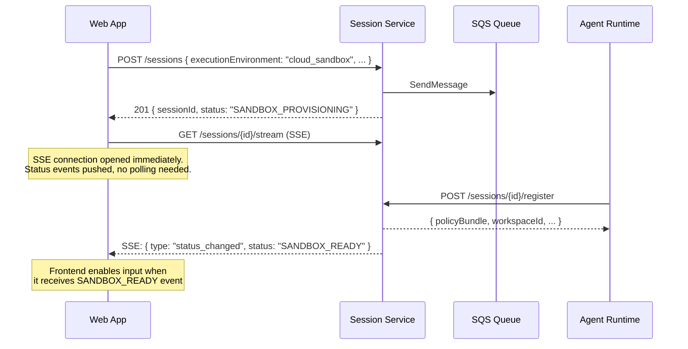

### Proposed: Desktop App sends a message

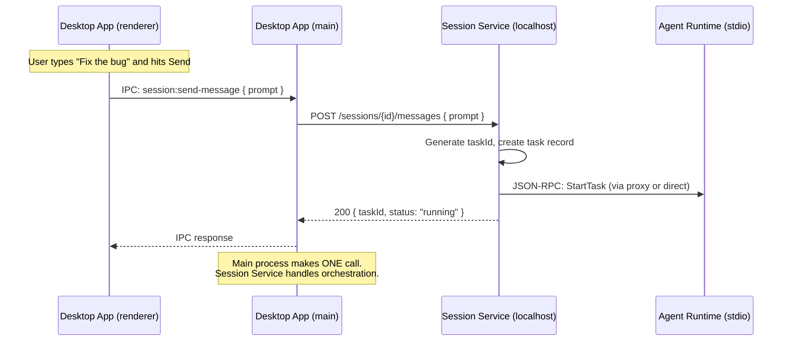

### Proposed: Simplified event stream

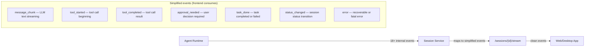

---

## New Endpoints

All new endpoints live under the existing `/sessions` prefix. They coexist with the current endpoints — no breaking changes.

### POST /sessions/{id}/messages

Send a user message and start a task. Session Service generates the task ID, creates the task record, and dispatches `StartTask` to the agent runtime.

**Request:**
```json
{
    "prompt": "Fix the authentication bug in login.py",
    "options": {
        "maxSteps": 50,
        "planOnly": false
    }
}
```

**Response (200):**
```json
{
    "taskId": "task_abc123",
    "status": "running"
}
```

**Error responses:**
- `404` — session not found
- `403` — not session owner
- `409` — session not active, or another task is already running
- `502` — agent runtime unreachable

**Internal flow:**
1. Validate session exists, is active, and caller owns it
2. Check no task is currently running (409 if so)
3. Generate `taskId = uuid4()`
4. Create task record in DynamoDB (`POST /sessions/{id}/tasks` internally)
5. Proxy `StartTask` JSON-RPC to agent runtime sandbox
6. Return `{ taskId, status: "running" }`
7. If step 5 fails, mark task as failed, return error

### POST /sessions/{id}/cancel

Cancel the currently running task. If no task is running, cancels the session.

**Request:** No body required.

**Response (200):**
```json
{
    "cancelled": "task",
    "taskId": "task_abc123"
}
```

or

```json
{
    "cancelled": "session"
}
```

**Internal flow:**
1. If a task is running: proxy `CancelTask` RPC to agent runtime
2. If no task running: cancel the session (`POST /sessions/{id}/cancel` internally)

### POST /sessions/{id}/approve

Resolve a pending approval decision.

**Request:**
```json
{
    "approvalId": "apr_123",
    "decision": "approve",
    "modifications": {}
}
```

**Response (200):**
```json
{
    "approvalId": "apr_123",
    "status": "resolved"
}
```

**Internal flow:**
1. Proxy `ApproveAction` JSON-RPC to agent runtime

### GET /sessions/{id}/stream

Unified SSE event stream. Replaces `GET /sessions/{id}/events` for frontend consumption. Maps internal agent events to simplified types.

**Query params:**
- `since={eventId}` — replay events after this ID (reconnect)

**SSE event format:**
```
id: 42
event: session_event
data: {"type": "message_chunk", "content": "Here's how to fix...", "taskId": "task_abc"}

id: 43
event: session_event
data: {"type": "tool_started", "toolName": "WriteFile", "toolCallId": "tc_1", "taskId": "task_abc"}

id: 44
event: session_event
data: {"type": "status_changed", "status": "SANDBOX_READY"}
```

**Event type mapping:**

| Internal event | Simplified event | Payload |
|---|---|---|
| `text_chunk` | `message_chunk` | `{ content, taskId }` |
| `tool_requested` | `tool_started` | `{ toolName, toolCallId, arguments, taskId }` |
| `tool_completed` | `tool_completed` | `{ toolCallId, output, status, taskId }` |
| `approval_requested` | `approval_needed` | `{ approvalId, toolName, riskLevel, description }` |
| `approval_resolved` | `approval_resolved` | `{ approvalId, decision }` |
| `task_completed` | `task_done` | `{ taskId, status: "completed" }` |
| `task_failed` | `task_done` | `{ taskId, status: "failed", error }` |
| `session_created` | `status_changed` | `{ status: "SESSION_CREATED" }` |
| (sandbox registered) | `status_changed` | `{ status: "SANDBOX_READY" }` |
| `session_completed` | `status_changed` | `{ status: "SESSION_COMPLETED" }` |
| `session_failed` | `status_changed` | `{ status: "SESSION_FAILED" }` |
| `step_started` | (dropped) | — |
| `step_completed` | (dropped) | — |
| `llm_request_started` | (dropped) | — |
| `llm_request_completed` | (dropped) | — |
| `checkpoint_saved` | (dropped) | — |
| `context_compacted` | (dropped) | — |
| `verification_started` | (dropped) | — |
| `verification_completed` | (dropped) | — |
| `step_limit_approaching` | `warning` | `{ message: "Approaching step limit" }` |

**Status change injection:** Session Service monitors session status transitions (from DynamoDB stream or polling) and injects `status_changed` events into the SSE stream. This eliminates the need for frontend polling after session creation.

### POST /sessions/{id}/files

Upload a file. Unchanged from current `POST /sessions/{id}/upload` but with a cleaner path.

### GET /sessions/{id}/files and GET /sessions/{id}/files/{path}

List/download workspace files. Unchanged from current.

---

## Session Status via SSE (No Polling)

Currently, the frontend polls `GET /sessions/{id}` after session creation to detect `SANDBOX_READY`. With the `/stream` endpoint, the frontend connects SSE immediately after session creation and receives status change events.

### Flow

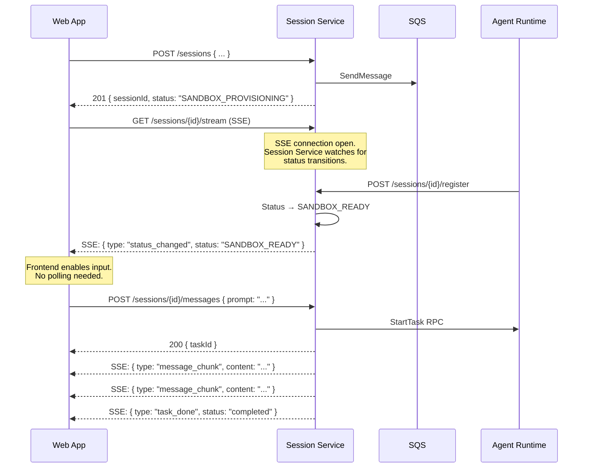

### Implementation: Status event injection

Session Service needs to detect session status changes and push them to the SSE stream. Two approaches:

**A. Proxy-side injection (simpler):** When the `/stream` SSE connection is established and the session is in `SANDBOX_PROVISIONING`, Session Service polls the session record (every 1s) until the status changes to `SANDBOX_READY`, then injects a `status_changed` event and begins proxying agent-runtime events.

**B. DynamoDB Streams (scalable):** Use DynamoDB Streams to detect status changes on the session table. A Lambda function or internal consumer pushes events to connected SSE clients. More complex but eliminates polling.

**Recommendation:** Start with Approach A — poll during provisioning only (short-lived, <30s). Migrate to DynamoDB Streams later if needed.

---

## Desktop vs Web: Where the Simplified API Lives

The simplified API is a **shared contract**, not a shared service. Web and desktop implement the same logical operations, but the implementation lives in different places because of a fundamental constraint: **the cloud cannot reach the user's desktop machine.**

### The constraint

On web, Session Service runs in AWS and the agent runtime runs in ECS — both in the cloud. Session Service can proxy requests to the sandbox.

On desktop, Session Service runs in AWS but the agent runtime runs on the user's machine. Session Service cannot reach it — the user is behind NAT/firewall. The agent-runtime's stdio pipe is only accessible from the Desktop App's main process.

### Component diagrams

#### Web Architecture

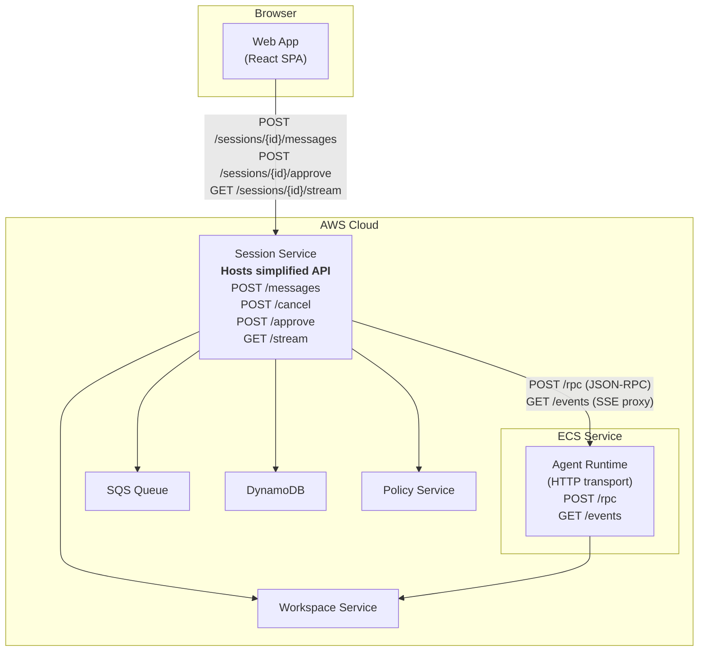

**Web: Session Service is the BFF.** It hosts the simplified endpoints, orchestrates task creation + RPC dispatch, maps events, and proxies everything to the agent runtime.

#### Desktop Architecture

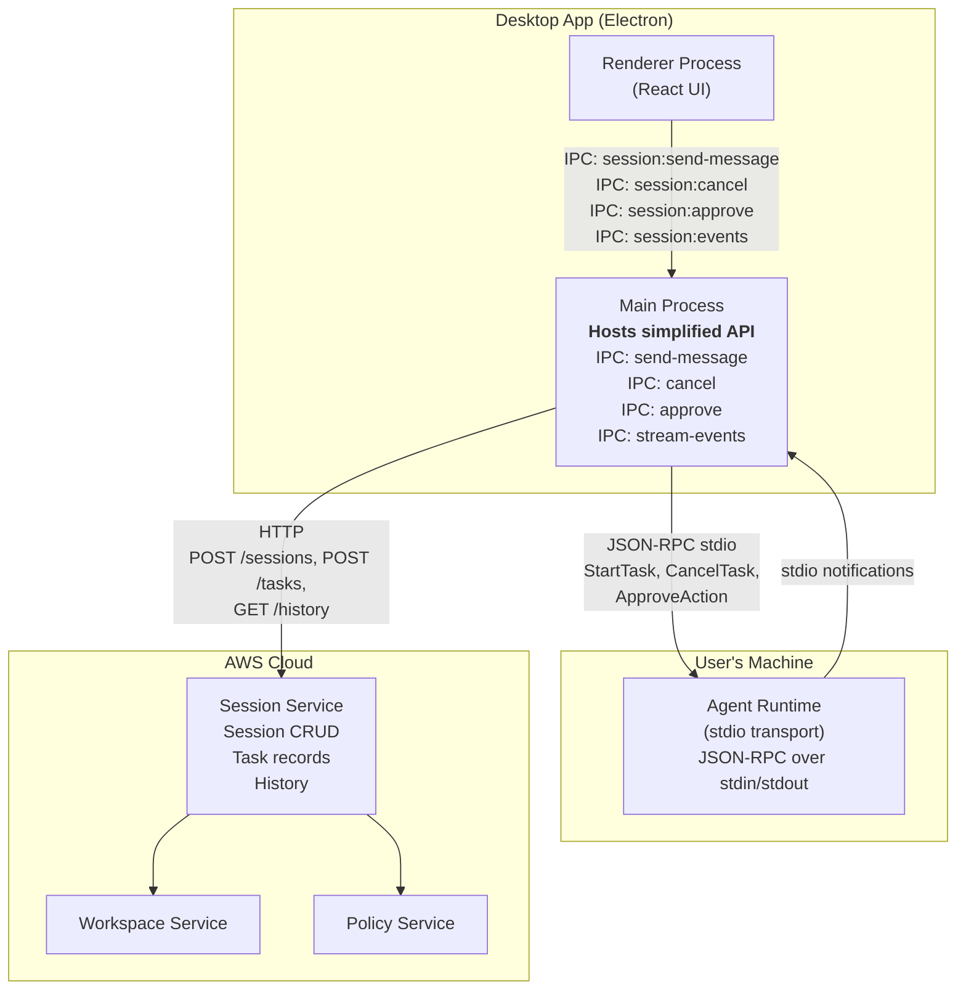

**Desktop: The main process is the BFF.** It hosts the same logical operations as IPC handlers, orchestrates agent-runtime (stdio) + Session Service (HTTP), and pushes events to the renderer.

#### Side-by-side comparison

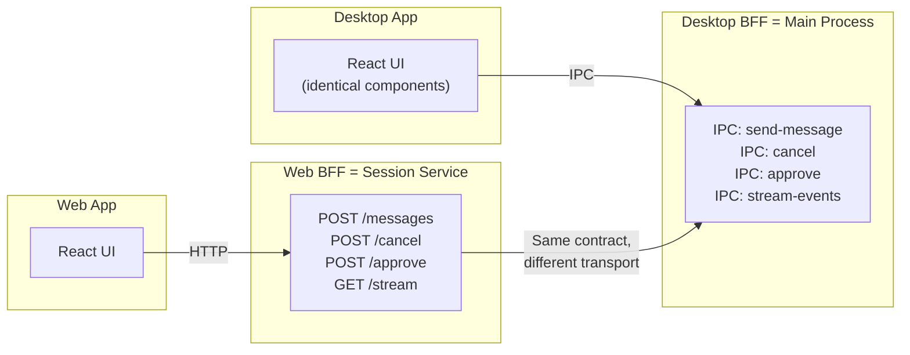

### The shared contract

Both BFFs implement the same operations with the same request/response shapes:

| Operation | Web (HTTP) | Desktop (IPC) | Request | Response |
|---|---|---|---|---|
| Send message | `POST /sessions/{id}/messages` | `session:send-message` | `{ prompt, options? }` | `{ taskId, status }` |
| Cancel | `POST /sessions/{id}/cancel` | `session:cancel` | (none) | `{ cancelled, taskId? }` |
| Approve | `POST /sessions/{id}/approve` | `session:approve` | `{ approvalId, decision }` | `{ status }` |
| Event stream | `GET /sessions/{id}/stream` (SSE) | `session:events` (IPC push) | — | Simplified events |

The React UI components can be shared between web and desktop — they call an abstract `SessionClient` interface. The web implementation uses `fetch()`, the desktop implementation uses `ipcRenderer.invoke()`. Same types, same events, same error shapes.

### What each BFF does internally

| Step | Web BFF (Session Service) | Desktop BFF (Main Process) |
|---|---|---|
| **Send message** | Generate taskId → create task in DynamoDB → proxy `StartTask` RPC to sandbox HTTP endpoint | Generate taskId → send `StartTask` JSON-RPC via stdio → create task via Session Service HTTP |
| **Cancel** | Proxy `CancelTask` RPC to sandbox | Send `CancelTask` JSON-RPC via stdio |
| **Approve** | Proxy `ApproveAction` RPC to sandbox | Send `ApproveAction` JSON-RPC via stdio |
| **Events** | Proxy agent-runtime SSE → map to simplified events → push to client SSE | Receive stdio JSON-RPC notifications → map to simplified events → push to renderer via IPC |
| **Session CRUD** | Direct DynamoDB access | HTTP to Session Service (cloud) |
| **File upload** | S3 persist + sandbox sync | Direct filesystem (agent-runtime reads locally) |

### What changes for Desktop

The Desktop App's **main process IPC handlers** are refactored to match the simplified contract. Today they expose agent-runtime internals:

**Current IPC channels:**
```typescript
// Current: protocol-aware, multi-step
ipcMain.handle('agent:create-session', ...)   // JSON-RPC to agent-runtime
ipcMain.handle('agent:start-task', ...)       // JSON-RPC + HTTP to Session Service
ipcMain.handle('agent:cancel-task', ...)      // JSON-RPC to agent-runtime
ipcMain.handle('agent:approve', ...)          // JSON-RPC to agent-runtime
ipcMain.handle('agent:get-events', ...)       // JSON-RPC to agent-runtime
```

**Proposed IPC channels:**
```typescript
// Proposed: action-oriented, single-step
ipcMain.handle('session:create', ...)         // Orchestrates everything
ipcMain.handle('session:send-message', ...)   // Generate taskId + StartTask + create task record
ipcMain.handle('session:cancel', ...)         // CancelTask or cancel session
ipcMain.handle('session:approve', ...)        // ApproveAction
// Events: pushed via ipcMain → renderer (no pull-based GetEvents)
```

The renderer never sees JSON-RPC, task IDs, or agent-runtime protocol details. The main process hides all of it — same as Session Service does for web.

### Why not run Session Service locally?

Running a local Session Service instance for desktop would unify the architecture, but:

1. **Deployment complexity**: Ship and maintain a Python FastAPI service alongside the Electron app. Manage Python runtime, dependencies, process lifecycle on macOS and Windows.
2. **DynamoDB dependency**: Session Service needs DynamoDB. Locally, this means either DynamoDB Local (Java, 500MB+) or an embedded alternative. Heavy for a desktop app.
3. **Unnecessary for desktop**: The Desktop App main process already does exactly what a local Session Service would do — orchestrate agent-runtime + backend services. Adding a service layer in between doesn't simplify anything, it adds a process.

The main process IS the local BFF. No additional service needed.

---

## Wiring: How it all connects

### Web session lifecycle

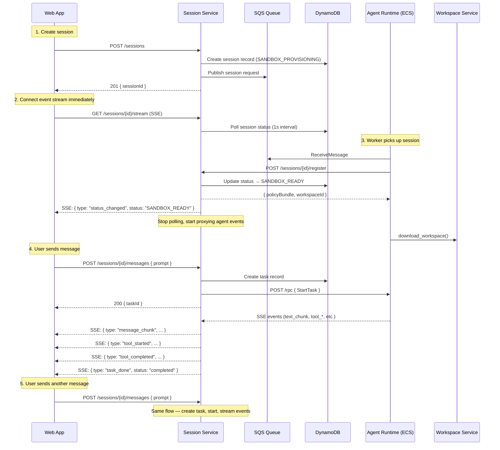

### Desktop session lifecycle

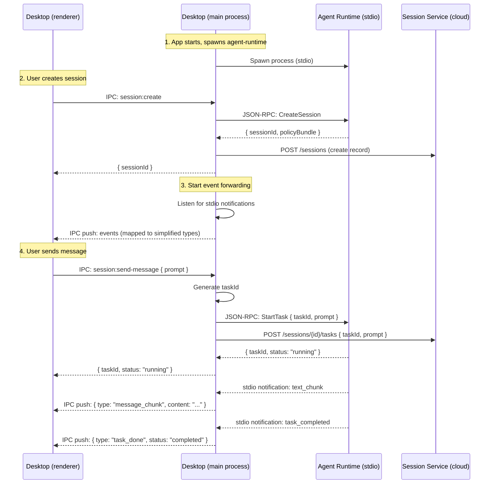

### Approval flow

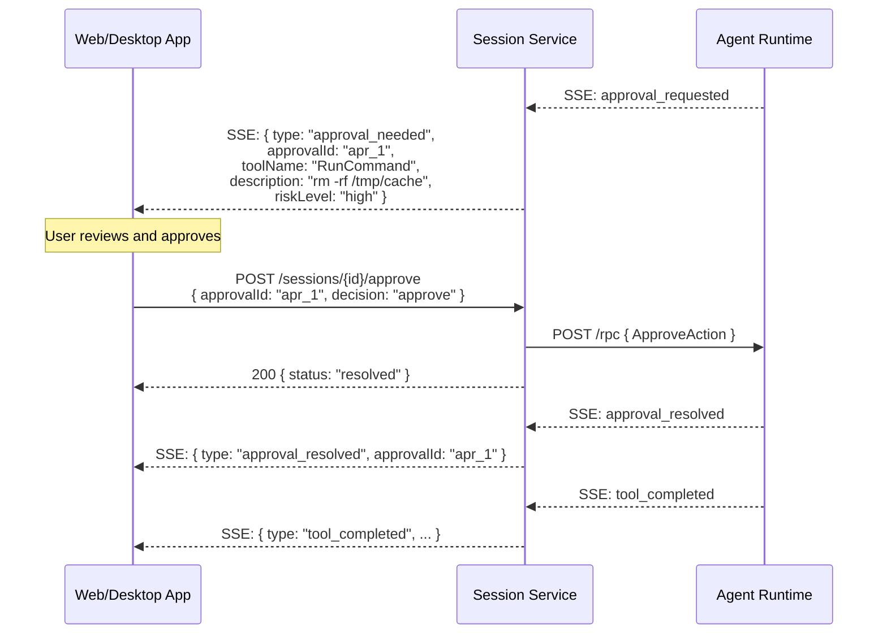

### Resume flow

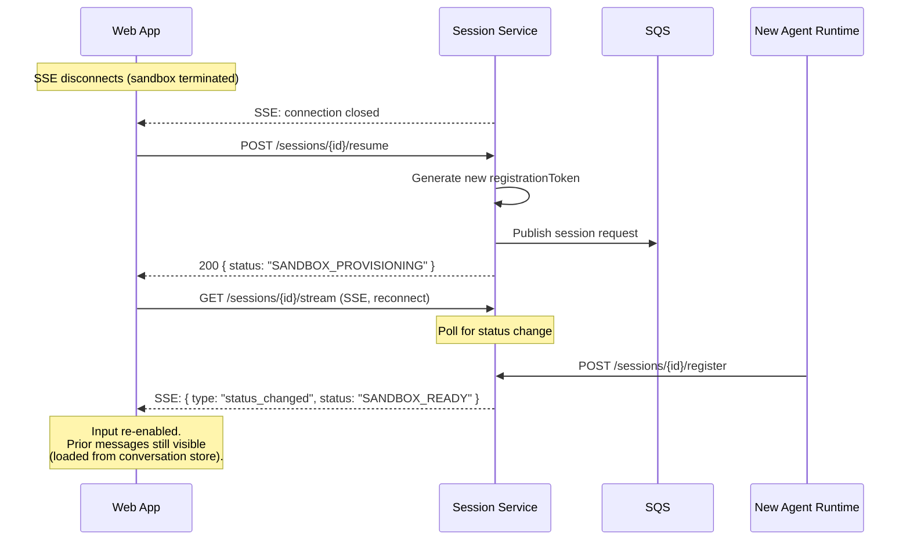

---

## Event Stream Architecture

### Current: Raw proxy

```
Agent Runtime → /events (SSE) → Session Service (transparent proxy) → Web App
```

Session Service blindly proxies all SSE bytes. The frontend receives every internal event type.

### Proposed: Mapped stream

```
Agent Runtime → /events (SSE) → Session Service (event mapper) → /stream (SSE) → Web App
```

Session Service reads the agent-runtime SSE stream, maps events to simplified types, drops internal-only events, and writes the simplified stream to the client.

### Event mapper implementation

```python
# In Session Service: event_mapper.py

MAPPINGS = {
    "text_chunk": lambda e: {"type": "message_chunk", "content": e.get("content", ""), "taskId": e.get("taskId")},
    "tool_requested": lambda e: {"type": "tool_started", "toolName": e.get("toolName"), "toolCallId": e.get("toolCallId"), "taskId": e.get("taskId")},
    "tool_completed": lambda e: {"type": "tool_completed", "toolCallId": e.get("toolCallId"), "output": e.get("output"), "taskId": e.get("taskId")},
    "approval_requested": lambda e: {"type": "approval_needed", "approvalId": e.get("approvalId"), "toolName": e.get("toolName"), "riskLevel": e.get("riskLevel")},
    "approval_resolved": lambda e: {"type": "approval_resolved", "approvalId": e.get("approvalId"), "decision": e.get("decision")},
    "task_completed": lambda e: {"type": "task_done", "taskId": e.get("taskId"), "status": "completed"},
    "task_failed": lambda e: {"type": "task_done", "taskId": e.get("taskId"), "status": "failed", "error": e.get("reason")},
    "step_limit_approaching": lambda e: {"type": "warning", "message": "Approaching step limit"},
}

# Events not in MAPPINGS are dropped (step_started, checkpoint_saved, etc.)
```

### Raw events still available

The existing `GET /sessions/{id}/events` endpoint continues to serve raw, unfiltered events. This is useful for:
- Debugging and observability dashboards
- Future advanced UI features that need fine-grained events
- Internal service-to-service communication

---

## Endpoint Summary

### New (action-oriented, frontend-facing)

| Method | Path | Purpose |
|---|---|---|
| `POST` | `/sessions/{id}/messages` | Send message → creates task + starts agent |
| `POST` | `/sessions/{id}/cancel` | Cancel running task or session |
| `POST` | `/sessions/{id}/approve` | Resolve approval decision |
| `GET` | `/sessions/{id}/stream` | Simplified SSE event stream |

### Existing (unchanged, backend-oriented)

| Method | Path | Purpose | Used by |
|---|---|---|---|
| `POST` | `/sessions` | Create session | Both (unchanged) |
| `GET` | `/sessions/{id}` | Get session metadata | Both (unchanged) |
| `POST` | `/sessions/{id}/resume` | Resume session | Both (unchanged) |
| `POST` | `/sessions/{id}/cancel` | Cancel session | Internal |
| `POST` | `/sessions/{id}/register` | Sandbox self-registration | Agent runtime only |
| `POST` | `/sessions/{id}/rpc` | Raw JSON-RPC proxy | Internal / debugging |
| `GET` | `/sessions/{id}/events` | Raw SSE event stream | Internal / debugging |
| `POST` | `/sessions/{id}/tasks` | Create task record | Internal (called by `/messages`) |
| `POST` | `/sessions/{id}/upload` | File upload | Internal (aliased by `/files`) |

---

## Migration Path

### Phase 1: Add new endpoints (no breaking changes)

1. Add `POST /messages`, `POST /cancel`, `POST /approve`, `GET /stream` to Session Service
2. Internal orchestration: `/messages` creates task record + proxies StartTask RPC
3. Event mapper filters and simplifies SSE events for `/stream`
4. Status change injection during provisioning (poll-based)
5. Existing endpoints unchanged

### Phase 2: Migrate Web App

1. Update `cowork-web-app` API client to use new endpoints
2. Remove JSON-RPC construction from frontend
3. Remove task ID generation from frontend
4. Remove polling loop — use SSE `status_changed` events
5. Remove raw event type mapping — use simplified events

### Phase 3: Migrate Desktop App

1. Refactor Desktop App IPC handlers to match simplified contract (`session:send-message`, `session:cancel`, `session:approve`)
2. Main process generates task IDs and orchestrates agent-runtime + Session Service internally
3. Event mapping: main process converts stdio JSON-RPC notifications to simplified event types
4. Remove protocol-aware IPC channels (`agent:start-task`, etc.) from renderer
5. Extract shared `SessionClient` TypeScript interface used by both web and desktop React components

### Phase 4: Cleanup

1. Mark `/rpc` and `/events` endpoints as internal-only in docs
2. Remove `X-User-Id` header — auth from OIDC token (Step 14)
3. Desktop renderer and web app share React components via shared `SessionClient` interface

---

## Repos Affected

| Repo | Changes | Phase |
|---|---|---|
| `cowork-session-service` | New endpoints (`/messages`, `/cancel`, `/approve`, `/stream`), event mapper, status injection | 1 |
| `cowork-platform` | Simplified event type enum, `/messages` request/response schemas, shared `SessionClient` interface types | 1 |
| `cowork-web-app` | Update API client to use new endpoints, remove JSON-RPC, use `/stream` | 2 |
| `cowork-desktop-app` | Refactor IPC handlers to simplified contract, event mapping in main process, shared React components | 3 |
| `cowork-agent-runtime` | No changes — stdio and HTTP transports unchanged | —

---

## Open Questions

| # | Question | Status |
|---|---|---|
| 1 | Should `/stream` include a `session_history` event on connect that replays the full conversation? This would let the frontend render immediately without a separate history fetch. | To discuss |
| 2 | Should `/messages` support streaming the response (SSE on the POST response) instead of requiring a separate `/stream` connection? | To discuss — simpler for simple clients, but breaks the event stream model |
| 3 | For desktop Phase 3: should Session Service manage the agent-runtime process lifecycle, or should the Desktop App continue to own it? | To discuss — Desktop App owning process gives better OS integration |
| 4 | Should `/cancel` distinguish between "cancel task" and "cancel session" based on state, or should these be separate endpoints? | To discuss |
| 5 | Should the event mapper be configurable (e.g., `?detail=full` returns all events, `?detail=simple` returns mapped events)? | To discuss |
