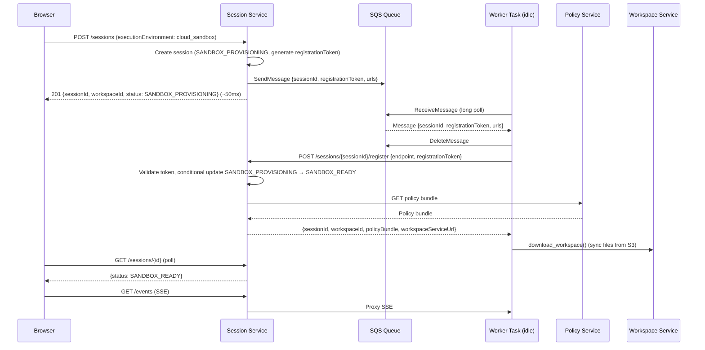
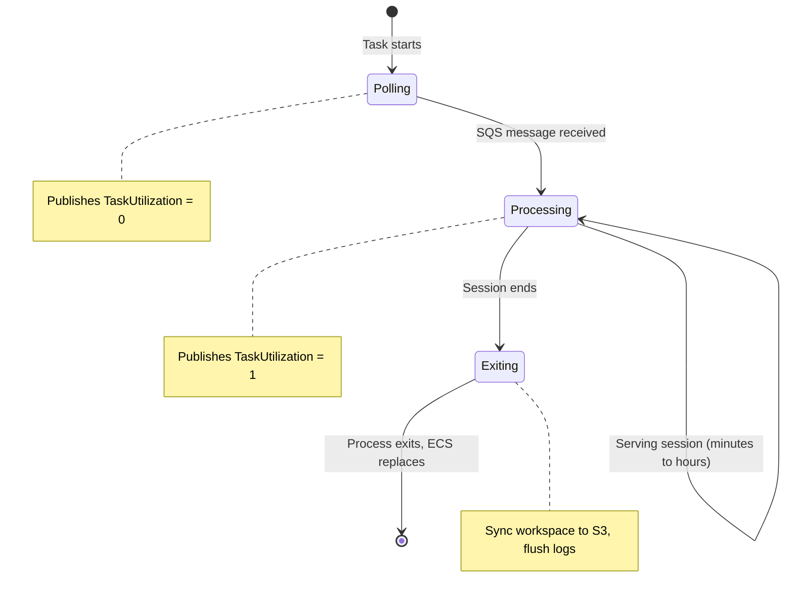

# SQS Sandbox Dispatch — Design Doc

**Status:** Proposed
**Scope:** Session Service, Agent Runtime, Infrastructure (Terraform)
**Date:** 2026-03-21
**Replaces:** RunTask-per-session provisioning (web-execution.md Section 3.1), warm-pool-options.md

---

## Problem

The current sandbox provisioning model calls `ecs:RunTask` synchronously during session creation. This has three problems at scale:

1. **Session creation latency** — `RunTask` API call takes 1–5 seconds, blocking the `POST /sessions` response
2. **ECS API rate limits** — `RunTask` has a per-account rate limit. At 250K users with bursty session creation, throttling becomes a real risk
3. **Cold start complexity** — each session launches a new Fargate task (15–45s provisioning), leading to warm pool designs that add significant operational overhead (DynamoDB coordination tables, distributed locks, heartbeat protocols, stale container cleanup)

---

## Goals

1. Session creation (`POST /sessions`) responds in <100ms — no blocking on infrastructure provisioning
2. Eliminate cold starts for the common case — idle worker tasks are always available to pick up new sessions
3. Scale to 250K users with standard AWS auto-scaling — no custom pool management
4. Simplify the architecture — remove EcsSandboxLauncher, LocalSandboxLauncher, warm pool infrastructure
5. Maintain security isolation — each session served by a dedicated task, no state leakage between sessions

## Non-Goals

- Multi-session-per-task (sharing a container between sessions) — isolation is more important than density
- Custom auto-scaling logic — rely on ECS Service native scaling
- Zero-interruption deployments — backlogged as version-aware task drain (Step 19 in execution plan)

---

## Design Overview

Replace the per-session `RunTask` call with an **SQS worker pool** pattern. The agent runtime runs as a long-lived ECS Service that polls an SQS queue for session requests. Session creation publishes a message to SQS instead of calling `RunTask`.

```
                          ┌─────────────────────┐
                          │      Web App         │
                          └──────────┬───────────┘
                                     │ POST /sessions
                                     ▼
                          ┌─────────────────────┐
                          │   Session Service    │
                          │  publish to SQS      │──────► SQS Queue
                          │  (~50ms)             │        (dev-sandbox-requests)
                          └─────────────────────┘              │
                                                               │ poll
                                                               ▼
                          ┌──────────────────────────────────────────┐
                          │         ECS Service: sandbox-workers     │
                          │                                          │
                          │  ┌─────────┐ ┌─────────┐ ┌─────────┐   │
                          │  │ Task 1  │ │ Task 2  │ │ Task 3  │   │
                          │  │ (idle)  │ │ (busy)  │ │ (idle)  │   │
                          │  └─────────┘ └─────────┘ └─────────┘   │
                          │                                          │
                          │  Auto-scales on utilization (70% target) │
                          │  scale_in_enabled = false                │
                          └──────────────────────────────────────────┘
```

### Key Property

**No cold start in steady state.** Utilization-based auto-scaling maintains headroom (e.g., 70% target = 30% of tasks are idle and polling). New sessions are picked up by idle tasks immediately. ECS only launches new tasks to restore the headroom buffer — and that cold start happens in the background, not on the user's request path.

---

## Design Decisions and Rationale

### D1: SQS Standard Queue (Not FIFO)

A single standard queue per environment: `{env}-sandbox-requests`.

| Option | Throughput | Ordering | Dedup | Verdict |
|--------|-----------|----------|-------|---------|
| Standard | Unlimited | Best-effort | At-least-once | Sufficient — registration token prevents duplicate session serving |
| FIFO | 300 msg/s (3,000 with batching) | Strict | Exactly-once | Unnecessary ordering guarantee; throughput limit could become a bottleneck |

At-least-once delivery means a message could be received by two tasks in rare cases. The self-registration endpoint (`POST /sessions/{id}/register`) already validates that the session is in `SANDBOX_PROVISIONING` state via a DynamoDB conditional update — only one task wins. The other receives a 409 and discards the message.

### D2: Message as Dispatch Trigger (Not Long-Lived)

The SQS message is a short-lived dispatch trigger, not held for the session duration:

1. Task receives message from SQS
2. Task **deletes the message immediately**
3. Task self-registers with Session Service
4. Task serves the session (minutes to hours)
5. Task terminates when session ends

This keeps visibility timeout short (60 seconds) and avoids fighting SQS semantics for long-lived work. If the task crashes between receiving and registering, the provisioning timeout (180s) in the `SandboxLifecycleManager` catches it and the session is marked `SESSION_FAILED`.

### D3: Task Terminates After Each Session

After serving a session, the task process exits. ECS replaces it with a fresh container to maintain desired count.

**Alternatives considered:**

| Approach | Description | Verdict |
|----------|-------------|---------|
| **Terminate (chosen)** | Task exits after session, ECS replaces | Zero state leakage risk, no cleanup code, fresh container every time |
| **Cleanup and reuse** | Task wipes filesystem and memory, polls for next session | Better resource efficiency but requires cleanup sequence, risk of state leaking between tenants |

The terminate approach trades a small amount of resource efficiency (ECS replaces the task, ~10s to start a new one) for strong security isolation and zero operational complexity. The replacement task starts fresh and joins the idle pool — the utilization-based scaling ensures this doesn't impact users.

### D4: Utilization-Based Scale-Out Only

ECS Service auto-scaling uses target tracking on a custom `TaskUtilization` metric with `scale_in_enabled = false`.

**How it works:**

- Each task publishes a CloudWatch metric: `1` (serving a session) or `0` (idle/polling SQS)
- Average across all tasks gives utilization percentage
- Target: 70% — ECS maintains ~30% idle capacity
- When utilization exceeds 70%, ECS adds tasks to bring it back down
- `scale_in_enabled = false` means ECS never force-terminates tasks

**Why no scale-in:** Tasks self-terminate after sessions end. ECS replaces them to maintain desired count. If desired count is higher than needed (traffic dropped), the extra tasks sit idle polling SQS. They're replaced by fresh containers when they eventually serve a session and terminate. The cost of a few idle tasks is negligible compared to the complexity of safe scale-in.

**Minimum capacity** is always maintained (e.g., 5 in prod). This ensures idle tasks are always available — no cold start even after quiet periods.

| Setting | Dev | Prod |
|---------|-----|------|
| Min capacity | 1 | 5 |
| Max capacity | 5 | configurable per tenant/environment |
| Target utilization | 70% | 70% |
| Scale-out cooldown | 60s | 60s |

### D5: Custom CloudWatch Metric for Utilization

The agent runtime publishes `TaskUtilization` to CloudWatch namespace `Cowork/Sandbox`:

```python
# After picking up SQS message (start of session)
cloudwatch.put_metric_data(
    Namespace="Cowork/Sandbox",
    MetricData=[{
        "MetricName": "TaskUtilization",
        "Value": 1.0,
        "Unit": "None",
        "Dimensions": [
            {"Name": "ServiceName", "Value": "sandbox-workers"},
            {"Name": "Environment", "Value": env},
        ],
    }],
)

# After session ends (before process exit)
cloudwatch.put_metric_data(
    Namespace="Cowork/Sandbox",
    MetricData=[{
        "MetricName": "TaskUtilization",
        "Value": 0.0,
        ...
    }],
)
```

This requires `cloudwatch:PutMetricData` on the ECS task role.

### D6: Registration Token Replaces Task ARN Validation

In the current RunTask model, Session Service stores `expectedTaskArn` after launching a task, and validates it at registration. With SQS dispatch, Session Service doesn't know which task will pick up the message, so task ARN validation is no longer possible.

The `registrationToken` (UUID generated at session creation, passed via SQS message, validated at registration) is sufficient to prevent impersonation. The token is single-use (session transitions from `SANDBOX_PROVISIONING` to `SANDBOX_READY` only once via conditional update) and never exposed to the browser.

The `expectedTaskArn` field and its validation are removed.

### D7: Graceful Shutdown on SIGTERM

Tasks may receive SIGTERM during ECS deployments or maintenance. The agent runtime handles this gracefully:

1. Catch SIGTERM signal
2. Sync workspace files to S3 (via Workspace Service)
3. Flush structured logs
4. Exit

Fargate allows up to 120 seconds for graceful shutdown (`stopTimeout`). This is sufficient for workspace sync. The session is left in whatever state it was in — the `SandboxLifecycleManager` eventually transitions it to `SESSION_FAILED` if the sandbox doesn't cleanly terminate the session.

**Future improvement (backlogged as Step 19):** Version-aware task drain — after a session ends, the task checks its task definition revision against the service's current revision. If outdated, it exits instead of serving another session. This enables zero-interruption deployments without SIGTERM.

---

## SQS Message Schema

```json
{
  "sessionId": "sess_789",
  "registrationToken": "uuid-generated-at-session-creation",
  "sessionServiceUrl": "https://session-service.internal",
  "workspaceServiceUrl": "https://workspace-service.internal",
  "llmGatewayEndpoint": "https://llm-gateway.internal",
  "publishedAt": "2026-03-21T10:30:00Z"
}
```

Message attributes:
- `tenantId` (string) — for future per-tenant queue routing or filtering
- `priority` (string) — for future priority-based processing

---

## Modified Flows

### Session Creation (New)



### Worker Task Lifecycle



### Auto-Scaling Behavior

```
Utilization at 50% (5/10 tasks busy)
  → Below 70% target → no scaling action
  → 3 more sessions arrive → utilization 80%
  → Exceeds 70% target → ECS adds tasks
  → New tasks start, join idle pool
  → Utilization drops to ~60%

All sessions end, traffic drops to zero:
  → 10 tasks idle, utilization 0%
  → No scale-in (scale_in_enabled = false)
  → Tasks sit idle at min capacity cost
  → Next session picked up instantly
```

---

## Changes by Repo

### Session Service (`cowork-session-service`)

**Remove:**
- `clients/ecs_launcher.py` — EcsSandboxLauncher
- `clients/local_launcher.py` — LocalSandboxLauncher
- `services/sandbox_launcher.py` — SandboxLauncher protocol
- `provision_sandbox()` logic in SandboxService — RunTask call, expectedTaskArn storage
- `expectedTaskArn` validation in registration endpoint
- `expectedTaskArn` field on session DynamoDB record

**Add:**
- `clients/sqs_publisher.py` — SQS message publisher
  - `publish_session_request(session_id, registration_token, urls) -> None`
  - Handles retries on SQS throttling (exponential backoff)
- `SandboxService.provision_sandbox()` — simplified to: validate concurrent limit → publish SQS message
- Configuration: `SQS_QUEUE_URL`, `SQS_ENDPOINT_URL` (for LocalStack)

**Modify:**
- Registration endpoint — remove `taskArn` from request schema and validation
- Session record — remove `expectedTaskArn` field

### Agent Runtime (`cowork-agent-runtime`)

**Add:**
- `agent_host/sandbox/sqs_consumer.py` — SQS polling loop
  - Long-poll SQS (20s wait time)
  - On message: delete message, extract session config
- `agent_host/sandbox/metrics.py` — CloudWatch metric publisher
  - Publish `TaskUtilization` (1 = busy, 0 = idle)

**Modify:**
- `agent_host/sandbox/startup.py` — if `SQS_QUEUE_URL` is set, poll SQS for session config; otherwise read from env vars (current behavior, useful for debugging/manual start)
- After session ends, process exits (ECS replaces the task)
- Graceful shutdown — already exists, verify workspace sync completes within 120s

### Infrastructure (`cowork-infra`)

**Add:**
- SQS queue: `{env}-sandbox-requests` (standard queue)
- SQS dead-letter queue: `{env}-sandbox-requests-dlq` (maxReceiveCount: 3)
- ECS Service: `{env}-sandbox-workers` (replaces standalone RunTask usage)
  - Task definition: same image, entrypoint `--transport http`
  - Desired count managed by auto-scaling
  - No ALB attachment (tasks don't serve external HTTP — Session Service proxies to them)
- Auto-scaling: target tracking on `Cowork/Sandbox/TaskUtilization`
  - Target: 70%, scale_in_enabled: false
  - Min/max capacity per environment
- IAM additions to task role:
  - `sqs:ReceiveMessage`, `sqs:DeleteMessage`, `sqs:GetQueueAttributes` on the queue ARN
  - `cloudwatch:PutMetricData` (for TaskUtilization metric)
- IAM additions to Session Service task role:
  - `sqs:SendMessage` on the queue ARN
- `scripts/localstack-init.sh` — create SQS queues

**Remove:**
- `ecs:RunTask` permission from Session Service task role (no longer needed)
- Warm pool Terraform resources (if any were drafted)

**Modify:**
- Sandbox task definition — entrypoint changes to `--transport http`
- Security group — sandbox tasks still need inbound from Session Service on port 8080

### Platform Contracts (`cowork-platform`)

- Remove `taskArn` from registration request schema
- Add SQS message schema (for documentation/validation, optional)

### LocalStack Init (`docker-compose.yml` / `localstack-init.sh`)

```bash
# New in localstack-init.sh
awslocal sqs create-queue --queue-name dev-sandbox-requests-dlq
awslocal sqs create-queue --queue-name dev-sandbox-requests \
  --attributes '{
    "RedrivePolicy": "{\"deadLetterTargetArn\":\"arn:aws:sqs:us-east-1:000000000000:dev-sandbox-requests-dlq\",\"maxReceiveCount\":\"3\"}"
  }'
```

---

## Local Development

The local development experience is **simpler** than before — no `LocalSandboxLauncher`, same code path as production:

```bash
# 1. Start infrastructure (LocalStack: DynamoDB + S3 + SQS)
docker-compose up -d

# 2. Start backend services
cd cowork-session-service && make run     # publishes to SQS on LocalStack
cd cowork-workspace-service && make run
cd cowork-policy-service && make run

# 3. Start agent runtime in sandbox mode (polls SQS on LocalStack)
cd cowork-agent-runtime && make run-sandbox
# Polls http://localhost:4566 SQS queue, picks up sessions, serves them

# 4. Start web app
cd cowork-web-app && make dev
```

**Key env vars:**
- `AWS_ENDPOINT_URL=http://localhost:4566` — all services use LocalStack
- `SQS_QUEUE_URL=http://localhost:4566/000000000000/dev-sandbox-requests`
- `ENVIRONMENT=dev`

The agent runtime runs the **exact same code** locally and in production. The only difference is the SQS endpoint URL.

---

## Error Handling

| Scenario | Handling |
|----------|---------|
| SQS SendMessage fails | Session Service retries (3x exponential backoff). If all retries fail, session marked `SESSION_FAILED`. |
| Task crashes after receiving message but before registering | Message already deleted. `SandboxLifecycleManager` provisioning timeout (180s) marks session `SESSION_FAILED`. |
| Task crashes during session | Session left in `SESSION_RUNNING`. `SandboxLifecycleManager` max-duration timeout eventually cleans up. Future: EventBridge detects ECS task stop event for faster detection (Step 17). |
| Duplicate message delivery (rare, standard queue) | Second task attempts registration, conditional update fails (session already in `SANDBOX_READY`), task discards message and exits. ECS replaces it. |
| DLQ messages (3 failed receive attempts) | Alarm on DLQ depth. Investigate — likely a bug in the consumer, not transient. |
| Session Service publishes to SQS but no tasks available | Message sits in queue until a task becomes available or auto-scaling adds capacity. `SandboxLifecycleManager` provisioning timeout applies. |

---

## Observability

### New Metrics

| Metric | Source | Purpose |
|--------|--------|---------|
| `Cowork/Sandbox/TaskUtilization` | Agent runtime → CloudWatch | Auto-scaling signal + utilization dashboard |
| `sandbox.sqs_publish_duration` | Session Service | Time to publish SQS message |
| `sandbox.sqs_receive_to_register` | Agent runtime | Time from message receipt to successful registration |
| `sandbox.queue_depth` | CloudWatch (SQS built-in) | Messages waiting — alarm if >0 sustained |
| `sandbox.dlq_depth` | CloudWatch (SQS built-in) | Failed messages — alarm if >0 |
| `sandbox.worker_idle_count` | Agent runtime → CloudWatch | Number of tasks in polling state |

### Alarms

| Alarm | Threshold | Action |
|-------|-----------|--------|
| Queue depth > 0 for 5 min | Sustained backlog | Investigate scaling — are tasks processing too slowly? |
| DLQ depth > 0 | Any failed message | Bug investigation — consumer likely has a defect |
| TaskUtilization > 90% for 10 min | Near capacity | Scaling may be hitting max capacity — consider increasing max |
| Worker idle count = 0 for 5 min | No spare capacity | All tasks busy — new sessions will wait in queue |

---

## Migration Path

### Step 1: Infrastructure (Terraform)

- Create SQS queues (standard + DLQ)
- Create ECS Service `{env}-sandbox-workers` with new task definition (`--transport http`)
- Add IAM permissions (SQS, CloudWatch)
- Update `localstack-init.sh`

### Step 2: Agent Runtime (SQS consumer)

- Implement SQS consumer, CloudWatch metric publisher in sandbox mode
- When `SQS_QUEUE_URL` is set, poll SQS for session config; otherwise read from env vars
- Test locally against LocalStack

### Step 3: Session Service (SQS publish)

- Replace `provision_sandbox()` with SQS publish
- Remove EcsSandboxLauncher, LocalSandboxLauncher
- Remove `expectedTaskArn` from registration validation
- Test locally end-to-end

### Step 4: Cleanup

- Remove `warm-pool-options.md` design doc
- Update CLAUDE.md files in affected repos
- Remove unused IAM permissions (`ecs:RunTask` from Session Service)

**Note:** Design docs (`web-execution.md`, `architecture.md`, `session-service.md`, `domain-model.md`, `local-agent-host.md`) have already been updated to reflect the SQS dispatch architecture.

---

## What This Eliminates

| Component | Status |
|-----------|--------|
| `EcsSandboxLauncher` | Removed |
| `LocalSandboxLauncher` | Removed |
| `SandboxLauncher` protocol | Removed |
| `expectedTaskArn` field and validation | Removed |
| `ecs:RunTask` per session | Removed |
| Warm pool (Steps 13/18 in old plan) | Eliminated by design — utilization headroom serves the same purpose |
| `warm-pool-options.md` | Superseded by this doc |

---

## Future Improvements (Backlogged)

| Improvement | Step | Description |
|-------------|------|-------------|
| Session resume | 15 | Wire history loading into `init_from_registration()` for resumed sandbox sessions, add SQS dispatch to resume endpoint, web app reconnection UX. History upload every N steps and history fetch already exist. |
| EventBridge crash detection | 17 | ECS task state change events for faster crash detection than the current 5-minute polling cycle |
| Version-aware task drain | 18 | Tasks log their revision at startup and on exit. Foundation for future multi-session-per-task model where tasks could check revision before picking up new work. |
| Lifecycle manager → EventBridge | 19 | Replace polling-based timeout checks (provisioning, idle, max-duration) with per-session EventBridge Scheduler events. Eliminates DynamoDB scans. |
| Per-tenant queue routing | — | Separate SQS queues per tenant for isolation or priority-based processing |
