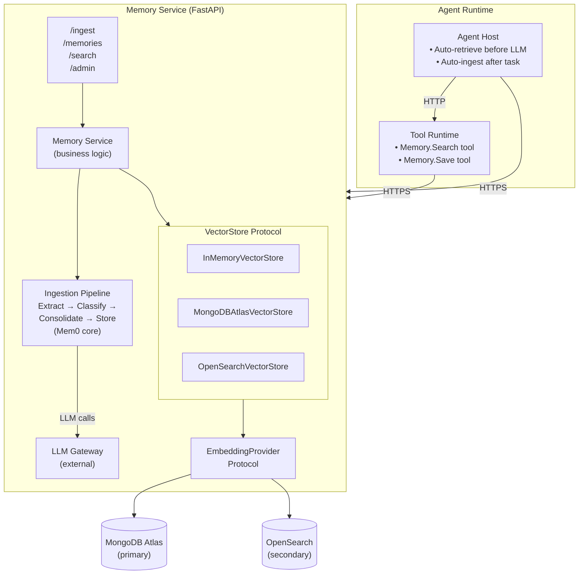
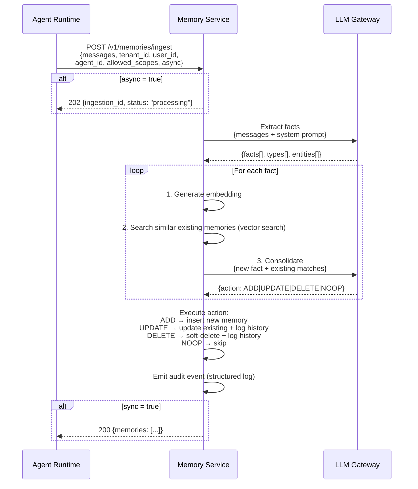
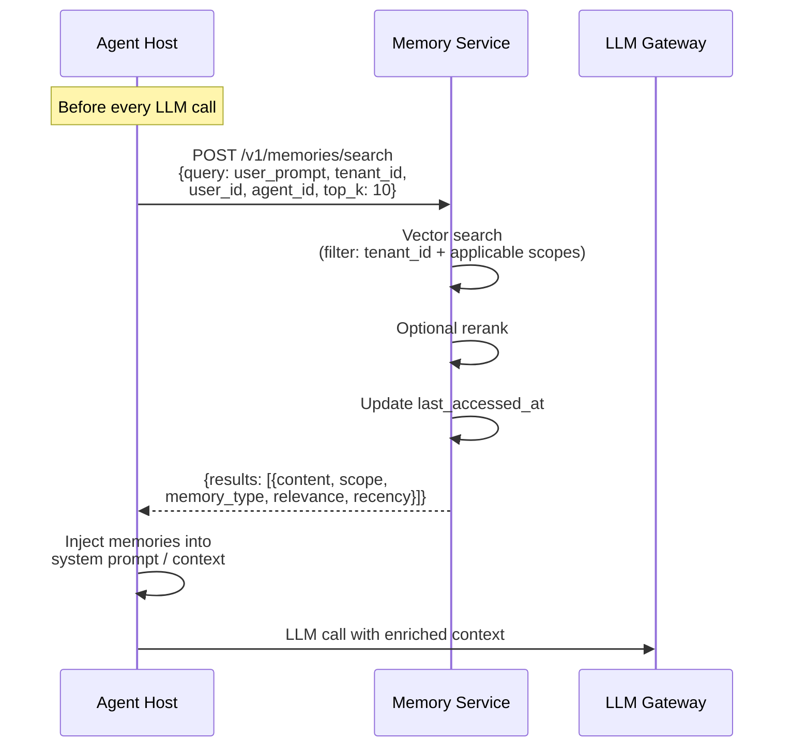

# Memory Service — Architecture Decisions

> **Status**: Architecture decisions finalized. Implementation not started.
> **Date**: 2026-03-14

## Overview

The Memory Service is a multi-tenant backend service that provides persistent, cross-session memory for agents. It enables agents to learn from past interactions, retain user preferences, and accumulate organizational knowledge across sessions.

## Research Context

Architecture decisions were informed by analysis of leading open-source agent memory systems:

- **Mem0** (Apache 2.0) — LLM-driven extraction/consolidation pipeline. Dual-store (vector + optional graph). Flat scoping via entity IDs.
- **Graphiti/Zep** (MIT) — Temporal knowledge graph. Bi-temporal fact tracking, contradiction resolution. Hybrid retrieval (semantic + BM25 + graph traversal).
- **Letta/MemGPT** — OS-inspired tiered memory. Agents self-edit their own memory via tools.
- **CrewAI** — Composite scoring (semantic + recency + importance). Hierarchical tree-path scoping.
- **LangGraph Store** — Namespace-scoped key-value store with optional vector search.

Key industry patterns identified:
- Cognitive-science taxonomy (semantic/episodic/procedural) based on Princeton CoALA framework
- Extraction → consolidation → retrieval pipeline (Mem0)
- Bi-temporal fact tracking with contradiction resolution (Graphiti)
- Hybrid search (vector + keyword + graph) outperforms any single method
- Context graphs provide relationship traversal, temporal awareness, and auditability that pure vector search cannot

---

## Architectural Decisions

### D1: Memory Scoping Hierarchy

**Decision**: Four-level scope hierarchy. Session/task-level memory stays in the agent runtime.

```
Tenant → User → Agent+User → Usecase+Agent+User
```

- **Tenant**: Organizational knowledge shared across all users and agents (e.g., "We use AWS CDK")
- **User**: Individual preferences and facts across all agents (e.g., "Prefers dark mode")
- **Agent+User**: Knowledge specific to one agent's relationship with one user
- **Usecase+Agent+User**: Most specific — scoped to a particular use case, agent, and user combination

Session/task-level ephemeral working memory is managed by the agent runtime, not the memory service.

Every memory record carries a `scope` field: `tenant`, `user`, `agent_user`, `usecase_agent_user`.

**Alternatives considered**:
- **Include session/task scope in memory service**: Rejected. Session/task memory is ephemeral and only needed during active execution. Pushing it to a backend service adds latency to every agent step for no benefit. The memory service is for persistent, cross-session knowledge. Mem0 and Zep make the same distinction.
- **No tenant-level scope**: Rejected. Enterprise customers need shared organizational knowledge (tech stack, conventions, compliance rules) that applies to all users and agents. Without tenant scope, this knowledge would need to be repeated per-user.
- **Deeper hierarchy (team/project level)**: Deferred. Could be added later as additional scope levels without architectural changes. Not needed for Phase 1.

**Tradeoffs**:
- (+) Clean separation: persistent knowledge in memory service, ephemeral context in agent runtime
- (+) Tenant scope enables organizational knowledge without per-user duplication
- (-) Four levels add query complexity (retrieve across all applicable scopes per request)

---

### D2: Scope Conflict Resolution

**Decision**: Return all memories tagged with scope, let the agent resolve contextually (Option B).

When a query matches memories at multiple scope levels (e.g., tenant says "use PostgreSQL", user says "prefer MongoDB"), the memory service returns all of them with their scope labels. The agent (LLM) resolves conflicts contextually.

No conflict resolution logic in the memory service — it stays simple.

**Alternatives considered**:
- **Option A — Most-specific scope wins (CSS specificity model)**: Usecase+Agent+User overrides Agent+User overrides User overrides Tenant. Clean and predictable, but the agent never sees the broader context it's overriding. Hard override rules can suppress useful nuance — e.g., a user preference might be relevant even when a more specific memory exists.
- **Option B — Return all, let the agent decide (chosen)**: Return all relevant memories with scope labels. The LLM is well-suited to contextual conflict resolution and can weigh competing information based on the current task.

**Tradeoffs**:
- (+) Memory service stays simple — no conflict resolution logic to maintain
- (+) Agent has full context to make nuanced decisions
- (+) No risk of useful information being suppressed by rigid override rules
- (-) More tokens consumed in agent context (returning multiple scopes)
- (-) Agent must be capable of resolving conflicts (relies on LLM quality)

---

### D3: Memory Types

**Decision**: Three types from day 1 — semantic, episodic, procedural.

| Type | What It Stores | Example |
|------|---------------|---------|
| **Semantic** | Facts, preferences, knowledge | "User prefers TypeScript" |
| **Episodic** | Past interaction outcomes, experiences | "Last deployment failed due to missing migration" |
| **Procedural** | Learned workflows, patterns, instructions | "Always run canary before prod deploy" |

Classification is performed by the LLM at extraction time (same call that extracts the memory — negligible additional cost). Agents can also explicitly declare type when saving memories via tools.

Type is stored on every record as `memory_type: semantic | episodic | procedural`.

**Alternatives considered**:
- **Semantic only, add others later**: Semantic memory is the highest-value, lowest-complexity starting point. Every system in the research started here. However, since classification is just one additional field in the same LLM extraction call, the cost of supporting all three from day 1 is negligible.
- **All three from day 1 (chosen)**: The LLM already understands the content during extraction — asking it to also classify the type adds almost no cost. Having the type field from day 1 enables type-aware retrieval and consolidation rules without backfilling.

**Who classifies**: The LLM at extraction time (inside the memory service). This handles the automatic pipeline (conversations → memories). When agents explicitly save a memory via a tool call, they declare the type themselves. Both paths are covered.

**Tradeoffs**:
- (+) Type-aware retrieval scoring possible from day 1 (e.g., weight recency higher for episodic)
- (+) Type-aware consolidation rules (e.g., episodic memories accumulate, semantic deduplicate)
- (+) Negligible additional cost — same LLM call, one extra field
- (-) LLM classification may occasionally miscategorize — but this is low-risk since the type is advisory, not critical

---

### D4: LLM Ownership

**Decision**: Memory service owns its LLM calls, routed through the existing LLM Gateway. Model configurable per tenant.

The ingestion pipeline (extraction, classification, consolidation) runs inside the memory service. Callers send raw messages; the service handles all LLM interactions.

**Alternatives considered**:
- **Option A/B — Memory service owns LLM calls (chosen)**: Architecturally identical, only difference is model selection (which is a configuration choice, not architectural). Service calls LLM Gateway directly. Consistent extraction logic across all agents and runtimes. Easier to improve centrally.
- **Option C — Agent runtime does extraction, sends structured memories**: Memory service stays simpler (no LLM dependency), no LLM cost on the service. But every agent implementation must handle extraction correctly, and consistency is lost. Quality improvements require updating every agent, not just one service.

**Tradeoffs**:
- (+) Consistent extraction quality across all agents — update one prompt, all benefit
- (+) Self-contained service — callers just send raw messages
- (+) Model configurable per tenant — cost-conscious tenants use cheaper models
- (-) Memory service has LLM cost and latency dependency
- (-) LLM Gateway becomes a dependency for memory operations

---

### D5: Context Graph

**Decision**: Phase 1 is vector-only. Context graph (Graphiti-style) added in Phase 2. Phase 1 captures entity and temporal metadata for clean upgrade path.

**Context graphs** are the most significant advancement in agent memory (2024-2025). They provide relationship traversal (A→B→C chains), temporal awareness (current vs historical facts), automated contradiction resolution, entity deduplication, and explainable retrieval paths — none of which pure vector search supports.

However, they add operational complexity (graph database dependency).

**Phase 1 captures entity + temporal metadata on every memory record**:
- `entities`: extracted entity names and types (from the same LLM extraction call)
- `valid_from` / `valid_until`: temporal validity timestamps

This data enables a smooth backfill into a graph database in Phase 2 without retroactive inference.

**Alternatives considered**:
- **Graph from day 1**: More upfront capability, but requires running a graph database (FalkorDB or Neo4j) immediately. Adds operational complexity before proving the core service works.
- **Vector-only, add graph later without metadata preparation**: Storage migration and retrieval pipeline changes are incremental. But temporal history is lost — all pre-existing memories would get the same backfill timestamp, not their actual validity period. Entity deduplication would require expensive retroactive LLM inference.
- **Vector-only with metadata capture, graph in Phase 2 (chosen)**: Captures the raw ingredients (entities, temporal data) from day 1 at negligible cost (same LLM extraction call). Graph addition in Phase 2 is a clean additive operation with pre-existing data.

**Tradeoffs**:
- (+) Simpler Phase 1 — no graph database to operate
- (+) Clean upgrade path — entity and temporal data already captured
- (+) Aligns with Mem0's architecture (graph is optional `enable_graph` flag)
- (-) No relationship traversal or contradiction resolution until Phase 2
- (-) Multi-hop queries ("user worked on Team Alpha → Team Alpha owns billing → user has billing context") not possible until Phase 2

**Phase 2 adds**: Graph database (FalkorDB or Neo4j), bi-temporal fact tracking, contradiction resolution via graph, hybrid retrieval (vector + BM25 + graph traversal). Graphiti (MIT license) is the reference implementation.

---

### D6: Vector Database

**Decision**: MongoDB Atlas (primary) and OpenSearch (secondary). Pluggable via `VectorStore` interface, switchable by environment variable.

**Why MongoDB Atlas**:
- **Unified store**: Vectors, structured metadata, and documents in one collection. Memory records are rich documents (scope fields, metadata, entity references, temporal timestamps, type, plus embedding vector). MongoDB handles this naturally as a single document, whereas pure vector DBs need a sidecar store for structured data.
- **Native hybrid search**: Atlas Vector Search + Atlas Search (BM25) in one query.
- **Mature multi-tenancy**: Well-documented patterns for `tenant_id` filtering, sharding, and views.
- **Rich query language**: Aggregation pipeline for complex metadata filtering, temporal queries, and scoring logic in a single query.
- **Change streams**: Useful for event-driven memory consolidation.

**Why also OpenSearch**:
- AWS-native managed service (aligns with existing infrastructure)
- Also supports hybrid search (vector + BM25)
- Keeps options open — validate both in practice before committing

Both implementations behind a `VectorStore` protocol/interface, selected by environment variable.

**Alternatives considered**:
- **Qdrant**: Best pure vector DB, excellent multi-tenancy (payload filtering, named shards). But adds non-AWS infrastructure, and memory records need a separate store for rich structured data.
- **pgvector**: Simplest if already running PostgreSQL. But scaling limits (performance degrades past ~10M vectors). Not appropriate for "scale from day 1."
- **Pinecone**: Excellent zero-ops vector DB. But external vendor dependency outside AWS, and vendor lock-in.
- **OpenSearch only**: AWS-native, hybrid search. Good option but doesn't have MongoDB's document model richness for complex memory records.
- **MongoDB Atlas only**: Considered, but implementing both backends validates assumptions and prevents lock-in.

**Tradeoffs**:
- (+) MongoDB's document model is a natural fit for rich memory records
- (+) Two backends prevent vendor lock-in and enable comparison
- (+) Both support hybrid search natively
- (-) MongoDB Atlas is a new infrastructure dependency outside the current AWS DynamoDB stack
- (-) Maintaining two vector store implementations has ongoing cost (but the interface keeps it manageable)

---

### D7: Multi-Tenant Isolation

**Decision**: Shared collection with `tenant_id` filtering (row-level isolation). Current scale: <3K tenants, ceiling <10K.

**MongoDB's official recommendation** for Atlas Vector Search multi-tenant architectures is single shared collection with `tenant_id` pre-filtering. This is their documented best practice.

**Alternatives considered**:
- **Row-level filtering (chosen)**: All tenants share one collection. Every document carries `tenant_id`, every query pre-filters on it. Scales to unlimited tenants. Shard by `tenant_id` when data volume requires horizontal scaling.
- **Collection-per-tenant**: Each tenant gets own collection + own vector search index. MongoDB's soft cap is ~10K collections per cluster — right at our ceiling. Each collection carries index overhead that multiplies. Additionally, collection-level isolation provides **no extra security** over row-level filtering within the same database — MongoDB's access control operates at the database level, not collection level.
- **Database-per-tenant**: Maximum isolation. Only needed for specific compliance regimes (FedRAMP, certain HIPAA). Most expensive.

For regulated customers requiring hard isolation: **dedicated cluster** — a sales/pricing tier decision, not an architectural one.

**Tradeoffs**:
- (+) Scales well to thousands of tenants
- (+) Operationally simple — one collection, one index, one schema
- (+) MongoDB-recommended approach
- (-) Isolation is application-level — a bug in query filtering could leak data. Defense-in-depth: integration tests that verify isolation + code review rigor.
- (-) Noisy neighbor risk — mitigated by sharding on `tenant_id`

---

### D8: ANN vs ENN Search

**Decision**: Default all tenants to ENN (Exact Nearest Neighbor). Switch to ANN when a tenant crosses ~10K memories.

When the overall collection is large but a given tenant has few vectors, ANN (Approximate Nearest Neighbor) accuracy degrades because highly selective filters reduce the candidate set. MongoDB recommends ENN for tenants with fewer than ~10K vectors.

**Implementation**: During ingestion, when a tenant's memory count crosses the 10K threshold, flip a config flag on their tenant configuration to ANN. The query path reads that flag and sets `exact: True/False` on the Atlas Vector Search query. No runtime counting — threshold detection happens at ingestion time via a counter on the tenant metadata record (incremented/decremented on memory create/delete).

The switch between ANN and ENN is a single parameter difference on the query — `exact: True` and no `numCandidates` for ENN.

**Tradeoffs**:
- (+) Accurate results for small tenants (most tenants initially)
- (+) Simple implementation — one config flag per tenant
- (+) No runtime counting overhead (counter maintained at write time)
- (-) ENN is slower than ANN for large datasets — but only used for tenants with <10K vectors, where it's fast

---

### D9: Importance Scoring

**Decision**: Skip importance scoring in Phase 1. Follow Mem0's default approach.

**Mem0's actual implementation**: No importance scoring anywhere in the codebase. Ranking is pure vector cosine similarity with optional reranking. The consolidation pipeline (ADD/UPDATE/DELETE/NOOP) serves as the quality filter — low-value information gets NOOP'd and never persists. This effectively filters noise at write time rather than scoring at read time.

**Alternatives considered**:
- **LLM-assigned importance score (1-10) at extraction time**: Helps distinguish "user mentioned it's raining" from "production DB requires manual approval." But LLM scoring is subjective and inconsistent — different models or calls may score the same fact differently. No way to validate if scores actually improve retrieval without extensive testing.
- **No importance scoring (chosen)**: Rely on consolidation pipeline for quality filtering at write time, and vector similarity + optional reranker at retrieval time. Simpler. Proven by Mem0 in production.

**Open door for future**: Importance can be added later as an optional nullable field (`importance: Optional[float]`). No schema migration needed — existing records stay `null`, new records get scores, retrieval treats `null` as a neutral value. Fully backward compatible.

**Tradeoffs**:
- (+) Simpler extraction pipeline
- (+) Proven approach (Mem0 production)
- (+) Avoids inconsistent LLM scoring
- (-) Cannot rank by importance until the field is added
- (-) Retrieval relies solely on relevance (vector similarity) plus recency

---

### D10: Retrieval Scoring

**Decision**: Return raw component scores, let the caller decide how to combine them.

The research shows a common composite formula: `score = α * relevance + β * recency + γ * importance` (Stanford "Generative Agents"). CrewAI uses weights 0.5/0.3/0.2. Different memory types could warrant different weights (e.g., episodic should weight recency higher).

Rather than baking a formula into the service, we return raw ingredients and let the caller combine.

The memory service returns per result:
- `relevance`: cosine similarity (from vector search)
- `recency`: derived from timestamps (`created_at`, `updated_at`, `last_accessed_at`)
- `scope`: the memory's scope level

Service applies sensible default ranking (relevance-based) for callers who don't specify custom scoring.

**Reasoning**: Same principle as D11 (sync/async) and D15 (allowed_scopes) — don't bake in a choice at the service level that the caller can make. Different agents, use cases, and tenants may want different scoring strategies. The service's job is to provide accurate raw signals.

**Tradeoffs**:
- (+) Maximum flexibility for callers
- (+) Service stays simple — no scoring formula to tune and maintain
- (+) Different agents can optimize scoring for their use case
- (-) Callers who don't care about scoring must still get reasonable defaults
- (-) More complexity pushed to callers (mitigated by good defaults)

---

### D11: Synchronous vs Asynchronous Ingestion

**Decision**: Caller decides per request via `async` flag. Default: async.

- `async: true` (default) — service accepts messages, returns acknowledgment, processes in background. Best for the common case (background conversation ingestion).
- `async: false` — caller waits until memories are extracted and stored. Needed for explicit "remember this" commands where the user expects confirmation.

**Reasoning**: This is a per-request decision, not an architectural one. No reason to constrain it at the service level. Mem0 supports both via `async_mode` flag. LangMem explicitly recommends async ("subconscious" processing) for the common case.

The risk with async (agent queries before ingestion completes) is mitigated because the agent already has the current conversation in working memory. Persisted memories are for future sessions, not the current turn.

**Tradeoffs**:
- (+) Async avoids 2-5 seconds of latency on the agent loop per turn
- (+) Caller has control based on use case
- (-) Async means a brief window where just-ingested memories aren't searchable

---

### D12: API Design — Ingest + CRUD

**Decision**: Both ingest and CRUD endpoints from day 1. Ingest handles the automatic pipeline (90% of memory creation). CRUD is needed for explicit memory management, admin tools, GDPR deletion, and debugging. This aligns with Mem0 and Zep API patterns.

See **API Contracts** section for full endpoint specifications.

---

### D13: Agent Runtime Integration

**Decision**: Both automatic (Agent Host) and explicit (Tool Runtime).

- **Agent Host** handles:
  - Automatic memory retrieval before each LLM call (inject relevant context)
  - Automatic background ingestion after each task (send conversation for extraction)

- **Tool Runtime** exposes:
  - `Memory.Search` tool — agent explicitly searches memories
  - `Memory.Save` tool — agent explicitly saves a specific memory

**Alternatives considered**:
- **Option A — Agent Host only**: Automatic retrieval and ingestion. Simple, always happens. But the agent has no explicit control — it can't deliberately search for specific memories or save something important.
- **Option B — Tool only**: Agent decides when to search/save. Maximum agent control. But depends on the LLM choosing to use the tools — memories might not be used or captured if the LLM doesn't invoke the tools.
- **Option C — Both (chosen)**: Automatic ensures memories are always used and captured (the LLM doesn't have to "remember to remember"). Explicit tools give the agent control for deliberate operations. This is what Letta does — automatic context injection + explicit memory tools.

**Tradeoffs**:
- (+) Memories always used and captured regardless of LLM behavior
- (+) Agent can also deliberately search/save when needed
- (-) More integration surface (both Agent Host and Tool Runtime touch the memory service)
- (-) Potential for duplicate memory creation (automatic ingestion + explicit save) — consolidation pipeline handles this via deduplication

---

### D14: GDPR and Compliance

**Decision**: Separate operational memory (deletable) from audit logs (anonymized, append-only). Audit events emitted from day 1.

- **User deletion**: Purges all memories at user, agent+user, and usecase+agent+user scopes for that user
- **Tenant-level memories survive user deletion**: Once a fact is promoted to tenant scope, it belongs to the organization, not the individual — analogous to how a company wiki article doesn't get deleted when the author leaves. `created_by` field stored for admin transparency.
- **Audit events emitted from day 1**: Memory created/updated/deleted events (no PII content) written to structured logs. Audit service consumes them in Phase 3.

**Reasoning for tenant-level survival**: Enterprise knowledge belongs to the organization. If a user says "we use AWS CDK" and it's extracted as a tenant memory, that's organizational fact — deleting it when the user leaves would harm all other users. The `created_by` field lets admins review if needed.

**Reasoning for day-1 audit events**: Costs almost nothing to emit structured log events. Deferring to Phase 3 means losing all early history. Retrofitting after the fact is not possible — you can't reconstruct what memories existed before you started logging.

**Compliance tensions**: GDPR right-to-be-forgotten (delete all user data) vs EU AI Act (10-year audit trails for high-risk AI, effective August 2026). Resolution: operational memory is deletable; anonymized audit logs (no PII, no memory content — just event type, scope, tenant_id, timestamp) are append-only and retained.

**Tradeoffs**:
- (+) Clean user deletion without losing organizational knowledge
- (+) Audit history from day 1
- (+) Addresses both GDPR and EU AI Act requirements
- (-) Tenant-level memories may contain information derived from a deleted user's conversations — acceptable because the extracted fact is organizational, not personal

---

### D15: Tenant-Level Memory Governance

**Decision**: Caller controls allowed scopes via `allowed_scopes` parameter on ingest requests.

The ingest request includes `allowed_scopes` (e.g., `["user", "agent_user"]`). The extraction pipeline classifies each memory's natural scope but only writes to permitted scopes.

- Regular agent conversations: `allowed_scopes` excludes `tenant` (no auto-pollution of org knowledge)
- Admin tools / trusted pipelines: include `tenant` scope for direct org knowledge management
- Governance rules come from tenant policy settings (managed in policy service) — the memory service doesn't know about policies, the agent runtime reads settings and passes `allowed_scopes` accordingly

**Alternatives considered**:
- **Option A — Admins only for tenant scope**: Most controlled, but adds friction for legitimate org knowledge capture.
- **Option B — Agents propose, admins approve**: Safe but adds a review workflow that may not be needed for all tenants.
- **Option C — Agents write directly to tenant scope**: Simplest but risks polluting shared org knowledge with bad inferences.
- **Caller decides (chosen)**: Different tenants have different governance needs — some want strict admin control, others want agent-driven knowledge capture. Making it a caller parameter (driven by tenant policy settings) lets each tenant configure their preferred model.

**Tradeoffs**:
- (+) Memory service stays governance-agnostic — clean separation of concerns
- (+) Each tenant can configure their preferred governance model
- (+) No governance logic to maintain in the memory service
- (-) Requires callers to correctly pass `allowed_scopes` based on tenant settings — a bug here could allow unintended scope writes

---

### D16: Open-Source Foundation

**Decision**: Wrap Mem0 (Apache 2.0) inside a FastAPI service with custom API contract.

- FastAPI app (consistent with all other Cowork backend services)
- Mem0's library used internally for extraction, consolidation, vector storage
- Custom multi-tenancy, scoping hierarchy, memory types, audit events built on top
- Own API contract — callers never know Mem0 is inside
- Swap internals freely (e.g., add Graphiti for Phase 2 graph) without API changes

**Alternatives considered**:
- **Pip dependency (direct use)**: Install `mem0ai` as a package, use its Python API directly. Least work, but coupled to Mem0's release cycle and internal APIs. Hard to add multi-tenancy, custom scoping, and audit.
- **Fork the repo**: Full control to modify internals. But you own all maintenance and miss upstream improvements. High ongoing cost.
- **Wrap as a service (chosen)**: Full API control with Mem0 as an internal implementation detail. Can upgrade Mem0, swap to Graphiti, or replace entirely — callers are unaffected. This is how Zep was built (Graphiti is the open-source engine, Zep Cloud is the service wrapper).

**Why Mem0 over Graphiti as Phase 1 foundation**: Graphiti is graph-first — harder to use without a graph database. Mem0's graph is an optional flag (`enable_graph`). Since Phase 1 is vector-only, Mem0 is the natural fit. Graphiti becomes relevant in Phase 2 when the context graph is added.

**Async behavior**: Mem0 provides an `AsyncMemory` class, but it is **not truly async** — it wraps synchronous calls in `concurrent.futures.ThreadPoolExecutor` internally. This means:
- Use `AsyncMemory` in our FastAPI service since we're in an async context
- The thread-pool wrapping is acceptable at our scale (<10K tenants) — the real latency is in LLM calls (extraction/consolidation) and vector store queries, both of which go over HTTP regardless
- Our own `VectorStore` and `EmbeddingProvider` protocols are natively async from day 1. If Mem0's thread-pool approach becomes a bottleneck, we can bypass Mem0's storage layer and call our protocols directly
- The FastAPI service remains **stateless** in the meaningful sense: no request-to-request state, any instance can serve any request, horizontal scaling works. The `AsyncMemory` instance holds only connection pools (same as `httpx.AsyncClient` or boto3 sessions in other services) — created once at app startup via FastAPI lifespan, not per-request

**Tradeoffs**:
- (+) Own API contract — decoupled from Mem0's evolution
- (+) Consistent with other Cowork services (FastAPI, repository pattern)
- (+) Swap internals without API changes
- (+) Mem0's extraction/consolidation pipeline is production-proven
- (-) Wrapping adds a layer of indirection
- (-) Must track Mem0 upstream changes and decide what to adopt
- (-) Mem0's async is thread-pool-based, not native asyncio — acceptable for Phase 1, can bypass if needed

---

### D17: Embedding Model

**Decision**: Single embedding model for all tenants in Phase 1. Designed for future per-tenant flexibility.

- One model for all tenants (specific model TBD)
- `embedding_model` field stored on every memory record (tracks which model produced the vector)
- `EmbeddingProvider` interface for model abstraction
- Future: per-tenant model config, re-embedding background job, dedicated collection for tenants with different dimensions

**Why single model**: Shared collection architecture (D7) means all vectors coexist in one MongoDB Atlas Vector Search index, which requires a fixed `numDimensions`. Different models produce different dimension vectors, which cannot coexist in the same index. Single model is the natural fit.

**Future per-tenant models**: When needed, the path is:
1. Tenant config specifies custom embedding model
2. Background job re-embeds that tenant's memories with the new model
3. If dimensions differ, move tenant to a dedicated collection (premium isolation tier)
4. `embedding_model` field on existing records tells you which records need re-embedding

**Tradeoffs**:
- (+) Simple — one model, one dimension, one index
- (+) `embedding_model` field preserves the door for future flexibility
- (+) No schema migration needed to add per-tenant models later
- (-) Tenants cannot use custom/fine-tuned embeddings in Phase 1

---

## System Architecture

### Component Diagram



### Data Flow: Ingestion Pipeline



### Data Flow: Memory Retrieval (Automatic Injection)



## Data Model

### Memory Record (MongoDB Document)

```json
{
    "_id": "mem_01JG8ZS4Y0R0SPM13R5R6H32CJ",
    "tenant_id": "t_acme_corp",
    "user_id": "u_456",
    "agent_id": "a_coding_agent",
    "usecase_id": "uc_code_review",
    "scope": "agent_user",
    "memory_type": "semantic",
    "content": "User prefers TypeScript over JavaScript for all new projects",
    "hash": "a1b2c3d4e5f6...",
    "embedding": [0.023, -0.041, 0.067, ...],
    "embedding_model": "text-embedding-3-small",
    "metadata": {
        "source": "conversation",
        "confidence": "high",
        "categories": ["language_preference", "development"]
    },
    "entities": [
        {"name": "TypeScript", "type": "technology", "role": "preferred"},
        {"name": "JavaScript", "type": "technology", "role": "deprecated"}
    ],
    "valid_from": "2026-03-14T00:00:00Z",
    "valid_until": null,
    "created_by": "u_456",
    "created_at": "2026-03-14T10:30:00Z",
    "updated_at": null,
    "last_accessed_at": "2026-03-15T09:15:00Z",
    "version": 1,
    "previous_version_id": null,
    "is_deleted": false
}
```

### Memory History Record (MongoDB Document)

Tracks every change to a memory for auditability and version history.

```json
{
    "_id": "hist_01JG9ABC...",
    "memory_id": "mem_01JG8ZS4Y0R0SPM13R5R6H32CJ",
    "tenant_id": "t_acme_corp",
    "version": 1,
    "action": "ADD",
    "content_before": null,
    "content_after": "User prefers TypeScript over JavaScript for all new projects",
    "changed_by": "system:ingestion",
    "changed_at": "2026-03-14T10:30:00Z",
    "reason": "Extracted from conversation session sess_123"
}
```

### Tenant Metadata Record (MongoDB Document)

Per-tenant configuration and counters for ANN/ENN switching and rate limiting.

```json
{
    "_id": "t_acme_corp",
    "tenant_id": "t_acme_corp",
    "memory_count": 4521,
    "use_ann": false,
    "llm_model": "claude-haiku-4-5-20251001",
    "rate_limit": {
        "ingest_per_minute": 60,
        "search_per_minute": 300,
        "crud_per_minute": 120
    },
    "embedding_model": null,
    "created_at": "2026-01-15T00:00:00Z",
    "updated_at": "2026-03-15T10:00:00Z"
}
```

### MongoDB Collections

| Collection | Purpose | Indexes |
|---|---|---|
| `memories` | All memory records across tenants | See index table below |
| `memory_history` | Version history / audit trail | `memory_id` + `version`, `tenant_id` + `changed_at` |
| `tenant_metadata` | Per-tenant config and counters | `tenant_id` (unique) |

### MongoDB Indexes

| Index | Fields | Type | Purpose |
|---|---|---|---|
| `tenant_scope_idx` | `{tenant_id: 1, scope: 1, is_deleted: 1}` | Compound | Scope-filtered queries |
| `tenant_user_idx` | `{tenant_id: 1, user_id: 1, is_deleted: 1}` | Compound | User-scoped memory retrieval |
| `tenant_agent_user_idx` | `{tenant_id: 1, agent_id: 1, user_id: 1, is_deleted: 1}` | Compound | Agent+user scoped queries |
| `tenant_type_idx` | `{tenant_id: 1, memory_type: 1, is_deleted: 1}` | Compound | Type-filtered queries |
| `hash_idx` | `{tenant_id: 1, hash: 1}` | Compound | Deduplication checks |
| `created_at_idx` | `{tenant_id: 1, created_at: -1}` | Compound | Recency-ordered listing |
| `memory_vector_idx` | `{embedding: "vectorSearch"}` | Atlas Vector Search | Semantic similarity search. Filter fields: `tenant_id`, `scope`, `memory_type`, `is_deleted` |

### Atlas Vector Search Index Definition

```json
{
    "name": "memory_vector_idx",
    "type": "vectorSearch",
    "definition": {
        "fields": [
            {
                "type": "vector",
                "path": "embedding",
                "numDimensions": 1536,
                "similarity": "cosine"
            },
            {
                "type": "filter",
                "path": "tenant_id"
            },
            {
                "type": "filter",
                "path": "scope"
            },
            {
                "type": "filter",
                "path": "memory_type"
            },
            {
                "type": "filter",
                "path": "is_deleted"
            }
        ]
    }
}
```

### OpenSearch Index Structure

When `VECTOR_STORE_BACKEND=opensearch`, all data lives in OpenSearch indexes instead of MongoDB collections.

#### `memories` Index

```json
{
    "mappings": {
        "properties": {
            "id": {"type": "keyword"},
            "tenant_id": {"type": "keyword"},
            "user_id": {"type": "keyword"},
            "agent_id": {"type": "keyword"},
            "usecase_id": {"type": "keyword"},
            "scope": {"type": "keyword"},
            "memory_type": {"type": "keyword"},
            "content": {
                "type": "text",
                "analyzer": "standard",
                "fields": {
                    "keyword": {"type": "keyword", "ignore_above": 256}
                }
            },
            "hash": {"type": "keyword"},
            "embedding": {
                "type": "knn_vector",
                "dimension": 1536,
                "method": {
                    "name": "hnsw",
                    "space_type": "cosinesimil",
                    "engine": "nmslib"
                }
            },
            "embedding_model": {"type": "keyword"},
            "metadata": {"type": "object", "dynamic": true},
            "entities": {
                "type": "nested",
                "properties": {
                    "name": {"type": "keyword"},
                    "type": {"type": "keyword"},
                    "role": {"type": "keyword"}
                }
            },
            "valid_from": {"type": "date"},
            "valid_until": {"type": "date"},
            "created_by": {"type": "keyword"},
            "created_at": {"type": "date"},
            "updated_at": {"type": "date"},
            "last_accessed_at": {"type": "date"},
            "version": {"type": "integer"},
            "previous_version_id": {"type": "keyword"},
            "is_deleted": {"type": "boolean"}
        }
    },
    "settings": {
        "index": {
            "knn": true,
            "number_of_shards": 3,
            "number_of_replicas": 1
        }
    }
}
```

Hybrid search uses OpenSearch's native capabilities: k-NN vector search for semantic similarity + BM25 full-text search on the `content` field, combined via score normalization.

#### `memory_history` Index

```json
{
    "mappings": {
        "properties": {
            "id": {"type": "keyword"},
            "memory_id": {"type": "keyword"},
            "tenant_id": {"type": "keyword"},
            "version": {"type": "integer"},
            "action": {"type": "keyword"},
            "content_before": {"type": "text"},
            "content_after": {"type": "text"},
            "changed_by": {"type": "keyword"},
            "changed_at": {"type": "date"},
            "reason": {"type": "text"}
        }
    }
}
```

#### `tenant_metadata` Index

Same structure as the MongoDB tenant metadata document, stored as a single document per tenant.

#### ENN/ANN in OpenSearch

OpenSearch doesn't have MongoDB's `exact: true` toggle. Instead:
- **ENN equivalent**: Use `script_score` query with exact cosine similarity calculation (brute-force, accurate)
- **ANN equivalent**: Use k-NN plugin with HNSW index (approximate, fast)

The `OpenSearchVectorStore` implementation abstracts this behind the same `exact` parameter in the `VectorStore` protocol.

### Storage Architecture Comparison

| Aspect | MongoDB Atlas | OpenSearch |
|---|---|---|
| **Memory storage** | `memories` collection (documents) | `memories` index (documents) |
| **Vector search** | Atlas Vector Search (`$vectorSearch` aggregation stage) | k-NN plugin (`knn` query type) |
| **BM25 keyword search** | Atlas Search (`$search` aggregation stage) | Native BM25 (default `match` query) |
| **Hybrid search** | Two aggregation stages combined | Score normalization of k-NN + BM25 |
| **Tenant filtering** | Pre-filter on `tenant_id` in `$vectorSearch` | `bool` query with `filter` on `tenant_id` |
| **ENN (exact search)** | `exact: true` parameter | `script_score` with cosine similarity |
| **ANN (approximate)** | Default `$vectorSearch` with `numCandidates` | k-NN HNSW index |
| **Deduplication** | Compound index on `tenant_id` + `hash` | Term query on `tenant_id` + `hash` |
| **Pagination** | `skip` + `limit` | `from` + `size` |
| **Sort** | `$sort` stage | `sort` parameter |
| **Multi-tenancy** | `tenant_id` field filtering | `tenant_id` field filtering |

## API Contracts

### Common Headers

All requests must include:

| Header | Required | Description |
|---|---|---|
| `X-Tenant-ID` | Yes | Tenant identifier. Enforced on every request. |
| `X-Request-ID` | No | Correlation ID for tracing. Auto-generated if absent. |
| `Authorization` | Yes | Bearer token or API key (validated upstream by ALB/API Gateway). |

### Common Error Response

All errors follow the standard Cowork error shape:

```json
{
    "code": "MEMORY_NOT_FOUND",
    "message": "Memory with id mem_01JG8... not found",
    "retryable": false
}
```

Error codes: `MEMORY_NOT_FOUND`, `INVALID_REQUEST`, `TENANT_NOT_FOUND`, `RATE_LIMIT_EXCEEDED`, `INGESTION_FAILED`, `LLM_UNAVAILABLE`, `VECTOR_STORE_ERROR`, `INTERNAL_ERROR`.

---

### POST `/v1/memories/ingest` — Extract Memories from Messages

**Request:**
```json
{
    "messages": [
        {"role": "user", "content": "I always use TypeScript for new projects"},
        {"role": "assistant", "content": "Got it, I'll use TypeScript for this project."}
    ],
    "user_id": "u_456",
    "agent_id": "a_coding_agent",
    "usecase_id": "uc_code_review",
    "allowed_scopes": ["user", "agent_user", "usecase_agent_user"],
    "session_id": "sess_789",
    "async": true,
    "metadata": {
        "source": "conversation"
    }
}
```

**Response (async=true, 202 Accepted):**
```json
{
    "ingestion_id": "ing_01JG9...",
    "status": "processing"
}
```

**Response (async=false, 200 OK):**
```json
{
    "ingestion_id": "ing_01JG9...",
    "status": "completed",
    "events": [
        {
            "action": "ADD",
            "memory_id": "mem_01JG8...",
            "content": "User prefers TypeScript over JavaScript for all new projects",
            "memory_type": "semantic",
            "scope": "user"
        },
        {
            "action": "NOOP",
            "content": "User is working on a code review",
            "reason": "Transient context, not worth persisting"
        }
    ]
}
```

---

### POST `/v1/memories` — Create Memory Directly

**Request:**
```json
{
    "content": "Always run database migrations before deploying new code",
    "user_id": "u_456",
    "agent_id": "a_coding_agent",
    "usecase_id": null,
    "scope": "agent_user",
    "memory_type": "procedural",
    "metadata": {
        "source": "explicit_save",
        "categories": ["deployment"]
    },
    "valid_from": "2026-03-15T00:00:00Z"
}
```

**Response (201 Created):**
```json
{
    "id": "mem_01JG9...",
    "content": "Always run database migrations before deploying new code",
    "tenant_id": "t_acme_corp",
    "user_id": "u_456",
    "agent_id": "a_coding_agent",
    "scope": "agent_user",
    "memory_type": "procedural",
    "metadata": {"source": "explicit_save", "categories": ["deployment"]},
    "entities": [{"name": "database migrations", "type": "process"}],
    "valid_from": "2026-03-15T00:00:00Z",
    "valid_until": null,
    "created_at": "2026-03-15T10:30:00Z",
    "version": 1
}
```

---

### POST `/v1/memories/search` — Semantic Search

**Request:**
```json
{
    "query": "What programming language does the user prefer?",
    "user_id": "u_456",
    "agent_id": "a_coding_agent",
    "usecase_id": "uc_code_review",
    "scopes": ["tenant", "user", "agent_user", "usecase_agent_user"],
    "memory_types": ["semantic", "procedural"],
    "top_k": 10,
    "threshold": 0.3,
    "rerank": false,
    "filters": {
        "metadata.categories": {"$in": ["language_preference", "development"]}
    }
}
```

**Response (200 OK):**
```json
{
    "results": [
        {
            "id": "mem_01JG8...",
            "content": "User prefers TypeScript over JavaScript for all new projects",
            "scope": "user",
            "memory_type": "semantic",
            "scores": {
                "relevance": 0.92,
                "recency": 0.85
            },
            "entities": [
                {"name": "TypeScript", "type": "technology", "role": "preferred"}
            ],
            "valid_from": "2026-03-14T00:00:00Z",
            "valid_until": null,
            "created_at": "2026-03-14T10:30:00Z",
            "last_accessed_at": "2026-03-15T09:15:00Z"
        }
    ],
    "total": 1,
    "query_time_ms": 45
}
```

---

### GET `/v1/memories` — List/Filter Memories

**Query parameters:**

| Parameter | Type | Description |
|---|---|---|
| `user_id` | string | Filter by user |
| `agent_id` | string | Filter by agent |
| `usecase_id` | string | Filter by use case |
| `scope` | string | Filter by scope level |
| `memory_type` | string | Filter by type (semantic/episodic/procedural) |
| `limit` | int | Results per page (default: 50, max: 200) |
| `cursor` | string | Cursor for next page (last memory ID from previous response) |

**Response (200 OK):**
```json
{
    "memories": [
        {
            "id": "mem_01JG8...",
            "content": "User prefers TypeScript over JavaScript",
            "scope": "user",
            "memory_type": "semantic",
            "created_at": "2026-03-14T10:30:00Z",
            "updated_at": null,
            "version": 1
        }
    ],
    "total_count": 42,
    "cursor": "mem_01JG8ZS4Y0R0SPM13R5R6H32CJ"
}
```

---

### GET `/v1/memories/{id}` — Get Single Memory

**Response (200 OK):** Full memory record (same shape as create response).

**Response (404):** `{"code": "MEMORY_NOT_FOUND", "message": "...", "retryable": false}`

---

### PUT `/v1/memories/{id}` — Update Memory

**Request:**
```json
{
    "content": "User prefers TypeScript for all projects, including backend services",
    "metadata": {
        "categories": ["language_preference", "development", "backend"]
    },
    "valid_from": "2026-03-15T00:00:00Z"
}
```

**Response (200 OK):** Updated memory record. `version` incremented. Previous state saved to `memory_history`.

---

### DELETE `/v1/memories/{id}` — Delete Single Memory

**Response (204 No Content):** Memory soft-deleted (`is_deleted: true`). History record created.

---

### DELETE `/v1/memories` — Bulk Delete by Scope

**Query parameters:** `user_id`, `agent_id`, `usecase_id`, `scope` (at least one required).

**Response (200 OK):**
```json
{
    "deleted_count": 15,
    "scopes_affected": ["user", "agent_user", "usecase_agent_user"]
}
```

---

### GET `/v1/memories/{id}/history` — Version History

**Response (200 OK):**
```json
{
    "memory_id": "mem_01JG8...",
    "history": [
        {
            "version": 2,
            "action": "UPDATE",
            "content_before": "User prefers TypeScript over JavaScript",
            "content_after": "User prefers TypeScript for all projects, including backend",
            "changed_by": "u_456",
            "changed_at": "2026-03-15T10:30:00Z"
        },
        {
            "version": 1,
            "action": "ADD",
            "content_before": null,
            "content_after": "User prefers TypeScript over JavaScript",
            "changed_by": "system:ingestion",
            "changed_at": "2026-03-14T10:30:00Z"
        }
    ]
}
```

---

### DELETE `/v1/users/{user_id}/memories` — GDPR User Deletion

Deletes all memories where `user_id` matches, across scopes `user`, `agent_user`, `usecase_agent_user`. Tenant-scoped memories are preserved (they belong to the org, not the user).

**Response (200 OK):**
```json
{
    "deleted_count": 127,
    "scopes_purged": ["user", "agent_user", "usecase_agent_user"],
    "tenant_memories_preserved": 3,
    "audit_event_id": "evt_01JG9..."
}
```

---

### GET `/v1/tenants/{tenant_id}/stats` — Tenant Statistics

**Response (200 OK):**
```json
{
    "tenant_id": "t_acme_corp",
    "total_memories": 4521,
    "by_scope": {
        "tenant": 23,
        "user": 1502,
        "agent_user": 2145,
        "usecase_agent_user": 851
    },
    "by_type": {
        "semantic": 3200,
        "episodic": 890,
        "procedural": 431
    },
    "use_ann": false,
    "unique_users": 45,
    "unique_agents": 3
}
```

---

### GET `/health` — Liveness

**Response (200 OK):** `{"status": "ok"}`

### GET `/ready` — Readiness

Checks MongoDB connectivity (or OpenSearch if configured).

**Response (200 OK):** `{"status": "ok", "vector_store": "mongodb_atlas"}`
**Response (503):** `{"status": "unavailable", "vector_store": "mongodb_atlas", "error": "connection timeout"}`

## Service Architecture

### Core Interfaces

**VectorStore Protocol** — all storage backends (InMemory, MongoDB Atlas, OpenSearch) implement this:

```python
@runtime_checkable
class VectorStore(Protocol):
    async def insert(self, record: MemoryRecord) -> None: ...
    async def get(self, memory_id: str, tenant_id: str) -> MemoryRecord | None: ...
    async def update(self, record: MemoryRecord) -> None: ...
    async def delete(self, memory_id: str, tenant_id: str) -> bool: ...
    async def search(
        self,
        embedding: list[float],
        tenant_id: str,
        *,
        user_id: str | None = None,
        agent_id: str | None = None,
        usecase_id: str | None = None,
        scopes: list[MemoryScope] | None = None,
        memory_types: list[MemoryType] | None = None,
        limit: int = 10,
        min_relevance: float = 0.0,
    ) -> list[tuple[MemoryRecord, float]]: ...
    async def list_memories(
        self,
        tenant_id: str,
        *,
        user_id: str | None = None,
        scope: MemoryScope | None = None,
        memory_type: MemoryType | None = None,
        limit: int = 50,
        cursor: str | None = None,
    ) -> tuple[list[MemoryRecord], str | None]: ...
    async def delete_by_user(self, tenant_id: str, user_id: str) -> int: ...
    async def count_by_tenant(self, tenant_id: str) -> int: ...
    async def health_check(self) -> bool: ...
```

**EmbeddingProvider Protocol**:

```python
@runtime_checkable
class EmbeddingProvider(Protocol):
    @property
    def model_name(self) -> str: ...
    @property
    def dimensions(self) -> int: ...
    async def embed(self, text: str) -> list[float]: ...
    async def embed_batch(self, texts: list[str]) -> list[list[float]]: ...
```

### Module Structure

```
src/memory_service/
├── __init__.py
├── main.py                     # FastAPI app factory, lifespan, exception handlers
├── config.py                   # pydantic-settings: MemoryServiceConfig
├── dependencies.py             # FastAPI Depends providers (factory pattern)
├── middleware.py                # Request ID, request logging
├── exceptions.py               # MemoryServiceError hierarchy
├── logging.py                  # structlog config, audit event emission
├── routes/
│   ├── __init__.py
│   ├── health.py               # GET /health, GET /ready
│   ├── memories.py             # CRUD + search endpoints
│   ├── ingest.py               # POST /v1/memories/ingest
│   └── admin.py                # Tenant stats, GDPR deletion
├── services/
│   ├── __init__.py
│   ├── memory_service.py       # Core business logic (CRUD, scoping, search)
│   ├── extraction.py           # MemoryExtractor — Mem0 wrapper for LLM extraction
│   ├── consolidation.py        # ConsolidationService — ADD/UPDATE/DELETE/NOOP
│   ├── ingest.py               # IngestService — orchestrates extract → consolidate → store
│   └── rate_limiter.py         # Per-tenant rate limiting
├── repositories/
│   ├── __init__.py
│   ├── vector_store.py         # VectorStore protocol
│   ├── embedding_provider.py   # EmbeddingProvider protocol
│   ├── reranker.py             # Reranker protocol (Step 7)
│   ├── memory_store.py         # InMemoryVectorStore
│   ├── mongodb_store.py        # MongoDBAtlasVectorStore
│   ├── opensearch_store.py     # OpenSearchVectorStore
│   ├── mock_embedding.py       # MockEmbeddingProvider (tests + local dev)
│   └── tenant_counter.py       # In-memory per-tenant count cache for ENN/ANN
└── models/
    ├── __init__.py
    ├── domain.py               # MemoryRecord, MemoryScope, MemoryType, Entity
    ├── requests.py             # Pydantic request models
    └── responses.py            # Pydantic response models
```

### Configuration

| Variable | Default | Purpose |
|---|---|---|
| `ENVIRONMENT` | `dev` | Environment name (resource prefixing) |
| `VECTOR_STORE_BACKEND` | `memory` | `memory`, `mongodb`, or `opensearch` |
| `MONGODB_URI` | `mongodb://localhost:27017` | MongoDB connection string |
| `MONGODB_DATABASE` | `dev-memories` | Database name |
| `MONGODB_COLLECTION` | `memories` | Collection name |
| `OPENSEARCH_URL` | `http://localhost:9200` | OpenSearch endpoint |
| `OPENSEARCH_INDEX` | `dev-memories` | OpenSearch index name |
| `EMBEDDING_PROVIDER` | `mock` | `mock` or `openai` |
| `EMBEDDING_MODEL` | `text-embedding-3-small` | Embedding model name |
| `EMBEDDING_DIMENSIONS` | `1536` | Vector dimensions |
| `LLM_GATEWAY_URL` | `http://localhost:8080` | LLM Gateway for extraction/consolidation |
| `RERANKER_ENABLED` | `false` | Enable LLM-based reranking |
| `RATE_LIMIT_ENABLED` | `true` | Enable per-tenant rate limiting |

### Exception Hierarchy

| Exception | Code | HTTP Status | Retryable |
|---|---|---|---|
| `MemoryNotFoundError` | `MEMORY_NOT_FOUND` | 404 | No |
| `TenantNotFoundError` | `TENANT_NOT_FOUND` | 404 | No |
| `ValidationError` | `INVALID_REQUEST` | 400 | No |
| `RateLimitError` | `RATE_LIMIT_EXCEEDED` | 429 | Yes |
| `IngestionError` | `INGESTION_FAILED` | 502 | Yes |
| `LLMUnavailableError` | `LLM_UNAVAILABLE` | 503 | Yes |
| `VectorStoreError` | `VECTOR_STORE_ERROR` | 502 | Yes |
| `ConflictError` | `CONFLICT` | 409 | No |

### Audit Events

All audit events are emitted as structured log entries via `structlog`. No PII content — only event metadata.

```json
{
    "event": "memory.created",
    "tenant_id": "t_acme_corp",
    "memory_id": "mem_01JG8...",
    "scope": "user",
    "memory_type": "semantic",
    "action": "ADD",
    "source": "ingestion",
    "timestamp": "2026-03-14T10:30:00Z"
}
```

Event types: `memory.created`, `memory.updated`, `memory.deleted`, `memory.searched`, `memory.bulk_deleted`, `user.memories_purged`, `ingestion.started`, `ingestion.completed`, `ingestion.failed`.

## Resiliency

### Retry Strategy

| Operation | Max Retries | Backoff | Timeout |
|---|---|---|---|
| LLM Gateway calls | 3 | Exponential (0.5s base) + jitter | 30s |
| MongoDB operations | 3 | Exponential (0.5s base) + jitter | 10s |
| OpenSearch operations | 3 | Exponential (0.5s base) + jitter | 10s |
| Embedding generation | 3 | Exponential (0.5s base) + jitter | 15s |

### Graceful Degradation

- **LLM Gateway down**: Ingest endpoint returns 503. CRUD and search continue working (no LLM needed).
- **Vector store down**: All endpoints return 503. Health check reflects unavailability.
- **Embedding service down**: Ingest and explicit create return 503. Search by ID, list, update, delete continue working.

### Idempotency

- **Ingest**: Content hashing prevents duplicate memories. Same messages ingested twice produce NOOP on second pass.
- **Create**: If a memory with identical `content` + `tenant_id` + `scope` + `user_id` exists, return conflict (409).
- **Delete**: Deleting an already-deleted memory returns 204 (idempotent).

## Testing Strategy

Follows the same tiered pattern as other Cowork services (InMemory → local Docker → cloud).

| Tier | Vector Store Backend | What It Tests | Infrastructure |
|------|---------------------|---------------|----------------|
| **Unit** | `InMemoryVectorStore` (mock implementation of `VectorStore` interface) | Business logic, scoping, filtering, CRUD, consolidation rules, audit event emission | None |
| **Service** | Local MongoDB via Docker (`docker run -p 27017:27017 mongo:7`) | MongoDB-specific query logic, tenant_id filtering, aggregation pipelines, CRUD correctness. No vector search (Atlas-only feature). | Docker |
| **Integration** | MongoDB Atlas free tier (M0) or dev cluster | Full vector search (ENN/ANN), embedding generation, end-to-end ingest pipeline, reranking | Atlas + LLM Gateway |

The `InMemoryVectorStore` is also the third backend alongside MongoDB and OpenSearch — useful for local development and fast iteration without any infrastructure.

```bash
# Local MongoDB for service tests
docker run -p 27017:27017 mongo:7

# Run tests
make test              # Unit tests (InMemoryVectorStore, no infra)
make test-service      # Service tests (local MongoDB via Docker)
make test-integration  # Integration tests (Atlas + LLM Gateway)
```

### Infrastructure

- **Compute**: AWS ECS Fargate (same as other backend services)
- **Primary store**: MongoDB Atlas (vectors + documents)
- **Alternative store**: OpenSearch (switchable via env var)
- **LLM**: Via existing LLM Gateway (model configurable per tenant)
- **Audit**: Structured log events → Audit Service (Phase 3)

## Phases

### Phase 1 — MVP

Everything needed for agents to use persistent memory end-to-end. Ships as one unit.

**Memory Service (new repo: `cowork-memory-service`)**:
- FastAPI service wrapping Mem0, own API contract
- Ingest endpoint (async/sync, with `allowed_scopes`)
- CRUD endpoints (create, get, list, search, update, delete, version history)
- All three memory types: semantic, episodic, procedural (LLM classification at extraction)
- Multi-tenancy: shared collection with `tenant_id` filtering
- MongoDB Atlas vector store (primary)
- OpenSearch vector store (secondary, switchable via env var)
- ENN/ANN switching per tenant (default ENN, flip at ~10K memories)
- Reranker support (optional, caller opts in)
- Rate limiting / quotas per tenant
- GDPR user deletion (purge user-scoped memories, preserve tenant-level)
- Audit event emission via structured logs
- Entity + temporal metadata captured on every record (for Phase 2 graph upgrade)
- `embedding_model` field on every record (for future per-tenant models)
- Health checks (`/health`, `/ready`)

**Agent Runtime integration (changes in `cowork-agent-runtime`)**:
- **Agent Host**: Automatic memory retrieval before each LLM call (deterministic context injection)
- **Agent Host**: Automatic background ingestion after each task (send conversation for extraction)
- **Tool Runtime**: `Memory.Search` tool — agent explicitly searches memories
- **Tool Runtime**: `Memory.Save` tool — agent explicitly saves a specific memory

**Platform contracts (changes in `cowork-platform`)**:
- Memory-related schemas: `MemoryRecord`, `MemorySearchRequest`, `MemoryIngestRequest`, etc.

See [memory-service-implementation.md](memory-service-implementation.md) for the detailed 10-step implementation plan with work items, tests, and acceptance criteria for each step.

### Phase 2 — Context Graph

Adds relationship traversal, temporal fact tracking, and contradiction resolution.

- Graph database integration (FalkorDB or Neo4j — selection TBD)
- Graphiti-based temporal knowledge graph (bi-temporal: `valid_from`/`valid_until` + `ingested_at`/`expired_at`)
- Automated contradiction detection and resolution (invalidate old facts, never hard-delete)
- Hybrid retrieval: vector similarity + BM25 keyword search + graph traversal
- Entity deduplication via graph-based resolution
- Backfill existing memories into graph using entity + temporal metadata captured in Phase 1

### Phase 3 — Enterprise Hardening

Depends on `cowork-observability` (Cowork project Phase 3).

- Audit service integration (connect structured log events to centralized audit service)
- Per-tenant embedding models (custom model config, re-embedding background job, dedicated collections for dimension mismatch)
- Tenant analytics dashboard (memory usage, query patterns, consolidation stats)

## Open Questions

- Specific embedding model selection
- Reranker provider selection (Mem0 supports Cohere, LLM-based, Sentence Transformer, HuggingFace, Zero Entropy)
- Memory size limits (max memories per tenant/user)
- Backup and disaster recovery strategy for MongoDB Atlas
- Graph database selection for Phase 2 (FalkorDB vs Neo4j)
