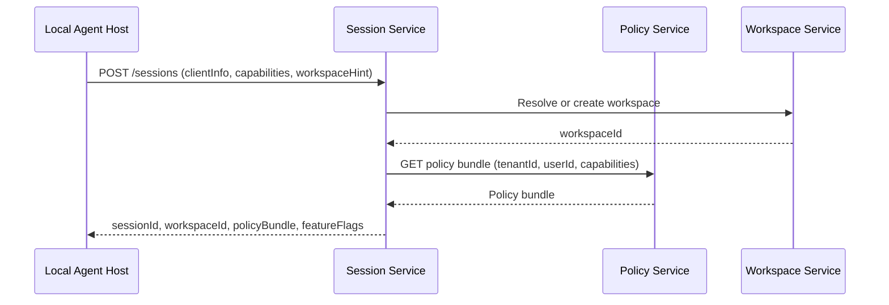
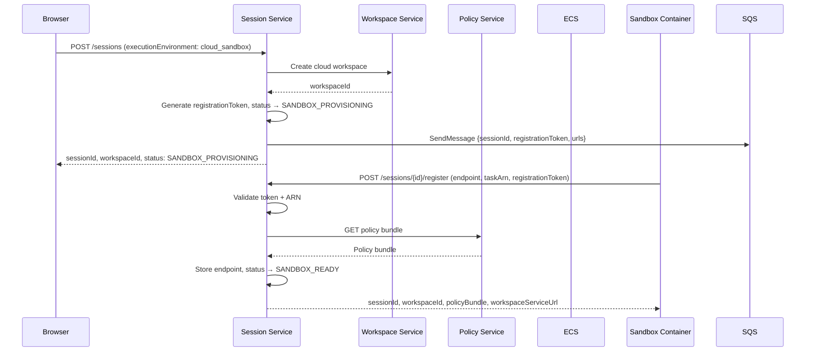
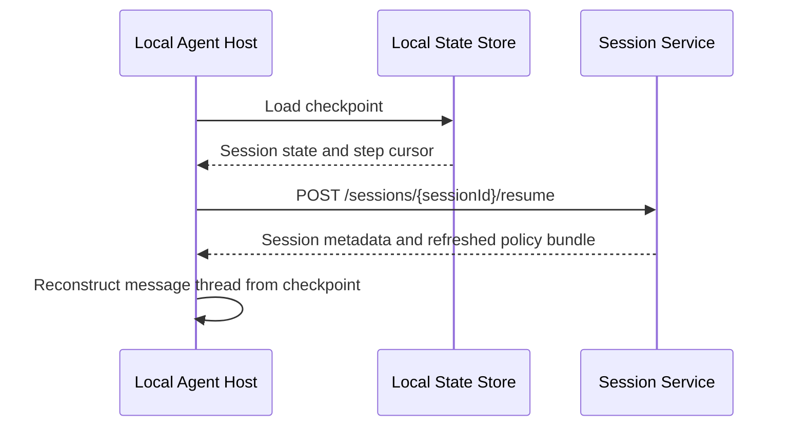

# Session Service — Detailed Design

**Phase:** 1 (MVP)
**Repo:** `cowork-session-service`
**Bounded Context:** SessionCoordination

---

## Purpose

The Session Service is the entry point for every agent session. It establishes sessions, performs compatibility checks, resolves workspaces, fetches policy from the Policy Service, and returns everything the Local Agent Host needs to begin work.

---

## Responsibilities

- Create and resume sessions
- Version and capability compatibility checks between client and backend
- Workspace resolution — create or retrieve the workspace for this session based on `workspaceHint`
- Fetch policy bundle from Policy Service and return it to the client
- Track session metadata and status transitions
- Session cancellation

---

## Relationships

| Calls | Purpose |
|-------|---------|
| Policy Service | Fetch policy bundle for the session |
| Workspace Service | Create or resolve workspace from `workspaceHint` |

| Called by | Purpose |
|-----------|---------|
| Local Agent Host | Create session, resume session, cancel session |
| Desktop App | Query session status |

---

## API Endpoints

### POST /sessions — Create Session

Called by the Local Agent Host at startup to establish a new session.

**Request:**
```json
{
  "tenantId": "tenant_abc",
  "userId": "user_123",
  "executionEnvironment": "desktop",
  "workspaceHint": {
    "localPaths": ["/Users/suman/projects/demo"]
  },
  "clientInfo": {
    "desktopAppVersion": "1.0.0",
    "localAgentHostVersion": "1.0.0",
    "osFamily": "macOS",
    "osVersion": "14.6"
  },
  "supportedCapabilities": [
    "File.Read",
    "File.Write",
    "Shell.Exec",
    "Network.Http",
    "Workspace.Upload",
    "LLM.Call"
  ]
}
```

**Response (desktop):**
```json
{
  "sessionId": "sess_789",
  "workspaceId": "ws_456",
  "name": "",
  "compatibilityStatus": "compatible",
  "policyBundle": { ... },
  "featureFlags": {
    "approvalUiEnabled": false,
    "mcpEnabled": false
  }
}
```

**Response (cloud_sandbox):**
```json
{
  "sessionId": "sess_789",
  "workspaceId": "ws_456",
  "name": "",
  "status": "SANDBOX_PROVISIONING",
  "featureFlags": {
    "approvalUiEnabled": false,
    "mcpEnabled": false
  }
}
```

Note: Sandbox sessions do not include `policyBundle` or `compatibilityStatus` in the creation response — the policy bundle is fetched and returned during the registration step (`POST /sessions/{id}/register`).

> **LLM Gateway configuration** (endpoint and auth token) is not included in the response. The agent-runtime reads both from local environment variables (`LLM_GATEWAY_ENDPOINT`, `LLM_GATEWAY_AUTH_TOKEN`). This avoids sending credentials in API responses. LLM Gateway configuration will be revisited in a later phase.

**Workspace resolution logic:**
- If `workspaceHint.localPaths` is provided → resolve or create a `local`-scoped workspace matching that path
- If no `workspaceHint` (desktop) → create a new `general`-scoped workspace for this session only
- If `executionEnvironment == "cloud_sandbox"` → create a new `cloud`-scoped workspace (S3-backed, supports file CRUD)

**Sandbox session creation:**
When `executionEnvironment` is `cloud_sandbox`, the session creation flow differs:
1. Compatibility check is skipped (no desktop app involved)
2. Initial status is `SANDBOX_PROVISIONING` (not `SESSION_CREATED`)
3. Policy bundle fetch is **deferred** to the registration step (`POST /sessions/{id}/register`)
4. Session response includes `status: "SANDBOX_PROVISIONING"` but no `policyBundle`
5. `networkAccess` field is stored on the session record if provided
6. **Sandbox provisioning:** After persisting the session record, the Session Service calls `SandboxService.provision_sandbox()` which:
   - Checks the concurrent sandbox session limit for this user (rejects with 409 if over limit)
   - Publishes a message to the SQS queue (`{env}-sandbox-requests`) with `sessionId`, `registrationToken`, and service URLs
   - On publish failure, transitions the session to `SESSION_FAILED`

**SQS Dispatch:** Session Service publishes to SQS instead of calling `ecs:RunTask`. Agent runtime runs as an ECS Service worker pool that polls the queue. Idle worker tasks pick up messages and self-register. See [sqs-sandbox-dispatch.md](../design/sqs-sandbox-dispatch.md) for the full design.

Configuration:
- `SANDBOX_MAX_CONCURRENT_SESSIONS` — max active sandbox sessions per user (default: 5)
- `ECS_CLUSTER`, `ECS_TASK_DEFINITION`, `ECS_SUBNETS`, `ECS_SECURITY_GROUPS` — ECS launcher settings (provided by the Terraform `sandbox` module in `cowork-infra/iac/modules/sandbox/`, which provisions the task definition ARN, security group ID, and IAM roles for sandbox tasks)
- `AGENT_RUNTIME_PATH` — path to agent-runtime repo (local launcher only)
- `SESSION_SERVICE_URL` — passed to sandbox as env var for self-registration

**Proxy Layer:**

`ProxyService` forwards browser traffic to sandbox containers through Session Service. The browser never connects directly to sandboxes.

Five proxy endpoints:

| Method | Path | Description |
|--------|------|-------------|
| `POST` | `/sessions/{sessionId}/rpc` | Forward JSON-RPC to sandbox `/rpc` |
| `GET` | `/sessions/{sessionId}/events` | SSE proxy (streaming, `Last-Event-ID` pass-through) |
| `POST` | `/sessions/{sessionId}/upload` | Unified upload: persist to S3 via Workspace Service, then sync to sandbox |
| `GET` | `/sessions/{sessionId}/files/{path}` | File download from sandbox workspace |
| `GET` | `/sessions/{sessionId}/files` | File listing or workspace archive download |

Key behaviors:
- **Endpoint caching:** `sandboxEndpoint` cached per session with configurable TTL (default 30s). Invalidated on sandbox termination or connection errors.
- **Ownership validation:** Every proxy request verifies `user_id` matches session owner. Returns 403 if not.
- **State validation:** Only sessions in proxyable states (`SANDBOX_READY`, `SESSION_RUNNING`, `WAITING_FOR_*`, `SESSION_PAUSED`) are forwarded. Returns 409 otherwise.
- **Activity tracking:** `lastActivityAt` updated on `POST /rpc` and `POST /upload` only (not SSE keepalives). Batched — writes DynamoDB at most once per 60s per session.
- **Error mapping:** Sandbox unreachable → 503, session not found → 404, inactive → 409, wrong owner → 403.
- **Connection pool:** Separate `httpx.AsyncClient` for sandbox connections (not shared with Policy/Workspace clients).

Config: `PROXY_ENDPOINT_CACHE_TTL_SECONDS` (30), `PROXY_ACTIVITY_BATCH_SECONDS` (60), `PROXY_TIMEOUT_SECONDS` (30), `PROXY_SSE_TIMEOUT_SECONDS` (14400).

**Unified File Upload (`POST /sessions/{sessionId}/upload`):**

`FileUploadService` handles file uploads in two phases:
1. **S3 persist** — Forward to Workspace Service `POST /workspaces/{workspaceId}/files?path=X` (multipart). This is the durable write.
2. **Sandbox sync** (best-effort) — Send `workspace.sync` JSON-RPC to the sandbox's `/rpc` endpoint with `{"direction":"pull","paths":["X"]}`. Failure does not fail the upload.

State handling:
- **Terminal states** (`SESSION_CANCELLED`, `SANDBOX_TERMINATED`) → reject with 409
- **Non-terminal, no sandbox** (`SANDBOX_PROVISIONING`, `SESSION_CREATED`) → S3 persist only, `sandboxSynced: false`
- **Syncable states** (`SANDBOX_READY`, `SESSION_RUNNING`, `WAITING_FOR_*`, `SESSION_PAUSED`) with sandbox endpoint → S3 persist + sync attempt

Response: `{"path": "...", "size": N, "persisted": true, "sandboxSynced": true|false}`

Config: `UPLOAD_SYNC_TIMEOUT_SECONDS` (10).

**Sandbox Lifecycle Manager:**

`SandboxLifecycleManager` runs as a background `asyncio.Task` started in the FastAPI lifespan. It periodically scans all active sandbox sessions and enforces three time-based rules:

| Check | Condition | Action |
|-------|-----------|--------|
| Provisioning timeout | `SANDBOX_PROVISIONING` session older than `SANDBOX_PROVISION_TIMEOUT_SECONDS` (180) | Transition to `SESSION_FAILED` |
| Max duration | Active sandbox session older than `SANDBOX_MAX_DURATION_SECONDS` (14400) | Terminate via `SandboxService` |
| Idle timeout | No `lastActivityAt` update within `SANDBOX_IDLE_TIMEOUT_SECONDS` (1800) AND no running tasks | Terminate via `SandboxService` |

Design:
- **Multi-instance safe:** Uses DynamoDB conditional updates (`ConditionExpression`) to prevent double-termination when multiple Session Service instances check concurrently.
- **Per-session error isolation:** Errors processing one session are caught and logged; other sessions are still checked.
- **Running task protection:** Idle timeout is never applied to sessions with at least one `running` task — busy sandboxes are never idle-terminated.
- **Best-effort termination:** If stopping the sandbox container fails, the status is still updated to prevent retries.
- **Check interval:** `SANDBOX_LIFECYCLE_CHECK_INTERVAL_SECONDS` (default 300 / 5 minutes).

---

### POST /sessions/{sessionId}/resume — Resume Session

Called by the Local Agent Host after a desktop restart when a checkpoint exists in the Local State Store.

**Request:**
```json
{
  "sessionId": "sess_789",
  "checkpointCursor": "step_004"
}
```

**Response:**
```json
{
  "sessionId": "sess_789",
  "workspaceId": "ws_456",
  "compatibilityStatus": "compatible",
  "policyBundle": { ... }
}
```

---

### POST /sessions/{sessionId}/cancel — Cancel Session

**Request:**
```json
{
  "reason": "user_requested"
}
```

**Response:** `204 No Content`

---

### PATCH /sessions/{sessionId}/name — Update Session Name

Called by the Local Agent Host to auto-name sessions from the first user prompt.

**Request:**
```json
{
  "name": "Fix login bug in auth module",
  "autoNamed": true
}
```

**Response:** `200 OK` (empty body)

---

### POST /sessions/{sessionId}/tasks — Create Task

Reports task creation to the Session Service for persistence and history.

**Request:**
```json
{
  "taskId": "task-1234567890",
  "prompt": "Fix the authentication bug",
  "maxSteps": 50
}
```

**Response:** `201 Created` (empty body)

---

### POST /sessions/{sessionId}/tasks/{taskId}/complete — Complete Task

Reports task completion (success, failure, or cancellation).

**Request:**
```json
{
  "status": "completed",
  "stepCount": 12,
  "completionReason": "Natural completion"
}
```

**Response:** `200 OK` (empty body)

---

### GET /sessions/{sessionId}/tasks — List Tasks

Returns all tasks for a session, ordered by creation time.

**Response:**
```json
[
  {
    "taskId": "task-1",
    "sessionId": "sess_789",
    "prompt": "Fix the bug",
    "status": "completed",
    "stepCount": 12,
    "createdAt": "2026-02-21T14:01:00Z",
    "completedAt": "2026-02-21T14:05:00Z"
  }
]
```

---

### GET /sessions/{sessionId}/tasks/{taskId} — Get Task

Returns a single task by ID.

---

### POST /sessions/{sessionId}/register — Sandbox Self-Registration

Called by the sandbox worker task after picking up a session from SQS. Validates the registration token matches what was stored at session creation (single-use via conditional update), stores the sandbox endpoint, fetches the policy bundle from the Policy Service, transitions status to `SANDBOX_READY`, and returns the policy bundle and service URLs.

**Request:**
```json
{
  "sandboxEndpoint": "http://10.0.1.42:8080",
  "registrationToken": "uuid-generated-at-session-creation"
}
```

**Response (200):**
```json
{
  "sessionId": "sess_789",
  "workspaceId": "ws_456",
  "workspaceServiceUrl": "http://workspace-service:8002",
  "llmGatewayEndpoint": "",
  "policyBundle": { ... }
}
```

**Registration token flow:** A UUID registration token is generated during session creation and stored on the session record *before* the sandbox container is launched. The token is passed to the container as the `REGISTRATION_TOKEN` environment variable. At registration time, the container must present this token — preventing unauthorized containers from registering against a session.

**Errors:**
- 404 — session not found
- 409 — session not in `SANDBOX_PROVISIONING` state or registration token mismatch

### GET /sessions/{sessionId} — Get Session Metadata

**Response:**
```json
{
  "sessionId": "sess_789",
  "workspaceId": "ws_456",
  "tenantId": "tenant_abc",
  "userId": "user_123",
  "executionEnvironment": "desktop",
  "status": "SESSION_RUNNING",
  "name": "Fix login bug in auth module",
  "autoNamed": true,
  "createdAt": "2026-02-21T14:00:00Z",
  "expiresAt": "2026-02-21T18:30:00Z"
}
```

---

## Session Handshake Flow (Desktop)



## Sandbox Handshake Flow (cloud_sandbox)



---

## Session Resume Flow



---

## Session Metadata Model

| Field | Type | Description |
|-------|------|-------------|
| `sessionId` | string | Unique session identifier |
| `workspaceId` | string | Always present — resolved or created at session start |
| `tenantId` | string | Tenant |
| `userId` | string | User |
| `executionEnvironment` | enum | `desktop` or `cloud_sandbox` |
| `status` | enum | `SESSION_CREATED`, `SESSION_RUNNING`, `SESSION_PAUSED`, `SESSION_COMPLETED`, `SESSION_FAILED`, `SESSION_CANCELLED`, `SANDBOX_PROVISIONING`, `SANDBOX_READY`, `SANDBOX_TERMINATED` |
| `createdAt` | datetime | Session creation time |
| `expiresAt` | datetime | Policy bundle expiry — session must not continue past this |
| `updatedAt` | datetime | Last update time |
| `sandboxEndpoint` | string? | Internal IP:port of sandbox container (cloud_sandbox only, set at registration) |
| `registrationToken` | string? | One-time UUID token for sandbox self-registration validation (cloud_sandbox only, generated at session creation) |
| `networkAccess` | enum? | `enabled` or `disabled` — outbound internet for sandbox (cloud_sandbox only) |
| `lastActivityAt` | datetime? | Last user interaction time for idle timeout (cloud_sandbox only) |
| `desktopAppVersion` | string? | Desktop app version from `clientInfo` (desktop only) |
| `agentHostVersion` | string? | Agent host version from `clientInfo` (desktop only) |
| `supportedCapabilities` | list[string]? | Capabilities the client supports |

---

## Data Store

**Database:** DynamoDB table `{env}-sessions`

### Key schema

| Key | Value |
|-----|-------|
| Partition key | `sessionId` (String) |
| TTL attribute | `ttl` (Number, Unix epoch) — set from `expiresAt`; DynamoDB auto-deletes expired sessions |

### Global Secondary Indexes

| GSI | Partition key | Sort key | Use |
|-----|--------------|----------|-----|
| `tenantId-userId-index` | `tenantId` | `createdAt` | List sessions for a user within a tenant, sorted by creation time |

### Stored attributes

`sessionId`, `tenantId`, `userId`, `workspaceId`, `executionEnvironment`, `status`, `name`, `autoNamed`, `createdAt`, `expiresAt`, `updatedAt`, `ttl`, `desktopAppVersion`, `agentHostVersion`, `supportedCapabilities`, `sandboxEndpoint`, `registrationToken`, `networkAccess`, `lastActivityAt`

---

### Tasks Table

**Database:** DynamoDB table `{env}-tasks`

| Key | Value |
|-----|-------|
| Partition key | `taskId` (String) |
| TTL attribute | `ttl` (Number, Unix epoch) — set from parent session's `expiresAt` |

**GSI:**

| GSI | Partition key | Sort key | Use |
|-----|--------------|----------|-----|
| `sessionId-index` | `sessionId` | `createdAt` | List tasks for a session, sorted by creation time |

**Stored attributes:** `taskId`, `sessionId`, `workspaceId`, `tenantId`, `userId`, `prompt`, `status`, `stepCount`, `maxSteps`, `completionReason`, `createdAt`, `completedAt`, `updatedAt`, `ttl`

### Testing

| Tier | Infrastructure |
|------|---------------|
| Unit tests | `InMemorySessionRepository` — no infrastructure needed |
| Service tests | DynamoDB Local: `docker run -p 8000:8000 amazon/dynamodb-local` |
| Integration tests | LocalStack: `docker run -p 4566:4566 localstack/localstack` |
| E2E sandbox tests | `make test-web-sandbox` — requires all services running + `SANDBOX_LAUNCHER_TYPE=local` |

Set `AWS_ENDPOINT_URL=http://localhost:8000` (DynamoDB Local) or `http://localhost:4566` (LocalStack) to point the service at a local emulator. The same repository code runs in all environments.

**E2E Web Sandbox Test** (`scripts/test-web-sandbox.py`): Tests the full sandbox lifecycle end-to-end — session creation, SQS dispatch, worker task registration, proxy RPC/SSE/file operations, idle timeout, and provisioning timeout. Requires session-service, policy-service, workspace-service, agent-runtime (in sandbox mode with SQS), and LocalStack running locally.

---

## Compatibility Check

During handshake the Session Service validates:
- `localAgentHostVersion` is within the supported version range
- `desktopAppVersion` is within the supported version range
- Requested capabilities are a subset of what the tenant policy allows

If incompatible, returns `compatibilityStatus: "incompatible"` with a reason. The Local Agent Host must not proceed.

---

## Policy Bundle Validation (client-side)

After receiving the policy bundle, the Local Agent Host must verify:
- `expiresAt` is in the future
- `sessionId` in the bundle matches the returned `sessionId`
- `schemaVersion` is supported by this version of the Local Agent Host

If any check fails, the session must not start.

---

## Observability

### Request ID Middleware

Every inbound request is assigned a unique `X-Request-ID` (UUID v4). If the caller provides an `X-Request-ID` header, the service propagates it; otherwise it generates a new one. The ID is:

- Bound to `structlog` context via `structlog.contextvars.bind_contextvars(request_id=...)` so all log lines during that request include it
- Returned in the `X-Request-ID` response header for client-side correlation
- Available for downstream calls (Workspace Service, Policy Service) to propagate the same request ID

### Structured Logging

All log output is JSON-formatted via `structlog` with the following processors: `merge_contextvars`, `add_log_level`, `TimeStamper(fmt="iso")`, `StackInfoRenderer`, `format_exc_info`, `JSONRenderer`.

Every request logs on completion:
```json
{"event": "request_completed", "method": "POST", "path": "/sessions", "status_code": 200, "duration_ms": 45.2, "request_id": "abc-123", "level": "info", "timestamp": "..."}
```
